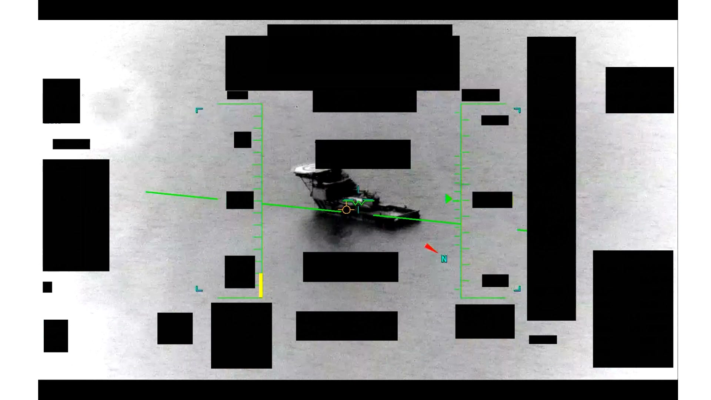
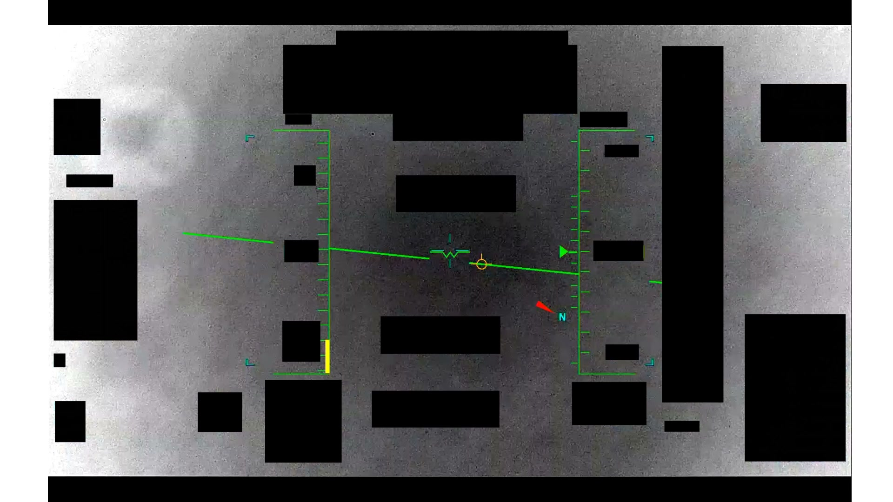
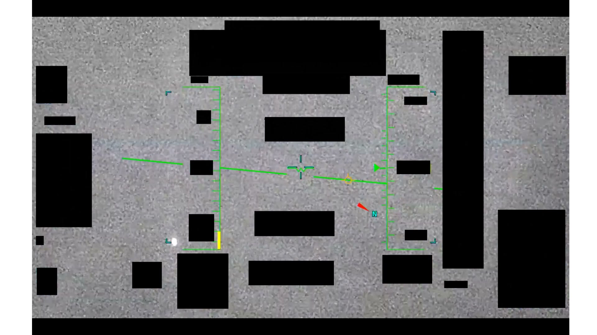

# #093 PR36 中東 2020-05：2 分 17 秒 IR 影片，1m16s 收窄變焦，2m10s 短暫藍十字未鎖定

2020 年 5 月 14 日波斯灣，海軍 F/A-18 用 ATFLIR pod 拍下水面上方一個做不規則運動的圓形實體，整段觀測收進機載 MISREP 編為 D38。六年後，War Department 把這段感測器原始影片公開，編號 PR36。PR36 對應 D 系列 [#053 DOW-UAP-D38](../053-dow_uap_d38_range_fouler_debrief_middle_east_may_2020/report.md)（Range Fouler Debrief，Black Hot / Linear gain，2020-05-14 20:40Z），是該案件公開的感測器原始影片。

## 影片內容

- 長度：2 分 17 秒（30 fps、1920×1080、H.264）
- 感測器：IR，White Hot 極性，畫面 16:9，HUD 含人工水平線、heading 羅盤、紅色北方箭頭
- HUD metadata 大量遭 1.4(a) 黑塊遮蔽，估計覆蓋 30 - 40 % 畫面
- 開頭：感測器以橙色 auto-track 環鎖定 contrast region，水面紋理可見
- 約 1m16s：感測器切換成 narrow FOV，畫面出現藍色矩形視野指示框，contrast region 變大但仍被 redaction 蓋住
- 約 2m10s：藍色十字一閃即逝，未取得穩定 lock
- 全程無人聲、無字幕

## 對應 D38 上下文

D38 為 Navy F/A-18 ATFLIR 在波斯灣 28°31'N 49°52'E 觀測到一個「solid white in Black Hot」的圓形實體。PR36 影片的 White Hot 極性與 D38 Range Fouler Form 描述的 Black Hot 相反，但兩者皆為同一案件之同一段觀測，極性可由操作員即時切換。「Erratic movements above the water」+「4x zoom 失去目標」的描述對應 PR36 收窄變焦後仍無法穩定鎖定的行為。

## 為什麼未解

- HUD metadata 1.4(a) 遮蔽，無法讀取機型、高度、距離、TGT-pos
- contrast region 在收窄 FOV 後形態仍模糊，無 ID、無雷達高度、無 RWR signature 可交叉
- AARO 將本片列為 unresolved 的主因是 ATFLIR autotrack 無法持續，4x zoom 中目標跨出 sensor 自動追蹤能力

## 影像規格與來源

| 欄位 | 內容 |
|---|---|
| 系列 | DOW-UAP-PR36 |
| 地點 | 中東（波斯灣，對應 D38 座標 28°31'N 49°52'E） |
| 月份 | 2020-05 |
| 影片長度 | 2:17（137.4 秒） |
| 解析度 / fps | 1920×1080 / 30 fps |
| 感測器 | IR（推測 F/A-18 ATFLIR pod） |
| 對應 MISREP | DOW-UAP-D38（[#053](../053-dow_uap_d38_range_fouler_debrief_middle_east_may_2020/report.md)） |
| 機密層級 | 原 SECRET，公開 cleared |
| 公開日 | 2026-05-08 |
| 釋出途徑 | USCENTCOM MDR 25-0094 thru MDR 25-0099 |
| 官方來源 | [DOW-UAP-PR36, Unresolved UAP Report, Middle East, May 2020](https://www.war.gov/UFO/#DOW-UAP-PR36,%20Unresolved%20UAP%20Report,%20Middle%20East,%20May%202020) |
| DVIDS 鏡像 | [DVIDS video 1006083](https://www.dvidshub.net/video/1006083/dow-uap-pr36-unresolved-uap-report-middle-east-may-2020) |
