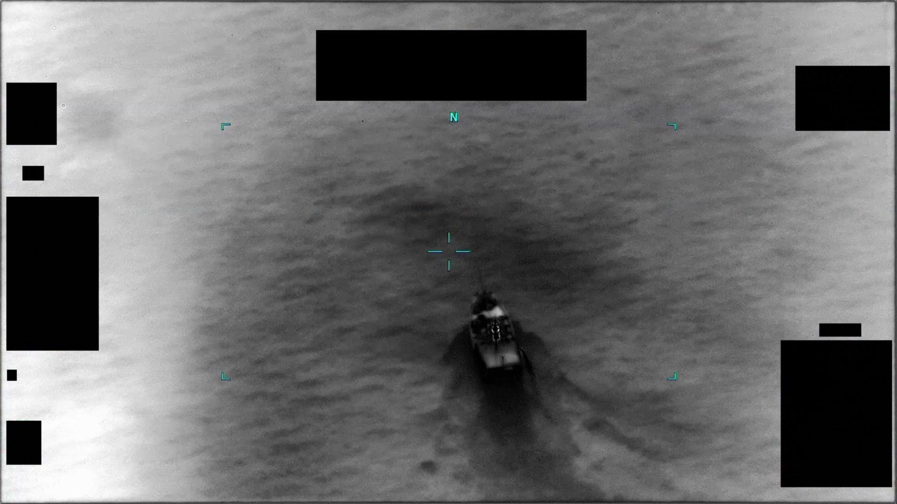

# #094 PR37 中東 2020：9 秒 IR 影片，6-8 秒對比區左下進入近線性向上、左上離開

中東 2020，9 秒 IR 影片，畫面裡一艘船在水面拖出尾跡。6 到 8 秒之間，一個微弱熱點從左下進入畫面、爬升、由左上離開。AARO 沒提供 caption，沒指認任務報告，連感測器平台都沒寫死。PR37 是 PR 系列裡資料最稀薄的一份：影片不到 10 秒，旁邊什麼脈絡都沒有。

## 影片內容

- 長度：9.8 秒，1920×1080，30 fps，H.264
- 感測器：IR，畫面上方與邊角有 1.4(a) 黑塊遮蔽 metadata
- 約 6 - 8 秒：一個微弱對比區由畫面左下進入，沿近線性軌跡向上移動，最終由左上角離開
- 無 HUD 標註圈、無人聲

## 為什麼未解

PR37 是 PR 系列中 AARO 未提供「對應 D 系列 MISREP」的少數案件之一，沒有伴隨的飛行員任務報告，無雷達、無高度、無速度、無 RWR 資訊可交叉。影片過短（不足 10 秒），對比區形態僅能形容為「點狀微弱熱訊號」，視差變化不足以三角化距離。AARO 未能歸入已知類別（鳥、無人機、商業飛機、火箭殘骸）即列為 unresolved。

## 影像規格與來源

| 欄位 | 內容 |
|---|---|
| 系列 | DOW-UAP-PR37 |
| 地點 | 中東（未細分） |
| 年份 | 2020 |
| 影片長度 | 9.8 秒 |
| 解析度 / fps | 1920×1080 / 30 fps |
| 感測器 | IR（推測 MQ-9 MTS-B 或同等級） |
| 對應 MISREP | 無（公開資料中未指認對應 D 系列） |
| 機密層級 | 原 SECRET，公開 cleared |
| 公開日 | 2026-05-08 |
| 釋出途徑 | USCENTCOM MDR 25-0094 thru MDR 25-0099 |
| 官方來源 | [DOW-UAP-PR37, Unresolved UAP Report, Middle East, 2020](https://www.war.gov/UFO/#DOW-UAP-PR37,%20Unresolved%20UAP%20Report,%20Middle%20East,%202020) |
| DVIDS 鏡像 | [DVIDS video 1006087](https://www.dvidshub.net/video/1006087/dow-uap-pr37-unresolved-uap-report-middle-east-2020) |

## 相關報告

- [#096 PR39 中東 2020](../096-dow_uap_pr39_middle_east_2020/report.md)，同為極短 IR 片段（5 - 9 秒），可同類比對「片長不足以做運動學分析」的 unresolved 形態
- [#097 PR40 中東 2020](../097-dow_uap_pr40_middle_east_2020/report.md)，同地點同年代但 AARO 在影片內加白圈與 U/I 標籤，可對照「AARO 後製標註」與本案「無 caption」的處置差異
- [#053 D38 中東 2020 Range Fouler Debrief](../053-dow_uap_d38_range_fouler_debrief_middle_east_may_2020/report.md)，同地點同年代的 D 系列文字檔，可作為中東 2020 PR/D 跨類別 ground truth 對照
