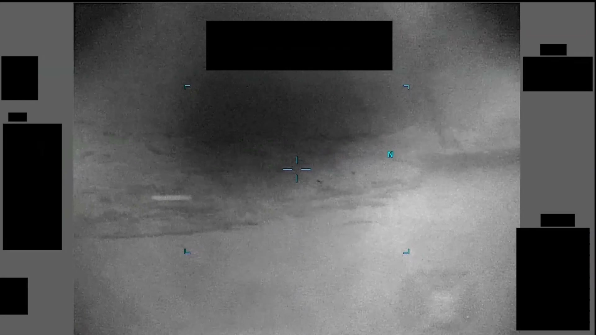

# #098 PR41 中東 2020：1 分 34 秒 IR 影片，對比區左下進入後感測器左→右橫掃保持其於畫面中央

PR41 重點不在「對比區是什麼」，而在「操作員怎麼跟」。目標從畫面左下進場後，感測器立刻啟動左到右的連續水平 slew，整段 1 分 34 秒裡，目標被人手動拉著保持在畫面中央。autotrack 沒鎖上去。操作員選擇了手動。這個 sensor-induced motion pattern 本身就洩漏了一件事：lock-on 條件不符。

## 影片內容

- 長度：1 分 34 秒（94.5 秒），1920×1080，30 fps
- 感測器：IR，HUD 邊角受 1.4(a) 黑塊遮蔽
- 對比區由畫面左下進入
- 感測器隨即以左→右方向的連續水平 slew（轉向）跟隨目標
- 結果：目標相對畫面位置保持在中央區域，但背景持續向右移動
- 此 sensor-induced motion 模式顯示操作員主動追蹤而非 autotrack lock

## 為什麼未解

PR41 透過 sensor-induced motion 揭露兩個事實：

- 目標有相對運動，但運動方向與感測器 slew 方向部分抵消
- 操作員無法（或選擇不）建立 autotrack lock，必須手動跟隨

候選解釋包括小型 UAV（手動跟隨表示 lock-on 條件不符）、氣球（緩慢飄移與 slew 方向一致）、感測器 artifact（已排除，因為目標跨過 1.4(a) 黑塊未跟隨黑塊一起 slew）。

## 影像規格與來源

| 欄位 | 內容 |
|---|---|
| 系列 | DOW-UAP-PR41 |
| 地點 | 中東（未細分） |
| 年份 | 2020 |
| 影片長度 | 1:34（94.5 秒） |
| 解析度 / fps | 1920×1080 / 30 fps |
| 感測器 | IR |
| 操作模式 | 手動 slew（非 autotrack） |
| 對應 MISREP | 無 |
| 機密層級 | 原 SECRET，公開 cleared |
| 公開日 | 2026-05-08 |
| 釋出途徑 | USCENTCOM MDR 25-0094 thru MDR 25-0099 |
| 官方來源 | [DOW-UAP-PR41, Unresolved UAP Report, Middle East, 2020](https://www.war.gov/UFO/#DOW-UAP-PR41,%20Unresolved%20UAP%20Report,%20Middle%20East,%202020) |
| DVIDS 鏡像 | [DVIDS video 1006094](https://www.dvidshub.net/video/1006094/dow-uap-pr41-unresolved-uap-report-middle-east-2020) |

## 相關報告

- [#101 PR44 中東 2020](../101-dow_uap_pr44_middle_east_2020/report.md)，同地點同年代但操作員成功取得 autotrack lock，可對照「手動 slew」與「autotrack 鎖定」兩種操作策略
- [#102 PR45 中東 2020](../102-dow_uap_pr45_middle_east_2020/report.md)，同樣以 sensor 行為（slant range 縮短）揭露目標運動學
- [#099 PR42 中東 2020](../099-dow_uap_pr42_middle_east_2020/report.md)，同地點同年代但 sensor 操作集中於模態切換而非手動 slew
