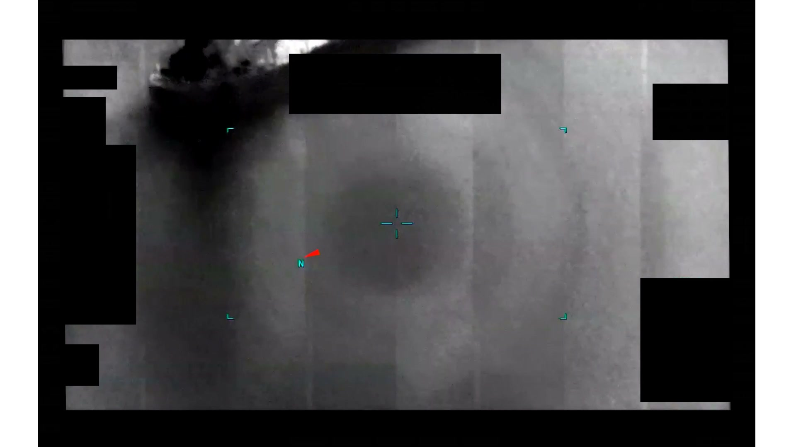
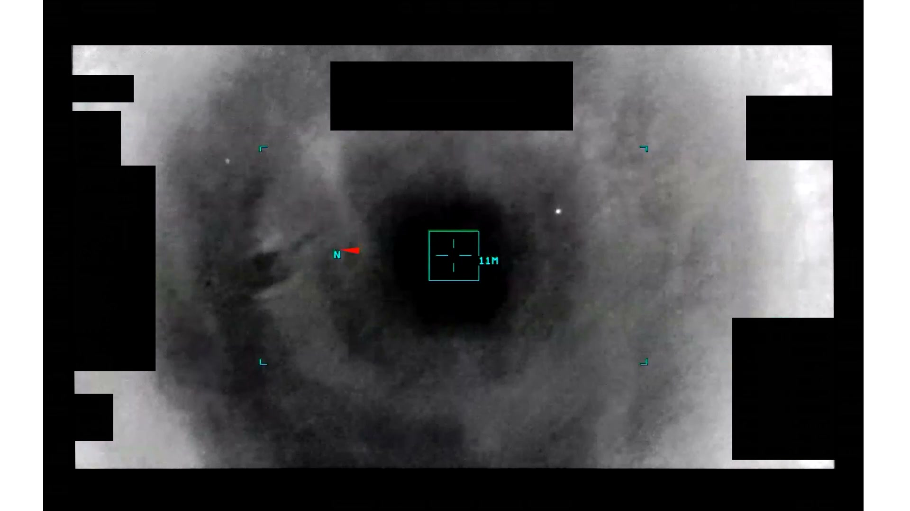
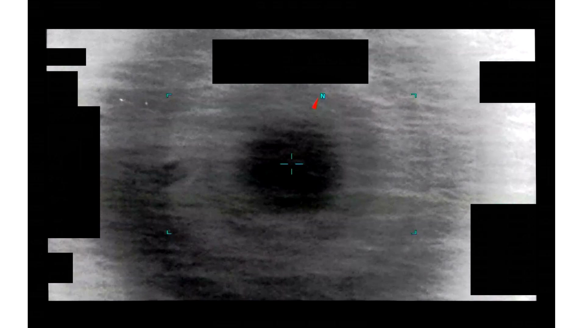

# #101 PR44 中東 2020：5 分 11 秒 IR 影片，感測器追蹤約 3 分鐘含十字鎖定、變焦、收窄視野

PR44 是 PR 系列中操作員投入最多時間的單一案件之一。5 分 12 秒的影片裡，有將近 3 分鐘是主追蹤序列：autotrack 鎖定、多次變焦、FOV 收窄切換，整套 ISR 標準流程都跑過一遍。儘管如此 AARO 仍列為 unresolved。鎖得上不等於 ID 得出來。

## 影片內容

- 長度：5 分 12 秒（312 秒），1920×1080，30 fps
- 感測器：IR，HUD 邊角受 1.4(a) 黑塊遮蔽
- 約前 30 秒：搜索階段，感測器掃描畫面
- 約 t=30 - 210 秒（3 分鐘）：主追蹤序列
  - 十字 autotrack lock 取得
  - 多次 zoom in / zoom out 調整
  - 至少一次 FOV 收窄（narrow FOV）切換
- 後段：失鎖或結束追蹤

## 為什麼未解

PR44 是 PR 系列中操作員投入最多 sensor 操作時間的影片之一（3 分鐘主動追蹤）。儘管如此 AARO 仍列為 unresolved：

- HUD redaction 移除高度、距離、TGT-pos，無法重建運動學
- autotrack 雖然鎖定，但目標形態未能形成清晰 ID
- 影片缺乏對應的雷達／IFF／飛行員口述資料

## 影像規格與來源

| 欄位 | 內容 |
|---|---|
| 系列 | DOW-UAP-PR44 |
| 地點 | 中東（未細分） |
| 年份 | 2020 |
| 影片長度 | 5:12（312 秒） |
| 解析度 / fps | 1920×1080 / 30 fps |
| 感測器 | IR |
| 操作模式 | autotrack + 變焦 + narrow FOV |
| 對應 MISREP | 無 |
| 機密層級 | 原 SECRET，公開 cleared |
| 公開日 | 2026-05-08 |
| 釋出途徑 | USCENTCOM MDR 25-0094 thru MDR 25-0099 |
| 官方來源 | [DOW-UAP-PR44, Unresolved UAP Report, Middle East, 2020](https://www.war.gov/UFO/#DOW-UAP-PR44,%20Unresolved%20UAP%20Report,%20Middle%20East,%202020) |
| DVIDS 鏡像 | [DVIDS video 1006104](https://www.dvidshub.net/video/1006104/dow-uap-pr44-unresolved-uap-report-middle-east-2020) |

## 相關報告

- [#099 PR42 中東 2020](../099-dow_uap_pr42_middle_east_2020/report.md)，同為中東 2020 長片（4:53 vs 5:12），可對照「autotrack + 變焦」與「模態切換」兩種長時間追蹤策略
- [#102 PR45 中東 2020](../102-dow_uap_pr45_middle_east_2020/report.md)，同樣保持 autotrack lock，並輔以 AARO 對 sensor-target slant range 的加註
- [#098 PR41 中東 2020](../098-dow_uap_pr41_middle_east_2020/report.md)，反例：同地點同年代但操作員無法取得 autotrack lock，可對照 lock-on 條件成立 vs 不成立的差別
