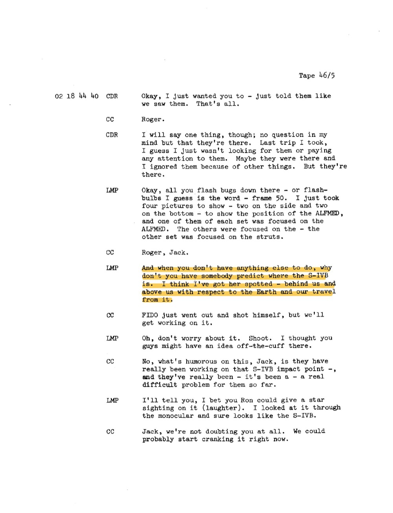

# Apollo 17：月面三點藍光 + Schmitt 兩次親口報告月面閃光

| 機關 | NASA |
| --- | --- |
| 類型 | 3 份 PDF + 1 張月面照 |
| 任務日期 | 1972-12-07 至 1972-12-19 |
| 地點 | 月球軌道 + Taurus-Littrow valley |
| 釋出日期 | 2026-05-08 |
| 卷宗 | [#140 transcript](https://www.war.gov/UFO/#nasa-uap-d2-apollo-17-transcript-1972) ・ [#142 science debrief](https://www.war.gov/UFO/#nasa-uap-d5-apollo-17-crew-debriefing-for-science-1973) ・ [#143 technical debrief](https://www.war.gov/UFO/#nasa-uap-d6-apollo-17-technical-crew-debriefing-1973) ・ [#150 VM6 photo](https://www.war.gov/UFO/#nasa-uap-vm6-apollo-17-1972) |

## Overview

Apollo 17 是最後一次載人登月。機組 Cernan（CDR）、Evans（CMP）、Schmitt（LMP，地質學博士）。1972-12-11 在 Taurus-Littrow valley 著陸。

DOW 釋出 4 份檔：1 張月面 panorama（VM6）+ 3 份 debrief PDF。

值得看：

- VM6 是 NASA UAP 包裡唯一被 DOW 立案的影像
- 任務通訊紀錄裡，Schmitt 兩次親口說「我看到月面閃光」
- 三份 debrief 互相印證 ALFMED 實驗：機組戴上眼罩 60 分鐘觀察艙內 light flashes，這是 NASA 第一次系統研究太空人視覺異常
- DOW 釋出版的 transcript 直接用螢光筆標出關鍵段落

## VM6：三點藍光在月面地平線上方

panorama 拍攝視角：太空人朝南面拍 Taurus-Littrow valley，三座連綿山丘（South Massif 山脊）構成地平線。前景是 reseau 十字標記（Hasselblad 70mm 底片標準框點）+ 月面 regolith 紋理。畫面左下角邊緣有一道暗色物體輪廓，可能是 Lunar Roving Vehicle 配件或樣本袋陰影。

DOW 在右上方加上黃色框，箭頭指向地平線右側上方的一小塊區域。

放大區內：三個藍綠色亮點，呈水平偏斜排列，中間點略高。亮點大小不等，左點較銳利，中點最亮並有暈散，右點較弱。三點之間的角距非常小，整體在原始畫面上只有約 5 像素寬。

關鍵：三點所在位置不是月空深處，而是緊貼地平線山頂上方。如果是星體，這個位置在當時的天文軟體裡查不到對應目標。如果是底片瑕疵，三點同色 + 大小遞減的結構很難用單一刮痕解釋。

DOW 卷宗描述明確寫 open investigation，沒給結論。

## Schmitt 描述「整段飛行都看到 light flashes」

文件來源是 Apollo 17 Technical Crew Debriefing（MSC-07631，1973-01-04），原 CONFIDENTIAL 90 天自動解密條款，實際 53 年後（2026-05-08）才依 E.O. 13526 Sec 3.3(a) 解密。

頁碼 24-4。對話按時序排列：

**Evans（續）**：「火球亮度降下來之後，我從 rendezvous 窗回頭看，眼前像一條隧道，中間有個亮點。隧道盡頭、最深處，我還能看到火球。」

**Cernan**：「整個落地跟回收過程，唯一一次怪事是 CMP 看出窗外，看見一艘航艦的上層結構，他說『喔我們旁邊有個鐵罐』。」

**Evans**：「窗戶上有點霧。」

**Schmitt**：「Trans-Earth 段我們只看到地球的一小條月牙，沒辦法做太多氣象觀察。整段飛行只要我們眼睛適應暗，幾乎連續看到 light flashes。我有過一次，當時以為看到月面閃光。我們戴 ALFMED 眼罩那段時間，反而完全沒看到 flash。但同一晚睡前，flashes 又回來了。所以好像剛好只有戴眼罩那段，我跟另外兩位都看不到。」

原文：

> SCHMITT: Transearth we had only a small crescent of an Earth and it was not feasible to do any extensive weather observations. We had light flashes just about continuously during the whole flight when we were dark adapted. I had one which I thought was a flash on the lunar surface. That one period of time when we had the blindfolds on for the ALFMED experiment there were just no visible flashes, although that evening, that night, before I went to sleep I noticed that I was seeing the light flashes again. So, it just seemed to be that one interval either side of it where the light flash was not visible to myself or to the other two crewmen.

Schmitt 這段同時收兩件事：

1. ALFMED 戴眼罩期間沒 flash → 拿掉眼罩 flash 又出現
2. 他「以為看到一次月面閃光」（與下方 Tape 60/2 的事件對應）

第一件事是 ALFMED 實驗的關鍵負面對照：當光線不能進入眼睛時，flash 完全消失，這驗證了「flash 是視覺通道內部現象」。

## ALFMED 拍照 + Schmitt 視覺確認 S-IVB

Tape 46/5，GET 02 18 44 40（任務第 2 天 18:44:40）。

對話：

**CDR Cernan**：「好，我只是想跟你們講我們看到的，沒別的意思。」
**CC**：「Roger.」
**CDR**：「但我可以說一件事，毫無疑問它們在那裡。上次任務我搞不好就沒在找、也沒注意。可能它們也在，但我因為其他事忽略了。但它們真的在。」
**LMP Schmitt**：「OK，下面那些 flash bugs，或叫 flashbulbs 比較對，第 50 格底片。我剛拍了四張，兩張側邊兩張底部，呈現 ALFMED 的位置，每組各有一張對焦在 ALFMED 上，另一組對焦在 struts。」
**CC**：「Roger, Jack.」

下一段（**整段被 DOW 螢光筆標黃**）：

**LMP**：「然後等你們有空的時候，請哪個人幫你們算 S-IVB 在哪。我覺得我看到她了，在我們後上方，相對於地球跟我們的航跡。」
**CC**：「FIDO 剛才出去把自己槍斃了，但我們會去處理。」
**LMP**：「喔不用緊張，沒事。我只是想說你們搞不好臨時有想法。」
**CC**：「Jack，這事比較好笑的是，他們真的一直在算 S-IVB 的撞擊點，這對他們來說是個很麻煩的問題。」
**LMP**：「我跟你說，我打賭 Ron 可以給你一個 star sighting 鎖定它（笑）。我用單筒望遠鏡看，真的像 S-IVB。」
**CC**：「Jack 我們完全沒在懷疑你，可能現在就可以開始算。」

S-IVB = Saturn V 第三節，Apollo 17 任務中故意撞擊月球做地震實驗。FIDO（Flight Dynamics Officer）負責追蹤撞擊軌跡。Schmitt 在艙內用單筒望遠鏡視覺鎖定它，成為 FIDO 的備用 tracking 來源。

DOW 為什麼標這段：表面上看是太空人視覺辨認 booster，但「I think I've got her spotted」這句話的物理意義其實也適用於後續 Schmitt 看到的所有不明物體，他作為地質學博士有足夠光學辨識能力分辨人造物與自然天體。

## Schmitt 進入西邊 Procellarum，準備過 Grimaldi

Tape 60/1，GET 03 15 33 44（任務第 3 天 15:33:44）。

Schmitt 連續地形描述：

**LMP**：「就我們的解讀，如果可以從前面任務帶回的樣本外推。」
**LMP**：「驚人的是現在 Procellarum 西邊的高地仍然是亮的，新鮮 crater 跟正常高地的對比在地光下還是非常明顯，特別是沿著相對地球的零相位點。Rima Gamma 現在離我們橢圓軌跡的 horseshoe 越來越近，靠 horseshoe 較大、較西邊那一端；那條暗色 horseshoe 在這個光下很清楚。它指向西，或西北，整個 strange feature 的走向都這樣。我覺得 Ron 接下來幾天有很好的機會研究 mare 內部跟月面其他地方那些淺色 swirls。我們在 Mare Marginis 跟 Mare Crisium 東邊看得很清楚，他應該也看得到。」
**CC**：「Okeydoke.」

GET 03 15 35 50：

**CDR Cernan**：「Gordo，我剛在用 GDC 時注意到 Pc gage 在 Pz - Pc 位置現在有約 7% 的持續偏移，切到 ALPHA 就歸零。上一次 burn 之前沒這個現象。」
**CC**：「Roger, Gene.」

GET 03 15 36 35：

**LMP**：「Hey, Gordy，我正看著 Procellarum 海西邊跟月球西邊高地的接觸帶，我們快飛到 Grimaldi 南邊。那條邊緣非常不規則。沒有明顯指出有大型 basin 被 mare 灌過去形成那個邊緣，但在這個淺光下還是可以辨識地形差異。我現在開始看到 crater 裡有陰影。」

Schmitt 用 「we're just about to fly a little bit south of Grimaldi」 鋪陳了下一頁的事件位置。

關鍵：Grimaldi 是月球西緣的暗色 crater，Apollo 軌道從東往西飛時 Grimaldi 是黎明線剛過的區域，也就是地形剛被斜射陽光照亮，最容易看到 transient 現象的時段。

## Schmitt 親眼看到月面閃光（DOW 螢光筆全段標黃）

Tape 60/2 接續上頁。整段 DOW 用螢光筆標黃。

對話：

**CC**：「Roger.」
**LMP Schmitt**：「那是小型 crater。在 Mare Procellarum 最靠近 Grimaldi 那邊有兩條 arcuate rilles，看起來剖面可能是 V 形。我相信我們之前在照片上看比這裡看清楚很多。那些 rille 的走向看起來確實延伸進高地。」
**CC**：「Okay.」
**LMP**：「然後在那塊 mare 海灣的北邊，北邊，等一下打斷一下。」

GET 03 15 38 09：

**LMP**：「Hey，我剛看到月面有一個 flash！」
**CC**：「喔是嗎？」
**LMP**：「就在 Grimaldi 北邊，剛好北邊。如果你們的 seismometer 有抓到什麼可以查一下，雖然小型撞擊應該也會給出一定量的可見光。」
**CC**：「OK 我們會查。」
**LMP**：「就在那個 crater 旁邊，一個明亮的小 flash。看到 Grimaldi 邊緣那個 crater 沒？再它北邊還有一個。北邊那個比較銳利的位置，有一條細細的光痕。」
**CC**：「能不能在地圖上你看到的位置打 X？」
**LMP**：「我會持續找，是的，我們會。我本來就計畫要找這類東西。現在開始看到 Orientale 的邊緣了，Gordy。在西邊很遠。Hey，Gene 你隨時喊我（中斷）」

GET 03 15 39 46：

**LMP**：「Gordy，Grimaldi 北邊有一個大小差不多的 basin，但只有東北象限部分被 mare 灌過。其他部分看起來像不規則 hummocky 地形。」
**CC**：「Roger.」

原文（此段為 Schmitt 月面 flash 主述）：

> LMP: Hey, I just saw a flash on the lunar surface!
> CC: Oh, yes?
> LMP: It was just out there north of Grimaldi. Just north of Grimaldi. You might see if you got anything on your seismometers, although a small impact probably would give a fair amount of visible light.
> CC: Okay. We'll check.
> LMP: It was a bright little flash right out there near that crater. See the crater right at the edge of Grimaldi. Then there is another one north of it. Fairly sharp one north of it is where there was just a thin streak of light.

值得注意：

1. Schmitt 看到的不是一個 flash，而是 **三個現象**：明亮的小 flash + 鄰近 crater 一個更銳利的點 + 一條細細的光痕（thin streak of light）
2. 他主動建議用 seismometer 交叉驗證，如果是隕石撞擊，地震儀應該收得到信號
3. 他補了「我本來就計畫要找這類東西」，Apollo 17 機組行前訓練包含 transient lunar phenomenon 觀察任務

CC（Gordon Fullerton）的「能不能在地圖上打 X」是 NASA 第一次正式要求太空人即時定位月面異常。

## 分析

VM6 三點藍光與 Schmitt Grimaldi flash 是兩個獨立但屬同一類別的觀測。

VM6 是攝影底片留下的證據，事後在地球上才被人發現。Schmitt flash 是即時口頭報告，沒有同步影像紀錄。兩者都是月面附近不明發光體，但前者地點不明、時間不明、相機快門期間記錄；後者地點明確（Grimaldi 北邊）、時間明確（GET 03 15 38 09）、有 seismometer 交叉驗證機會。

Schmitt 觀察到三個現象（flash + crater 邊緣銳利點 + 光痕）是 transient lunar phenomenon (TLP) 學界已知的特徵組合。

學術界對 TLP 的解釋分四類：

1. 微隕石撞擊（impact flash），後續 NELIOTA 計畫 2017 年起在地球望遠鏡確認過數百次
2. 月震帶來的 outgassing 釋放氣體 + 太陽 UV 激發冷光
3. 月面 regolith 因為剛進入陽光區的熱衝擊產生靜電放電
4. 觀察者視覺幻覺

Schmitt 的描述（小 flash + 短時間 + 「thin streak of light」）最符合第 1 類，但他在 1972 年時學界對 impact flash 還沒系統觀察。

ALFMED 實驗的負面結果是這份 release 最有教學意義的部分。

戴眼罩期間 flashes 完全消失 → flashes 必須透過視網膜 → 是視覺通道內部現象。

但這個結論不能套到 Schmitt Grimaldi flash 上。Schmitt 是清醒、未戴眼罩、透過 LM 窗戶往月面看。flash 來源在艙外幾百公里處的月面，不是視網膜被粒子擊中。

換句話說：同一份 release 同時收兩種現象，一種被 ALFMED 解掉（cabin flashes = 視網膜現象），一種沒被解掉（lunar surface flash = 真實月面光點）。

DOW 在 transcript 上用螢光筆主動標出 Schmitt 兩段話（S-IVB 鎖定 + Grimaldi flash），不是 OCR 自動標的，是人工標的。意思是 DOW 內部有人讀過這份 transcript，特別認為這兩段需要被讀者看到。

與本批 release 其他 NASA 卷宗的連結：

- Apollo 11 (#141) Aldrin 1969 年描述 cabin 內 flashes，但他自己提出 penetration 假說，三年後才有 ALFMED 驗證
- Apollo 12 (#139 + #145-149) Bean 透過 AOT 看到 particles「逃離月球射向恆星」，VM1-5 五張月面照標出 14 個觀測點，與 VM6 屬同類
- Skylab (#144) 三批機組共 9 人在地球軌道重複觀察 cabin flashes，確認 ALFMED 結論
- Gemini 7 (#020) Borman 1965 年「BOGEY」是更早的艙外不明物紀錄
## 相關報告

- [#020 Gemini 7](../020_021-nasa_gemini_7/report.md)
- [#139 Apollo 12](../139_145_146_147_148_149-nasa_apollo_12/report.md)
- [#141 Apollo 11](../141-nasa_apollo_11/report.md)
- [#144 Skylab](../144-nasa_skylab/report.md)
