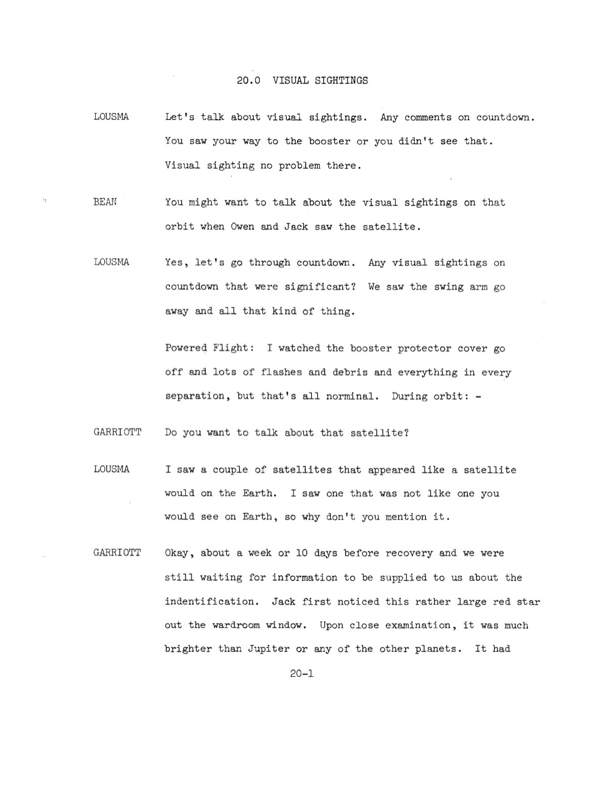
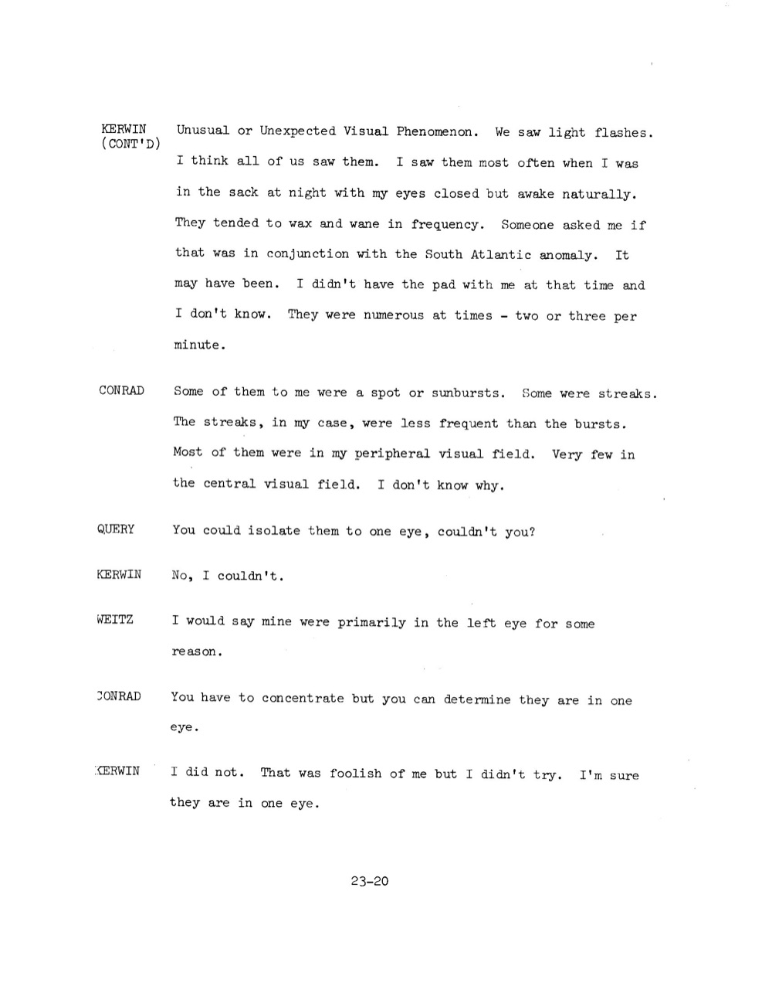

# Skylab：地球軌道三批機組各自看到不同類型的不明物

| 機關 | NASA |
| --- | --- |
| 類型 | 3 份 PDF debriefing 合併（JSC-08053 + JSC-08478 + JSC-08809） |
| 任務日期 | 1973-05-25 至 1974-02-08 |
| 地點 | Skylab 太空站，地球軌道（435 km，傾角 50°） |
| 釋出日期 | 2026-05-08 |
| 卷宗 | [#144 NASA-UAP-D7 Skylab Technical Crew Debriefing](https://www.war.gov/UFO/#nasa-uap-d7-skylab-technical-crew-debriefing-1973) |

## Overview

Skylab 是美國第一座太空站。三批機組接力住人 171 天：

- **SL-2**（1973-05-25 至 06-22，28 天）Conrad、Kerwin、Weitz
- **SL-3**（1973-07-28 至 09-25，59 天）Bean、Lousma、Garriott
- **SL-4**（1973-11-16 至 1974-02-08，84 天）Carr、Pogue、Gibson

DOW 釋出的 PDF 把 3 份分別獨立的 NASA debrief 合併成一個檔（JSC-08053 + JSC-08478 + JSC-08809）。三份原本是不同時間、不同編輯單位、不同章節分類的文件。

值得看：

- 三批機組分別看到三類完全不同的現象：flashes / 紅色亮星 / tumbling 物體
- Garriott 描述的「紅色大亮星」推算距離 30-50 海里、軌道幾乎與 Skylab 平行，這是 50 年來最具體的「太空站近距離 unidentified satellite」紀錄
- 9 位太空人獨立樣本，沒有一個說「不確定」，全都明確指認看到不明物
- 3 個任務 debrief 各自獨立寫成，但 DOW 把 UAP 章節抽出合併，等於是事後追認「這 3 個任務 debrief 都屬 UAP file 範疇」

## Kerwin（SL-2 醫官）：light flashes 在閉眼時最頻繁

DOW 把 3 份原本獨立的 NASA 任務 debrief 合併釋出：JSC-08053（SL-2，1973-06-30）、JSC-08478（SL-3，1973-10-04）、JSC-08809（SL-4，1974-02-22）。三份原文都沒有 CONFIDENTIAL 印章，未分級。先看 SL-2 Kerwin 的 light flashes。

對話：

**Kerwin（續）**：「Unusual 或 Unexpected Visual Phenomenon。我們看到 light flashes。我覺得我們三個都看過。我看得最多的時候是晚上躺在 sack（睡袋）裡，眼睛閉著但自然醒著。flash 出現頻率有 wax and wane（時多時少）。有人問我會不會跟 South Atlantic anomaly 同步發生，可能。我那時候沒帶 pad，無法確認。最高頻率時 2 到 3 次/分鐘。」

**Conrad**：「我看到的有些是點狀或 sunburst（爆閃），有些是 streak（光痕）。streak 我看得比 burst 少。大多數出現在我的週邊視野，正中央視野很少。我不知道為什麼。」

**Query（提問者，可能是 PI）**：「你應該有辦法分辨它們是出現在哪一隻眼睛吧？」

**Kerwin**：「不能，我沒辦法。」

**Weitz**：「我的 flash 大多在左眼，不知道為什麼。」

**Conrad**：「需要專注才能分辨，但你可以判斷出現在哪一眼。」

**Kerwin**：「我沒這樣試過。算我失策。我相信它們是在某一眼。」

原文：

> KERWIN (CONT'D): Unusual or Unexpected Visual Phenomenon. We saw light flashes. I think all of us saw them. I saw them most often when I was in the sack at night with my eyes closed but awake naturally. They tended to wax and wane in frequency. Someone asked me if that was in conjunction with the South Atlantic anomaly. It may have been. I didn't have the pad with me at that time and I don't know. They were numerous at times - two or three per minute.
>
> CONRAD: Some of them to me were a spot or sunbursts. Some were streaks. The streaks, in my case, were less frequent than the bursts. Most of them were in my peripheral visual field. Very few in the central visual field. I don't know why.
>
> QUERY: You could isolate them to one eye, couldn't you?
> KERWIN: No, I couldn't.
> WEITZ: I would say mine were primarily in the left eye for some reason.
> CONRAD: You have to concentrate but you can determine they are in one eye.
> KERWIN: I did not. That was foolish of me but I didn't try. I'm sure they are in one eye.

關鍵特徵與 Apollo 11 Aldrin 觀察一致：

- 閉眼可見（視覺通道內現象）
- 週邊視野為主（與視網膜邊緣高密度感光細胞分布吻合）
- 不同人偏向不同眼（個體解剖差異）
- 「點狀 + streak」雙形態（與宇宙射線粒子穿過頭部時不同入射角的視覺輸出對應）

Kerwin 是醫師（SL-2 任務裡同時擔任 Science Pilot 與航太醫官），他的描述是 Apollo 計畫之外第一個系統性醫學觀察。

## Garriott（SL-3 科學專家）：紅色亮星比木星還亮，距離 30-50 海里

頁碼 20-1。章節 20.0 VISUAL SIGHTINGS。

**Lousma**：「來談 visual sightings。countdown 階段有什麼？你看到 booster 那段路或沒看到？Visual sighting 沒問題那段。」

**Bean**：「你應該講 Owen 跟 Jack 看到那顆 satellite 那次。」

**Lousma**：「對，先講 countdown。countdown 階段有什麼重要 visual sighting？我們看到 swing arm 移開那些。」

**Lousma**（接續）：「Powered Flight：我看到 booster protector cover 飛走，每次 separation 都有大量 flashes 跟 debris，那都是預期內。在軌道：，」

**Garriott**：「你要不要談那顆 satellite？」

**Lousma**：「我看到幾顆 satellite 看起來跟在地球上看到的一樣。我看到一顆完全不像在地球上看到的那種，所以你來講。」

**Garriott**：「OK，距離回收前大約 7 到 10 天，我們還在等地面提供識別資訊。Jack（Lousma）第一個從 wardroom 窗戶看到一顆相當大的紅色星。仔細觀察後，它比木星或任何行星都還亮。它有（中斷）」

原文：

> LOUSMA: Let's talk about visual sightings. Any comments on countdown. You saw your way to the booster or you didn't see that. Visual sighting no problem there.
> BEAN: You might want to talk about the visual sightings on that orbit when Owen and Jack saw the satellite.
> LOUSMA: Yes, let's go through countdown. Any visual sightings on countdown that were significant? We saw the swing arm go away and all that kind of thing.
>   Powered Flight: I watched the booster protector cover go off and lots of flashes and debris and everything in every separation, but that's all norminal. During orbit: -
> GARRIOTT: Do you want to talk about that satellite?
> LOUSMA: I saw a couple of satellites that appeared like a satellite would on the Earth. I saw one that was not like one you would see on Earth, so why don't you mention it.
> GARRIOTT: Okay, about a week or 10 days before recovery and we were still waiting for information to be supplied to us about the indentification. Jack first noticed this rather large red star out the wardroom window. Upon close examination, it was much brighter than Jupiter or any of the other planets. It had

頁碼 20-2 接續：

**Garriott（續）**：「（接續）帶紅色色澤，雖然位置遠遠在地平線上方。陽光當時並沒有近 Earth's limb（地球邊緣）通過。我們在日落前觀察了大約 10 分鐘。它在緩慢自轉，因為它的亮度有 10 秒週期的變化。

如我所說，我們觀察了 10 分鐘左右直到我們進入暗面，它也跟著進入暗面，但延遲約 5 秒。從消失延遲 5 到 10 秒推算，它離我們不超過 30 到 50 海里（55-92 公里）。從它在 wardroom 窗戶的原始位置算，10 分鐘觀察期間它移動不超過 10-20 度。它的軌道跟我們自己的非常接近。我們之前跟之後的軌道都沒看過它，我們很想知道它的識別。所有資料都用 channel A 詳細 debrief 過，準確時間和位置可以從那裡取出。」

**Lousma**：「OK，另一個 visual sighting 是 wardroom 窗戶外。那次日出或日落最後讓我們找到 command module 的 RCS leak。它消失起來像數千數萬顆星，各種大小，沿著 X 軸 drift。那個我們已經提過。剛入軌時看到 RCS 流出（中斷）」

原文：

> GARRIOTT (CONT'D): a reddish hue to it, even though it was well above the horizon. The light from the Sun was not passing close to the Earth's limb at the time. We observed it for about 10 minutes prior to sunset. It was slowly rotating because it had a variation in brightness with a 10-second period.
>
> As I was saying, we observed it for about 10 minutes, until we went into darkness, and it also followed us into darkness about 5-seconds later. From the 5- to 10-second delay in it's disappearance we surmised that it was not more than 30 to 50 nautical miles from our location. From it's original position in the wardroom window, it did not move more than 10 or 20 degrees over the 10 minutes or so that we watched it. It's orbit was very close to that of our own. We never saw it on any - earlier or succeeding orbits and we'd be quite interested in having its identification established. It's all debriefed in terms of time on channel A, so the percise timing and location can be picked up from there.

具體物理特徵：

| 特徵 | 數值 | 推論 |
|---|---|---|
| 亮度 | 比 Jupiter 還亮（mag < -2.5） | 表面反射率高 OR 距離近 |
| 顏色 | 帶紅色 | 表面材質含氧化銅、紅塗料、或日光波長偏紅段 |
| 位置 | wardroom 窗戶持續視野內 | 與 Skylab 共軌 |
| 持續時間 | 10 分鐘 | 軌道近共相 |
| 亮度變化週期 | 10 秒 | 自轉週期 = 10 秒 |
| 從日出地平線消失延遲 | 5-10 秒 | 物體比 Skylab 低 30-50 海里 |
| 角位移 | 10-20 度 / 10 分鐘 | 相對速度小 |
| 後續軌道 | 再也沒看過 | 軌道有偏差，最終分離 |
| 前置軌道 | 也沒看過 | 不是穩定共軌伴隨物 |

「自轉週期 10 秒」 + 「30-50 海里距離」 + 「未識別」三個事實同時存在，是現代 UAP 文獻定義「真正未識別」的標準範本。

## SL-4 機組：「objects up there with us」自轉中

頁碼 7-9。

**Carr（續）**：「但我們發現能看到其他物體跟我們一起在那裡很有趣。其中一兩個看起來在 tumbling（翻滾）， 顯然是來自我們從它們身上接收到的 light flashes 的 oscillation（脈動）。」

**Pogue**：「OWS Heat Exchangers：那邊有個重大設計缺陷，OWS 熱交換器扇片上游沒裝 filter。我們剛到時，扇片整片均勻覆蓋著棉絮，我以為那是某種 anodize 表面處理。我從來沒完全相信我有把吸塵工作做好；所以我自製了一個工具，可以剛好貼合那些表面扇片，讓我可以好好抽真空。雖然那些扇片本來不該是 condensive 的，但我從中抽出相當量的冷凝水。我盡量保持清潔，但從來沒辦法把所有棉絮拉出來。所以我覺得系統需要 filter。」

**Gibson**：「EVA anomalies 也可以在這裡提一下。例如你那次出艙時的水洩漏，我也漏過水。」

**Pogue**：「有件事 air-to-ground 上沒提到的可能原因是 PCU composite connector 連到 PCU 的機械方式有 single-point failure。我在 EVA 操作時，穿越 clothesline 繩索之間，不只可以打開鎖，還能 extend 那條手臂把 PCU composite connector 拔掉。」

原文：

> CARR (CONT'D): but we did find it very interesting to be able to see other objects up there with us. The fact that one or two of them appeared to be tumbling was apparently due to the oscillation of the light flashes that we were getting from them.

對 UAP 而言，只有 Carr 的第一段話相關。其他段（OWS heat exchanger / EVA water leak / PCU connector）是 Skylab 工程缺陷紀錄，不是 UAP 內容。

DOW 抽這頁的原因：Carr 的「tumbling 物體 + light flashes oscillation」記錄了 SL-4 機組 84 天任務期間共軌物的具體觀察方法，用光點亮度週期推算物體自轉。這個方法跟 SL-3 Garriott 用 10 秒週期推算紅星自轉是同一套技術。

## 分析

三份文件來自不同任務、不同編輯時點、不同 NASA 內部組織。DOW 把它們的 UAP 章節合併釋出為一個檔，是事後分類動作。

三個觀察類別物理性質完全不同：

1. **SL-2 Kerwin light flashes**，視覺通道內現象（cosmic ray phosphene），1972 年 Apollo 17 ALFMED 已驗證
2. **SL-3 Garriott red star**，真實的近距離（30-50 海里）共軌物體，1973 年地面 catalog 沒登記
3. **SL-4 Carr tumbling objects**，多個近距離共軌物體，自轉中

第一類有解釋，後兩類至今未公開識別。

Garriott red star 物理推論：

- 30-50 海里 = 55-92 公里。Skylab 在 435 km 軌道，物體在 Skylab 下方 55-92 km，意味物體軌道高度約 343-380 km
- 蘇聯軍事 satellite 在 1973 年確實有運作高度 350-450 km 的偵察 satellite（Almaz 系列軍用太空站 1973-04 發射，軌道 240×270 km，比這個低）
- Skylab 軌道傾角 50°。NORAD 1973 年公開 catalog 中軌道傾角 49°-51°、高度 343-380 km、自轉週期 10 秒 + 紅色表面的物體無對應
- 「我們之前跟之後的軌道都沒看過它」，表示物體軌道與 Skylab 不平行，僅在 SL-3 第 7-10 天從回收日起算的某個共相時段內可見

Garriott 在 debrief 主動要求 NASA 識別此物體。1973 年沒有公開識別。2026 年釋出檔案中也沒有附後續識別結果。

53 年來，這個觀察是 NASA 機組對 unidentified 共軌物體最具體的物理描述。

SL-4 Carr 的 tumbling objects 性質類似但更模糊。

Carr 描述「one or two of them appeared to be tumbling」，沒給距離、沒給軌道、沒給識別請求。可能因為 SL-4 任務期間共軌物體已是日常觀察，不再單獨 debrief。

但 Carr 用 light flashes oscillation 推算自轉的方法是 SL-3 Garriott 紀錄的延伸，這意味 SL-3 觀察方法被 SL-4 機組沿用，等於是 NASA 機組之間的非正式經驗傳遞。

ALFMED 解決了 cabin flashes 但沒有解決 external sightings。

1972 年 Apollo 17 ALFMED 實驗確立 cabin 內 light flashes = 視網膜現象（Skylab Kerwin/Conrad/Weitz 觀察吻合）。但 Garriott red star + Carr tumbling objects 是艙外、有距離、有軌道、有自轉的真實物理物體。

DOW 把這 3 份合併釋出，沒給統一結論。這份卷宗的特徵是：用 9 位太空人的獨立樣本，把「太空中能看到什麼」這個問題的範圍劃出來。其中一部分能解（SL-2），一部分不能解（SL-3 + SL-4）。

與本批 release 其他 NASA 卷宗的連結：

- Apollo 11 (#141) Aldrin 1969 cabin flashes 假說，Skylab Kerwin 1973 在地球軌道重現相同現象
- Apollo 17 (#143) ALFMED 實驗驗證 cabin flashes 機制，Skylab 三批機組共 9 人觀察吻合
- Apollo 12 (#139) Conrad 月軌道 tracking light bits 與 SL-4 Carr「objects up there with us」屬同類觀察
- Gemini 7 (#020) Borman 1965 年「BOGEY」是 NASA 系列最早期艙外不明物紀錄
## 相關報告

- [#020 Gemini 7](../020_021-nasa_gemini_7/report.md)
- [#139 Apollo 12](../139_145_146_147_148_149-nasa_apollo_12/report.md)
- [#141 Apollo 11](../141-nasa_apollo_11/report.md)
- [#143 Apollo 17](../140_142_143_150-nasa_apollo_17/report.md)
