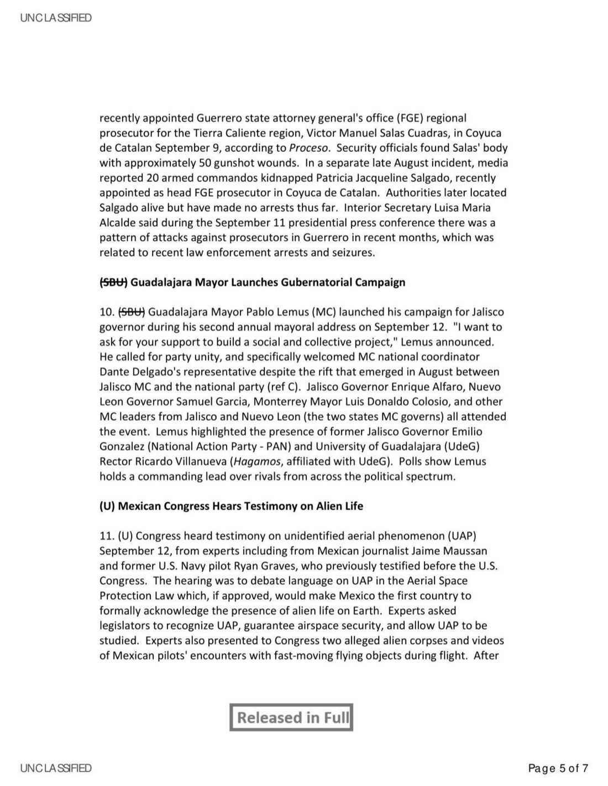

# #155 State Dept UAP Cable 5：墨西哥城 → 華府 2023-09-16「Mexican Congress Hears Testimony on Alien Life」

| 欄位 | 內容 |
|---|---|
| 來源 | AMEMBASSY MEXICO（Ambassador Salazar）|
| 日期 | 2023-09-16（Weekly Political Blotter for Sep 11-15）|
| 收件 | NSC, OVP, ONI, CIA, DIA, USNORTHCOM, DHS, DOJ, USSOUTHCOM Miami, WHA Diplomatic Posts, All US Consulates in Mexico |
| 主旨 | Mexico: Weekly Political Blotter, Sep 11-15（內含 "Mexican Congress Hears Testimony on Alien Life" 一節）|
| 機密層級 | SBU ／ Released in Full（2026-02-25）|
| 公開日 | 2026-05-08 |

## 故事

2023-09-12，墨西哥城國會山莊，全世界第一場官方國會層級的外星生命聽證會。議題：把 UAP 條款寫進 Mexican Aerial Space Protection Law；若通過，墨西哥就是第一個立法承認外星生命存在的國家。

兩位主要證人。墨西哥記者 Jaime Maussan 站在議員席前，搬出兩具乾屍，宣稱是「非人類存在」（後來被墨西哥法醫科學研究所與秘魯文化部鑑定為人類嬰兒骨骼加駱駝/羊駝骨骼拼接的偽造物）。另一位是前美國海軍 F/A-18 飛行員 Ryan Graves，2023-07 才在美國國會 UAP 聽證證詞。聽證後 Graves 公開表達失望：Maussan 的「unsubstantiated stunt」（無根據的噱頭）把他與其他飛行員的嚴肅 UAP 經驗一起拖下水。

四天後，2023-09-16，美駐墨西哥大使館（Salazar 大使簽）把這件事寫進 Weekly Political Blotter，第 11 條，跟 Mexico City Security Secretary 換人、MORENA 黨內選舉、Guerrero 檢察官被殺等內政條目並列。收件單位：NSC、OVP、ONI、CIA、DIA、USNORTHCOM、DHS、DOJ。State Dept 沒評論 Graves 的證詞嚴肅性，也沒評論 Maussan 的偽造物，只寫了一句：「Scientists have discredited previous alleged alien corpses Maussan presented as evidence of alien life.」

這份是 5 份國務院 UAP cable 中唯一的實質 UAP 內容。其他 4 份（PNG, Kazakhstan, Tbilisi, Ashgabat）都是政治脈絡裡剛好出現 UFO 一詞，這份是 2023 年 UAP 議題進入 NORTHCOM 與情報界例行政治簡報的時刻。1952 年 Samford 給 Nitze 的飛碟摘要還是跨機構特殊事件，2023 年的處理已是 weekly blotter 第 11 條。71 年的議題正常化軌跡。

## 1. 主文

> (U) Mexican Congress Hears Testimony on Alien Life
>
> 11. (U) Congress heard testimony on unidentified aerial phenomenon (UAP) September 12, from experts including from Mexican journalist Jaime Maussan and former U.S. Navy pilot Ryan Graves, who previously testified before the U.S. Congress. The hearing was to debate language on UAP in the Aerial Space Protection Law which, if approved, would make Mexico the first country to formally acknowledge the presence of alien life on Earth. Experts asked legislators to recognize UAP, guarantee airspace security, and allow UAP to be studied. Experts also presented to Congress two alleged alien corpses and videos of Mexican pilots' encounters with fast-moving flying objects during flight. After the hearing, Graves lamented the display took away from his and other pilots' experiences with UAP and expressed disappointment with Maussan's "unsubstantiated stunt." Scientists have discredited previous alleged alien corpses Maussan presented as evidence of alien life.

> (U) 墨西哥國會聽取外星生命證詞
>
> 11. (U) 國會於 9 月 12 日聽取了關於不明航太現象（UAP）的證詞，專家包括墨西哥記者 Jaime Maussan 與前美國海軍飛行員 Ryan Graves，後者曾於美國國會證詞。本次聽證會旨在辯論《空域保護法》中關於 UAP 的語言條款，若通過，墨西哥將是第一個正式承認地球上存在外星生命的國家。專家要求立法者承認 UAP、保障空域安全、允許 UAP 被研究。專家也向國會展示了兩具所謂的外星屍體和墨西哥飛行員飛行中與快速移動飛行物體遭遇的影片。聽證後，Graves 感嘆此展示分散了他與其他飛行員 UAP 經驗的注意力，並對 Maussan 的「無根據的噱頭」表達失望。科學家已駁斥 Maussan 先前展示作為外星生命證據的所謂外星屍體。

附 Figure 1：Jaime Maussan 在國會展示「非人類存在」遺骸的 Reuters 照片。

## 2. 墨西哥國會聽證的政策背景

**Aerial Space Protection Law**（aka Ley de Protección al Espacio Aéreo）是墨西哥國會 2023 年在審議的擴大墨西哥領空主權與管制範圍的立法。原本內容涵蓋國家安全、軍事飛行、商業空運等。Maussan + Graves 的證詞旨在說服立法者把「UAP 議題」納入法律語言，這將是世界首次以國家立法承認 UAP/外星生命議題。

**Jaime Maussan**：墨西哥記者，1990s 起持續推動 UAP 議題，多次被科學界批評使用偽造或誤判證據（包括 2015 Sirius Disclosure 期間的「Roswell slides」實為印地安孩童木乃伊照片）。本次 2023-09-12 展示的「外星屍體」（兩具乾屍）來自秘魯 Nazca 地區，後續科學鑑定（Mexican Institute of Forensic Sciences、Peruvian Ministry of Culture）認為是用人類嬰兒骨骼與駱駝/羊駝骨骼拼接而成的偽造物。

**Ryan Graves**：前美國海軍 F/A-18 戰機飛行員，2014-15 期間在 VFA-11「Red Rippers」中隊服役期間目擊大量 UAP，成為 2023-07 美國國會 UAP 聽證的核心證人之一。Graves 在墨西哥聽證中代表「嚴肅的飛行員目擊」陣營，但與 Maussan 共享舞台導致他事後公開表達不滿。

聽證會後續：墨西哥國會並未通過將外星生命承認納入空域保護法，但聽證會本身成為全球 UAP 議題媒體焦點。Maussan 2024 又在類似場合展示其他「樣本」，繼續被科學界否認。

## 3. State Dept 的「常規化」處理

本電報的結構顯示 State Dept 對 UAP 議題的最新態度：

- UAP 條目和 Mexico City 安全部長換人、MORENA 黨內選舉、Guerrero 暗殺案等併陳，作為「每週政治簡報」的常規條目。
- 不評論 Graves 的證詞嚴肅性，也不評論 Maussan 的「偽造屍體」，只記錄科學家已駁斥。
- 收件人包含 NSC、CIA、DIA、ONI、USNORTHCOM 等情報與軍事機構。

「2023 年 UAP 議題進入 NORTHCOM 與情報界例行政治簡報」這個事實本身意味，UAP 已從「特殊議題」變成「正規外交與政治分析項目」。比較 [#030 1952 Samford 給 Nitze 飛碟摘要](../030-59_64634_711.5612_1952_state_samford/report.md)（首次 State Dept 介入 UAP，視為跨機構特殊事件），本檔案 2023 的處理是「日常化」。

## 4. 觀察

**(1) UAP 議題的「常規化」**：1952 Samford → Nitze 是 State Dept 對 UFO 議題的首次認真處理，特殊待遇。2023 Mexico UAP 聽證已是 weekly political blotter 的常規條目。中間 71 年的政府 UAP 議題正常化軌跡可從本系列檔案推導。

**(2) 「外星屍體」進入官方國會的時刻**：2023-09-12 是世界首次（公開記錄中）有國會層級正式聽證會展示「外星屍體」實體。美國國務院的處理：記錄但不評論，並引述科學家駁斥。「不背書 + 不否認」是 State Dept 對民間 UAP 敘事的標準處理。

**(3) Graves vs. Maussan 公開分裂**：本檔案捕捉 UAP 議題公開支持者陣營內部的方法論分裂。Graves（飛行員目擊 + 美國國會 + 五角大廈 AARO）vs. Maussan（媒體展示 + 偽造證物 + Disclosure）兩條路線，2023-09 在墨西哥國會場合直接碰撞。

**(4) Mexican Aerial Space Protection Law 的全球先例性質**：若通過會成為全球第一個立法承認外星生命的國家，本檔案是這個立法提案實況的美國官方記錄。聽證會後立法並未通過，但「全球第一」的提案本身已成立。

## 5. 跨檔案連結

- **[#019 COMETA Report 1999 + Rosin → NASA](../019-255_413270_cometa_report_rosin/report.md)**：1999 法國軍方退休將領的 ET 假設研究 vs. 2023 墨西哥國會 Maussan 展示偽造屍體 + Graves 嚴肅證詞，兩種「ET 公共敘事」的 24 年對比。COMETA 是「嚴肅學術 + 軍方退役」路線；本檔案 2023 是「奇觀展示 + 飛行員證詞」混合路線的政治化。
- **[#029 白宮 Space Council 1963 Hunter](../029-59_214434_sp_16_1963_alien_race/report.md)**：1963 Hunter 預言「our policy will be determined in the traditional manner of grand panic」。2023 墨西哥聽證 + 美國 2023-07 國會聽證之後，UAP 政策仍未脫離 Hunter 預言的「ad hoc」模式。
- **[#153 / #154 State Dept UAP Cable 3 / 4](../153-state_dept_uap_cable_3_tbilisi_2001/report.md)**：本檔案是國務院 UAP cable 系列中**唯一一份實質性 UAP 內容**的電報，與其他 cable 的「UFO 修辭比喻」或「UFO 命名 NGO」形成鮮明對比。

## 6. 來源

- 原始檔案：[U.S. Department of War — State Department UAP Cable 5, Mexico, September 16, 2003](https://www.war.gov/UFO/#State%20Department%20UAP%20Cable%205,%20Mexico,%20September%2016,%202003)
- PDF 直接下載：`https://www.war.gov/medialink/ufo/release_1/059uap00013.pdf`
- 公開日：2026-05-08
- 7 頁，原 SBU，Released in Full
- 注意：CSV 中標示「2003-09-16」，但電報內容明確為 2023-09-12 墨西哥國會聽證（Sheinbaum 提名、Ebrard 黨內挑戰、Pablo Vazquez 接 Mexico City 安全部長等內文都是 2023 事件）。CSV 日期錯誤。
