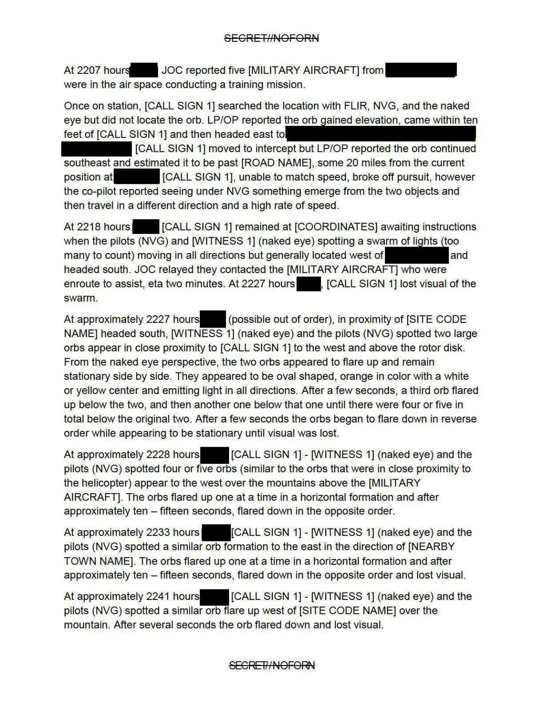
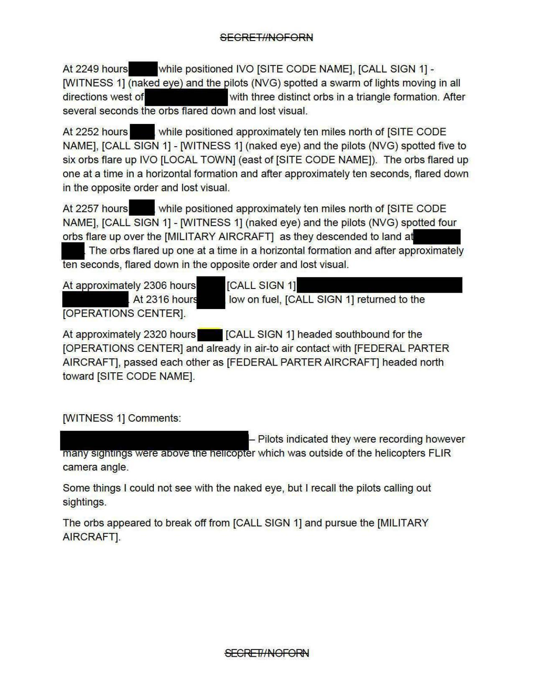

# #156 USPER Statement：直升機 FLIR + NVG 追蹤光球群、編隊上下「flare up / flare down」三小時

| 欄位 | 內容 |
|---|---|
| 文件類型 | USPER Statement about UAP Sighting（書面證詞 / 三人稱記述）|
| 機密層級 | SECRET // NOFORN（部分塗黑後釋出）|
| 事件時間 | 2025 年某日 1700-2320 hours |
| 觀測者 | WITNESS 1（資深 US 情報官員）+ 多名 FEDERAL PARTNER（PARTNER 2、PARTNER 3 等）|
| 平台 | 直升機（[CALL SIGN 1]，含 FLIR + NVG）+ MILITARY AIRCRAFT |
| 公開日 | 2026-05-08 |

## 故事

2025 年某日下午 5 點，一位資深美國情報官員（WITNESS 1）和另一位資深情報官員（WITNESS 2），帶著 [STATE PARTNER ORGANIZATION] 兩名飛行員，搭一架配 FLIR 加 NVG 的直升機（呼號 [CALL SIGN 1]），從 [OPERATIONS CENTER] 起飛，要去搜山。山頭西邊就在 [FACILITY] 範圍內，先前有目擊者通報過 orbs/lights，還聽到「東西掉到地面的撞擊聲」。

6 小時後，事情變得不太對勁。22:18，直升機停在 [COORDINATES] 等指示，飛行員（NVG）與 WITNESS 1（裸眼）同時看到「無法計數」的光球從所有方向湧出，整體朝南。JOC 通報軍機（[MILITARY AIRCRAFT]）兩分鐘到場支援。22:27 起，5-6 顆橙色光球在直升機西邊主旋翼盤上方出現，先兩顆並排亮起，再一顆、又一顆從下方往上長，10 秒內 5-6 顆排成水平編隊，然後依「相反順序」一個個熄滅。

22:28、22:31、22:41、22:52、22:57 連續五次同樣的「flare up 一個個亮起、flare down 相反順序熄滅」循環。位置在山頂上方、軍機上方、[LOCAL TOWN] 上方輪流出現。WITNESS 1 結語只有一句話：「The orbs appeared to break off from [CALL SIGN 1] and pursue the [MILITARY AIRCRAFT]」（光球從直升機旁離開、然後追擊軍機）。

這份是 War Department 釋出的 2023-2025 美國西部 UAP 多目擊事件中唯一一份 SECRET // NOFORN 書面證詞，含 multiple orbs、pursue military aircraft、flare up flare down 循環。WITNESS 1 是資深情報官員親口記述，FLIR + NVG + 裸眼 + JOC + LP/OP + 軍機多平台同步。

關鍵觀察：

1. **多平台同步**：直升機 [CALL SIGN 1] + [FEDERAL PARTNER AIRCRAFT] + 多個 LP/OP 地面點 + JOC（Joint Operations Center）+ MILITARY AIRCRAFT。多平台多模態（裸眼 + NVG + FLIR）並行紀錄。
2. **20 哩追不上**：「[CALL SIGN 1] could not catch the orb, even after pursuit, 4 miles out from location」+ 後續「could not catch」狀況反覆。
3. **flare up / flare down 循環**：1 顆橙球 → 1 顆 → 五六顆 → 四顆，每次「flare up one at a time in a horizontal formation」並在「approximately ten seconds, flared down in the opposite order and lost visual」。
4. **Orbs pursue military aircraft**：WITNESS 1 評論「The orbs appeared to break off from [CALL SIGN 1] and pursue the [MILITARY AIRCRAFT]」。

## 1. 1700-1751：起飛 + 抵山區

> On [2025], at approximately 1700 hours, [WITNESS 1 (a senior US intelligence official)], accompanied by [WITNESS 2 (a senior US intelligence official)], and two pilots from [STATE PARTNER ORGANIZATION], departed the [OPERATIONS CENTER] [COORDINATES] [CALL SIGN 1] main [REDACTED] area via a [STATE PARTNER ORGANIZATION] helicopter (call sign [CALL SIGN 1]) to conduct a daytime aerial search of the [REDACTED MOUNTAIN NAME] west of [SITE CODE NAME] on [FACILITY]. Previous eyewitness reports from personnel who observed orbs/lights IVO [COORDINATES] cited hearing thuds as if something has fallen and hit the ground. (Note: Earlier that day the [REDACTED] office completed a successful test of the [REDACTED] at [SITE CODE NAME] [COORDINATES] on [FACILITY].

> 2025 年某日約 1700 時，[WITNESS 1（資深美國情報官員）]，與 [WITNESS 2（資深美國情報官員）] 以及來自 [STATE PARTNER ORGANIZATION] 的兩名飛行員一同，由 [OPERATIONS CENTER] [COORDINATES][CALL SIGN 1] 主要 [REDACTED] 區域出發，搭乘 [STATE PARTNER ORGANIZATION] 的直升機（呼號 [CALL SIGN 1]），於 [SITE CODE NAME] 西側、位於 [FACILITY] 內的 [REDACTED MOUNTAIN NAME] 進行日間空中搜索。先前親眼目擊者在 IVO [COORDINATES] 區域看到 orbs/lights，並聽到類似有東西掉到地面的撞擊聲。（註：當日稍早 [REDACTED] 辦公室於 [SITE CODE NAME][COORDINATES] [FACILITY] 完成了一次 [REDACTED] 的成功測試。

> At 1751 hours, [CALL SIGN 1] spotted a large cavern entrance [COORDINATES] and conducted a short orbit of the location.

> 1751 時，[CALL SIGN 1] 在 [COORDINATES] 看到一處大型洞穴入口，並對該位置進行短暫盤旋。

關鍵：

- 1700 起飛，搜尋目標是早先目擊者通報 orbs/lights 的山區。
- 早先有「thuds as if something has fallen and hit the ground」（東西掉到地面的撞擊聲）。
- 同日稍早 [REDACTED] 辦公室在另一場地完成 [REDACTED] 的測試。後續是否與 UAP 事件相關，未說明。

## 2. 2050：完成測試 + 紅外線追蹤

> At approximately 2050 hours, [CALL SIGN 1] landed west of the [REDACTED MOUNTAIN NAME] and dropped off [WITNESS 2] with [FEDERAL PARTNER 3] personnel. At 2032 hours, [CALL SIGN 1] headed toward [SITE CODE NAME] to refuel. A second helicopter [STATE PARTNER ORGANIZATION] - [CALL SIGN 2] briefly landed at [SITE CODE NAME] before turning the command center position at [CALL SIGN 1], unable to match speed, broke off pursuit. However the co-pilot reported seeing under NVG something emerge from the two objects and then travel in a different direction at a high rate of speed.

> At 2218 hours [CALL SIGN 1] remained at [COORDINATES] awaiting instructions when the pilots (NVG) and [WITNESS 1] (naked eye) spotting a swarm of lights (too many to count) moving in all directions but generally located west of [REDACTED] and headed south. JOC relayed they contacted the [MILITARY AIRCRAFT] which were enroute to assist, eta two minutes. At 2227 hours [CALL SIGN 1] lost visual of the swarm.

> 2050 時，[CALL SIGN 1] 在 [REDACTED MOUNTAIN NAME] 以西降落，將 [WITNESS 2] 與 [FEDERAL PARTNER 3] 人員放下。2032 時，[CALL SIGN 1] 飛往 [SITE CODE NAME] 加油。第二架直升機 [STATE PARTNER ORGANIZATION] - [CALL SIGN 2] 短暫降落於 [SITE CODE NAME]…[CALL SIGN 1] 因無法配速而中止追擊。然而副駕駛在 NVG 中看到某物從那兩個物體中「emerge」並以高速朝不同方向移動。

> 2218 時，[CALL SIGN 1] 仍在 [COORDINATES] 等候指示，此時飛行員（NVG）與 [WITNESS 1]（裸眼）目擊一群「數量無法計數」的光球向所有方向移動，整體位於 [REDACTED] 以西、整體朝南。JOC 通知他們已聯絡 [MILITARY AIRCRAFT]，預計兩分鐘到場支援。2227 時，[CALL SIGN 1] 失去那群光球的視覺。

## 3. 2218 起：swarm + flare up / flare down 三段

> At approximately 2227 hours [REDACTED] (possible out of order), in proximity of [SITE CODE NAME] headed south, [WITNESS 1] (naked eye) and the pilots (NVG) spotted five large orbs appear in close proximity to [CALL SIGN 1] to the west and above the rotor disk. From the naked eye perspective, the two orbs appeared to flare up and remain stationary side by side. They appeared to be oval shaped, orange in color with a white or yellow center and emitting light in all directions. After a few seconds, a third orb flared up below the two, and then another one below that one until there were four or five in total below the original two. After a few seconds the orbs began to flare down in reverse order, eta no minutes, [CALL SIGN 1] lost visual of the swarm.

> 2227 時 [REDACTED]（時序可能略亂），於 [SITE CODE NAME] 附近朝南，[WITNESS 1]（裸眼）與飛行員（NVG）看到五顆大型光球在 [CALL SIGN 1] 主旋翼盤面西側偏上方近距離出現。從裸眼看，兩顆光球先 flare up 並並排靜止。它們呈卵形、橙色、中心白或黃，朝四面發光。幾秒後第三顆在下方 flare up，再有一顆在更下方，最後在最初兩顆下方一共出現四到五顆。幾秒後光球以相反順序 flare down，[CALL SIGN 1] 失去視覺。

> At approximately 2228 hours, [CALL SIGN 1] - [WITNESS 1] (naked eye) and the pilots (NVG) spotted four or five orbs (similar to the orbs that were in close proximity to [CALL SIGN 1]) to the west and over the mountains above the [MILITARY AIRCRAFT]. The orbs flared up one at a time in a horizontal formation and after approximately ten – fifteen seconds, flared down in the opposite order.

> 2228 時，[CALL SIGN 1] - [WITNESS 1]（裸眼）與飛行員（NVG）看到四或五顆光球（與先前接近 [CALL SIGN 1] 的相似），位於西方山頂、在 [MILITARY AIRCRAFT] 上方。光球依序水平 flare up 一個個亮起，約 10-15 秒後依相反順序 flare down。

> At approximately 2231 hours, [CALL SIGN 1] - [WITNESS 1] (naked eye) and the pilots (NVG) spotted a similar orb formation to the east in the direction of [NEARBY TOWN NAME]. The orbs flared up one at a time in a horizontal formation and after approximately ten – fifteen seconds, flared down in the opposite order and lost visual.

> 2231 時，[CALL SIGN 1] - [WITNESS 1]（裸眼）與飛行員（NVG）在東方朝 [NEARBY TOWN NAME] 方向看到類似的光球編隊。光球依序水平 flare up，約 10-15 秒後依相反順序 flare down 並失去視覺。

> At approximately 2241 hours [CALL SIGN 1] - [WITNESS 1] (naked eye) spotted a single orb (NVG) spotted a single orb flare up west of [SITE CODE NAME] over the mountain. After several seconds the orb flared down and lost visual.

> 2241 時，[CALL SIGN 1] - [WITNESS 1]（裸眼）和（NVG）看到一顆單獨的光球在 [SITE CODE NAME] 以西山上 flare up。數秒後光球 flare down 並失去視覺。

「flare up one at a time + flare down in reverse order」是本事件的核心 signature。十秒內 5-6 顆球依序亮起、再依相反順序熄滅，意味某個共同訊號或編隊規律。

## 4. 2249-2320：swarm triangle + 接駁

> At 2249 hours [REDACTED] while positioned IVO [SITE CODE NAME], [CALL SIGN 1] - [WITNESS 1] (naked eye) and the pilots (NVG) spotted a swarm of lights moving in all directions west of [REDACTED] with three distinct orbs in a triangle formation. After several seconds the orbs flared down and lost visual.

> 2249 時 [REDACTED] 仍位於 [SITE CODE NAME] 附近，[CALL SIGN 1] - [WITNESS 1]（裸眼）與飛行員（NVG）看到一群光球在 [REDACTED] 以西全方向移動，其中三顆光球呈三角形編隊。數秒後光球 flare down 並失去視覺。

> At 2252 hours [REDACTED] while positioned approximately ten miles north of [SITE CODE NAME], [CALL SIGN 1] - [WITNESS 1] (naked eye) spotted five to six orbs flare up IVO [LOCAL TOWN] (east of [SITE CODE NAME]). The orbs flared up one at a time in a horizontal formation and after approximately ten seconds, flared down in the opposite order and lost visual.

> 2252 時，[REDACTED] 距 [SITE CODE NAME] 北方約 10 哩處，[CALL SIGN 1] - [WITNESS 1]（裸眼）看到 5-6 顆光球在 [LOCAL TOWN]（[SITE CODE NAME] 東側）IVO flare up。光球依序水平 flare up，約 10 秒後依相反順序 flare down 並失去視覺。

> At 2257 hours [REDACTED] while positioned approximately ten miles north of [SITE CODE NAME], [CALL SIGN 1] - [WITNESS 1] (naked eye) and the pilots (NVG) spotted four orbs flare up over the [MILITARY AIRCRAFT] as they descended to land at [REDACTED]. The orbs flared up one at a time in a horizontal formation and after approximately ten seconds, flared down in the opposite order and lost visual.

> 2257 時，[REDACTED] 距 [SITE CODE NAME] 北方約 10 哩處，[CALL SIGN 1] - [WITNESS 1]（裸眼）與飛行員（NVG）看到 4 顆光球在 [MILITARY AIRCRAFT] 上方 flare up，正當該飛機降落至 [REDACTED]。光球依序水平 flare up，約 10 秒後依相反順序 flare down 並失去視覺。

> At approximately 2306 hours [CALL SIGN 1] [REDACTED]. At 2316 hours [REDACTED] low on fuel, [CALL SIGN 1] returned to the [OPERATIONS CENTER]. At approximately 2320 hours [CALL SIGN 1] headed southbound for the [OPERATIONS CENTER] and already in air-to-air contact with [FEDERAL PARTER AIRCRAFT], passed each other as [FEDERAL PARTER AIRCRAFT] headed north toward [SITE CODE NAME].

> 約 2306 時，[CALL SIGN 1][REDACTED]。2316 時，[REDACTED] 燃料偏低，[CALL SIGN 1] 返回 [OPERATIONS CENTER]。約 2320 時，[CALL SIGN 1] 南向飛往 [OPERATIONS CENTER]，已與 [FEDERAL PARTNER AIRCRAFT] 建立空對空通聯，兩機交會，後者朝北方 [SITE CODE NAME] 飛去。

## 5. WITNESS 1 結語：Orbs Pursue Military Aircraft

> [WITNESS 1] Comments:
> [REDACTED] – Pilots indicated they were recording however many sightings were above the helicopter which was outside of the helicopters FLIR camera angle.
> Some things I could not see with the naked eye, but I recall the pilots calling out sightings.
> The orbs appeared to break off from [CALL SIGN 1] and pursue the [MILITARY AIRCRAFT].

> [WITNESS 1] 評論：
> [REDACTED] - 飛行員表示他們有錄影，但許多目擊位於直升機上方，超出直升機 FLIR 攝影鏡頭的角度範圍。
> 有些東西我裸眼看不到，但我記得飛行員會喊出他們的目擊。
> 光球似乎從 [CALL SIGN 1] 旁離開、然後追擊 [MILITARY AIRCRAFT]。

「Orbs pursue military aircraft」是整份證詞最值得關注的結論。光球：

1. 接近 [CALL SIGN 1] 直升機（2227 hours）
2. 在不同方向出現 swarm（2218-2249 hours）
3. 朝 [MILITARY AIRCRAFT] 移動並在其上方 flare up flare down（2228 + 2257 hours）

意味光球的行為與美軍空中平台有關聯。

## 6. 觀察

(1) **跨平台 + 多模態紀錄**：直升機 FLIR + NVG + 裸眼 + JOC + LP/OP + MILITARY AIRCRAFT。多平台同步意味事件不是單一觀測者錯覺。

(2) **flare up / flare down + 相反順序**：核心 signature 是「按順序亮 → 按相反順序熄」，意味光球之間有同步機制。10-15 秒亮起持續時間 + 立即按相反順序熄滅，與煙火/氣球不符。

(3) **追不上**：直升機 [CALL SIGN 1] 試圖追擊光球，「無法配速、中止追擊」。後續再次嘗試亦同。光球速度顯著高於旋翼機。

(4) **編隊與互動**：三顆三角形編隊（2249 hours）、四到五顆水平編隊、六顆從一顆增長到六顆的「增生」模式（2227 hours）。光球之間存在編隊邏輯，且能朝美軍空中平台主動接近。

(5) **沒有抓到飛行特徵**：所有觀測都是「flare up 數秒後 flare down」，沒有觀測到光球在空中橫向移動的長軌跡。這與 #161 Western US Event 的 Orbs Launching Orbs（橙色母球發射紅色子球，紅色橫向飛走）不完全一致，意味本檔案的事件比 #161 的橙色 + 紅色雙色事件更純粹（單一型態 + 編隊閃爍）。

## 7. 跨檔案連結

- [#161 Western US Event](../161-western_us_event/report.md)：四種型態（橙色發射紅色、巨大火球、深色風箏、透明風箏）的官方 slide 摘要 + AARO 量測。本檔案是「光球編隊 flare up / flare down」單一型態的詳細時間戳紀錄。
- [#157 Composite Sketch](../157-fbi_september_2023_composite_sketch/report.md)：FBI 實驗室合成 9 月 2023 美國西部 UAP 目擊草圖（橢球銅金屬色 + 強光）。本檔案的「oval shaped, orange, white/yellow center」與該草圖的色彩與形狀描述吻合。
- [#158-#160 FBI 302 Serial](../158-fbi_september_2023_serial_3/report.md)：同事件中試驗場承包商（非執法人員）的 FBI 302 訪談紀錄。本檔案 USPER 是在事件主動參與的執法人員，與承包商的「偶然目擊」形成對照。

## 8. 來源

- 原始檔案：[U.S. Department of War — USPER Statement about UAP Sighting](https://www.war.gov/UFO/#USPER%20Statement%20about%20UAP%20Sighting)
- PDF 直接下載：`https://www.war.gov/medialink/ufo/release_1/usper-statement-redacted.pdf`
- 公開日：2026-05-08
- 3 頁，原 SECRET // NOFORN，部分塗黑後釋出
- 事件時間：2025 年某日 1700-2320 hours
