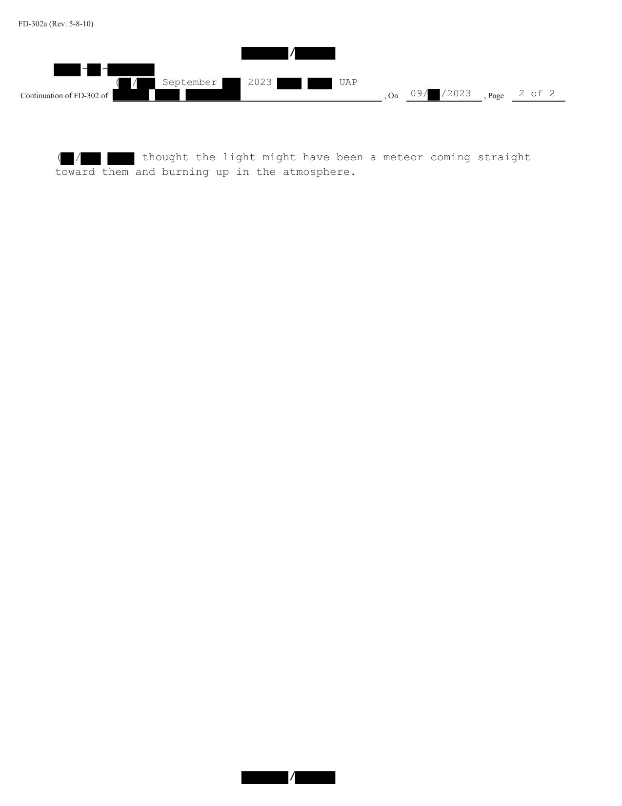

# #158 FBI 302 訪談（2023-09 LiDAR 試驗場）：地平線上方明亮白光、靜止 10 秒、消失

| 欄位 | 內容 |
|---|---|
| 文件類型 | FBI FD-302 訪談紀錄（FaceTime video 訪談）|
| 訪談日期 | 2023-10-？ |
| 訪談人 | FBI Special Agent + 同僚 |
| 受訪人 | LiDAR 試驗場承包商組成員（駕駛 F-150） |
| 事件日期 | 2023-09 某日 ~09:00 am |
| 公開日 | 2026-05-08 |

## 故事

2023-09 某日早上 9 點，美國西部某試驗場，三輛車一隊往東開去設定 LiDAR 試驗。受訪者坐在第一輛 F-150，車隊穿過幾道閘門。穿過某道閘門時他抬頭，從擋風玻璃右上角看到地平線上方一道亮白光，靜止懸停，然後往右移動一下，10 秒後消失。距離他估計 10-20 哩遠。

他把光指給駕駛看，駕駛看錯方向。沒看到。他自己也對這件事不太在意，覺得可能就是「直接朝他們飛來、在大氣中燃燒消失的流星」。但到了第一個試驗場後，第三輛車的兩位同事跑來說他們也看到了。一個月後 FBI 用 FaceTime 視訊訪談他，列為這場 2023-09 美國西部多目擊事件的次要證人。

與 #159（雪茄銅色 + 強光在物體東端 + 兩三架黑鷹長）、#160（線狀 + 金屬灰 + 約 5,000 ft 上空 + 東西向）對照：

- #158（本檔案）：**白光，無形狀，靜止，10 秒，10-20 哩遠**。
- #159：**雪茄銅色，幾乎懸停慢動 5-10 秒，向東西方向移動**。
- #160：**線狀金屬灰色，5,000 ft 上空，東西向平行於地面**。

三份證詞描述差別大，卻來自同一個 LiDAR 試驗場 + 同日上午 + 同組 3 輛車的同事或承包商，是事件多視角的關鍵原始證據。

本檔案受訪者特別說明：「未注意到對車輛電氣的任何干擾」，且本人「對光不在意」，先看到光的同事與「另一輛車的乘客」也說看到了。這是一份「次要目擊者」的證詞。

## 1. 訪談脈絡

> On September [REDACTED] 2023, [REDACTED] and FBI Special Agent [REDACTED] interviewed [REDACTED] via Facetime video ([REDACTED] was in [REDACTED] at the time of the interview). After being advised of the identity of the interviewing agents and the nature of the interview, [REDACTED] provided the following information:

> 2023 年 9 月 [REDACTED]，[REDACTED] 與 FBI Special Agent [REDACTED] 通過 FaceTime 視訊訪談 [REDACTED]（受訪者訪談時人在 [REDACTED]）。在受訪者被告知訪談探員身分與訪談性質後，[REDACTED] 提供以下資訊：

> On September [REDACTED] 2023 at around 9:00 am, [REDACTED] was at [REDACTED] driving east to a test site to acquire data for LiDAR testing with [REDACTED] and [REDACTED] were driving an F150. [REDACTED] was behind them, driving a GMC AT4 with [REDACTED] as his passenger. [REDACTED] was behind them driving a sprinter van.

> 2023 年 9 月 [REDACTED] 約 09:00 am，[REDACTED] 在 [REDACTED] 駕車向東前往試驗場，與 [REDACTED] 一同進行 LiDAR 測試的資料採集，他們駕一輛 F-150。[REDACTED] 在他們後方，駕一輛 GMC AT4，乘客是 [REDACTED]。[REDACTED] 在更後方駕一輛 Sprinter Van。

## 2. 目擊描述

> The vehicles drove through a couple of gates and [REDACTED] saw a bright light over the horizon. The light was stationary in the air, then started moving to the right and then disappeared. [REDACTED] could see the light through the top right of the vehicle's windshield. The light was bright white and was visible for ten seconds before it disappeared. The light stayed the same size throughout the incident. [REDACTED] thought the light was ten to twenty miles away. [REDACTED] did not notice any interference with his vehicle.

> 車隊穿過幾道閘門，[REDACTED] 看到地平線上方有一道亮光。光本來在空中靜止，然後開始向右移動然後消失。[REDACTED] 可以從車輛擋風玻璃右上方看到光。光呈亮白色，可見 10 秒後消失。整個事件中光的大小保持不變。[REDACTED] 認為光距離 10-20 哩遠。[REDACTED] 未注意到車輛有任何干擾。

> [REDACTED] pointed the light out to [REDACTED] but [REDACTED] looked in the wrong direction. [REDACTED] was also tall and had his seat leaned back so he was not in a good position to see the light. [REDACTED] was indifferent to the light until they got to the first test site and [REDACTED] and [REDACTED] said they saw it too.

> [REDACTED] 把光指給 [REDACTED] 看，但 [REDACTED] 看錯方向。[REDACTED] 身高較高且座椅斜倚，看光的角度也不佳。[REDACTED] 對該光感到漠然，直到他們到第一個試驗場後 [REDACTED] 與 [REDACTED] 也說他們看到了。

關鍵要素：

- 地平線上方、亮白色、靜止然後向右移動然後消失。
- 大小保持不變、可見 10 秒、估計 10-20 哩遠。
- 受訪者看到時車輛在通過閘門，擋風玻璃右上方。
- 同車駕駛側未看到（看錯方向）。
- 第三車兩名乘員也說看到了。
- 無電氣干擾。

## 3. 流星假設（後續被修正）

> [REDACTED] thought the light might have been a meteor coming straight toward them and burning up in the atmosphere.

> [REDACTED] 認為該光可能是一顆直接朝他們飛來、在大氣中燃燒消失的流星。

**「meteor coming straight toward them」**是受訪者本人在訪談中提出的解釋假設。這個假設的特殊性：

- 流星「直接朝觀測者方向飛來」會在天空中近似靜止點（因徑向視運動小），亮度先增後減消失，與「靜止 10 秒、向右移動然後消失」不完全一致。
- 但若流星進入大氣前是「擦邊掠過」軌跡（earth-grazing fireball），則可能維持較長可見時間（10 秒級）並橫向移動然後在地球大氣層上方消失。1972-08-10 美國西部 Great Daylight Fireball 即為一例（觀測者描述為「亮白光、橫向長軌跡、最後消失」）。

但目擊者只描述為「stationary then started moving to the right then disappeared」，與標準擦邊流星的剖面有差距。受訪者對自己這個假設的信心程度未在 302 中明確表達。

## 4. 觀察

(1) **次要目擊者的價值**：本檔案受訪者是「先看到的人，但對事件本身漠然」。次要目擊者的證詞通常比主目擊者更接近基線觀察（不受到事件後續解讀的污染）。

(2) **FaceTime 訪談的限制**：FBI 透過 FaceTime 視訊訪談意味受訪者已不在原試驗場附近。視訊訪談對細節捕捉的精度比 in-person 訪談低，特別是視角與動作展示。對比 #159 為 in-person 訪談，內容明顯詳細很多。

(3) **「10-20 哩遠」 vs. 「靜止」**：若距離 10-20 哩、可見 10 秒，物體必須在這段時間內：
   - 完全靜止 → 然後「向右」短暫位移 → 然後消失。
   - 估計時間軸：8 秒靜止 + 1-2 秒向右移動 + 1 秒消失。
   
   這個時間結構不符合任何明亮對流層飛行器（飛機在 10-20 哩距離的視運動會明顯快過 10 秒一格的「靜止 → 向右」）。也不符合衛星閃光（衛星反光為瞬間，不會 10 秒可見）。

(4) **與 #159 / #160 的不一致**：同事件的 3 名目擊者描述差別大。可能解釋：
   - 三個人看到的是不同物體。
   - 同物體在不同距離下視覺特徵不同。
   - 觀察者的描述語言能力差異。
   
   FBI 沒有對三份證詞做交叉驗證的結論性說明。

## 5. 跨檔案連結

- [#159 FBI 302（雪茄銅金屬色 in-person）](../159-fbi_september_2023_serial_4/report.md)：同事件詳細描述。
- [#160 FBI 302（線狀金屬灰色 FaceTime）](../160-fbi_september_2023_serial_5/report.md)：同事件另一名遠端訪談證人。
- [#157 Composite Sketch](../157-fbi_september_2023_composite_sketch/report.md)：依 #159 證詞繪製的 FBI 實驗室合成草圖。
- [#161 Western US Event](../161-western_us_event/report.md)：同事件官方 slide 摘要與 AARO 量測。

## 6. 來源

- 原始檔案：War Department UAP Release 1（File at index #158 row in War Department portal）
- PDF 直接下載：`https://www.war.gov/medialink/ufo/release_1/serial%205%20redacted_redacted.pdf`（URL 檔名 `serial 5 redacted` 與內部 Serial 編號的關係見任務說明）
- 公開日：2026-05-08
- 2 頁，FBI FD-302（Rev. 5-8-10）
- 訪談方式：FaceTime 視訊
