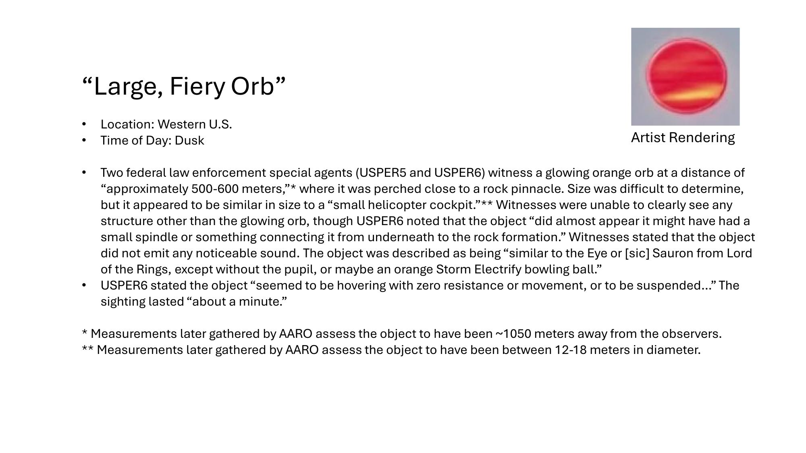
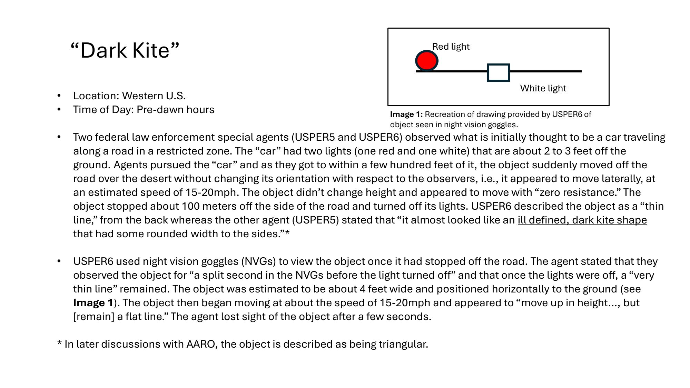
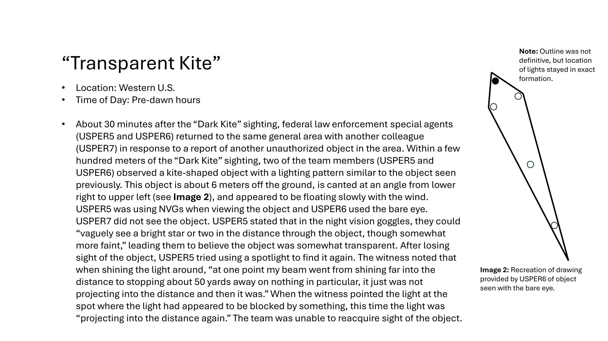

# #161 美國西部 UAP 事件四類型：Orbs Launching Orbs、Large Fiery Orb、Dark Kite、Transparent Kite

| 欄位 | 內容 |
|---|---|
| 標題 | Western US Event Slides |
| 日期（事件）| 2023 年某二日（黃昏 + 黎明前）|
| 觀測者 | 7 名聯邦執法部門特別探員（USPER1 至 USPER7）|
| 地點 | Western United States（具體座標經 AARO 量測，未公開）|
| 文件來源 | War Department UAP Release 1 |
| 公開日 | 2026-05-08（slide 標題日期為 5.08.2026）|

## 故事

2023 年某連續兩日，美國西部某管制區。7 名聯邦執法部別探員（USPER1 至 USPER7，兩兩三組）在黃昏與黎明前目擊四種完全不同型態的現象。後續 AARO 重返現場，用測距技術做了尺度標定。

四種型態：

1. **Orbs Launching Orbs**：橙色母球發射紅色子球，三組探員各自獨立目擊至少五次。母球可見 1-2 秒，子球大多沿水平離開、少數向上向下分歧。
2. **Large, Fiery Orb**：橙色發光球懸停於岩柱旁，目擊者初估 500-600 m，AARO 量測 1,050 m、直徑 12-18 m。USPER6 注意到「下方有 spindle 連到岩石地形」。
3. **Dark Kite**：黎明前一輛「車」沿管制區道路行駛（紅白雙燈），探員追上後，物體離開道路朝沙漠橫向移動、不轉向、零阻力、停在路邊熄燈。AARO 後續描述為三角形。
4. **Transparent Kite**：30 分鐘後同區，風箏形物體、6 m 懸空、NVG 可透視看到星光，手電筒光束在 50 碼處被擋住又突然繼續穿透。

這份 slide 是同事件其他文件（#156 USPER 證詞、#157 合成草圖、#158-#160 FBI 302 訪談）的官方摘要加 AARO 量測結論版。AARO 量測精度（距離 1,050 m、直徑 12-18 m）顯示後續有人重返現場以雷射測距或航攝技術完成尺度標定。

## 1. Orbs Launching Orbs（橙色母球發射紅色子球）

- 地點：Western U.S.
- 時間：黃昏（兩個分開日期）

> Three teams of two federal law enforcement special agents each (USPER1 through USPER6) independently describe seeing orange "orbs" in the sky emit/launch smaller red "orbs" in groups of two to four, with three being the general consensus. This is stated to have occurred at least five times. Each time, the orange orb would appear, launch red orbs, then disappear. The orange orb was only visible for one or two seconds. The red orbs would generally move away from the orange "mother" orb in a horizontal path, but in a couple of instances, one red orb was stated to move "heading up at an angle," while another witness stated sometimes the red orbs would "swoop down" after being launched from the larger orange orb. These events were witnessed by multiple teams from varying locations and vantage points over a two-day period. Due to the sequential nature of the events, it is not known whether there was a single orange "mother" orb that released the groups of red orbs or whether there were multiple orange orbs at play.

> 三組（每組 2 名）聯邦執法特別探員（USPER1 至 USPER6）獨立描述看到天空中的橙色「球體」發射出較小的紅色「球體」，每次成 2 到 4 顆一組，共識為 3 顆。此情形至少發生五次。每次橙色球體出現、發射紅色球體，然後消失。橙色球體只可見 1 到 2 秒。紅色球體多數沿水平路徑離開橙色「母球」，但少數案例中一顆紅球被描述為「以某角度向上飛去」，另一名目擊者描述紅球有時會在離開較大橙色球體後「向下俯衝」。事件由多個小組從不同地點與視角在兩日內目擊。由於事件呈現序列性質，目前無法確定是同一顆橙色「母球」釋出多組紅球，或者有多顆橙色球體在運作。

關鍵：

- 三組獨立、地點不同、視角不同，仍然描述出相似事件，意味事件本身具空間延伸。
- 「母球可見 1-2 秒，子球可見較久」是一個離散釋出事件，不是連續燃燒。
- 紅球大多水平、少數向上向下分歧，意味子球不只是慣性運動。
- AARO 未提供量測，可能因事件距離與位置不確定。

## 2. Large, Fiery Orb（懸停於岩柱旁的橙色發光球）

- 地點：Western U.S.
- 時間：黃昏

> Two federal law enforcement special agents (USPER5 and USPER6) witness a glowing orange orb at a distance of "approximately 500-600 meters,"* where it was perched close to a rock pinnacle. Size was difficult to determine, but it appeared to be similar in size to a "small helicopter cockpit."** Witnesses were unable to clearly see any structure other than the glowing orb, though USPER6 noted that the object "did almost appear it might have had a small spindle or something connecting it from underneath to the rock formation." Witnesses stated that the object did not emit any noticeable sound. The object was described as being "similar to the Eye of [sic] Sauron from Lord of the Rings, except without the pupil, or maybe an orange Storm Electrify bowling ball."

> 兩名聯邦執法特別探員（USPER5、USPER6）目擊到一顆發光橙色球體，距離「約 500-600 公尺」，停在一根岩柱附近。大小難以判定，但看起來與「小型直升機座艙」相當。除了發光球體外目擊者看不到任何結構，不過 USPER6 注意到該物體「幾乎像下方有一根小桿狀物或某東西把它連到岩石地形上」。目擊者表示該物體未發出可察覺聲響。物體被描述成「像魔戒裡的索倫之眼，但沒有瞳孔，或像一顆橙色的 Storm Electrify 保齡球」。

> USPER6 stated the object "seemed to be hovering with zero resistance or movement, or to be suspended..." The sighting lasted "about a minute."
>
> \* Measurements later gathered by AARO assess the object to have been ~1050 meters away from the observers.
> \*\* Measurements later gathered by AARO assess the object to have been between 12-18 meters in diameter.

> USPER6 表示該物體「似乎在零阻力或無運動的狀態下懸停，或像被吊著……」目擊持續「約一分鐘」。
>
> \* AARO 後續測量評估物體距觀測者約 1,050 公尺。
> \*\* AARO 後續測量評估物體直徑介於 12-18 公尺。

AARO 後續量測結果關鍵：

- 目擊者初估 500-600 m，AARO 量測為 1,050 m，誤差倍數約 2 倍。
- 直徑 12-18 m：對比小型直升機座艙（如 Robinson R-22 座艙約 2 m）的描述，意味目擊者把表觀大小投射成「直升機座艙感覺」但實際遠大於此。
- 12-18 m 的發光球體在距離 1,050 m 處，視角約 0.7-1°（滿月視角約 0.5°），目擊者描述「索倫之眼」的視覺強度與此吻合。
- 「下方有 spindle 連接岩石地形」意味物體可能不是自由懸浮，而是有某種結構支撐。AARO 後續量測未提供關於 spindle 的補充。

## 3. Dark Kite（黎明前受限區域內三角形物體）

- 地點：Western U.S.
- 時間：黎明前

> Two federal law enforcement special agents (USPER5 and USPER6) observed what is initially thought to be a car traveling along a road in a restricted zone. The "car" had two lights (one red and one white) that are about 2 to 3 feet off the ground. Agents pursued the "car" and as they got to within a few hundred feet of it, the object suddenly moved off the road over the desert without changing its orientation with respect to the observers, i.e., it appeared to move laterally, at an estimated speed of 15-20mph. The object didn't change height and appeared to move with "zero resistance." The object stopped about 100 meters off the side of the road and turned off its lights. USPER6 described the object as a "thin line," from the back whereas the other agent (USPER5) stated that "it almost looked like an ill defined, dark kite shape that had some rounded width to the sides."*

> 兩名聯邦執法特別探員（USPER5、USPER6）觀察到他們起初認為是「一輛在管制區道路上行駛的汽車」的物體。這台「車」有兩盞燈（一紅一白），距地面約 2-3 英尺。探員追上去，當距離只剩數百英尺時，物體突然離開道路朝沙漠移動，且相對觀測者的姿態未改變（亦即橫向移動），估計時速 15-20 mph。物體高度未變化，移動時呈現「零阻力」。物體在道路旁約 100 公尺處停下、熄燈。USPER6 從後方描述為「一條細線」，另一名探員（USPER5）說「幾乎像一個輪廓不明、深色的風箏形狀，兩側帶有圓潤寬度」。

> USPER6 used night vision goggles (NVGs) to view the object once it had stopped off the road. The agent stated that they observed the object for "a split second in the NVGs before the light turned off" and that once the lights were off, a "very thin line" remained. The object was estimated to be about 4 feet wide and positioned horizontally to the ground (see Image 1). The object then began moving at about the speed of 15-20mph and appeared to "move up in height..., but [remain] a flat line." The agent lost sight of the object after a few seconds.
>
> \* In later discussions with AARO, the object is described as being triangular.

> USPER6 在物體離開道路停下後用 NVG（夜視鏡）觀察。探員表示他們在「燈光熄滅前在 NVG 內只看到一瞬間」，燈熄滅後留下「一條非常細的線」。物體估計約 4 英尺寬、與地面平行（見 Image 1）。物體開始以約 15-20 mph 移動、看似「向上移動……但仍維持為平面線狀」。探員幾秒後失去物體。
>
> \* AARO 後續討論中，該物體被描述為三角形。

關鍵：

- 物體偽裝成汽車（紅白燈、貼地、2-3 ft 高）。地面車輛標準燈光是後方紅燈 + 前方白燈，物體選擇雙燈方位與此一致。
- 被追近後「離開道路 + 不改變姿態 + 橫向移動」，完全跳出汽車物理性質。
- 熄燈後留下「a very thin line」，AARO 描述為「triangular」。三角形從某些視角看可能呈現「細線 + 圓潤寬度」。
- 4 ft 寬，與地面平行，在距觀測者約幾百英尺處。

## 4. Transparent Kite（透明風箏 + 手電筒光束被擋）

- 地點：Western U.S.
- 時間：黎明前

> About 30 minutes after the "Dark Kite" sighting, federal law enforcement special agents (USPER5 and USPER6) returned to the same general area with another colleague (USPER7) in response to a report of another unauthorized object in the area. Within a few hundred meters of the "Dark Kite" sighting, two of the team members (USPER5 and USPER6) observed a kite-shaped object with a lighting pattern similar to the object seen previously. This object is about 6 meters off the ground, is canted at an angle from lower right to upper left (see Image 2), and appeared to be floating slowly with the wind. USPER5 was using NVGs when viewing the object and USPER6 used the bare eye. USPER7 did not see the object. USPER5 stated that in the night vision goggles, they could "vaguely see a bright star or two in the distance through the object, though somewhat more faint," leading them to believe the object was somewhat transparent.

> Dark Kite 目擊後約 30 分鐘，聯邦執法特別探員（USPER5、USPER6）與另一名同事（USPER7）回到同一區域，回應該區域另一份未授權物體通報。在離 Dark Kite 目擊地點數百公尺內，小組中兩名成員（USPER5、USPER6）觀察到一個風箏形物體，燈光圖樣與先前所見類似。該物體距地面約 6 公尺，自右下向左上傾斜（見 Image 2），看似隨風緩慢漂浮。USPER5 用 NVG 觀察，USPER6 用肉眼。USPER7 未看到該物體。USPER5 表示，在 NVG 中可以「隱約看到一兩顆遠處的星星透過該物體穿出，但略為較暗」，因此認為物體有一定程度的透明性。

> After losing sight of the object, USPER5 tried using a spotlight to find it again. The witness noted that when shining the light around, "at one point my beam went from shining far into the distance to stopping about 50 yards away on nothing in particular, it just was not projecting into the distance and then it was." When the witness pointed the light at the spot where the light had appeared to be blocked by something, this time the light was "projecting into the distance again." The team was unable to reacquire sight of the object.

> 失去物體蹤跡後，USPER5 嘗試用手電筒找回它。目擊者注意到，當手電筒在四周掃時，「我的光束從原本射向遠方突然在 50 碼處停下、什麼東西都沒有就是無法穿透，後來又突然能射向遠方」。當目擊者把光束指向先前被擋住的位置，這次光束「又能射向遠方」。小組無法重新看到該物體。

關鍵：

- 同形狀（風箏）+ 同燈光圖樣 = 同一族物體或同一物體。
- 6 m 懸空（前次 Dark Kite 約 2-3 ft），這次明顯離地。
- 透明性：NVG 可以隱約看到星光透過物體。
- 手電筒光束在「50 碼處停下」是視覺現象，亦可能源自空氣中懸浮微粒或物體某種光學特性，後續又「能穿透」意味物體已移走或改變狀態。
- 「Outline was not definitive, but location of lights stayed in exact formation」（在 Image 2 附註）：即使輪廓模糊，燈光位置在編隊內保持精確。

## 5. AARO 量測介入

整份 slide 最特殊處在於 AARO 後續量測的存在。

- Large Fiery Orb：500-600 m → 實測 1,050 m（誤差約 2 倍），直徑 12-18 m。
- Dark Kite：「triangular」（AARO 後續討論補述）。
- Orbs Launching Orbs / Transparent Kite：無 AARO 量測數據。

意味 AARO 至少對其中兩個事件做了現場重訪 + 三角測距或航攝測量。對美國執法人員親身目擊事件 + AARO 量測介入，是公開資料中可比 2004 USS Nimitz Tic Tac 事件「飛行員證詞 + 戰鬥群量測」的等級。

## 6. 與相關檔案的關聯

- [#156 USPER Statement](../156-usper_statement_uap_sighting/report.md)：USPER 之一的 FBI 302 證詞，含直升機追蹤光球、Listening Post / Observation Post、20 哩距離追不上的速度。本檔案是該事件的 slide 摘要 + 補充 AARO 量測。
- [#157 Composite Sketch](../157-fbi_september_2023_composite_sketch/report.md)：FBI 實驗室合成的 9 月 2023 美國西部目擊草圖（橢球銅色物體 + 強光），與本檔案 Large Fiery Orb 在型態上有對應關係。
- [#158 FBI 302 Serial（LiDAR 試驗場明亮光點）](../158-fbi_september_2023_serial_3/report.md)、[#159 FBI 302 Serial（雪茄銅金屬色）](../159-fbi_september_2023_serial_4/report.md)、[#160 FBI 302 Serial（線狀金屬灰色）](../160-fbi_september_2023_serial_5/report.md)：本檔案中 4 種型態的補充證詞，特別是 USPER1 至 USPER7 之外的試驗場承包商證詞。
- [#152 State Dept Cable, Kazakhstan 1994](../152-state_dept_uap_cable_2_kazakhstan_1994/report.md)：1994 Rhodes 機長「extraterrestrial under intelligent control」的飛行員主張 vs. 2023 USPER 探員「Eye of Sauron」「Transparent Kite」的觀察者主張，兩種「美籍人員 UAP 直接目擊 + 描述語言」的對比。
- [#048-#050 D32 Syria 2024-10 Plasma](../048_049_050-dow_uap_d32_mission_report_syria_october_2024/report.md)：軍方 IR 感測器抓到的「misshapen ball of white light」+ halo，Physical State 標記 Plasma。與本檔案的 Orbs Launching Orbs 與 Large Fiery Orb 在觀測語言上類似，但平台不同（無人機 IR vs. 地面執法人員 NVG / 肉眼）。

## 7. 來源

- 原始檔案：[U.S. Department of War — Western US Event](https://www.war.gov/UFO/#Western%20US%20Event)
- PDF 直接下載：`https://www.war.gov/medialink/ufo/release_1/western_us_event_slides_5.08.2026.pdf`
- 公開日：2026-05-08
- 4 頁，slide deck（4 個 UAP 型態各 1 頁）
- AARO 量測介入：Large Fiery Orb（距離 + 直徑）、Dark Kite（形狀補述）
