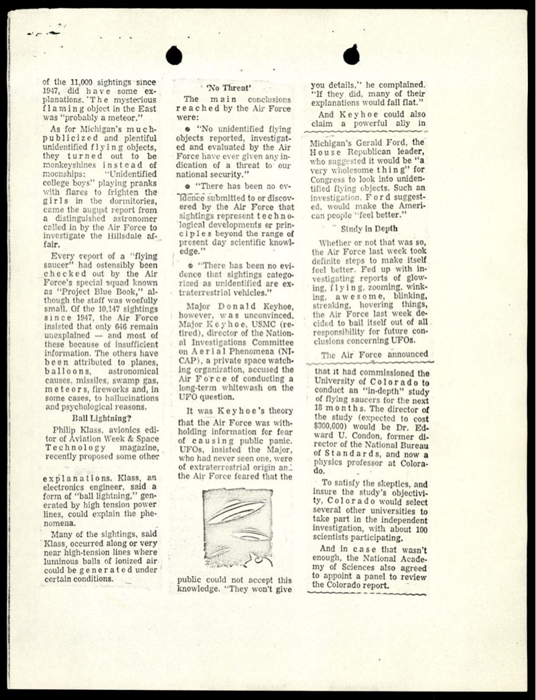
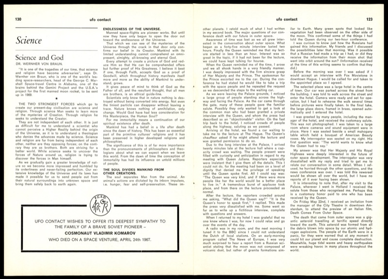

# FBI 62-HQ-83894 卷宗第 10 卷

| 機關 | FBI |
| --- | --- |
| 類型 | PDF · 184 頁掃描 |
| 事件日期 | 1947-06 至 1968-07 |
| 地點 | 全美 |
| 釋出日期 | 2026-05-08 |
| 報告 | <https://www.war.gov/UFO/#65_HS1-834228961_62-HQ-83894_Section_10> |

## Overview

184 頁掃描，跨越 1947 到 1968 共 21 年。

收的不是 FBI 自身調查，是民眾通報、報紙剪報、民間雜誌的混合存檔。

Hoover 在卷內明白拒絕對民間 UFO 組織做評價。卷宗功能是備檔，不是辦案。

抽樣三類代表頁：親簽信、debunking 剪報、von Braun 雜誌專文。

## Hoover 1966 年親簽回民眾信

1966-09-06，Hoover 親簽回覆新罕布夏州 Goffstown 一位 Mrs. Levi L. Dow。

她寫信來問 Flying Saucer Clubs of America, Inc. 是不是合法組織。

Hoover 在信中明說 FBI「is strictly an investigative agency... neither makes evaluations nor draws conclusions」。

信末附註欄：Bufiles 對該組織與該名民眾無任何紀錄。

## Hillsdale UFO 被歸為沼氣的剪報

1966 年 Michigan Hillsdale 飛碟通報，空軍派 J. Allen Hynek 認定為 swamp gas。

同篇報導引用空軍 Project Blue Book：1947 起累積 11,000 通報，只有 646 未解。

剪報後段點名 NICAP 的 Donald Keyhoe，指控空軍長期隱瞞。

眾議院少數黨領袖 Gerald Ford 也表態支持國會調查。

## von Braun 在 *UFO Contact* 雜誌的〈Science and God〉

作者是 Wernher von Braun，1969 登月計畫的關鍵主腦。

文章主題不是 UFO，而是科學與宗教為什麼不是對立。

雜誌同期還登了荷蘭 Queen Juliana 接見 UFO 接觸者的長文。

FBI 把這份雜誌剪進卷宗，是當時對民間 UFO 出版物的常規追蹤動作。

## 真實性分析

可確認真實：Hoover 信件 letterhead、簽名、Bufiles 附註系統與 FBI 已公開檔案一致。

von Braun 文章可在當期雜誌存檔對應。Hillsdale swamp gas 是 Hynek 親口提出的公開歷史。

可疑的不是內容假，是混排造成的誤讀。

第三方剪報和 *UFO Contact* 之類民間雜誌混在 FBI 信件之間，外人容易把整卷讀成 FBI 自身調查素材。

FBI 從未對 Flying Saucer Clubs of America 做評價，這是 Hoover 信中親口拒絕的事。

卷內 FBI 自身備案與第三方資料的可信度，要分開看。
