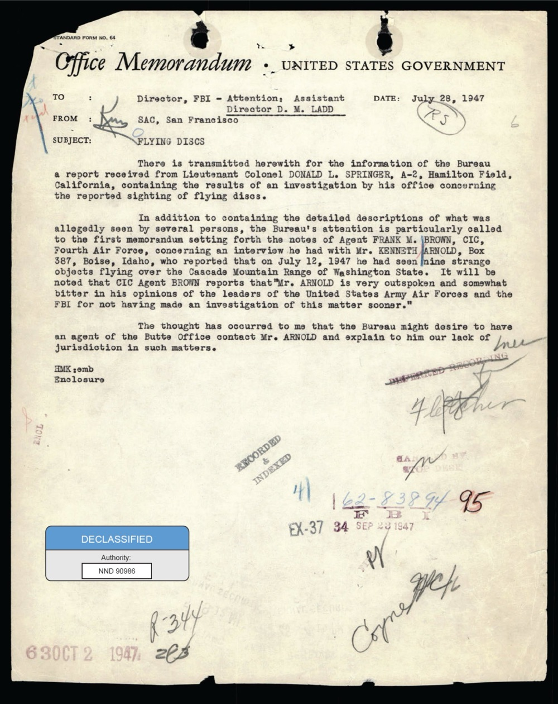
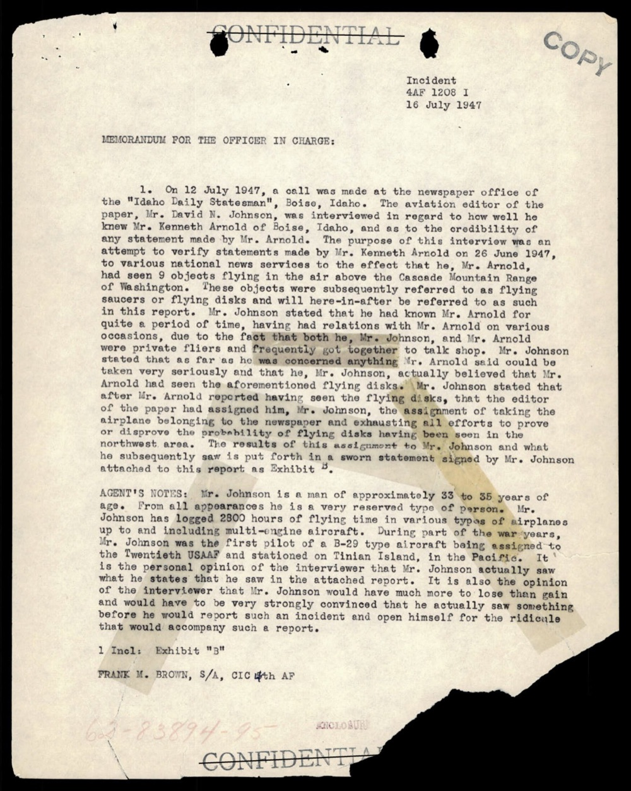
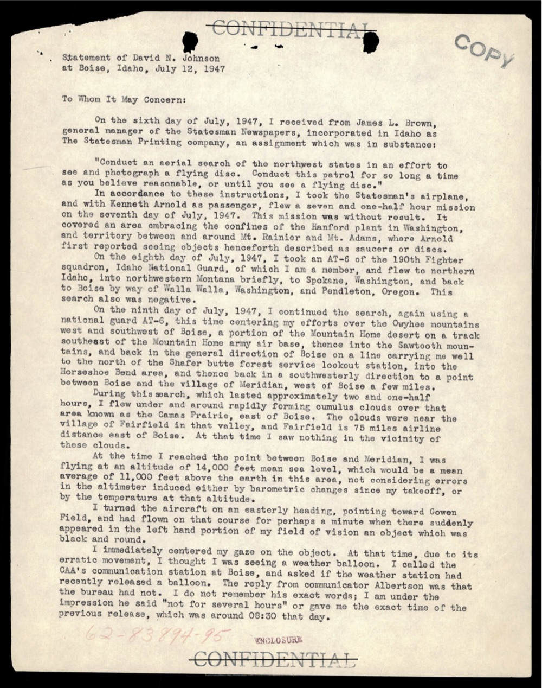
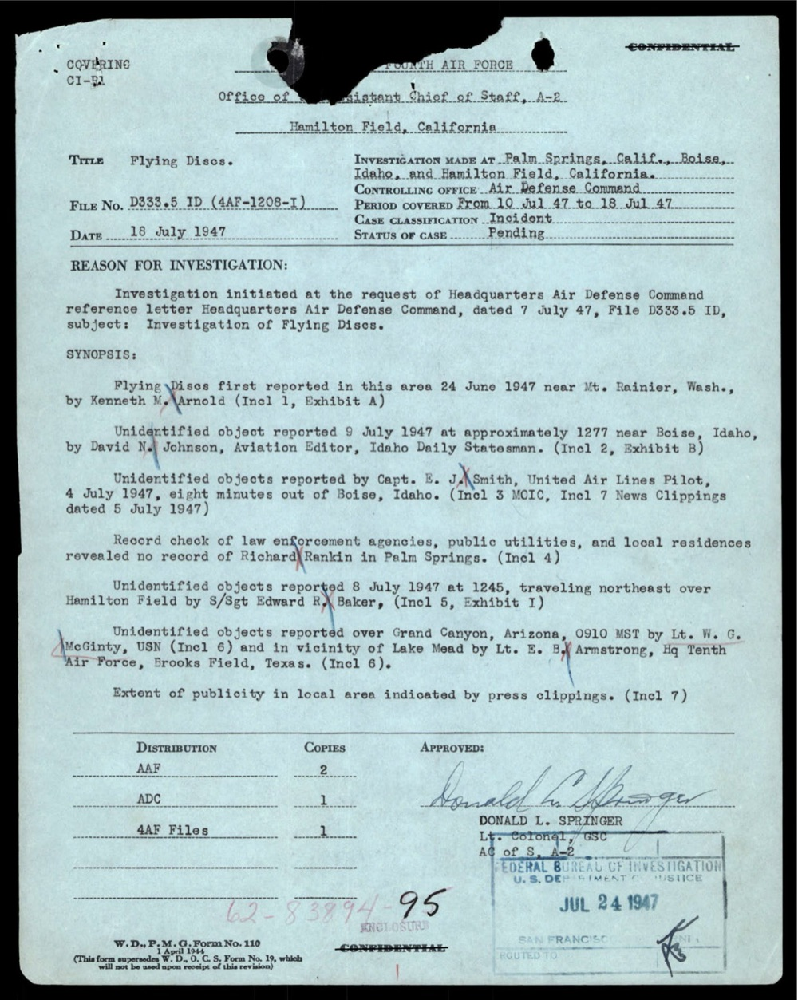
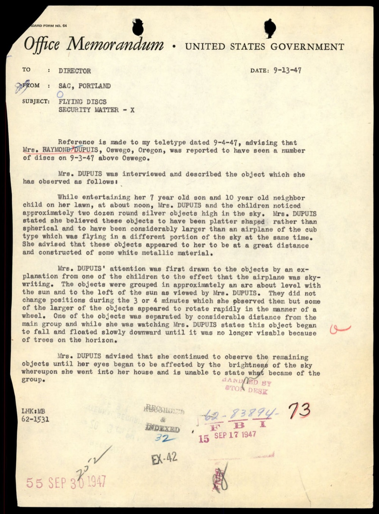
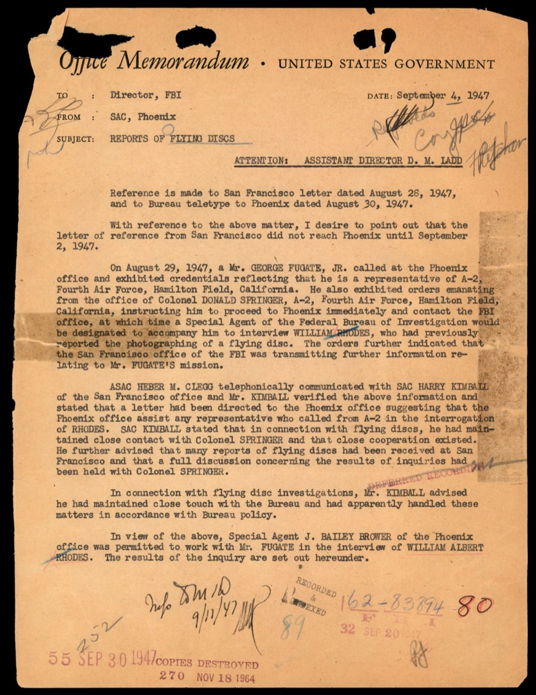
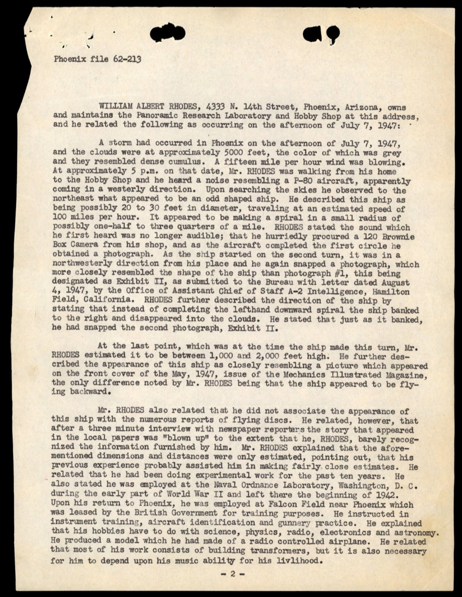
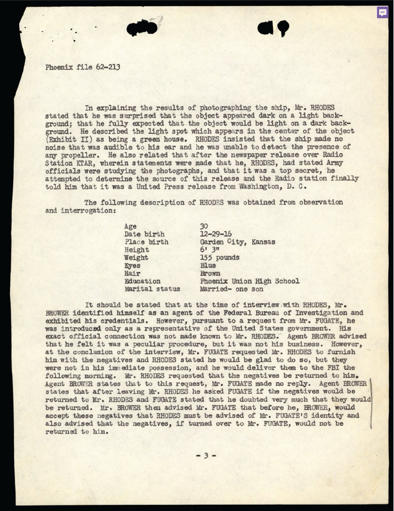
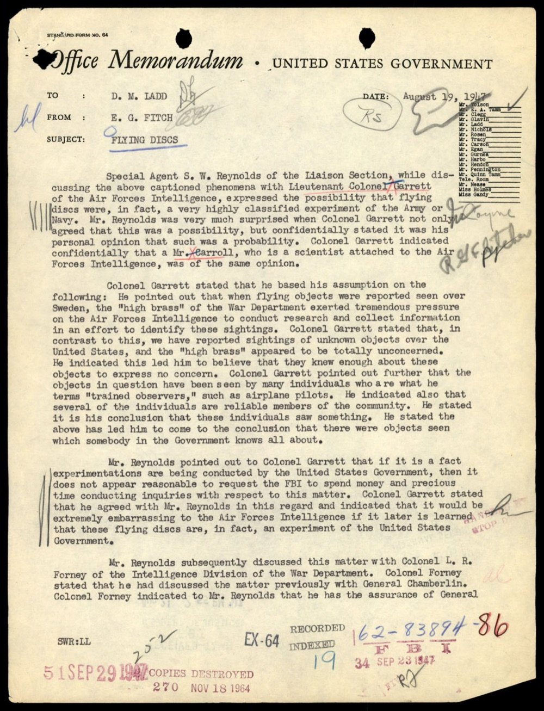
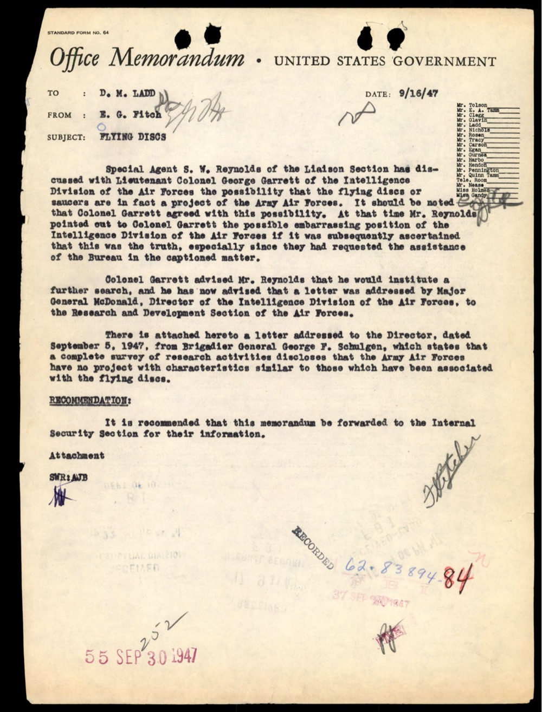

# FBI 62-HQ-83894 卷宗第 2 卷：1947 飛碟潮起源

| 機關 | FBI |
| --- | --- |
| 類型 | PDF（Section 2，Serials 53-100，192 頁） |
| 事件日期 | 1947-06 至 1947-09 |
| 地點 | 美國西部（Mt Rainier、Boise、Phoenix、Portland 等） |
| 釋出日期 | 2026-05-08 |
| 卷宗 | <https://www.war.gov/UFO/#65_HS1-834228961_62-HQ-83894_Section_2> |

## Overview

FBI 案卷 62-HQ-83894 的第 2 卷集中收 1947 夏天最早一批飛碟通報。當時 SAC（各地特別探員主管）把目擊報告、媒體剪報、人員訪談陸續送回 Hoover 總部。

值得看是因為三個歷史第一次都在這份卷裡：

- 1947-06-24 Kenneth Arnold 在 Mt Rainier 上空目擊 9 個物體，後來被媒體命名為「flying saucer」
- 1947-07-07 William Albert Rhodes 在 Phoenix 用 Brownie Box 相機拍到飛碟
- 1947-08-19 FBI 內部首次正式討論「飛碟是不是美軍機密實驗？」

一份卷宗看到現代 UFO 公共討論的三個原點。

## Section 2 卷夾封面

文件夾視覺特徵：

- 牛皮紙底色卷夾封面，格式 4-606 (REV. 1-20-73)
- 左上角白色長條標籤：FBI-CENTRAL RECORDS CENTER + HQ-HEADQUARTERS + Class/Case # 0062 83894 + Sub 2 + Vol. 53 + Serial # 100 + 條碼 8/11/127419X
- 右上角棕色標籤：62-HQ-83894 + SERIALS 53-100 + SECTION 2 + 條碼，附紅色大 X 標記
- 中央粗體紅字「INVESTIGATION」橫跨封面
- 大型黑色「DESTROY」印章 + 旁邊「DO NOT DESTROY」黑色印章（兩枚並列、相互矛盾，意味檔案處置決定多次更動）
- 紅色「COPIED FOR FOIPA」印章（共兩枚，分別蓋於 MAY 14 1977 與 MAR 2 1976）。FOIPA = Freedom of Information / Privacy Acts，1977 起多次因 FOIA 申請複印
- 兩枚 FOIPA # 手寫號碼：993088 + 1366494
- 下方紅色大字「USE CARE IN HANDLING THIS FILE / PICKETT STREET / Transfer-Call 3421」。Pickett Street 是 FBI 在 Alexandria, Virginia 的 records storage facility
- 藍色貼紙：「Declassification authority derived from FBI Automatic Declassification Guide, issued May 24, 2007.」

封面同時呈現「DESTROY」+「DO NOT DESTROY」+「COPIED FOR FOIPA」三層處置決定，是 FOIA 時代典型的檔案保存衝突證據。

封面之後 192 頁是 SAC 各分局發給 Hoover 的電報、信、剪報。

## SAC San Francisco 把 Arnold 案首次送到 Hoover

文件視覺特徵：

- Office Memorandum 標準表格（STANDARD FORM NO. 64）
- 上方 4 個 hole-punch（裝訂痕跡）
- 4 處水漬黑痕（年代久遠造成）
- 多枚紅筆與藍筆簽核
- 紅色印章「62-83894 / FBI / SEP 28 1947 / EX-37 34」（FBI 收文章）
- 下方紅色日期戳「6 30 OCT 2 1947」
- 藍色「DECLASSIFIED / Authority: NND 90986」標籤（FOIA 解密授權）
- 多個手寫批註：頁緣紅筆「345」「P-344」「K7」「6」等檔案路由代碼

文件主體：

**TO**：Director, FBI - Attention: Assistant Director D. M. Ladd
**FROM**：SAC, San Francisco
**DATE**：July 28, 1947
**SUBJECT**：FLYING DISCS

文件內容：

「茲為 Bureau 之資訊轉送一份報告，由 Hamilton Field, California A-2 部門 Lt. Col. Donald L. Springer 收受，內含其辦公室對 flying discs 通報目擊事件之調查結果。

除了內含數位人士所稱目擊之 detailed descriptions，特別請 Bureau 留意 第一份備忘錄，內含 Fourth Air Force CIC Agent FRANK M. BROWN 之筆記，關於他對 Mr. KENNETH ARNOLD（Boise, Idaho, Box 387）的訪談。Arnold 報告 1947-07-12 在 Washington State 的 Cascade Mountain Range 上空看到 9 個 strange 物體。應予留意 CIC Agent Brown 報告 *Mr. ARNOLD is very outspoken and somewhat bitter in his opinions of the leaders of the United States Army Air Forces and the FBI for not having made an investigation of this matter sooner.*

The thought has occurred to me that the Bureau might desire to have an agent of the Butte Office contact Mr. ARNOLD and explain to him our lack of jurisdiction in such matters.」

原文：

> There is transmitted herewith for the information of the Bureau a report received from Lieutenant Colonel DONALD L. SPRINGER, A-2, Hamilton Field, California, containing the results of an investigation by his office concerning the reported sighting of flying discs.
>
> In addition to containing the detailed descriptions of what was allegedly seen by several persons, the Bureau's attention is particularly called to the first memorandum setting forth the notes of Agent FRANK M. BROWN, CIC, Fourth Air Force, concerning an interview he had with Mr. KENNETH ARNOLD, Box 387, Boise, Idaho, who reported that on July 12, 1947 he had seen nine strange objects flying over the Cascade Mountain Range of Washington State. It will be noted that CIC Agent BROWN reports that "MR. ARNOLD is very outspoken and somewhat bitter in his opinions of the leaders of the United States Army Air Forces and the FBI for not having made an investigation of this matter sooner."
>
> The thought has occurred to me that the Bureau might desire to have an agent of the Butte Office contact Mr. ARNOLD and explain to him our lack of jurisdiction in such matters.

注意 FBI 內部日期錯誤：Arnold 實際目擊日期是 1947-06-24（6/24，而非 7/12）。這份 memo 寫成「on July 12, 1947」是 SAC 抄寫錯誤，後續其他 memo 都用 6/24 正確日期。

「lack of jurisdiction」這句設定了 FBI 對 Arnold 案的姿態：FBI 不調查 UFO，但會把資訊傳遞給通報人，安撫他的不滿。

## CIC Agent Frank Brown 親寫的 Johnson 可信度評估

文件視覺特徵：

- CONFIDENTIAL 印章上方下方各一（已被劃掉）
- 右上角灰色 COPY 印章（碳寫副本）
- 上緣破損，有手寫頁碼 95 在最下方（底部 62-83894-95，紅筆）
- Incident: 4AF 1208 1
- 日期 16 July 1947

文件內容（標題：MEMORANDUM FOR THE OFFICER IN CHARGE）：

「1. 1947-07-12，[CIC] 在 Boise, Idaho 的 *Idaho Daily Statesman* 報社辦公室拜訪該報 aviation editor Mr. David N. Johnson，採訪他對 Mr. Kenneth Arnold of Boise, Idaho 與 Mr. Arnold 任何陳述可信度的看法。此次訪談的目的是嘗試由 Mr. Kenneth Arnold 在不同新聞媒體所做的陳述加以驗證，以確認 Mr. Arnold 確實在 Washington State Cascade Mountain Range 上空看到 9 個 objects。這些物體被各方先前稱為 flying saucers 或 flying disks，本報告中如此引用。Mr. Johnson 表示他認識 Mr. Arnold 相當久了，與 Mr. Arnold 及其家人有過互動。Mr. Johnson 與 Mr. Arnold 是 private fliers 私人飛行員，常一起 talk shop。

Mr. Johnson 表示就他所知 Mr. Arnold 是個會誠實陳述觀察的人，Mr. Arnold 也告訴他確實 saw the flying disks，編輯則被指派寫一篇 article 試圖 prove or disprove 在 Northwest 看到 flying disks 的可能性。此事的調查結果由 Mr. Johnson 親自完成並提交，附在 Exhibit B 中為他的宣誓陳述。

AGENT'S NOTES：Mr. Johnson 是大約 33 至 35 歲之男子。各方面看來他都是非常 reserved type 個性。Mr. Johnson 已有 *2300 hours 飛行時數*，駕駛各種 multi-engine aircraft。在二戰期間，Mr. Johnson 是 B-29 飛機的 first pilot 並派駐於太平洋天寧島。本人對被訪談者的個人意見：Mr. Johnson actually saw what he states he saw 並附上 sworn statement。本人也認為 Mr. Johnson 在 Boise 知名度很高，*would have much more to lose than gain* 如果他寫一份不真實的報告，他若不確信會 ridicule 他的個性，不會輕易寫這份報告與冒險。

1 Inclosure: Exhibit "B"
FRANK M. BROWN, S/A, CIC 4th AF」

原文（關鍵句）：

> Mr. Johnson has logged 2300 hours of flying time in various types of airplanes up to and including multi-engine aircraft. During part of the war years, Mr. Johnson was the first pilot of a B-29 type aircraft being assigned to the Twentieth USAAF and stationed on Tinian Island, in the Pacific. It is the personal opinion of the interviewer that Mr. Johnson actually saw what he states he saw in the attached report. It is also the opinion of the interviewer that Mr. Johnson would have much more to lose than gain and would have to be very strongly convinced that he actually saw something before he would report such an incident and open himself for the ridicule that would accompany such a report.

當時還沒有 Project Blue Book 之類官方架構，這份是 FBI 收到最早的「目擊者可信度評估」，Brown 用 2300 飛行時數 + B-29 機長背景 + Tinian Island 派駐紀錄替 Johnson 背書。

## David Johnson 自己開報社飛機去找飛碟

文件視覺特徵：

- CONFIDENTIAL 印章上下各一（已被劃掉）
- 右上角灰色 COPY 印章
- 標題：「Statement of David N. Johnson at Boise, Idaho, July 12, 1947」
- 開頭：「To Whom It May Concern:」

文件內容（Johnson 親筆宣誓陳述）：

「於 1947-07-06，我從 *Statesman* 報社總經理 James L. Brown 處收到指令，substance 為：

『進行 northwest states 之 aerial search，目的是 see and photograph a flying disc。執行此任務 *as long a time as you believe reasonable, or until you see a flying disc.*』

依據此指令，我搭乘 *Statesman* 飛機，與 Kenneth Arnold 為乘客，於 1947-07-07 飛了七個半小時的任務。任務未獲結果。任務涵蓋 Hanford Area in Washington 與 Mt. Rainier、Mt. Adams 周邊範圍，這是 Arnold 第一次報告看到 saucers or discs 的地方。

1947-07-08 第八天，I took an AT-6 of the 190th Fighter Squadron, Idaho National Guard, of which I am a member, 飛到 Idaho 北部、轉至 Spokane 短暫停留、Washington 州，回到 Boise via Walla Walla, Washington 與 Pendleton, Oregon。This search also was negative.

1947-07-09 第九天，我繼續 search again 使用一架 national guard AT-6，這次主要在 Owyhee mountains 西邊與 Boise 西南、Mountain Home 軍機場的東南方。然後沿著 Boise 大致方向回，當沿線飛行至 Sharfer butte forest service lookout station 西南，再 southwesterly direction 到 Boise 與 Meridian 之間（Boise 西邊幾哩處）。

那天 14,000 呎高度看到 14,000 呎內並無飛碟。我在 14,000 呎這附近大約飛了 11,000 呎以上 mean sea level，但需考慮 altimeter 因氣壓變化未調整造成的誤差。

我把飛機朝東 heading 飛，朝向 Gowen Field，然後向那方向飛了大約一分鐘，突然在我視野的左下方出現一個物體，*which was black and round*。

我立刻 centered my gaze 集中視線於那個物體。當時，由於它的 erratic movement 不規則運動，我以為我是在看 weather balloon。我打電話到 Boise 的 CAA 通訊站，問他們最近是否有放氣球。answer 是 communicator Albertson 看到 *but the bureau had not*. 我不記得他確切的字句；我的印象是『not for several hours』 或者他不知道當天 06:30 之後的精確時間。」

原文（首段重點）：

> "Conduct an aerial search of the northwest states in an effort to see and photograph a flying disc. Conduct this patrol for so long a time as you believe reasonable, or until you see a flying disc."

關鍵：

- *Statesman* 報社派飛機 + 飛行員 + Arnold 親自當乘客，主動 7.5 小時搜索沒結果
- 隔天 7-8 換 AT-6 軍機（Idaho National Guard 190th Fighter Squadron），跨州搜索
- 7-9 在 Mountain Home Desert 上空 14,000 呎，Johnson 自己親見一個黑色圓物突現於左側視野
- 他用無線電通報，但 CAA 站員 Albertson 無法確認時間是否同期

這是 FBI 卷宗中最早的「主動派人去找飛碟」紀錄，比官方 Project Sign（1948）早 8 個月。

## Twelfth Air Force 編出最早的飛碟潮案件清單

文件視覺特徵：

- 藍色 carbon paper（FBI 收的 1947-07-18 Hamilton Field 12th AF 副本）
- 上方 CONFIDENTIAL 印章上下各一（已劃掉）
- 兩個 hole-punch + 多處污損
- 右下角 FBI 圓章「FEDERAL BUREAU OF INVESTIGATION / U.S. DEPARTMENT OF JUSTICE / SAN FRANCISCO」+ 紅色「JUL 24 1947」收文戳
- 表格樣式 carbon copy，由打字機打成
- 左下手寫「62-83894-95」+「DOWN-GRADED」批註

文件主體（TWELFTH AIR FORCE / Office of Asst Chief of Staff, A-2 / Hamilton Field, California）：

「**Title**：Flying Discs
**File No.**：D333.5 ID (4AF-1208-1)
**Date**：18 July 1947
**Investigation made at**：Palm Springs, Calif., Boise, Idaho, and Hamilton Field, California
**Controlling office**：Air Defense Command
**Period covered**：From 10 Jul 47 to 18 Jul 47
**Case classification**：Incident
**Status of case**：Pending

**REASON FOR INVESTIGATION**：依 Hq Air Defense Command 1947-07-07 letter D333.5 ID 主旨『Investigation of Flying Discs』之要求啟動。

**SYNOPSIS**：

- Flying Discs 此區首次回報於 1947-06-24 near Mt. Rainier, Wash., by Kenneth Arnold (Incl 1, Exhibit A)
- Unidentified object reported 9 July 1947 at approximately 1277 near Boise, Idaho, by David N. Johnson, Aviation Editor, Idaho Daily Statesman (Incl 2, Exhibit B)
- Unidentified objects reported by Capt. E.J. Smith, United Air Lines Pilot, 4 July 1947, eight minutes out of Boise, Idaho. (Incl 3 MOIC, Incl 1 News Clippings dated 6 July 1947)
- Record check of law enforcement agencies, public utilities, and local residences revealed no record of Richard Rankin in Palm Springs. (Incl 4)
- Unidentified objects reported 8 July 1947 at 1245, traveling northeast over Hamilton Field by S/Sgt Edward H. Saker. (Incl 5, Exhibit J)
- Unidentified objects reported over Grand Canyon, Arizona, 0910 MST by Lt. W.G. McGinty, USN (Incl 6) and in vicinity of Lake Mead by Lt. E.R. Armstrong, Hq Tenth Air Force, Brooks Field, Texas. (Incl 6).
- Extent of publicity in local area indicated by press clippings. (Incl 7)」

簽名：Donald L. Springer, Lt. Colonel USAF, ACSI A-2

| 案件 | 日期 | 地點 | 目擊者 |
|---|---|---|---|
| Arnold | 1947-06-24 | Mt Rainier WA | Kenneth Arnold（民間商人） |
| Johnson | 1947-07-09 | Boise / Mountain Home ID | David Johnson（記者+飛行員） |
| Smith | 1947-07-04 | Boise 起飛 8 分鐘 | Capt. E.J. Smith（民航 UAL 機長） |
| Saker | 1947-07-08 | Hamilton Field 上空 | S/Sgt Saker（USAF） |
| McGinty | 1947-07-XX | Grand Canyon AZ | Lt. McGinty（USN） |
| Armstrong | 1947-07-XX | Lake Mead | Lt. Armstrong（USAF Tenth AF） |

這是現存最早的軍方飛碟潮索引，檔號 D333.5 ID。6 起案件涵蓋民間商人、記者、民航機長、空軍士官、海軍中尉、空軍中尉，跨州（WA / ID / CA / AZ / NV）。

## 平民版本：Mrs Dupuis 在草坪上看到 24 個盤狀物

文件視覺特徵：

- Office Memorandum 標準表格
- 上方 4 個 hole-punch
- 紅色「62-83894 / FBI / 15 SEP 17 1947」收文戳
- 紅色「STAMPED BY ROOM TOP DESK」
- 左下紅色「55 SEP 30 1947」二次處理戳
- 右下手寫紅筆「73」「32」「EX-42」
- 多處藍色與紅色簽核

文件主體：

**TO**：DIRECTOR
**FROM**：SAC, PORTLAND
**DATE**：9-13-47
**SUBJECT**：FLYING DISCS / SECURITY MATTER - X

文件內容：

「Reference 我 1947-09-04 的 teletype，advising 通知 Mrs. RAYMOND DUPUIS, Oswego, Oregon 報告於 1947-09-03 在 Oswego 上空看到 *a number of discs*。

Mrs. DUPUIS 接受訪談並描述她觀察到的物體如下：

當她正午時分在草坪上招待自己 7 歲兒子 + 10 歲鄰居小孩時，Mrs. DUPUIS 與小孩們注意到天空高處 approximately two dozen round silver objects high in the sky。Mrs. DUPUIS 表示她相信這些物體後來被稱為 platter shaped 而非球狀，比 cub type 飛機更大，看起來距離很遠，由 some kind metallic material 構成。

Mrs. DUPUIS 的注意力首先被其中一位小孩告知，那個小孩說 'the airplane was sky-writing'。物體被分組為大致兩個 dozen 排列、從 sun 之東與 sun 之左方向（從 Mrs. DUPUIS 的視野）。觀察期間 3 至 4 分鐘，物體沒有改變位置，但其中較大者 *was separated by considerable distance from the main group and was watching Mrs. DUPUIS state this object began to fall and floated slowly downward until it was no longer visible because of trees on the horizon*。

Mrs. DUPUIS 繼續觀察 remaining objects 直到她的眼睛 began to be affected by the brightness of the sky，然後她進入屋內，無法陳述 what became of the group。」

關鍵特徵：

- 多目擊者（成人 + 兩個小孩，三人同時觀察）
- 24 個物體（Mrs. Dupuis 用「two dozen」描述）
- 形狀更正：先 spherical 後改 platter shaped（盤狀）
- 一個較大者「以輪盤方式快速旋轉」（rotate rapidly in the manner of a wheel）， 這個細節在原文裡稍後出現
- 持續時間 3-4 分鐘 + 後續觀察直到陽光太亮無法繼續

平民通報的特徵與軍方/民航通報不同：細節豐富但缺乏儀器測量（速度、高度都用直觀估計）。

## Phoenix Rhodes 案：SAC Phoenix 報告附 Ladd 注意

文件視覺特徵：

- Office Memorandum 標準表格
- 4 個 hole-punch
- 標題下方紅色印章「ATTENTION: ASSISTANT DIRECTOR D. M. LADD」
- 多處紅筆批註：右上「Tolson / Conroy / Repshow」
- 左下紅筆「Info SLN(D) / 9/12/47 (M)」+「852」
- 右下「162-83894 / FBI / 32 SEP 8 / 80」
- 紅色印章「55 SEP 30 1947 COPIES DESTROYED 270 NOV 18 1964」（很重要的紀錄：1964-11-18 已銷毀部分副本）

文件主體：

**TO**：Director, FBI
**FROM**：SAC, Phoenix
**DATE**：September 4, 1947
**SUBJECT**：REPORTS OF FLYING DISCS / ATTENTION: ASSISTANT DIRECTOR D. M. LADD

文件內容：

「Reference 1947-08-28 San Francisco 寄出之 letter + 1947-08-30 Bureau 寄至 Phoenix 之 teletype。

對於上述事項，I desire to point out that letter of reference from San Francisco did not reach Phoenix until September 2, 1947.

1947-08-29，Mr. GEORGE FUGATE, JR. 來到 Phoenix office，出示 reflecting that he is a representative of A-2 Fourth Air Force, Hamilton Field, California。他也展示了從 Colonel DONALD SPRINGER, A-2, Fourth Air Force, Hamilton Field, California 辦公室發出的 orders，指示他要立即到 Phoenix 並與 the Phoenix office 聯絡，那時 Federal Bureau of Investigation 將指派一位 Special Agent 陪同他訪談 WILLIAM RHODES，此人之前 reported the photographing of a flying disc。orders 進一步指明 San Francisco office of the FBI 將傳輸更多資訊與 Mr. FUGATE's mission 相關。

ASAC HEBER M. CLEGG telephonically communicated with SAC HARRY KIMBALL of the San Francisco office and Mr. KIMBALL verified the above information and stated that a letter had been directed to the Phoenix office suggesting that the Phoenix office assist any representative who called from A-2 in the interrogation of RHODES. SAC KIMBALL stated that in connection with flying discs, he had maintained close contact with Colonel SPRINGER and that close cooperation existed. He further advised that many reports of flying discs had been received at San Francisco and that a full discussion concerning the results of inquiries that had been held with Colonel SPRINGER.

In connection with flying disc investigations, Mr. KIMBALL advised he had maintained close touch with the Bureau and had apparently handled these matters in accordance with Bureau policy.

In view of the above, Special Agent J. BAILEY BROWER of the Phoenix office was permitted to work with Mr. FUGATE in the interview of WILLIAM ALBERT RHODES. The results of the inquiry are set out hereunder.」

要點：

- Bureau 已提前指派專人陪同 USAAF A-2 探員去訪 Rhodes
- ASAC Heber M. Clegg 與 SAC Harry Kimball 通話協調 Phoenix 處理方式
- Rhodes 之前已被 *Mechanics Illustrated* 雜誌轉載照片，FBI 是第二輪訪談者
- 接手探員：Special Agent J. Bailey Brower（Phoenix office）

## Rhodes 親口描述他拍到的飛碟

文件視覺特徵：

- 白紙 carbon copy
- 頁碼 -2- 在底部中央
- 左上「Phoenix file 62-213」
- 4 個 hole-punch + 上方輕微撕痕

文件主體（接續訪談紀錄）：

「WILLIAM ALBERT RHODES, 4333 N. 14th Street, Phoenix, Arizona, owns and maintains the Panoramic Research Laboratory and Hobby Shop at this address, and he related the following as occurring on the afternoon of July 7, 1947:

A storm had occurred in Phoenix on the afternoon of July 7, 1947, and the clouds were at approximately 5000 feet, the color of which was gray and they resembled dense cumulus. A fifteen mile per hour wind was blowing.

Approximately 5 p.m. on that date, Mr. RHODES was walking from his home to the Hobby Shop and he heard a noise resembling a P-80 aircraft, apparently coming in a westerly direction. Upon searching the skies he observed to the northeast what appeared to be an odd shaped ship. He described this ship as being possibly 20 to 30 feet in diameter, traveling at an estimated speed of 100 miles per hour. *It appeared to be making a spiral in a small radius of possibly one-half to three quarters of a mile.* RHODES stated the sound which he first heard was no longer audible; that he hurriedly procured a 120 Brownie Box Camera from his shop, and as the aircraft completed the first circle he obtained a photograph. As the ship started on the second turn, it was in a *northwesterly* direction from his place and he again snapped a photograph, which more closely resembled the shape of the ship than photograph #1. Mr. RHODES designated as Exhibit II, as submitted to the Bureau with letter dated August 4, 1947, by the Office of Assistant Chief of Staff A-2 Intelligence, Hamilton Field, California. RHODES further described the direction of the ship by stating that instead of completing the lefthand downward spiral the ship banked to the right and disappeared into the clouds. He stated that just as it banked, he had snapped the second photograph, Exhibit II.

At the last point, which was at the time the ship made this turn, Mr. RHODES estimated it to be between 1,000 and 2,000 feet high. He further described the appearance of this ship as closely resembling a picture which appeared on the front cover of the May, 1947, issue of the *Mechanics Illustrated* magazine, the only difference noted by Mr. RHODES being that the ship appeared to be flying backward.

Mr. RHODES also related that he did not associate the appearance of this ship with the numerous reports of flying discs. He related, however, that after a three minute interview with newspaper reporters the story that appeared in the local papers was 'blown up' to the extent that he, RHODES, barely recognized the information furnished by him. RHODES explained that the aforementioned dimensions and distances were only estimated, pointing out, that his previous experience probably assisted him in making fairly close estimates. He related that he had been doing experimental work for the past ten years. He also stated he was employed at the Naval Ordnance Laboratory, Washington, D.C. during the early part of World War II and left there the beginning of 1942. Upon his return to Phoenix, he was employed at Falcon Field near Phoenix which was leased by the British Government for training purposes. He instructed in instrument training, aircraft identification and gunnery practice. He explained that his hobbies have to do with science, physics, radio, electronics and astronomy. He produced a model which he had made of a radio controlled airplane. He related that most of his work consists of building transformers, but it is also necessary for him to depend upon his music ability for his livlihood.」

關鍵：

- 1947-07-07 17:00 雷雨後，Rhodes 走出自家 Hobby Shop
- 聽到「P-50 type」飛機聲（typed as P-80），抬頭看見東北方一個盤狀物體
- 直徑 20 至 30 呎，速度約 100 mph，做半徑半哩到 3/4 哩的螺旋
- 回 shop 拿 120 Brownie Box 相機，拍下兩張底片（Exhibit I + Exhibit II）
- Rhodes 自稱外形類似 1947-05 *Mechanics Illustrated* 雜誌封面，但「飛機在 fly backward」

Rhodes 的背景在 FBI 看來重要：

- Naval Ordnance Laboratory, Washington D.C. 工作（二戰初期到 1942）
- Falcon Field（Phoenix 附近，英國政府租用訓練基地）擔任 instrument training / aircraft identification / gunnery practice 教官
- 自己經營 Panoramic Research Laboratory 與 Hobby Shop
- 嗜好：science, physics, radio, electronics, astronomy

Rhodes 不是純粹民眾，是有科學儀器背景的工程師類人物。

## Rhodes 個資 + FBI 拿走底片不還

文件視覺特徵：

- 接續上頁
- 頁碼 -3- 在底部中央
- 左上仍是 Phoenix file 62-213
- 上方 hole-punch + 少量水漬

文件內容：

「In explaining the results of photographing the ship, Mr. RHODES stated that he was surprised that the object appeared dark on a light background; that he fully expected that the object would be light on a dark background. He described the light spot which appears in the center of the object (Exhibit II) as being a green house. RHODES insisted that the ship made no noise that was audible to his ear and he was unable to detect the presence of any propeller. He also related that after the newspaper release over Radio Station KTAR, wherein statements were made that he, RHODES, had stated Army officials were studying the photographs, and that it was a top secret, he attempted to determine the source of this release and the Radio station finally told him that it was a United Press release from Washington, D.C.

The following description of RHODES was obtained from observation and interrogation:

Age: 30
Date birth: 12-29-16
Place birth: Garden City, Kansas
Height: 6' 3"
Weight: 155 pounds
Eyes: Blue
Hair: Brown
Education: Phoenix Union High School
Marital status: Married - one son

It should be stated that at the time of interview with RHODES, Mr. BROWER identified himself as an agent of the Federal Bureau of Investigation and exhibited his credentials. *However, pursuant to a request from Mr. FUGATE, he was introduced only as a representative of the United States Government. His exact official connection has not been made known to Mr. RHODES.* Agent BROWER advised that he felt it was a peculiar procedure, but it was not his business. However, at the conclusion of the interview, Mr. FUGATE requested Mr. RHODES to furnish him with the negatives and RHODES stated he would be glad to do so, but they were not in his immediate possession, and he would deliver them to the FBI the following morning. Mr. RHODES requested that the negatives be returned to him. Agent BROWER states that to this request, Mr. FUGATE made no reply. Mr. BROWER states that after leaving Mr. RHODES he asked FUGATE if the negatives would be returned to Mr. RHODES and FUGATE stated that he doubted very much that they would be returned. Mr. BROWER then advised Mr. FUGATE that before he, BROWER, would accept these negatives that RHODES must be advised of Mr. FUGATE's identity and also advised that the negatives, if turned over to Mr. FUGATE, would not be returned to him.」

文中強調的關鍵段（FBI 內部紀錄的程序爭議）：

- Brower（FBI Special Agent）以 FBI 名義向 Rhodes 借底片，口頭承諾原物歸還
- 但 Fugate（USAAF A-2 探員）要求 Brower 「以美國政府代表身分」介紹自己，*不要表明 FBI 身分*
- Brower 自認此程序「peculiar」但「not his business」
- 訪談結束時 Fugate 要求 Rhodes 把底片借出，Rhodes 答應
- Rhodes 要求歸還，Fugate 沒回應
- Brower 私下問 Fugate「底片會還嗎？」Fugate 表示「他高度懷疑會還」
- Brower 因此告訴 Fugate：除非 Rhodes 知道 Fugate 真實身分 + 知道底片不會歸還，否則 FBI 不會接手底片

這份 Phoenix file 62-213 是 1947 年 FBI 自己留下的「軍方扣押 UFO 物證」+「FBI 拒絕背書」雙重記錄。

Rhodes 個資完整：身高 6'3"、體重 155 磅、藍眼棕髮、Garden City Kansas 出生、Phoenix Union HS 畢業、已婚有一子。

## FBI 內部 1947-08-19：「這是不是陸軍秘密實驗？」

文件視覺特徵：

- Office Memorandum 標準表格
- 4 個 hole-punch
- 右上角藍筆「Conroy / Tolson」+「RS / Aytaher / RsExpta」（路由縮寫）
- 紅色印章「162-83894 / FBI / EX-64 / 19 / 34 SEP 23 1947」
- 左下紅色「51 SEP 29 1947 / COPIES DESTROYED 270 NOV 18 1964」
- 多處紅藍雙色簽核

文件主體：

**TO**：D. M. Ladd
**FROM**：E. G. Fitch
**DATE**：August 19, 1947
**SUBJECT**：FLYING DISCS

文件內容：

「Special Agent S. W. Reynolds of the Liaison Section, while discussing the above captioned phenomena with Lieutenant Colonel GARRETT of the Air Forces Intelligence, expressed the possibility that flying discs were, in fact, a very highly classified experiment of the Army or Navy. Mr. Reynolds was much surprised when Colonel Garrett not only agreed that this was a possibility, but confidentially stated it was his personal opinion that such was a probability. Colonel Garrett indicated confidentially that a Mr. CARROLL, who is a scientist attached to the Air Forces Intelligence, was of the same opinion.

Colonel Garrett stated that he based his assumption on the following: He pointed out that when flying objects were reported seen over Sweden, the *high brass* of the War Department exerted tremendous pressure on the Air Forces Intelligence to conduct research and collect information in an effort to identify these sightings. Colonel Garrett stated that, in contrast to this, we have reported sightings of unknown objects over the United States, and the *high brass* appeared to be totally unconcerned. He indicated this led him to believe that they knew enough about these objects to express no concern. Colonel Garrett pointed out further that the objects in question have been seen by many individuals who are what he termed 'trained observers,' such as airplane pilots. He indicated that several of the individuals are reliable members of the community. He stated it is his conclusion that these individuals saw something. He stated the above has led him to come to the conclusion that there were objects seen which somebody in the Government knows all about.

Mr. Reynolds pointed out to Colonel Garrett that if it is a fact experimentations are being conducted by the United States Government, then it does not appear reasonable to request the FBI to spend money and precious time conducting inquiries with respect to this matter. Colonel Garrett stated that he agreed with Mr. Reynolds in this regard and indicated that it would be extremely embarrassing to the Air Forces Intelligence if it later is learned that these flying discs are, in fact, an experiment of the United States Government.

Mr. Reynolds subsequently discussed this matter with Colonel L. R. Forney of the Intelligence Division of the War Department. Colonel Forney stated that he had discussed the matter previously with General Chamberlin. Colonel Forney indicated to Mr. Reynolds that he has the assurance of General [續]」

要點翻譯：

- SA Reynolds（FBI Liaison Section）與 Lt. Col. Garrett（空軍情報）私下討論
- Garrett 起先「個人意見：飛碟『可能是』美軍機密實驗」（probability，比 possibility 強）
- Garrett 引用論證 1：瑞典上空有「high brass」目擊，戰爭部對空軍情報施加「強大壓力」要查
- Garrett 引用論證 2：相對地，美國本土上空也有目擊，「high brass」卻完全不關心，暗示他們知道答案
- Garrett 引用論證 3：目擊者多是受過訓練的飛行員（trained observers），他們確實看到了東西
- Garrett 結論：「政府裡有人完全知道這是什麼」
- Reynolds 直率地說：如果是政府實驗，就別讓 FBI 浪費資源查
- Garrett 同意 + 補：「如果之後查證確實是美國實驗，會讓空軍情報極尷尬」
- Reynolds 後續找 Col. Forney（戰爭部情報部門）+ Forney 引 General Chamberlin 私下對話，此處頁面斷在「assurance of General [續]」

這頁是 FBI 卷宗中第一次正式記錄「飛碟可能是美軍實驗」的內部假設。Garrett 的引用 sweden ghost rocket（1946 年瑞典上空大量目擊「火箭狀物體」，當時被認為是蘇聯由 V-2 改裝）作為前例。

## 一個月後，空軍正式回覆「我們沒有這個項目」

文件視覺特徵：

- Office Memorandum 標準表格
- 4 個 hole-punch
- 右上路由欄手寫「Tolson / E. A. Tamm / Clegg / Glavin / Ladd / Nichols / Rosen / Tracy / Carson / Egan / Hendon / Pennington / Quinn Tamm / Tele. Room / Nease / Miss Gandy」（FBI 高層名單）
- 右上紅筆「RS」
- 紅色印章「162-83894 / FBI / 84」
- 左下紅色「55 SEP 30 1947 / 252」

文件主體：

**TO**：D. M. Ladd
**FROM**：E. G. Fitch
**DATE**：9/16/47
**SUBJECT**：FLYING DISCS

文件內容：

「Special Agent S. W. Reynolds of the Liaison Section has discussed with Lieutenant Colonel George Garrett of the Intelligence Division of the Air Forces the possibility that the flying discs or saucers are in fact a project of the Army Air Forces. At that time Mr. Reynolds pointed out to Colonel Garrett the possible embarrassing position of the Intelligence Division of the Air Forces if it was subsequently ascertained that this was the truth, especially since they had requested the assistance of the Bureau in the captioned matter.

Colonel Garrett advised Mr. Reynolds that he would institute a further search, and he has now advised that a letter was addressed to Major General McDonald, Director of the Intelligence Division of the Air Forces, to the Research and Development Section of the Air Forces.

There is attached hereto a letter addressed to the Director, dated September 5, 1947, from Brigadier general George F. Schulgen, which states that a complete survey of research activities discloses that the Army Air Forces have no project with characteristics similar to those which have been associated with the flying discs.

RECOMMENDATION:
It is recommended that this memorandum be forwarded to the Internal Security Section for their information.」

要點翻譯：

- 同 Fitch → Ladd memo，但日期是 1947-09-16（比上一份晚 28 天）
- Garrett 之前承諾的「進一步調查」結果：他寄信給 Major General McDonald（空軍情報部主任）+ 空軍 R&D Section
- 附 Brigadier General George F. Schulgen 1947-09-05 信函：「完整盤點空軍研究項目後，正式聲明 Army Air Forces have no project with characteristics similar to those which have been associated with the flying discs」
- Fitch 建議：將此 memo 轉給 Internal Security Section 備檔

這封信實質結案了 FBI「discs 是 Army 實驗」的內部假設。從 1947-08-19（Garrett 提出假設）到 1947-09-16（空軍正式否認），中間 28 天是 FBI 從「不關我們的事」到「我們得真的查」的轉折點。

但要注意：Schulgen 的否認只涵蓋 *Army Air Forces*。海軍、CIA、NRL、其他 black project 機關不在他的權限。後續解密文件確認，1947 年確實有「Project Sign」這類研究 UFO 的 Air Force 計畫，但是 1948 才正式成立，與 Schulgen 1947-09 否認時間一致。

## 分析

「flying saucer」這個詞不是 Arnold 自己說的。

Arnold 1947-06-24 描述形狀「像切下一片派 (cut a piece out of pie)」，媒體把它寫成 flying saucer。卷裡 Brown 訪談 Johnson 時，眾人已自然用「saucers or discs」指稱。

70 年來 UFO 公共討論被這個誤譯定型。Rhodes 看到的物體實際上是橢圓盤狀（platter），不是 saucer。Mrs. Dupuis 看到的是 round silver objects，後來改稱 platter shaped 而非球狀。

Rhodes 是 1947 年最早拍到飛碟的人之一。

他不是專業攝影師，用最普通的 Brownie Box 120 相機。但他有 NRL 工作背景 + Falcon Field 飛行教官資歷，相對於普通民眾，他的觀察可信度較高。

FBI Agent Brower 以 FBI 名義借走底片，Fugate 以 USAAF A-2 名義索取，事後改口拒不歸還。FBI 內部紀錄保留了 Brower 對這個程序「peculiar」的不滿。

「政府扣押第一手證據」模式從這份卷宗開始，UFO 史上反覆重演：Roswell 1947、Maury Island 1947、Phoenix Lights 1997、Tic Tac 2004 都有相似模式。

FBI 的「Army 實驗」假設只活了 28 天。

1947-08-19 Garrett 對 Reynolds 私下說「probability」。1947-09-16 空軍 Schulgen 正式回信「沒有 project」。中間 28 天是 FBI 從「不關我們的事」到「我們得真的查」的轉折點。

Garrett 引用瑞典「ghost rocket」事件做論證：1946 年瑞典上空大量目擊「火箭狀物體」，當時被認為是蘇聯由 V-2 改裝。Garrett 用這個前例說服自己「飛碟通報需要嚴肅處理」。

但 Schulgen 的否認在邏輯上不完全。他只涵蓋 Army Air Forces，不涵蓋海軍 + CIA + NRL + 其他機關。1947 年的「飛碟可能是美軍實驗」假設後來被歷史學家追溯到 Project Mogul（高空氣球+聲波偵測蘇聯核試）+ Project Skyhook（高空氣球載儀）， 這兩個項目都不屬於 Army Air Forces，所以 Schulgen 的否認形式上是真實的，但實質上有迴避空間。

證人可信度評估在 1947 還是探員親筆勾勒。

Frank Brown 評 David Johnson「2300 飛行時數、B-29 機長、二戰退役」，這是用航空背景背書一個目擊。Mrs Dupuis 卷宗則純記錄敘事，沒有同等規格的可信度評估。

1948 年 Project Sign 才開始，1952 年 Project Blue Book 才系統化評估目擊者可信度。這份 1947 卷宗保留的就是這個制度化前的「探員主觀判斷」狀態。

與本批 release 其他卷宗的連結：

- 整套 62-HQ-83894 從 Section 1（#033）到 Section 10（#001）跨 21 年
- 本卷集中在 1947-06 至 1947-09 三個月，是案卷最濃的起點
- Section 10 是末段（1966-1968），Hoover 親簽 + Hynek + von Braun
- 中間 Section 3-9 + Serial 130/153/164/220/403/438/449 預期跨 1948-1965
