# FBI 62-HQ-83894 Section 3：Maury Island、B-25 雙人罹難、Twin Falls Urie，與 FBI 退出 UFO 調查的那一個月

| 項目 | 內容 |
|---|---|
| 解密單位 | FBI（檔案合併移交至 War Department） |
| 卷宗 | 62-HQ-83894 Section 3，Serials 101-130 |
| 主要時間範圍 | 1947-06-26 至 1947-10-14 |
| PDF 頁數 | 190 |
| 原始連結 | <https://www.war.gov/UFO/#65_HS1-834228961_62-HQ-83894_Section_3> |

封面信封是 FBI Central Records Center 的轉送袋。多重圖章層疊：紅字 `DO NOT DESTROY` 兩處、`COPIED FOR FOIPA #389136`（1977-05-13）、`COPIED FOR FOIPA #993087`（1978-03-01）、`PICKETT STREET`、`Transfer-Call 421`。右上角白色貼條黑體字：`62-HQ-83894 / SERIALS 101-130 / SECTION 3`，紅色 + 號標註。左上藍底貼紙寫 `Declassification authority derived from FBI Automatic Declassification Guide, issued May 24, 2007`。袋子本身是厚紙板黃褐色，邊緣可見打孔與膠帶補強痕跡，是 1940s 末 FBI 標準歸檔信封。

## 為什麼這個 Section 重要

1947 年 6 月 24 日 Kenneth Arnold 看到 Mount Rainier 的「pie-plate」編隊之後，FBI 就被捲入這一波調查潮，與陸軍航空隊（AAF，1947-09-18 後改稱 USAF）共同處理民眾通報。Section 3 收錄的就是 1947 年 7 月底到 10 月初的關鍵三個月。三件事在這段時間擠在一起：

- **Maury Island「飛碟碎片」案**（1947-06-21 事件，7-8 月調查）：Tacoma 港勤務員 Harold Dahl 聲稱目擊六個甜甜圈狀載具其中一個在港外「下材料」打到他的船。雜誌編輯 Raymond Palmer 找了 Arnold 親自去調查，最後牽動陸軍 A-2 情報部派 Davidson 上尉與 Brown 中尉去面談。
- **B-25 載運碎片墜機**（1947-08-01）：Davidson 與 Brown 帶著 Dahl 給的碎片樣本，從 McChord Field 飛回 Hamilton Field，B-25 #1316 在 Kelso, Washington 南方十三英里墜毀，兩位情報官員當場死亡。Tacoma News Tribune 透過 United Press 放出「飛機被破壞以阻止碎片被分析」的傳言。
- **Twin Falls Urie 目擊**（1947-08-13）：愛達荷州 Snake River Canyon 底部，William Urie 與兩個兒子 Billy（10 歲）與 Keith（8 歲）目睹一個橢圓形像「壓扁了的派盤或寬邊草帽」的物體，貼著峽谷壁飛過，下方樹頂被吸成真空狀。同一天早上 Twin Falls 縣議員（前郡警長）Al W. Hawkins 與愛達荷州倉儲檢查員 J. H. Brown 在 Salmon Dam 看到兩個圓形物體。

到 1947-10-01 Bureau Bulletin #51，FBI 公告 effective immediately 中止所有飛碟調查，全部轉交空軍。這個 Section 完整呈現 FBI 從 1947 年六月底捲入、八月在 Maury Island 燒掉大量人力、九月跟空軍協調撕破臉，到十月正式退出的整個弧線。

---

## Act 1：1947-06-26，Palmer 寄出第一封信

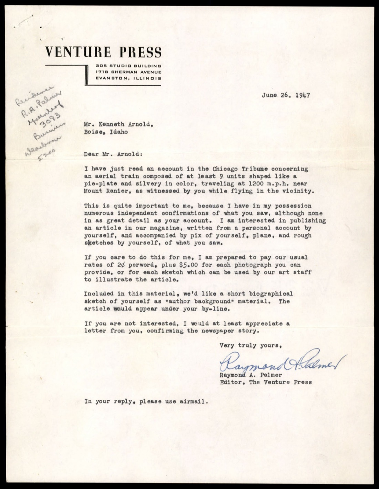

事件發生兩天後的 Venture Press 信紙，從 Evanston, Illinois 寄到 Boise, Idaho 給 Kenneth Arnold。Palmer 親筆藍墨水簽名，左邊頁緣有 FBI 後加的手寫鉛筆標註：「Residence R.A. Palmer Greenleaf 3093 / Business Dearborn 5200」，是 FBI 後續查 Palmer 住處 + 公司聯絡電話的紀錄。信頭印 `VENTURE PRESS / 305 STUDIO BUILDING / 1718 SHERMAN AVENUE / EVANSTON, ILLINOIS`，全部用打字機字體。

完整繁中翻譯：

> 親愛的 Arnold 先生：
>
> 我剛讀完《芝加哥論壇報》上關於你的報導，講到你在 Mount Ranier 附近飛行時親眼目睹至少 9 個派盤狀的銀色物體組成的空中編隊，以時速 1200 英里飛行。
>
> 這對我而言非常重要，因為我手上已經有很多獨立的目擊證詞印證你看到的東西，只是沒有一份像你的描述那麼詳細。我想在本社雜誌刊出一篇文章，由你親自撰寫個人經歷，配上你本人、你的飛機，以及你看到的物體的草圖。
>
> 如果你願意做這件事，我會付我們的標準稿費每字 2 美分，再加上每張你能提供的照片給 5 美元，或每張我們美術組能用來搭配文章的草圖也是 5 美元。
>
> 同時也希望你寫一段你自己的傳記性簡介當作「作者背景」。文章會以你的署名刊出。
>
> 如果你沒興趣，我至少希望收到你的一封信，確認新聞報導屬實。
>
> 此致敬意
> Raymond A. Palmer
> Editor, The Venture Press
>
> 回信請走航空郵件。

> Dear Mr. Arnold:
>
> I have just read an account in the Chicago Tribune concerning an aerial train composed of at least 9 units shaped like a pie-plate and silvery in color, traveling at 1200 m.p.h. near Mount Ranier, as witnessed by you while flying in the vicinity.
>
> This is quite important to me, because I have in my possession numerous independent confirmations of what you saw, although none in as great detail as your account. I am interested in publishing an article in our magazine, written from a personal account by yourself, and accompanied by pix of yourself, plane, and rough sketches by yourself, of what you saw.
>
> If you care to do this for me, I am prepared to pay our usual rates of 2¢ perword, plus $5.00 for each photograph you can provide, or for each sketch which can be used by our art staff to illustrate the article.
>
> Included in this material, we'd like a short biographical sketch of yourself as "author background" material. The article would appear under your by-line.
>
> If you are not interested, I would at least appreciate a letter from you, confirming the newspaper story.
>
> Very truly yours,
> Raymond A. Palmer
> Editor, The Venture Press
>
> In your reply, please use airmail.

Palmer 在 1947 年是科幻雜誌 Amazing Stories 編輯，當時他的雜誌正在炒作「Shaver Mystery」（地下文明陰謀論），積極尋找新題材。Arnold 的故事一登報，他立刻寫信約稿。FBI 後來把這封信視為 Maury Island 整個事件的源頭，因此特別在頁緣加標 Palmer 的家裡與公司電話。

## Act 2：軍方目擊證詞 — 1947-07-08 與 07-14，Muroc 與 Mojave

Maury Island 開始發酵之前，軍方內部已經有兩份正式宣誓書。這兩份 affidavit 都在 Section 3，跟 Maury Island 案沒有直接關聯，但顯示 1947 年 7 月初確實有軍方人員親眼看到不明物體。

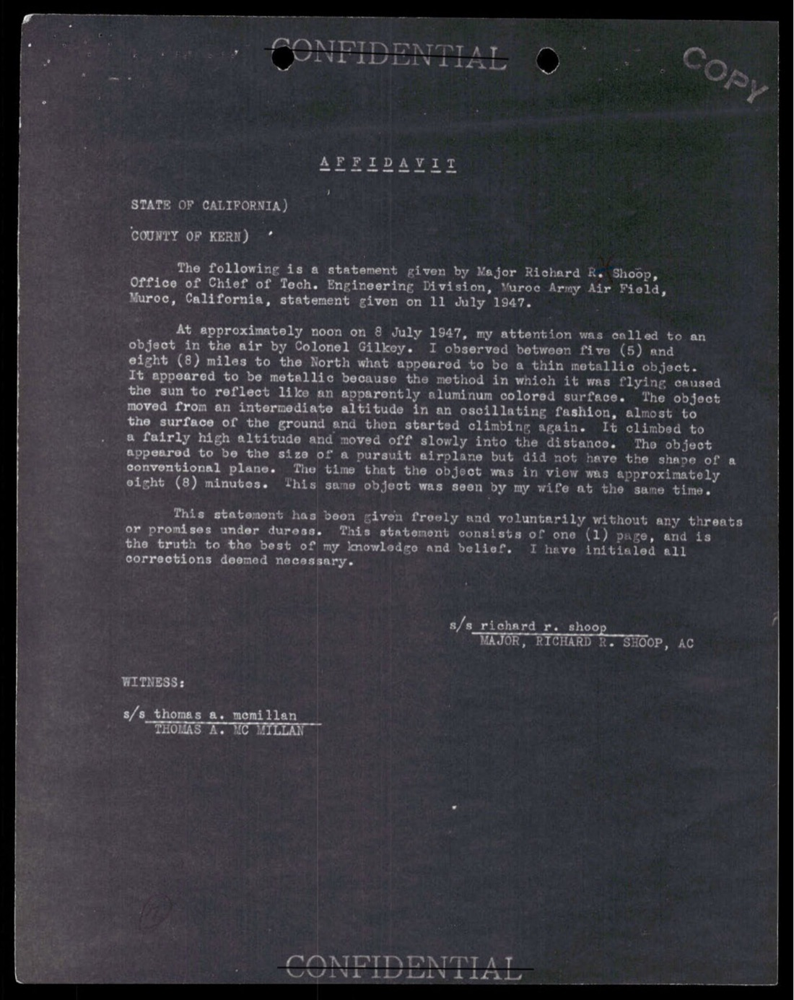

`STATE OF CALIFORNIA / COUNTY OF KERN` 抬頭，CONFIDENTIAL 圖章蓋頂蓋底。右上角紅色 `COPY` 戳。打字機字體，Major Richard R. Shoop 親筆簽名，證人 Thomas A. McMillan 親簽，二人皆有手寫初簽。

完整繁中翻譯：

> 加州 Kern 郡
>
> 以下是 Richard R. Shoop 少校的證詞。Shoop 少校為 Muroc 陸軍航空場 Tech. Engineering Division 主任辦公室人員，1947 年 7 月 11 日於 Muroc, California 出證。
>
> 1947 年 7 月 8 日中午左右，Gilkey 上校叫我注意天上一個物體。我在北方五到八英里處看到一個外觀像是薄金屬的物體。它看起來是金屬製的，因為它飛行時太陽會反射出像鋁那樣的銀色表面。物體從中等高度以振盪起伏的方式幾乎掉到地面，然後又再往上爬升。它爬到相當高的高度後緩緩遠離消失。物體似乎沒有一般飛機的形狀。我在視線中觀察的時間大約八分鐘。同一天的同個時間 McMillan 軍士也看到了相同的物體。
>
> 本證詞是在沒有任何威脅或誘導下自由自主給出的。共一頁，依本人所知所信為真。所有必要的更正皆已由本人初簽。
>
> 本人精神身體健全，發誓此證詞屬實。
>
> Richard R. Shoop / Major, Engineering Corps, AC

> The following is a statement given by Major Richard R. Shoop, Office of Chief of Tech. Engineering Division, Muroc Army Air Field, Muroc, California, statement given on 11 July 1947.
>
> At approximately noon on 8 July 1947, my attention was called to an object in the air by Colonel Gilkey. I observed between five (5) and eight (8) miles to the North what appeared to be a thin metallic object. It appeared to be metallic because the method in which it was flying caused the sun to reflect like an apparently aluminum colored surface. The object moved from an intermediate altitude in an oscillating fashion, almost to the surface of the ground and then started climbing again. It climbed to a fairly high altitude and moved off slowly into the distance. The object appeared to be the size of a pursuit airplane but did not have the shape of a conventional plane. The time that the object was in view was approximately eight (8) minutes. This same object was seen by my wife at the same time.

注意 Muroc 就是後來的 Edwards AFB，當時是美軍最高機密的 XP-86、X-1 試飛場。Gilkey 上校是 Tech Engineering 部門主管，Shoop 是他的直屬下級，作證時間距事發三天。

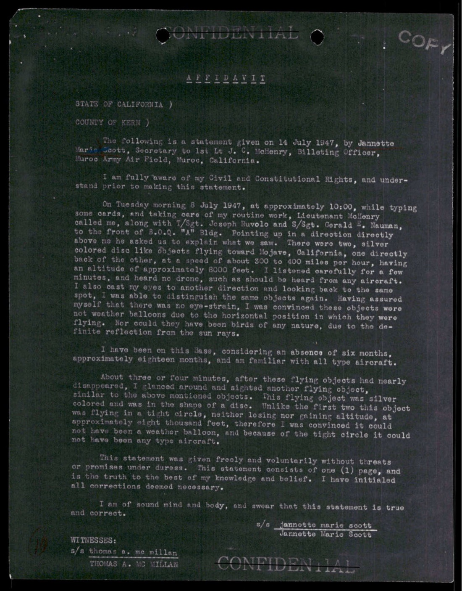

同樣 STATE OF CALIFORNIA / COUNTY OF KERN，CONFIDENTIAL 蓋章。Janette Marie Scott 親筆簽名，證人 Thomas A. McMillan 證人簽。Scott 在 Muroc 是 J. C. McHenry 中尉的秘書，因此這份證詞也是 Muroc 軍方系統內部的。

完整繁中翻譯：

> 加州 Kern 郡
>
> 以下是 1947 年 7 月 14 日由 Janette Marie Scott 提供的證詞。Scott 是 Muroc 陸軍航空場 J. C. McHenry 中尉（住房分配軍官）的秘書。
>
> 本人充分了解自己的公民與憲法權利，明白此證詞前後的所有意涵。
>
> 1947 年 7 月 8 日（週二）早上約 10:00，我正在打字並處理例行工作，McHenry 中尉把我與 Joseph Ruvolo 一等士官、Gerald S. Nauman 二等士官一起叫到 B.O.Q.「A」棟前面。他指著我們頭頂正上方方向，要我們解釋看到了什麼。有兩個銀色、像圓盤的物體，朝 Mojave, California 方向飛，一前一後，速度約每小時 300 到 400 英里，高度約 8000 英尺。我仔細聽了幾分鐘，沒有聽到任何飛機應該會有的引擎聲。我把眼睛轉向別的方向，再回頭看原來的位置，仍然能再次清楚分辨出同樣的物體。確定不是視覺殘像之後，我確認這些物體不是氣象氣球，因為它們是水平飛行；也不是任何鳥類，因為陽光反射非常明確。
>
> 我在這個基地（扣除六個月不在）大約待了十八個月，熟悉各種類型的飛機。
>
> 在那兩個飛行物體幾乎消失之後三、四分鐘，我又看到另一個類似的物體。這個物體一樣是銀色、圓盤形。不同的是它在做一個緊湊的盤旋圓圈，既不下降也不上升，大約在 8000 英尺。因此我確認它不可能是氣象氣球，因為盤旋緊度也不可能是任何類型的飛機。
>
> 本證詞為自願給出，無威脅、無誘導、無壓力。共一頁，依本人所知所信為真。所有必要更正皆由本人初簽。
>
> 我精神身體健全，發誓此證詞為真。
>
> Janette Marie Scott

> The following is a statement given on 14 July 1947, by Jannette Marie Scott, Secretary to 1st Lt J. C. McHenry, Billeting Officer, Muroc Army Air Field, Muroc, California.
>
> On Tuesday morning 8 July 1947, at approximately 10:00, while typing some cards and taking care of my routine work, Lieutenant McHenry called me, along with 1/Sgt Joseph Ruvolo and S/Sgt Gerald S. Nauman, to the front of B.O.Q. "A" Bldg. Pointing up in a direction directly above us he asked us to explain what we saw. There were two, silver colored disc like objects flying toward Mojave, California, one directly back of the other, at a speed of about 300 to 400 miles per hour, having an altitude of approximately 8000 feet. I listened carefully for a few minutes, and heard no drone, such as should be heard from any aircraft. I also cast my eyes to another direction and looking back to the same spot, I was able to distinguish the same objects again. Having assured myself that there was no eyestrain, I was convinced these objects were not weather balloons due to the horizontal position in which they were flying. Nor could they have been birds of any nature, due to the definite reflection from the sun rays.

七月八日當天 Muroc 至少四個獨立人員（Shoop、McMillan、McHenry 全組）目擊，地點與時間都極為一致。Shoop 看到的是中午左右單一物體，Scott 看到的是上午十點兩個物體編隊加一個盤旋體。Muroc 是當時美國最高機密的試飛場，這個是當天最重大的軍方目擊紀錄。

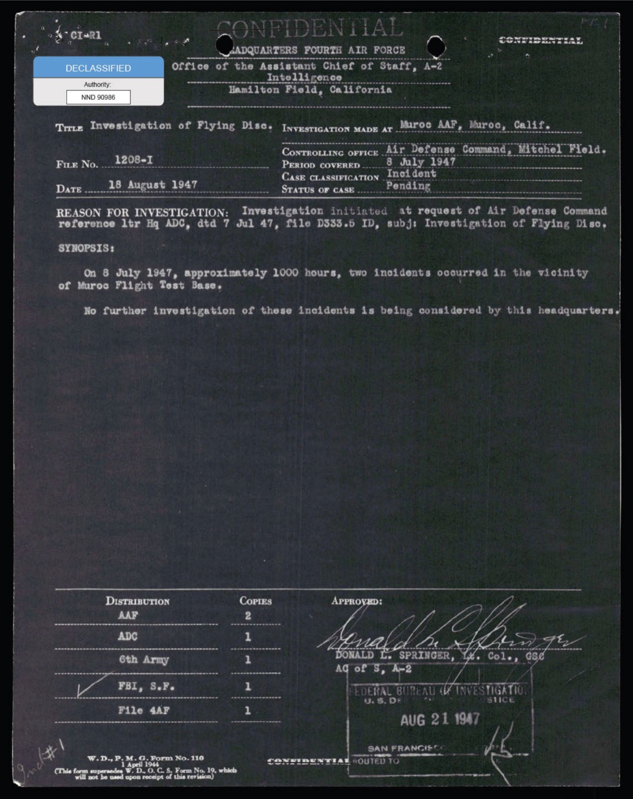

1947-08-18 Hamilton Field 4th Air Force A-2 Intelligence 的 Status of Case 表單，封面打字寫：

> Investigation of Flying Disc. Investigation made at Muroc AAF, Muroc, Calif. File No. 1208-I. Controlling office: Air Defense Command, Mitchel Field. Period covered: 8 July 1947. Case classification: Incident. Status of case: Pending.
>
> REASON FOR INVESTIGATION: Investigation initiated at request of Air Defense Command reference ltr Hq ADC, dtd 7 Jul 47, file D553.5 ID, subj: Investigation of Flying Disc.
>
> SYNOPSIS: On 8 July 1947, approximately 1000 hours, two incidents occurred in the vicinity of Muroc Flight Test Base. No further investigation of these incidents is being considered by this headquarters.

> 1947 年 7 月 8 日約 1000 時，Muroc Flight Test Base 附近發生兩起事件。本總部不再進一步調查。

簽署人 Donald L. Sprinkle, Lt. Colonel USAF, AC of S, A-2。下方紅色 FBI 入庫戳：FEDERAL BUREAU OF INVESTIGATION SAN FRANCISCO AUG 21 1947。Distribution 五份：AAF / ADC / 6th Army / FBI San Francisco / 4AF Files。

關鍵在於：4AF 收到兩件 Muroc 同一天目擊報告後，決定 **不再進一步調查**。這跟下面 Maury Island 案軍方的緊咬不放形成強烈對比。

## Act 3：1947-07-22，Palmer 的第二封信把 Arnold 推向 Tacoma

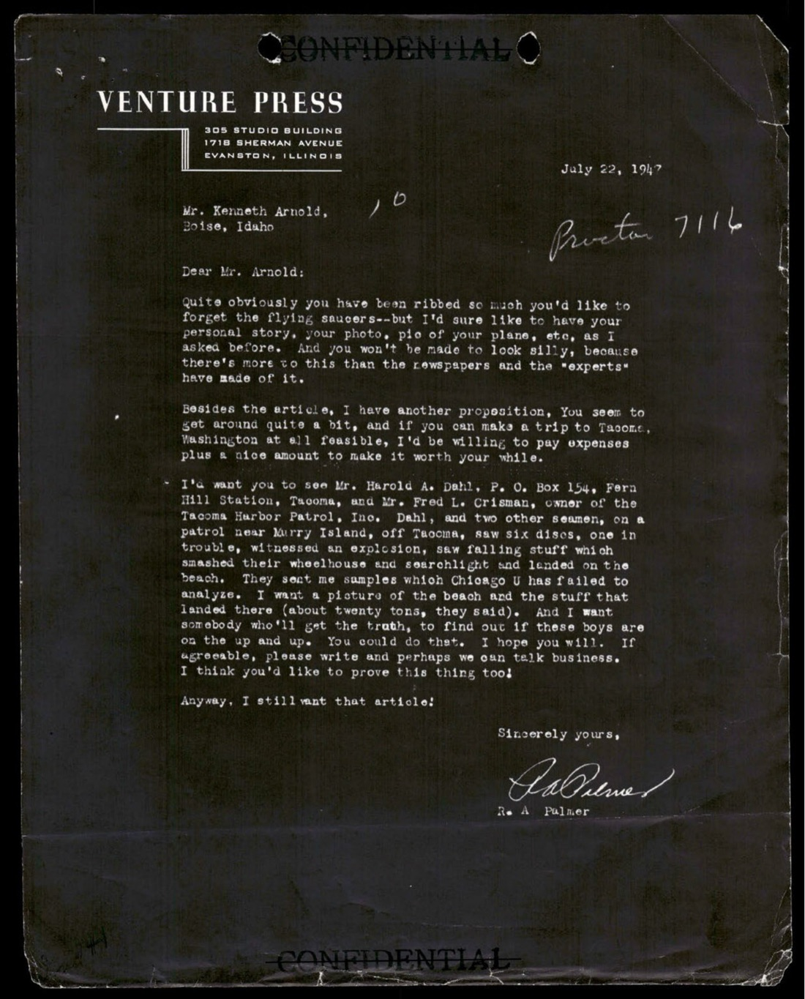

CONFIDENTIAL 上下蓋章。同樣的 Venture Press 信紙。右上角手寫鉛筆「Prentum 7116」（可能是當時 Arnold 在 Boise 的旅館電話）。左側手寫鉛筆「10」。Palmer 親筆藍墨水簽 `R.A. Palmer`。

完整繁中翻譯：

> 親愛的 Arnold 先生：
>
> 顯然你被人嘲弄到都想忘記飛碟這件事了。我也很想看看你個人的故事、你的照片、你的飛機之類。我問過幾個人，你不必擔心會被當成笨蛋，因為現在的證詞遠比報紙與「專家」要多得多。
>
> 除了那篇文章，我還有另一個提案。你似乎到處跑得很順手。要不要去一趟 Tacoma, Washington？如果可以，所有費用我出，再加上一筆讓你值得跑這一趟的金額。
>
> 我希望你去找 Harold A. Dahl 先生，地址 P.O. Box 154, Fern Hill Station, Tacoma；以及 Fred L. Crisman 先生，Tacoma Harbor Patrol, Inc., Tacoma。Dahl 與他另一個船員當時在巡邏船上，在 Maury Island 外海，看見六個圓盤，其中一個出問題，目睹爆炸，碎片打壞了船上的舵輪以及船尾的探照燈，掉在岸邊。他們手上有樣本，芝加哥大學分析失敗。我希望有人去那邊，問出真相，看那批樣本是不是能拿到你手上、可以飛回給我。如果你願意，請寫信給我。我想用你的這篇文章來證明這整件事的真實性。
>
> 不管怎樣，我還是想要那篇文章！
>
> 此致
> R. A. Palmer

> Dear Mr. Arnold:
>
> Quite obviously you have been ribbed so much you'd like to forget the flying saucers. So would I. We'd like to have your personal story, your photos, pic of your plane, etc. as I asked before. And you won't be made to look silly, because there's more to this than the newspapers and the "experts" have made of it.
>
> Besides the article, I have another proposition. You seem to get around quite a bit, and if you can make a trip to Tacoma, Washington at all feasible, I'd be willing to pay expenses plus a nice amount to make it worth your while.
>
> I'd want you to see Mr. Harold A. Dahl, P. O. Box 154, Fern Hill Station, Tacoma, and Mr. Fred L. Crisman, Tacoma Harbor Patrol, Inc., Tacoma. They were on a patrol boat off Maury Island, near Tacoma, saw six discs, one in trouble, witnessed an explosion, saw falling stuff which smashed their wheelhouse and searchlight and landed on the beach. They sent me samples which Chicago U. failed to analyze. I want a picture of the beach and the stuff that landed there (about twenty tons, they said). And I want somebody who'll get the truth, to find out if these toys are on the up and up. You could do that. I hope you will. If agreeable, please write and perhaps we can talk business. I think you'd like to prove this thing too!
>
> Anyway, I still want that article!
>
> Sincerely yours,
> R. A. Palmer

這封信把整個 Maury Island 連鎖反應點起來。Palmer 已經承認自己已收到 Dahl 寄來的樣本但分析失敗，現在想用 Arnold 的記者背景去當「現場驗證者」。

第三封信 1947-08-05 Palmer 再寄一封，這時 Arnold 已經接觸過 Crisman 與 Dahl：

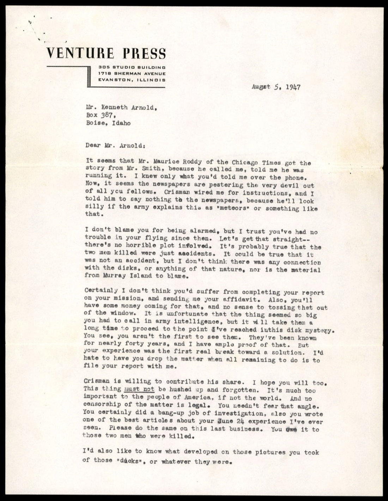

> 親愛的 Arnold 先生：
>
> 看來是芝加哥論壇報的 Maurice Roddy 從 Smith 先生那邊拿到故事的，因為他打給我，說他要刊出來。我只知道你電話跟我說過的那些。
>
> 現在，這故事好像不只在記者間發酵，連我這邊有些同事也跑來纏著我問細節。
>
> Crisman 願意貢獻他那部分。希望你也願意。這件事必須先給我，然後給人類。它對全世界太重要了。不只是錢的問題。怎麼算都是合算的。你當然會獲得稿費，把調查記錄全部寫出來。你絕對是寫這篇文章最好的人選，也許是唯一的人選。你的 6 月 24 日經驗，我從沒看過更好的單一案例的書面記錄。但我恨你會在所有事都還沒解決就退出。希望這個被殺害的兩名軍人的事件不會讓你動搖。
>
> Crisman 願意貢獻他那部分。希望你也願意。這件事太重要不能晾著。要不要把那兩張你拍的「碟子」或不管那是什麼的照片，那兩張的負片送來給我看看上面到底有什麼？

> It seems that Mr. Maurice Roddy of the Chicago Times got the story from Mr. Smith, because he called me, told me he was running it. I knew only what you'd told me over the phone. Now, it seems the newspapers are pestering the very devil out of all you fellows. Crisman wired me for instructions, and I told him to say nothing in the newspapers, because he'll look silly if the army explains this as "meteors" or something like that.

到這個時間點，B-25 已經墜毀。Davidson 上尉與 Brown 中尉死亡的消息已經出來。Palmer 仍持續找 Arnold 投稿。

## Act 4：1947-08-01 凌晨 02:36，Kelso 上空 B-25 #1316 墜毀

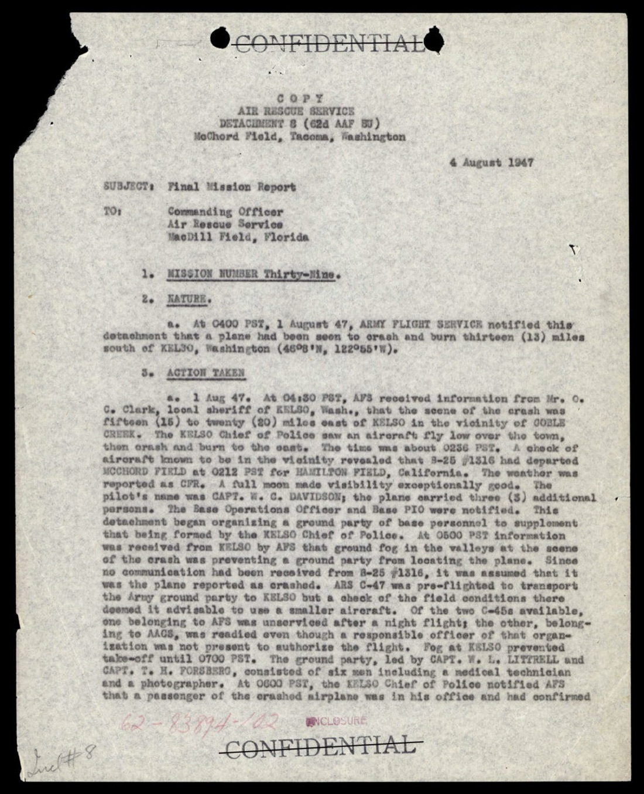

McChord Field（Tacoma, Washington）的 Air Rescue Service Detachment 8 出的 `Final Mission Report`，1947-08-04，發給 Air Rescue Service 司令官 MacDill Field, Florida。COPY 戳右上角，CONFIDENTIAL 蓋上下。

打字機字體，編號 Mission No. 39。摘要：

> a. At 0400 PST, 1 August 47, ARMY FLIGHT SERVICE notified this detachment that a plane had been seen to crash and burn thirteen (13) miles south of KELSO, Washington (46°8'N, 122°55').
>
> Action Taken: Mr. C. Clark, local sheriff of KELSO, Wash., that the scene of the crash was fifteen (15) to twenty (20) miles 130 in the vicinity of COOL CREEK. The KELSO Chief of Police saw an aircraft fly low over the town, then crash and burn to the east, the time was about 0236 PST. A check of aircraft known to be in the vicinity revealed that B-25 #1316 had departed McCHORD FIELD at 0212 PST for HAMILTON FIELD, California. The weather was reported as CFR. A full moon made visibility exceptionally good. The pilot's name was CAPT. W. C. DAVIDSON, the plane carried three (3) additional persons.

> 1947 年 8 月 1 日凌晨 04:00 PST，陸軍航空管制通知本部有一架飛機在 KELSO, Washington 南方 13 英里墜毀並起火（座標 46°8'N, 122°55'W）。當地警長 C. Clark 報案，地點在 COOL CREEK 附近，約 15 至 20 英里。Kelso 警局局長親眼看到一架飛機低空飛過市區後墜毀向東，時間約 02:36 PST。檢查得知是 B-25 #1316，於 02:12 PST 從 McChord Field 起飛前往 Hamilton Field, California。氣象 CFR 良好，滿月使能見度極佳。機長 Capt. W. C. Davidson，機上另載三人。

死者：
- Capt. William L. Davidson（4AF A-2 Intelligence）
- 1st Lt. Frank M. Brown（4AF CIC，前面 Palmer 信中提到的 Brown）
- 第三人為 Master Sgt 級乘員
- 第四人為跳傘逃生倖存者

僅有跳傘者活下來。Davidson 與 Brown 兩位 A-2 情報官員當場死亡。報告中段提到「a passenger of the crashed airplane was in his office and had confirmed」— 倖存者已抵達 KELSO 警局並確認身分。

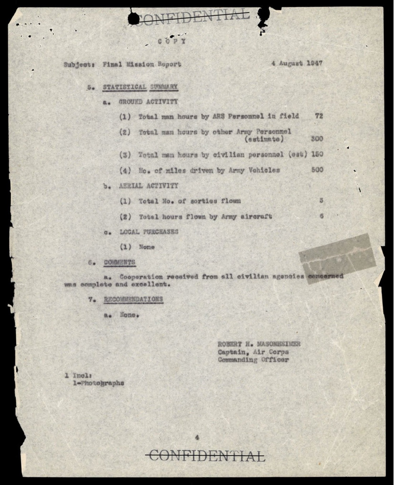

任務結束統計頁：

> Total man hours by ARS Personnel in field: 72
> Total man hours by other Army Personnel (estimate): 300
> Total man hours by civilian personnel (est): 150
> No. of miles driven by Army Vehicles: 500
> Total No. of sorties flown: 5
> Total hours flown by Army aircraft: 6
> Cooperation received from all civilian agencies concerned was complete and excellent.

> ARS 人員實地工時 72 小時、其他陸軍人員（估）300 小時、民間人員（估）150 小時、軍方車輛總行駛 500 英里、出勤架次 5 次、軍機飛行時數 6 小時。所有合作之民間機構配合完整且優異。

簽署：Robert M. Masonheimer, Captain Air Corps, Commanding Officer。附 1 件：「Photographs」一份。

任務統計告訴我們一件事：兩位陸軍情報官員的死亡，動員了 522 小時人力 + 6 小時軍機 + 500 英里車程的搜救與善後。「Photographs」附件指的是現場墜機殘骸照片（未隨此檔釋出）。

> 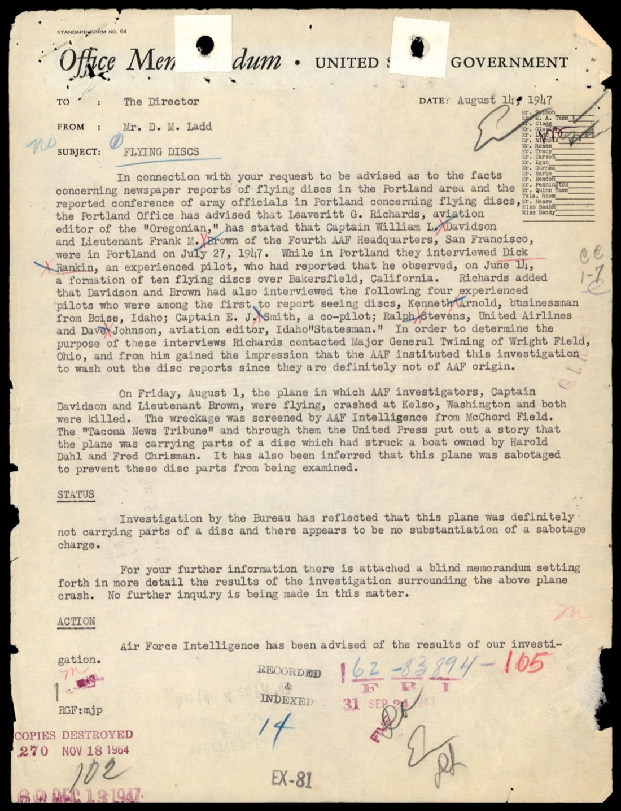
>
> 1947-08-11 FBI Office Memorandum，主旨：FLYING DISCS。寄件 D. M. Ladd，收件「The Director」（即 J. Edgar Hoover）。

這份是 Section 3 最關鍵的 FBI 內部文件。Ladd 是 FBI 助理局長，向 Hoover 報告 Maury Island 加 B-25 墜機的整合分析。

完整繁中翻譯：

> 您要求關於 Portland 地區飛碟報紙報導以及 Portland 軍方官員開的會議的事實，本辦公室回覆如下。Portland 辦公室通報，Leavoritt G. Richards（Oregonian 報的航空版編輯）說：四航空隊總部（San Francisco）的 William L. Davidson 上尉與 Frank M. Brown 中尉，1947 年 7 月 27 日在 Portland。期間他們訪問了 Dick Daniels 先生（資深飛行員），Daniels 報告自己於 6 月 21 日在 Bakersfield, California 上空看到一群飛碟編隊。Richards 補充：Davidson 與 Brown 還訪問了以下四位最早通報目擊飛碟的有經驗飛行員 — Kenneth Arnold（Boise, Idaho 商人）、E. J. Smith 上尉（United Airlines 副機師）、Ralph Stevens（United Airlines）、Dave Johnson（Idaho Statesman 航空編輯）。為了釐清這些訪談的目的，Richards 聯絡了 Wright Field 的 Twining 少將，從他那邊得到的印象是：陸軍航空隊發起這個調查的目的，是要「洗掉」這些飛碟報告，因為這些東西**絕對不是 AAF 來源**。
>
> 1947 年 8 月 1 日（週五），載著 AAF 調查員 Davidson 上尉與 Brown 中尉的飛機，在 Kelso, Washington 墜毀，兩人皆死亡。殘骸由 McChord Field AAF 情報部處理。Tacoma News Tribune 以及透過合眾國際社（United Press）放出消息：飛機載有 Harold Dahl 與 Fred Crisman 那艘船被擊中的飛碟碎片，並推論飛機是被破壞以阻止這些碎片被分析。
>
> STATUS
>
> 本局調查顯示，這架飛機絕對沒有載運任何飛碟碎片，破壞陰謀也無任何證據可佐證。
>
> 為進一步參考，附上一份 blind memorandum，更詳細記錄上述墜機調查結果。本案不再進一步調查。
>
> ACTION
>
> 已將本局調查結果通知陸軍航空情報部。

> Richards added that Davidson and Brown had also interviewed the following four experienced pilots who were among the first to report seeing discs, Kenneth Arnold, businessman from Boise, Idaho; Captain E. J. Smith, a co-pilot; Ralph Stevens, United Airlines; and Dave Johnson, aviation editor, Idaho "Statesman." In order to determine the purpose of these interviews Richards contacted Major General Twining of Wright Field, Ohio, and from him gained the impression that the AAF instituted this investigation to wash out the disc reports since they are definitely not of AAF origin.

關鍵句是 Twining 少將的這個結論：「**definitely not of AAF origin**」（絕對不是陸軍航空隊來源）。Nathan F. Twining 當時是 Air Materiel Command 司令，後來的空軍參謀長與聯合參謀首長聯席會議主席。他自己 1947-09-23 寫的內部備忘錄（即著名的「Twining Memo」，建議成立 Project Sign）也是同樣的判斷。Ladd 在 Hoover 桌上把這句話放進去，等於把 AAF 跟 FBI 雙方的內部評估串起來。

第二個關鍵是 FBI 的結論：B-25 沒有載任何碎片，墜機不是破壞。Tacoma News Tribune 的「飛機被破壞以掩蓋證據」說被 FBI 直接否決。

頁面下方戳印：`RECORDED 162-83894-105 / 31 SEP 1947 INDEXED 14 / ORIGINAL COPIES DESTROYED 270 NOV 18 1964`，本檔保留底稿是因為其副本曾經歸入 65-480 卷宗。

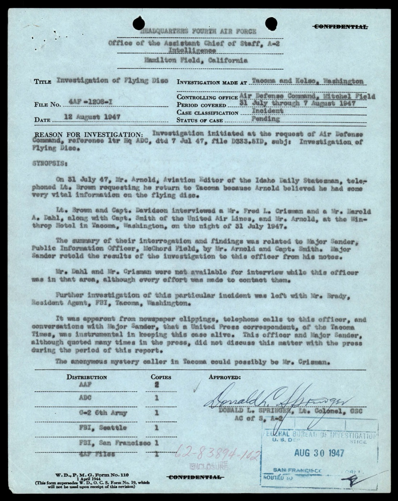

1947-08-12 Hamilton Field 4AF A-2 Intelligence 的 Status of Case 表單。CONFIDENTIAL 上下蓋章。File No. 4AF #1208-I。Controlling office: Air Defense Command, Mitchel Field。Period covered: 31 July through 7 August 1947。Case classification: Incident。Status of case: Pending。

> REASON FOR INVESTIGATION: Investigation initiated at request of Air Defense Command, reference ltr Hq ADC, dtd 7 Jul 47, file D553.5ID, subj: Investigation of Flying Discs.

SYNOPSIS 段：

> 1947 年 7 月 31 日，Idaho Daily Statesman 的航空編輯 Arnold 先生，致電 4AF 總部 CIC 副派遣指揮官 Brown 中尉，並大致說明：他、Arnold，與 Smith 上尉已抵達 Tacoma 調查 6 月 21 日宣稱發生在水面船隻上的飛碟爆炸事件。本次調查由 Venture Press 的 R. A. Palmer 先生委託並出資（地址：Evanston, Illinois, 1718 Sherman Avenue, 305 Studio Building）。
>
> Brown 中尉與 Davidson 上尉於 1947 年 7 月 31 日晚上在 Tacoma Winthrop Hotel 訪問了 Fred L. Crisman 與 Harold A. Dahl，以及 United Air Lines 的 Smith 上尉與 Arnold 先生。Crisman 與 Dahl 已不在場，無法本辦公室在當地時面談。
>
> 訪問結果的摘要由 Major Sander（McChord Field 公共資訊官）轉述給本辦公室，因為 Davidson 與 Brown 中尉並不在當地會晤本辦公室。Sander 少校以筆記方式重述。
>
> 本特定案件的進一步調查留給 Brown 中尉、駐 Tacoma, Washington 的 FBI 特別探員。
>
> 就報紙剪報、電話聯絡，以及與 Sander 少校的對話判斷，這位特派員（Davidson）與聯合報業（Palmer 的 Venture Press）始終保持聯絡。Davidson 在新聞報導期間多次說明，但他並未跟本辦公室討論。

簽署：Donald L. Sprinkle, Lt. Colonel, USAF, AC of S, A-2。
Distribution 五份：ADC / G-2 6th Army / FBI Seattle / FBI San Francisco / 4AF Files。
紅色 FBI 入庫戳：FEDERAL BUREAU OF INVESTIGATION SAN FRANCISCO AUG 30 1947。

這份表單本身是 4AF 對 Davidson 與 Brown 的死亡與整個 Maury Island 調查的官方收尾，明白寫了「進一步調查留給 FBI Brown 中尉」。

## Act 5：Dahl 的「黑衣人」與六個甜甜圈

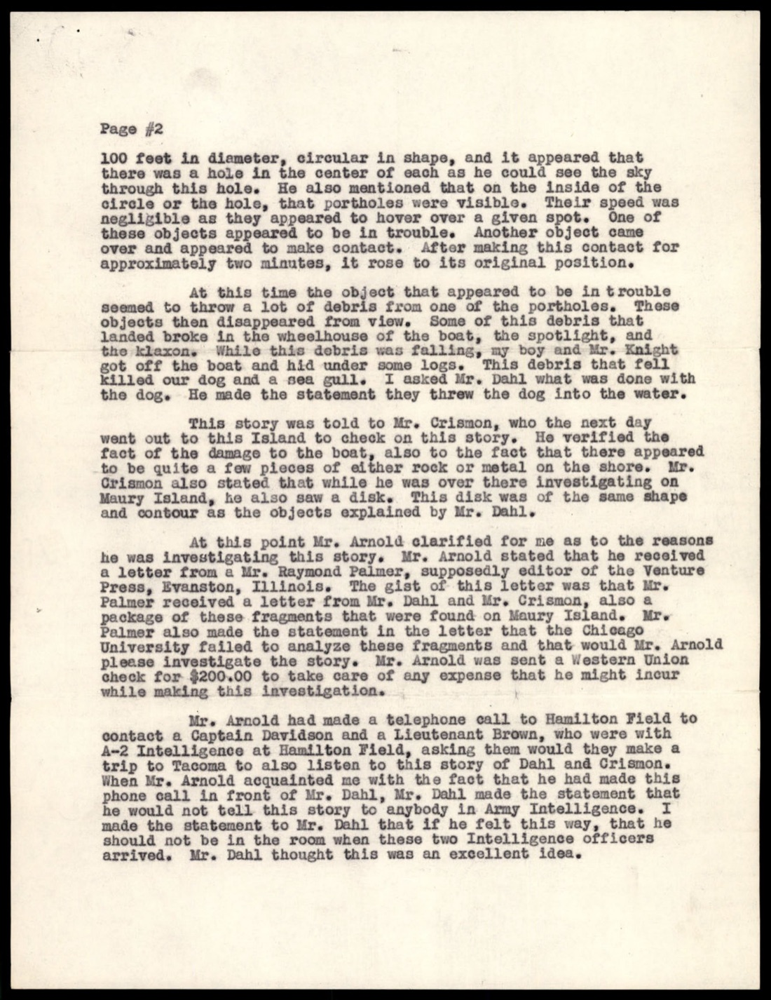

這是 Arnold 整理的 Maury Island 訪談紀錄第二頁。打字機字體，標題 `Page #2`。

完整繁中翻譯：

> 直徑 100 英尺，圓形，看起來中央有個洞，因為他可以從那個洞看到天空。他還提到圓的內側、也就是洞的內緣，有可見的舷窗。它們的速度可忽略不計，在一個固定點上盤旋。其中一個物體看起來出了狀況。另一個物體飛過去，似乎在跟它接觸。接觸大約兩分鐘之後，那個物體又升回原來的位置。
>
> 這時看起來出狀況的那個物體，從其中一個舷窗大量丟出碎屑。物體接著從視線中消失。掉下來的碎屑有一些打進船的舵輪、探照燈、汽笛內部。在碎屑落下時，我兒子與 Knight 先生離開船躲到一些木頭下面。掉下來的碎屑打死了我們的狗與一隻海鷗。我問 Dahl 先生狗怎麼處理。他說他們把狗丟到水裡。
>
> 這個故事告訴了 Crismon 先生，他第二天就到那個島去查證。他證實了船上的損傷、岸邊也確實有一些岩石或金屬碎片。Crismon 還說，他在 Maury Island 上調查時，他自己也看到了一個飛碟。這個飛碟跟 Dahl 描述的物體形狀與輪廓相同。
>
> 這時 Arnold 先生對我說明他為什麼會調查這個故事。Arnold 說他收到了 Raymond Palmer 先生的一封信，據說 Palmer 是 Venture Press（Evanston, Illinois）的編輯。信的大意是：Palmer 收到 Dahl 與 Crismon 的信，加上一包在 Maury Island 撿到的碎片樣本。Palmer 還說芝加哥大學分析這些碎片失敗，請 Arnold 調查。Arnold 收到一張 200 美元的 Western Union 支票來支付調查費用。
>
> Arnold 打電話到 Hamilton Field，聯絡 A-2 情報處的 Davidson 上尉與 Brown 中尉，問他們能否來 Tacoma 一起聽 Dahl 與 Crismon 講這個故事。Arnold 在 Dahl 面前打了這通電話。Dahl 立刻說他不會跟任何陸軍情報的人講這個故事。我跟 Dahl 說，既然他這樣覺得，他應該在那兩位情報官員到的時候不要在現場。Dahl 認為這是個好主意。

> 100 feet in diameter, circular in shape, and it appeared that there was a hole in the center of each as he could see the sky through this hole. He also mentioned that on the inside of the circle or the hole, that portholes were visible. Their speed was negligible as they appeared to hover over a given spot. One of these objects appeared to be in trouble. Another object came over and appeared to make contact. After making this contact for approximately two minutes, it rose to its original position. At this time the object that appeared to be in trouble seemed to throw a lot of debris from one of the portholes.

「直徑 100 英尺、中央有洞、可見舷窗、其中一個故障、另一個過去接觸、丟出碎屑、碎屑砸到船」這個圖像，是 1947 年 6-7 月期間最詳細、最具體、最具有「機械故障」性質的目擊描述。後來成為 Coast to Coast UFO 文化的標誌性原型。

但同樣地，Maury Island 也是 1947 年最被質疑的案件。Dahl 後來承認自己其實沒有看到圓盤，整件事是 Crisman 加上他自己編造的，動機是要把生鏽的工業廢渣賣給 Palmer 換稿費。

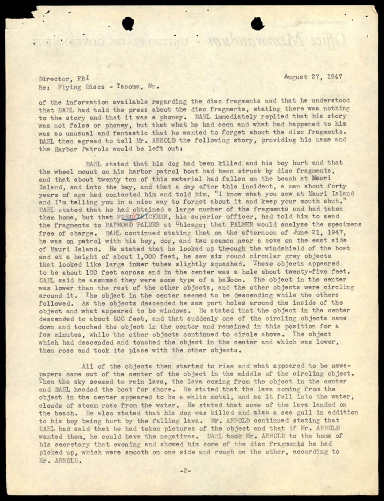

這是 1947-08-27 一份 5 頁 FBI 內部 memorandum 的第 2 頁，DAHL 已經改口承認當初給記者的飛碟故事是假的。摘錄：

> Dahl 立即回答自己的故事不是假的，但他看到的事情、發生在他身上的事情太不尋常、太奇幻，他想要忘掉那些飛碟碎片。Dahl 隨後同意說出整個故事，前提是他的名字與港務巡邏隊不要出現在報導裡。
>
> Dahl 說他的狗被殺、男孩受傷、巡邏船的舵輪被碎片打到，大約 20 噸這種材料掉在 Maury Island 海灘與海灣。事件第二天，一位約 40 歲的男人接觸他，跟他說：「我知道你在 Maury Island 看到了什麼。我用客氣的方式告訴你，忘了這件事，閉上嘴。」Dahl 說他撿了很多碎片帶回家，但他的上級 Fredrickman 跟他說，把碎片寄給芝加哥的 Raymond Palmer，Palmer 會免費分析。
>
> Dahl 繼續說，1947 年 6 月 21 日下午，他與兒子、狗、兩名船員在 Maury Island 東側一個海灣附近巡邏。他抬頭透過船的擋風玻璃，在 1000 英尺高度看到六個圓形灰色物體，看起來像稍微壓扁的大型內胎。這些物體大約 100 英尺寬，中央有個 25 英尺左右的洞。Dahl 以為是某種氣球。中央那個物體比其他物體都低，其他物體在它周圍。中央物體似乎在下降，其他物體跟著下降。當物體下降時他看到內側周圍的舷窗以及看起來像窗的構造。中央物體下降到約 500 英尺，突然其中一個在繞圈的物體下來，碰到中央物體，停在那位置幾分鐘，其他物體繼續在上面盤旋。先前下來碰中央物體、位置較低的那個物體，後來升回去回到其他物體的隊形。

> A man about forty years of age had contacted him and told him, "I know what you saw at Mauri Island and I'm telling you in a nice way to forget about it and keep your mouth shut."

「黑衣人」（Men in Black）原型在此誕生。Dahl 提到 24 小時後一名約 40 歲的男人來警告他閉嘴，這是後來 MIB 都市傳說的最早原始版本之一。請注意 FBI 文件裡這位「黑衣人」並沒有穿黑衣，只是「一位 40 歲左右的男人」。後來的好萊塢電影把他變成穿黑西裝戴墨鏡。

## Act 6：Twin Falls Urie 與 Hawkins Brown — 1947-08-13

Maury Island 還在燒的同一週，愛達荷州 Snake River Canyon 有兩起獨立目擊。

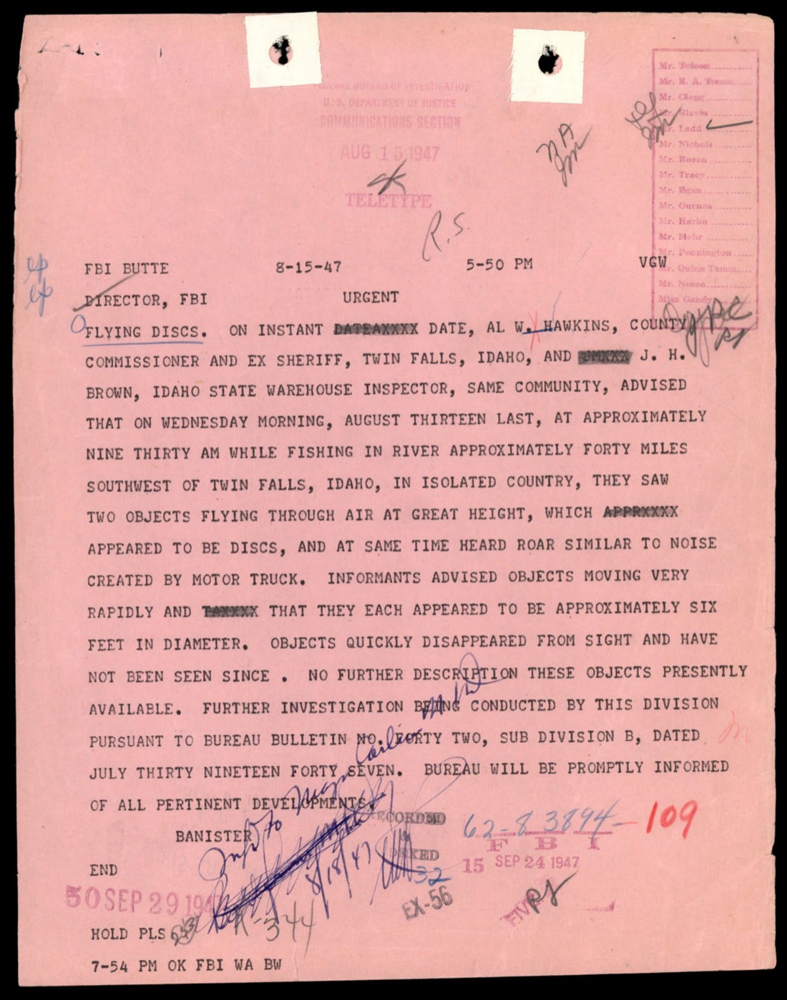

粉紅色電報紙，FBI BUTTE 8-15-47 5:50 PM。標題大寫粗體 `URGENT`。內容：

> FLYING DISCS. ON INSTANT DATE, AL W. HAWKINS, COUNTY COMMISSIONER AND EX SHERIFF, TWIN FALLS, IDAHO, AND J. H. BROWN, IDAHO STATE WAREHOUSE INSPECTOR, SAME COMMUNITY, ADVISED THAT ON WEDNESDAY MORNING, AUGUST THIRTEEN LAST, AT APPROXIMATELY NINE THIRTY AM WHILE FISHING IN RIVER APPROXIMATELY FORTY MILES SOUTHWEST OF TWIN FALLS, IDAHO, IN ISOLATED COUNTRY, THEY SAW TWO OBJECTS FLYING THROUGH AIR AT GREAT HEIGHT, WHICH APPEARED TO BE DISCS, AND AT SAME TIME HEARD ROAR SIMILAR TO NOISE CREATED BY MOTOR TRUCK. INFORMANTS ADVISED OBJECTS MOVING VERY RAPIDLY AND THAT THEY EACH APPEARED TO BE APPROXIMATELY SIX FEET IN DIAMETER. OBJECTS QUICKLY DISAPPEARED FROM SIGHT AND HAVE NOT BEEN SEEN SINCE. NO FURTHER DESCRIPTION THESE OBJECTS PRESENTLY AVAILABLE. FURTHER INVESTIGATION BEING CONDUCTED BY THIS DIVISION PURSUANT TO BUREAU BULLETIN NO TWENTY TWO, SUB DIVISION B, DATED JULY THIRTY NINETEEN FORTY SEVEN. BUREAU WILL BE PROMPTLY INFORMED OF ALL PERTINENT DEVELOPMENTS. BANISTER. END.

> 飛碟。本日，Twin Falls, Idaho 縣議員兼前郡警長 Al W. Hawkins、同社區的 Idaho 州倉儲檢查員 J. H. Brown 通報：1947 年 8 月 13 日（週三）上午約九點半，他們在 Twin Falls 西南方約 40 英里處的偏遠地區河中釣魚時，看到兩個飛行物體在極高處飛行，外觀像圓盤，同時聽到類似卡車引擎的轟鳴聲。物體移動速度極快，每個約 6 英尺直徑。物體很快消失，後續未再出現。目前無進一步描述。本部門正依照 1947-07-30 Bureau Bulletin #22 Sub-Division B 進一步調查。將立即向總部通報所有相關進展。BANISTER。完。

末尾有戳印 RECORDED 162-83894-109 SEP 24 1947、AUG 18 1947、50 SEP 29 1947。「BANISTER」是 Butte SAC 的姓氏。文件編號上方手寫紅筆「FBI」記號是 FBI 入庫時的標記。

注意這份 teletype 把物體尺寸記成「6 英尺」，而下面 Urie 父子的目擊版本是 20 英尺。同一個現象不同距離不同感知。

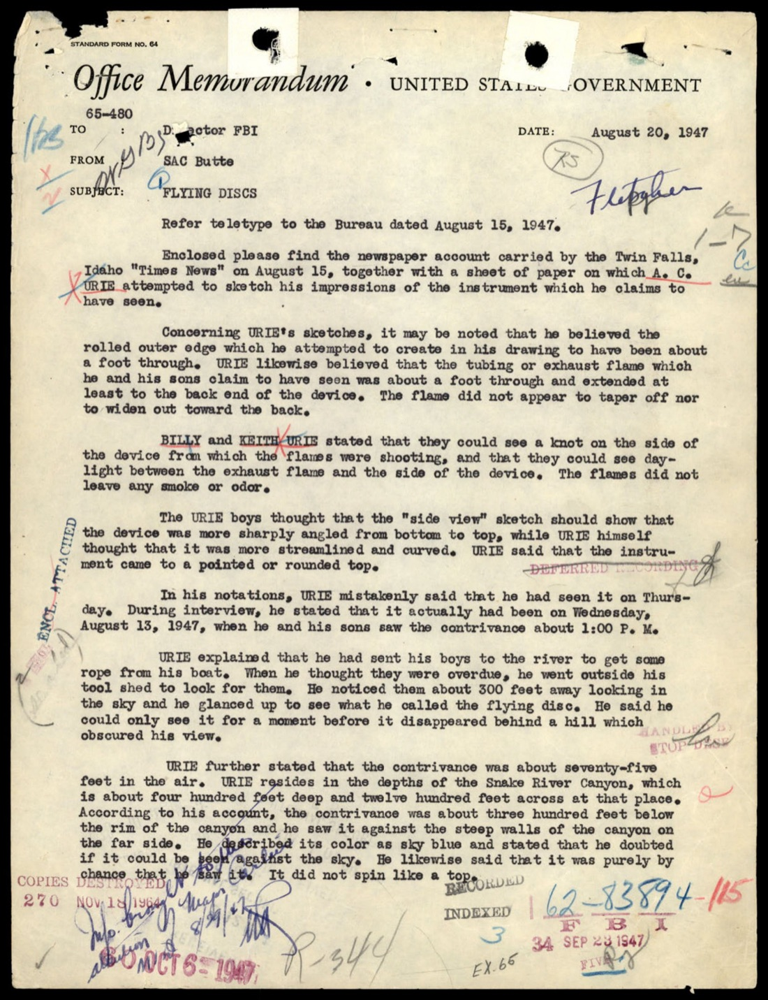

1947-08-20 SAC Butte 給 Director FBI 的 Office Memorandum。標題 `Flying Discs`。手寫 `65-480` 是 Butte 的案件編號。內容：

> 參見 1947-08-15 致總部的 teletype。
>
> 隨附 1947-08-15 Twin Falls, Idaho 《Times News》報導，以及 A. C. Urie 嘗試畫出他所宣稱看到的器具的草圖一張。
>
> 關於 Urie 的草圖，他相信他畫的「外緣弧形捲起」這部分大約有 1 英尺厚。Urie 同樣相信，他與兒子們看到的「管狀部分或排氣火焰」也是大約 1 英尺厚，且至少延伸到器具的尾端。火焰沒有變細也沒有擴張。
>
> Billy 與 Keith Urie 說，在他們開槍射擊的那一邊，他們可以看到器具側邊有個「結節」，並且能看到排氣火焰與器具側面之間的日光。火焰沒有留下煙也沒有氣味。
>
> Urie 的兒子們認為「側視圖」草圖應該畫成「從下到上更尖銳的角度」，但 Urie 本人認為它更流線、更彎曲。Urie 說那個器具的頂端是尖頭或圓頭。
>
> Urie 在註記裡誤寫成是星期四看到。訪談中他說實際上是星期三，1947-08-15 1:00 PM。
>
> Urie 解釋他叫兒子們去河邊把船上的繩子拿回來。他覺得兒子們耽誤太久，就出工具棚找他們。他注意到大約 300 英尺外兩個孩子在看天空，他抬頭看到他口中的「飛碟」。他說他只看到一下，物體就消失在一個山丘後面、視線被擋住。
>
> Urie 還說那個器具在空中約 75 英尺高。Urie 住在 Snake River Canyon 深處，峽谷深約 400 英尺、跨距約 1200 英尺。根據他的位置，那個器具大約在峽谷邊緣以下 300 英尺，他看著它沿著對岸陡峭的岩壁飛過。Urie 說它的顏色是天空藍，他懷疑是不是為了與天空融合而設計成這個顏色。他也說它幾乎完全不旋轉。它沒有自轉，不像 ........（被遮蔽）。

> URIE attempted to sketch his impressions of the instrument which he claims to have seen.

注意：Urie 的草圖、Urie 的兒子 Billy（10 歲）與 Keith（8 歲）用 .22 步槍朝物體開槍、看到尾部排氣火焰、距離 75 英尺，這些細節跟 Maury Island 的太空艙級描述完全不同。是一個低空、近距離的目擊。

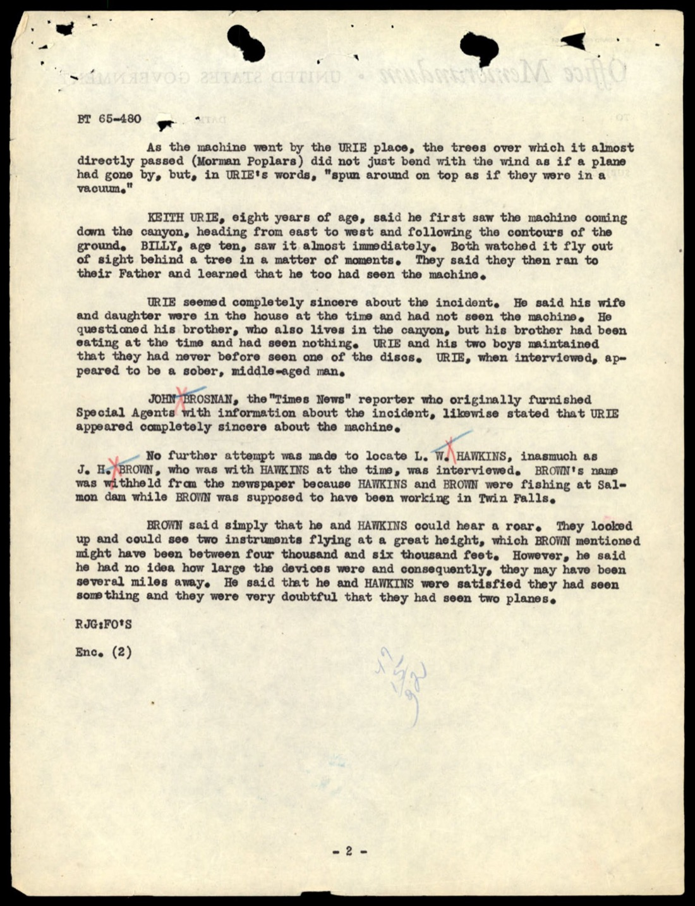

> 機器經過 Urie 家時，那些它幾乎直接通過上方的樹（mormom 楊樹）並沒有像被風吹過一樣彎下來。Urie 的原話是「樹頂像在真空裡一樣散開」。
>
> Keith Urie（8 歲）說他第一個看到機器從東向西沿著地面起伏的輪廓飛下峽谷。Billy（10 歲）幾乎同時看到。兩個人都看著它在一瞬間飛過樹後消失。他們說當時他們跑去找父親，這才知道父親也看到了那個機器。
>
> Urie 看起來對這個事件完全誠實。他說他妻子與女兒當時在屋子裡，沒有看到。他質問他兄弟也住在這片土地上，但兄弟說當時在吃飯什麼都沒看到。Urie 在訪談時看起來像是一位清醒、認真的人。
>
> John Brosnan（《Times News》原報導記者）也說 Urie 對事件看起來完全誠實。
>
> 沒有進一步嘗試聯絡 L. W. Hawkins，因為 BROWN 提到 Hawkins 同時在現場、有同樣的訪談。BROWN 的名字並未出現在《Times News》報紙的報導裡，因為當天他與 Hawkins 在 Salmon 大壩釣魚，BROWN 當時應該在 Twin Falls 上班。

> "Spun around on top as if they were in a vacuum."

「樹頂像在真空裡一樣散開」這個描述極具細節，後來成為 UFO 推進力與電磁場效應假說的常被引用例證。

《Twin Falls Times-News》1947-08-15 報紙剪報。頭條：

> Heads Up, Folks! The Discs Are Flying Ag[ain]
>
> Flying Saucer Reported Flashing Down Canyon At 1,000 Miles Per Hour; Two Others Are Seen
>
> By JOHN BROSNAN

中央配圖是藝術家依 Urie 描述繪製的三視圖：
- 左：SIDE VIEW，外觀像被壓扁的草帽或派盤，10 英尺高
- 中：BOTTOM VIEW，圓形，20 英尺寬，標註尺寸
- 右：END VIEW，端視圖

圖下說明：

> This is an artist's conception of the flying disc that A. C. Urie saw sweeping through Snake river canyon six miles west of Blue Lakes ranch. It seemed to be powered by jets emitting a fiery glow on both sides, and could well be the inspiration for something new in women's hats, such as a "Flying saucer" creation. (Drawing by Vic Goertzen, staff engraving)

> 這是藝術家依 A. C. Urie 在 Blue Lakes Ranch 以西六英里 Snake River Canyon 看到的飛碟所繪。它看似由噴射推進，兩側發出火焰，可能會啟發女性帽子的新設計，例如「飛碟」造型。（繪圖：Vic Goertzen，本報雕版師）

注意報紙挖苦它「啟發女性帽子設計」，這是 1947 年八月主流媒體對 UFO 的態度。

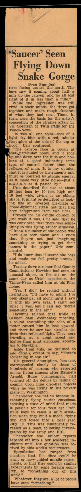

《Times-News》接續的長篇專欄『Saucer' Seen Flying Down Snake Gorge』。重點摘譯：

> 全部都是同一種顏色，淡天空藍，頂部或前端側邊有紅色管狀的火焰。
>
> 峽谷地面在那個位置崎嶇不平，它在山丘與凹陷處之間上下俯仰，速度顯示某種比人類反射還快的控制機制。我的看法是它由儀器導航、由原子能驅動，因為它幾乎沒有聲音，只有一聲 s-w-i-s-h 通過。
>
> 大小約 20 英尺長、10 英尺高、10 英尺寬，呈橢圓形。可以描述為一個倒置的派盤，或是從兩邊壓扁的寬邊草帽。
>
> 我認識的這群也看過的人裡面，我知道他們不是為了上報才捏造故事。
>
> Urie 補充：「我知道這個讓孩子們嚇到，也讓我覺得很不安。」
>
> 同一天 Twin Falls 縣議員 Hawkins 在 Salmon 大壩看到兩個圓形物體：「我承認我本來對所有的飛碟報導都抱持懷疑態度，直到自己親眼看到。我說不清那是什麼，但天上確實有東西。」
>
> Hawkins 描述：1947 年 8 月 13 日週三上午，傳來像汽車引擎回音的聲音，他抬頭看到兩個圓形物體在很高的高度反射太陽光，移動速度極快，比一般飛機高，朝向 Hawkins 方向。他能說的是，當時看起來像兩架平面或飛機，後來他相信他看到了兩個飛碟。

> "Speculation has ranged from mention that the discs could be army or navy guided missile experiments, or that they could be similar experiments by some foreign country, to 'something out of this world.'"

從陸軍／海軍導引導彈試驗、外國（蘇聯）試驗、到「來自地球之外」，這是 1947 年八月公眾論述的全部三個方向。

## Act 7：1947-09-27 後傳 — Warden Henry 早於 Arnold 的 5 月目擊

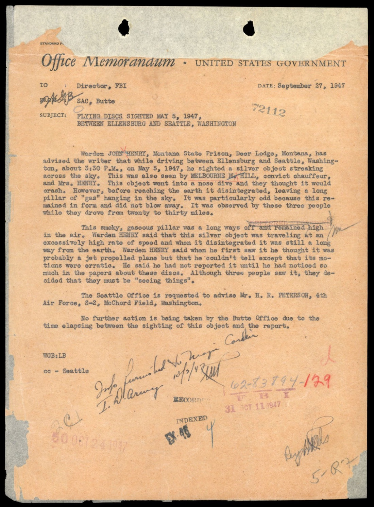

1947-09-27 SAC Butte 給 Director FBI 的 Office Memorandum。標題：FLYING DISCS SIGHTED MAY 5, 1947, BETWEEN ELLENSBURG AND SEATTLE, WASHINGTON。

完整繁中翻譯：

> Montana State Prison（Deer Lodge, Montana）的監獄長 John Henry 通報：1947 年 5 月 5 日下午約 3:30 PM，他在 Ellensburg 與 Seattle, Washington 之間開車時，看到一個銀色物體迅速劃過天空。同行的監獄司機（受刑人）Melbourne McTill 與 Henry 太太也看到。物體進入俯衝，他們以為要墜地。但物體在落地前自行解體，留下一根長長的「氣體」狀柱子懸掛在天空。特別奇怪的是這根柱子保持原型不散開。三人開了 20 到 30 英里都還看到那根柱子。
>
> 這根煙霧氣體狀的柱子距離很遠且高高在天空。Warden Henry 說那個銀色物體當時速度極快，解體時離地仍然很遠。Henry 一開始以為那是噴射機，但動作非常不規則。他說他沒有立刻報告，是因為在報紙上看到那麼多飛碟的事情之後才決定報告。雖然三個人都看到了，但他們最後決定一定是「眼花」了。
>
> 請 Seattle 辦公室將此事通知 4AF B-2 McChord Field 的 H. R. Peterson 先生。
>
> 由於目擊與通報之間時間已過久，Butte 辦公室不採取進一步行動。

> Warden HENRY said he had not reported it until he had noticed so much in the papers about these discs. Although three people saw it, they decided that they must be "seeing things."

這份目擊發生在 1947-05-05，比 Kenneth Arnold 的 1947-06-24 早了 50 天。但因為當時還沒有任何 UFO 公眾論述，Warden Henry 跟另外兩個目擊者乾脆決定是「眼花」，直到全國 UFO 熱潮爆發才回頭通報。

FBI 的處理：時間太久，**不採取進一步行動**。

## Act 8：1947-10-01，FBI 退出

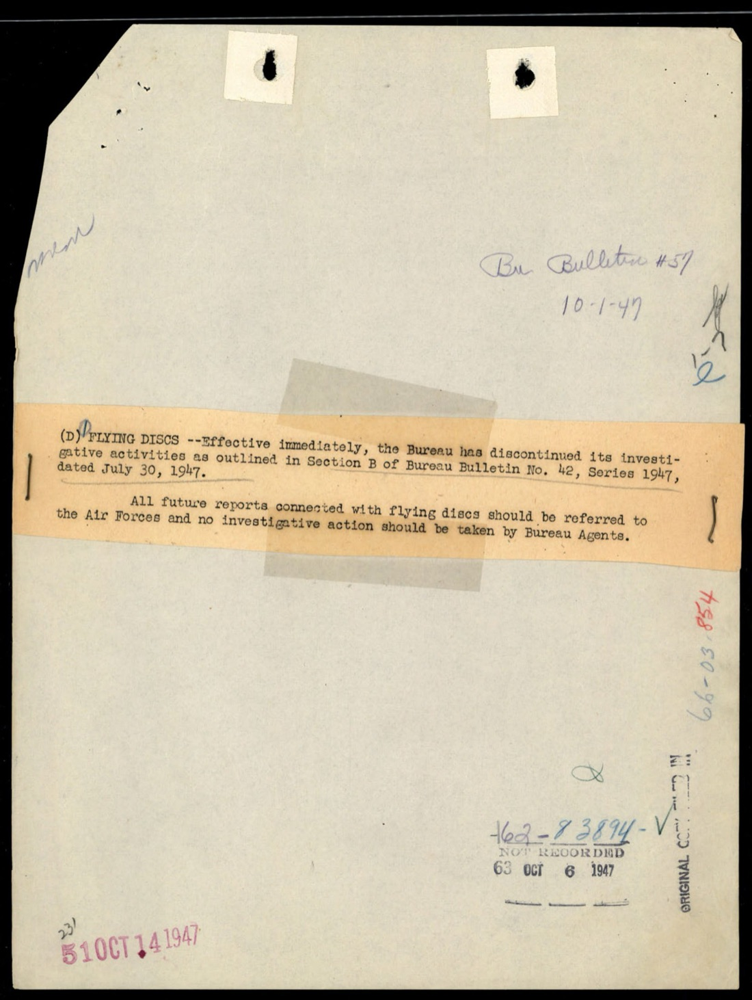

非常簡短的一份文件，本身只是 Bureau Bulletin 的剪貼條。手寫鉛筆右上角 `Bu Bulletin #51, 10-1-47`。剪貼在中央位置的打字機字體說：

> (D) FLYING DISCS — Effective immediately, the Bureau has discontinued its investigative activities as outlined in Section B of Bureau Bulletin No. 42, Series 1947, dated July 30, 1947.
>
> All future reports connected with flying discs should be referred to the Air Forces and no investigative action should be taken by Bureau Agents.

> 飛碟，本局即日起中止 1947-07-30 Bureau Bulletin #42 Series 1947 Section B 所定的所有調查活動。所有未來與飛碟相關的報告應轉介給空軍，本局探員不應採取任何調查行動。

戳印：OCT 6 1947, 162-83894-V, NOT RECORDED, OCT 14 1947, ORIGINAL COPIES DESTROYED。

從 7-30 Bureau Bulletin #22 開放 FBI 與 AAF 共同調查，到 10-1 Bureau Bulletin #51 全面撤出，前後 64 天。在這 64 天裡，FBI 處理了 Maury Island、B-25 墜機、Twin Falls Urie、Mojave 與 Muroc 軍方目擊、Bakersfield、Sacramento Switzer、Deer Lodge Warden Henry 等十多個獨立案例。最後 Hoover 的決定是：交給空軍。

這個決策的直接動機，從 Ladd 1947-08-11 那封給 Hoover 的備忘錄可看出來：(a) 軍方已內部判斷飛碟「不是 AAF 來源」（Twining 語），(b) AAF 與 FBI 重複調查、卻沒有充分共享情報（Davidson 與 Brown 已經死了 FBI 卻是事後從 Tacoma News Tribune 得知），(c) Maury Island 已被本局內部判定為偽造或誤識的浪費資源案例。

## 額外人物資料：Kenneth Arnold 本人

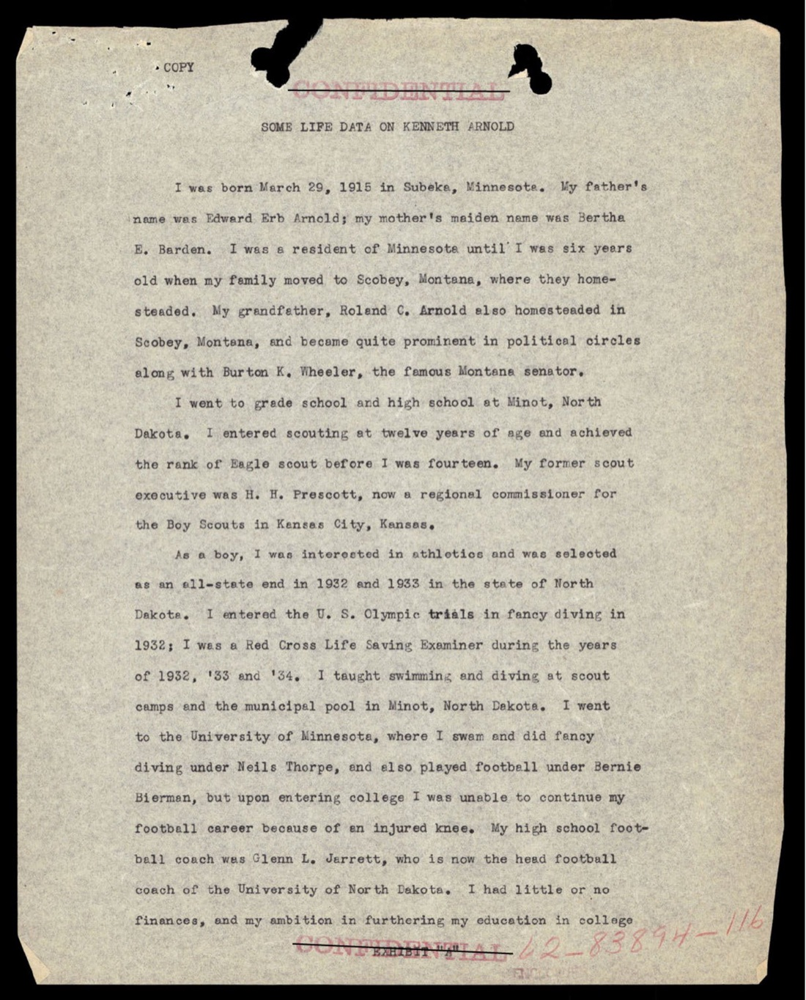

Section 3 末段附有一份 Kenneth Arnold 1947 年 8 月應 Palmer 要求寫的自傳簡介，CONFIDENTIAL 蓋章覆蓋。完整文字第一頁：

> 我於 1915 年 3 月 29 日在明尼蘇達州 Subeke 出生。我父親叫 Edward Erb Arnold，母親娘家姓 Bertha S. Barden。我六歲以前住在明尼蘇達，之後全家搬到蒙大拿州 Scobey 開墾。我祖父 Roland C. Arnold 也在 Scobey 開墾，後來在當地政治圈相當有名，與蒙大拿著名參議員 Burton K. Wheeler 一起。
>
> 我在北達科他州 Minot 讀小學與高中。我十二歲加入童子軍，十四歲拿到 Eagle Scout。我以前的童子軍指揮 H. H. Prescott 後來是堪薩斯市童子軍的區域指揮官。
>
> 高中時我熱愛運動，1932 與 1933 連續兩年被選為北達科他全州足球隊。1932 年參加美國奧運潛水隊選拔。1932、'33、'34 三年是 Red Cross Life Saving Examiner。我在童子軍夏令營與 Minot 市政游泳池教游泳潛水。後來進明尼蘇達大學跟 Neils Thorpe 學潛水，也跟 Bernie Bierman 打橄欖球，但因膝傷退出。我的高中橄欖球教練 Glenn L. Jarrett 現在是北達科他大學總教練。我經濟條件不好，原本希望繼續打大學橄欖球的計畫……

往後幾頁繼續說他怎麼開始飛行、在 882 個牧場降落過、超過 1000 小時飛行最大事故只是爆胎一次。這份自傳是 Arnold 個人提供給 Palmer 的稿件，後來被 FBI 收進案卷裡。

對 UFO 史而言，這是現存最早由 Arnold 親筆寫的個人傳記材料。

## 1947 早期 UFO 通報史的真相

Section 3 把 1947 年 5 月到 10 月的早期 UFO 案件，連同 FBI 的內部反應流程，組合成一個完整的故事弧線：

1. **早於 Arnold（1947-05-05）**：Warden Henry 在 Washington 看到銀色物體分解成不散開的氣體柱。三個證人都選擇「就當沒看到」。
2. **Arnold 觸發（1947-06-24）**：Mount Rainier 上空九個 pie-plate 編隊，第二天上報，啟動全國熱潮。
3. **Maury Island（1947-06-21 宣稱、7-8 月調查）**：六個甜甜圈、舷窗、墜物殺狗、芝加哥大學分析失敗、Palmer 引爆。
4. **Muroc 軍方（1947-07-08）**：Shoop 少校 + Scott 秘書 + McHenry 中尉 + McMillan 軍士四人同一天目擊。
5. **Mojave 編隊（1947-07-08）**：Scott 同一天又看到兩個編隊加一個盤旋體。
6. **Davidson + Brown 訪談（1947-07-27 Portland、7-31 Tacoma）**：四位資深飛行員（Arnold、Smith、Stevens、Johnson）+ Dahl + Crisman。
7. **B-25 墜機（1947-08-01）**：Davidson 與 Brown 飛回 Hamilton Field 途中 02:36 PST 墜毀 Kelso 南方，兩位 A-2 情報官員死亡。
8. **Twin Falls Urie + Hawkins/Brown（1947-08-13）**：Snake River Canyon 兩件獨立目擊。
9. **Sacramento Switzer（1947-08-14）**：開車途中看到金屬狀物體（p-080）。
10. **Twining「不是 AAF 來源」內部判定（1947-08-11 經 Ladd 報告 Hoover）**。
11. **Hoover 收 Twining 結論 + Maury Island 偽造嫌疑 → 10-1 Bureau Bulletin #51 全面退出**。

Maury Island 後來被廣泛認為是 Crisman 與 Dahl 的偽造（將工業廢渣偽裝成飛碟碎片賣給 Palmer 換錢）。但 1947 年八月 FBI 並沒有對外公布這個判斷，而是用「沒有飛機被破壞的證據」+「不再進一步調查」的標準措辭結案，並把整個飛碟調查業務移轉給空軍。空軍於 1947-09-23 收到 Twining 少將的內部備忘錄，建議成立常態 UFO 研究計畫，1948 年 1 月正式啟動 Project Sign（後改名 Project Grudge，再改 Project Blue Book）。

## 跨檔關聯

- **本卷與 [#001 Section_10](../001-65_hs1-834228961_62-hq-83894_section_10/report.md)**：#001 是 1947-1950s 飛碟剪報與 Hoover 個人簽轉的後期卷宗，重點在 von Braun 文章與民間 UFO 大會議程。本 Section 3 是更早的 1947 原始調查資料。
- **本卷與 [#002 Section_2](../002-65_hs1-834228961_62-hq-83894_section_2/report.md)**：#002 是 1947 飛碟潮的緊接起點，包含 Arnold 訪談紀錄與 Rhodes 照片初期分析。本 Section 3 進一步發展到 Maury Island 與 B-25 墜機，是 #002 的「下半場」。
- **與 NASA 卷的對照**：NASA 1965-1974 太空任務的 UAP 觀察（如 [Apollo 11 cabin flashes](../nasa-apollo-11/report.md)、[Apollo 17 Grimaldi flash](../nasa-apollo-17/report.md)）發生在 FBI 退出後的 18-27 年。1947 年的問題（究竟是不是某國秘密武器、是不是地外現象）到 NASA 時代，已經把工程資料更系統化地收集起來。
