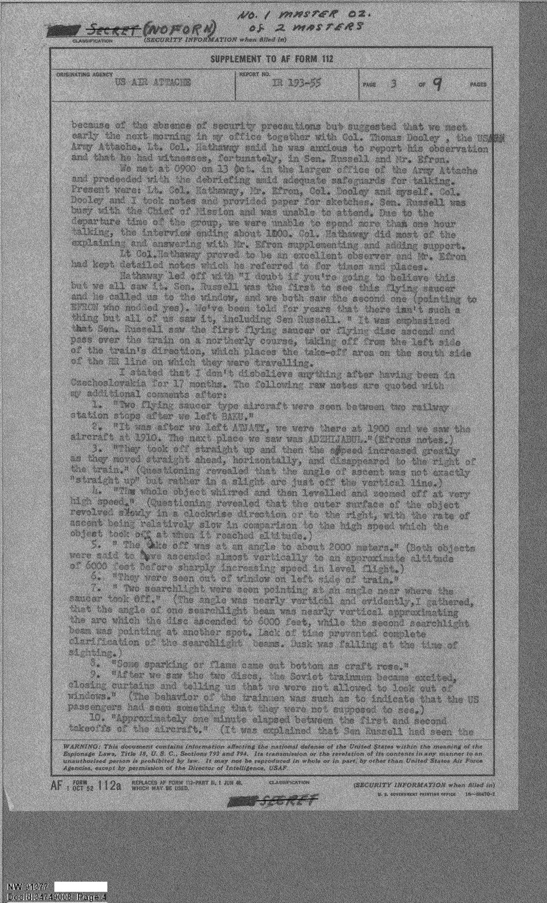
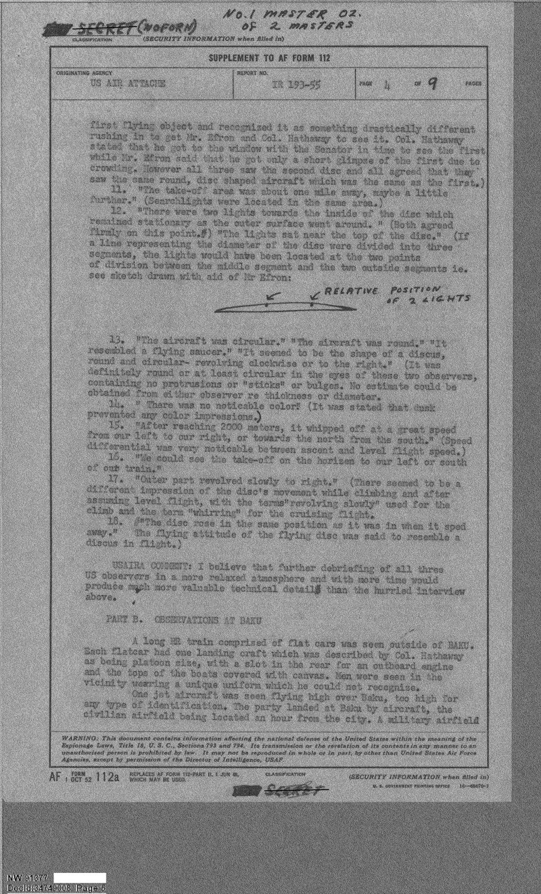
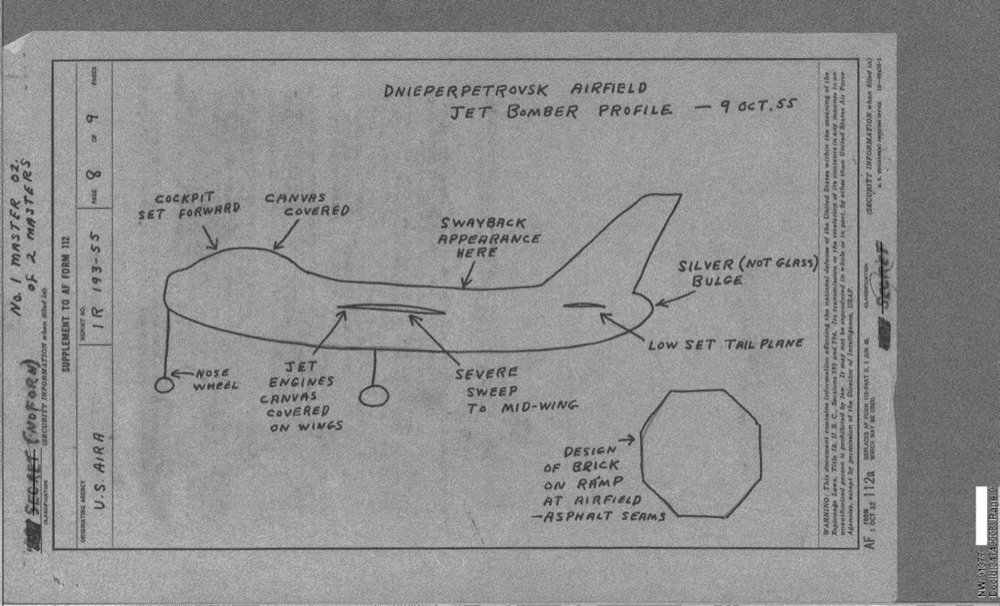
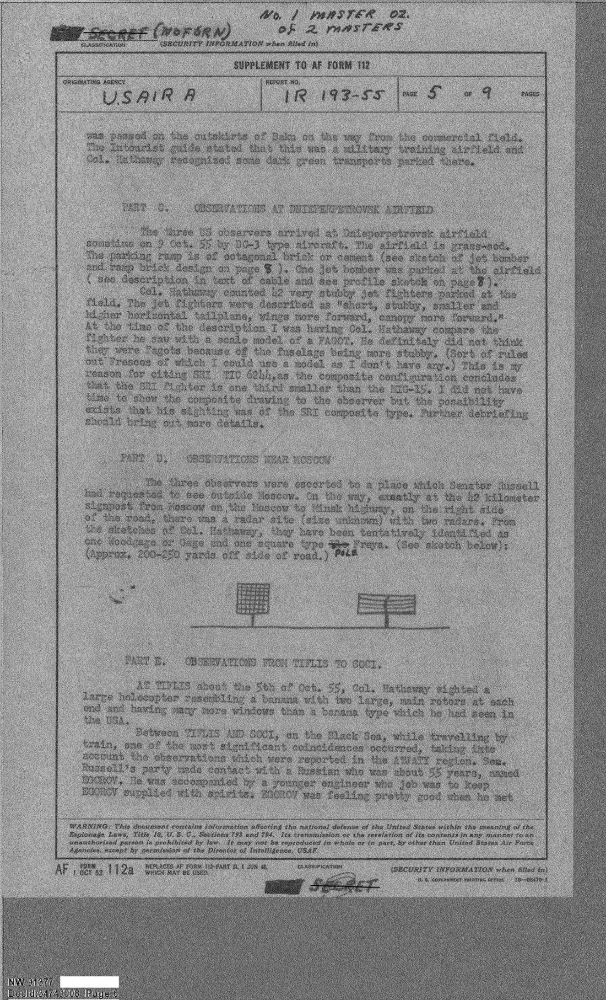
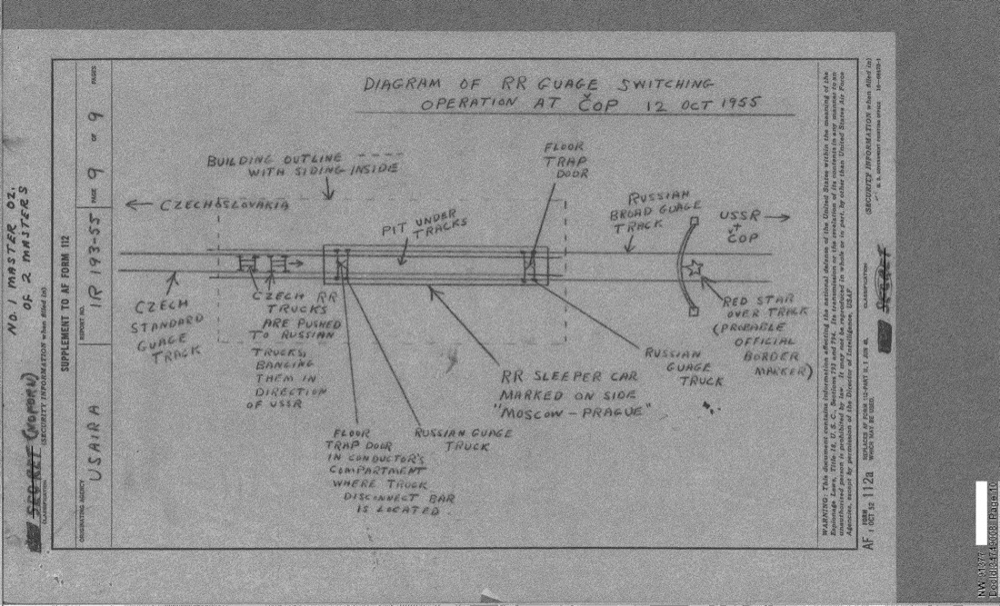

# #024 USAIRA IR 193-55：Russell 參議員 1955-10-04 蘇聯外高加索目擊飛碟

| 欄位 | 內容 |
|---|---|
| 檔案編號 | 341_110677_Numerical_File,_5-2500 |
| 來源機關 | US Air Attache, Prague (USAIRA Prague) — Lt Col Thomas S. Ryan |
| 報告編號 | IR 193-55 |
| 收集日期 | 1955-10-13（Prague 訪談） |
| 報告日期 | 1955-10-14 |
| 事件日期 | 1955-10-04 1910 hrs（蘇聯外高加索鐵路上） |
| 頁數 | 9 頁 |
| 地點 | Atyaga → Adzhi-Kabul 鐵路段（亞塞拜然，巴庫西南約 80 公里） |
| 機密層級 | SECRET (NOFORN) ／ 引用電報 TOP SECRET ／ DECLASSIFIED (NND 857013) |
| 公開日 | 2026-05-08 |

## 為什麼這份檔案重要

1955-10-04 1910 時，三名美國參議院武裝部隊委員會（Senate Armed Services Committee）成員在蘇聯外高加索鐵路上，從車廂窗戶看到兩個飛碟先後從南邊起飛、垂直升空、爬升到約 6000 英尺後突然加速北飛。三名目擊者：

- **Senator Richard B. Russell Jr.**（民主黨喬治亞州，參議院武裝部隊委員會主席 1951-69，後任參議院臨時議長 1969-71）
- **Lt Col Edmund U. Hathaway**（陸軍上校，武裝部隊委員會軍事參謀）
- **Mr. Ruben Efron**（武裝部隊委員會顧問）

Russell 是 1953-69 年美國參議院內國防議題的核心人物。他親自看到了兩個飛碟，從西向東垂直升空，外圈逆時針旋轉，內部有兩盞固定燈，底部噴出火花，過程中蘇聯車廂服務員衝過來把窗簾拉下、禁止他們繼續看窗外。

事件回到布拉格後，由 USAIRA Lt Col Thomas S. Ryan 主持的詳細口頭詢問。Ryan 對 USAF 的最後評語：

> The significance of this report to the USAF project 'Unidentified Flying Objects' is remarkable and lends credence to many 'saucer' reports.

> 本報告對 USAF「不明飛行物」專案的重要性顯著，並為許多「飛碟」報告提供佐證。

這份檔案的歷史意義：

1. **是 USAF 已解密文件中最高政治位階目擊者的飛碟報告**。Russell 1955 年是參議院武裝部隊委員會主席，後來 1969 年成為參議院臨時議長（President pro tempore，總統繼承順位第三）。
2. **事件發生在蘇聯境內**，違反東歐冷戰旅行規範。
3. **觀察延續 5+ 分鐘**，描述粒度極高：兩個物體、間隔一分鐘、垂直升空、外圈順時針旋轉（後修正：爬升時順時針，巡航時 whirring）、內部兩盞燈固定、底部火花、地面有兩盞探照燈幾乎垂直指向起飛點。
4. **蘇聯地面人員的反應**：火車人員看到後立刻拉窗簾、禁止繼續觀察，意味地面知道這是不能讓外國人看到的東西。

事件早在 1980 年代被 UFO 研究者（Donald Keyhoe、Robert Hastings 等）追問過部分文件，但完整的 IR 193-55 報告長期被列為機密。2026-05-08 公開的版本是已解密的完整 9 頁版本，含 Hathaway 親繪兩張手繪草圖（Dnepropetrovsk 噴射轟炸機、COP 鐵路換軌操作）。

## 1. 行程與時間軸

Russell-Hathaway-Efron 三人 1955 年 10 月初的旅程，按報告整理：

| 日期 | 地點 | 觀察重點 |
|---|---|---|
| 10-03 之前 | Kiev → 飛 Baku | 進入外高加索 |
| 10-04 1910 | Atyaga → Adzhi-Kabul 鐵路上（亞塞拜然）| **兩飛碟垂直升空 → 6000 ft → 北飛** |
| ~10-05 | Tiflis（Tbilisi）| 雙旋翼香蕉型大型直升機目擊（Yak-24 級）|
| 10-05 → 10-08 | 黑海沿岸 Sochi 段 | 火車上遇到俄國前極地飛行員 Egorov |
| 10-09 0900-1100 | Dnepropetrovsk 機場 | 42 架短粗噴射戰機（非 MiG-15 Fagot）|
| 10-09 → 10-11 | Moscow → Minsk 公路 42 km 標記處 | 路邊雷達站（Woodgage + Freja 型）|
| 10-12 早晨 | COP（Chop，烏克蘭/捷克斯洛伐克邊境）| 鐵路換軌操作（俄寬軌 ↔ 捷標準軌）|
| 10-12 ~2145 | Prague Wilson Station 抵達 | 由 Acting Chief of Mission Vedler + USAIRA 接 |
| 10-13 0900-1200 | Prague US Army Attache 辦公室 | Hathaway + Efron 正式 debriefing |
| 10-13 | Prague → Rome（Swissair）| 行程結束 |

文件的時間粒度顯示，這三個人不是觀光客：他們在 9 天內覆蓋了 Kiev、Baku、Tiflis、Sochi、Dnepropetrovsk、莫斯科近郊、COP 邊境，沿途記錄軍事設施、鐵路設施、空軍裝備細節，回到布拉格後立即向美國軍事武官交報。Hathaway 的軍事背景使他能夠對蘇聯戰機、雷達、坦克做粒度識別。

## 2. 詢問的開場

10-12 晚抵達 Prague 後在 US Residency 晚餐席間，Hathaway 對 USAIRA Ryan 開口：

> Lt Col. Hathaway expressed a desire to report something of the utmost importance to the USAIRA, "something you may not believe, but something that we've been told by your people (USAF) doesn't exist."

> Hathaway 上校表達想向 USAIRA 報告一件極為重要的事，「你可能不會相信，但這是你們的人（USAF）多年來告訴我們不存在的東西」。

「告訴我們不存在的東西」這句直接點到 USAF 1953-55 期間對外的官方立場：Project Grudge 後期 + Project Blue Book 早期，USAF 對外口徑是「飛碟沒有任何證據顯示存在」。Hathaway 親眼看到後，第一反應是去找美國軍事武官報告，並開口就引用 USAF 的官方否認話術。

隔天 10-13 0900，正式 debriefing 開始。Ryan、Army Attache Col. Thomas Dooley、Hathaway、Efron 四人到場（Russell 因要見 Chief of Mission 沒到）。Hathaway 開場：

> Hathaway led off with "I doubt if you're going to believe this but we all saw it. Sen. Russell was the first to see this flying saucer and he called us to the window, and we both saw the second one (pointing to EFRON who nodded yes). We've been told for years that there isn't such a thing but all of us saw it, including Sen Russell."

> Hathaway 一開始就說「我懷疑你會不會相信這件事，但我們都看到了。Russell 參議員是第一個看到這個飛碟的人，他叫我們去窗邊，然後我們兩個都看到了第二個（指著 EFRON，EFRON 點頭表示同意）。多年來我們被告知這種東西不存在，但我們所有人（包括 Russell 參議員）都看到了」。

## 3. 詳細描述：18 條問答記錄

Efron 在事發當下做了筆記，所以時間、地名都很精確。debriefing 報告以 Efron 筆記為基礎，加上 Hathaway 補充，整理出 18 條敘述：

> 1. "Two flying saucer type aircraft were seen between two railway station stops after we left BAKU."
>
> 2. "It was after we left ATYAGY, we were there at 1900 and we saw the saucer at 1910. The next place we saw was ADJEMABAD." (Efron notes)
>
> 3. "They took off straight up and then the speed increased greatly as they moved straight ahead, horizontally, and disappeared to the right of the train." (Questioning revealed that the angle of ascent was not exactly "straight up" but rather in a slight arc just off of the vertical line.)
>
> 4. "The whole object whirred and then levelled and zoomed off at very high speeds." (Questioning revealed that the outer surface of the object revolved slowly in a clockwise direction or to the right, with the rate of ascent being relatively slow in comparison to the high speed which the object took off at when it reached altitude.)
>
> 5. "The disc(s) was at an angle to about 2000 meters." (Both objects were said to have ascended almost vertically to an approximate altitude of 6000 feet before sharply increasing speed in level flight.)
>
> 6. "They were seen out of window on left side of train."
>
> 7. "Two searchlights were seen pointing at an angle near where the saucer took off."
>
> 8. "Some sparking or flame came out bottom as craft rose."
>
> 9. "After we saw the two discs, the Soviet trainmen became excited, closing curtains and telling us that we were not allowed to look out of windows." (The behavior of the trainmen was such as to indicate that the US passengers had seen something that they were not supposed to see.)
>
> 10. "Approximately one minute elapsed between the first and second takeoffs of the aircraft."

> 1. 「兩架飛碟型飛行器在我們離開 BAKU 後的兩個火車停靠站之間被看到。」
>
> 2. 「是我們離開 ATYAGY 之後，我們 1900 時在那裡，1910 時看到飛碟。我們下一個停靠的地方是 ADJEMABAD。」（Efron 筆記）
>
> 3. 「它們直接垂直升空，然後速度大增、水平直線移動、從火車右方消失。」（追問顯示，上升角不完全是「垂直」，而是稍微偏離垂直線的弧線。）
>
> 4. 「整個物體嗡嗡作響，然後拉平、以非常高的速度衝離。」（追問顯示，物體的外表面以順時針方向（往右）緩慢旋轉，上升速度相對緩慢，與升到高空後突然提速形成對比。）
>
> 5. 「這些飛碟以某個角度升到約 2000 公尺。」（兩個物體都被描述為幾乎垂直升空到大約 6000 英尺的高度，然後才在水平飛行時急遽加速。）
>
> 6. 「從火車左側窗戶看到。」
>
> 7. 「兩盞探照燈以某個角度照向飛碟起飛的位置附近。」
>
> 8. 「飛行器升起時，底部噴出一些火花或火焰。」
>
> 9. 「看到兩個飛碟之後，蘇聯火車人員變得激動，把窗簾拉上，告訴我們不准看窗外。」（火車人員的行為表現出美國乘客看到了不該看到的東西。）
>
> 10. 「兩架飛行器的起飛時間相隔約一分鐘。」

繼續：

> 11. "The take-off area was about one mile away, maybe a little further." (Searchlights were located in the same area.)
>
> 12. "There were two lights towards the inside of the disc which remained stationary as the outer surface went around." (Both agreed firmly on this point.) "The lights sat near the top of the disc."
>
> 13. "The aircraft was circular." "The aircraft was round." "It resembled a flying saucer." "It seemed to be the shape of a discus, round and circular- revolving clockwise on the right." (It was definitely round or at least circular in the eyes of those two observers, containing no protrusions or "sticks" or bulges. No estimate could be obtained from either observer for thickness or diameter.)
>
> 14. "There was no noticeable color!" (It was stated that dusk prevented any color impressions.)
>
> 15. "After reaching 2000 meters, it whipped off at a great speed from our left to our right, or towards the north from the south." (Speed differential was very noticeable between ascent and level flight speed.)
>
> 16. "We could see the take-off on the horizon to our left or south of our train."
>
> 17. "Outer part revolved slowly to right." (There seemed to be a different impression of the disc's movement while climbing and after assuming level flight, with the terms "revolving slowly" used for the climb and the term "whirring" for the cruising flight.)
>
> 18. "The disc rose in the same position as it was in when it sped away." The flying aircraft of the flying disc was said to resemble a discus in flight.

> 11. 「起飛地點大約一英里遠，也許更遠一點。」（探照燈位於同一區域。）
>
> 12. 「飛碟內側有兩盞燈，當外表面旋轉時，這兩盞燈保持靜止。」（兩位都堅定同意這一點。）「這些燈位於飛碟頂端附近。」
>
> 13. 「飛行器是圓形的。」「飛行器是圓的。」「它像一個飛碟。」「它看起來像鐵餅的形狀，圓的、環形的，向右順時針旋轉。」（在兩位觀察者眼中，它確實是圓形或至少是環形，沒有任何突出物或「桿子」或凸起。兩位觀察者都無法提供厚度或直徑的估計。）
>
> 14. 「沒有明顯顏色！」（陳述當時黃昏的光線阻礙了顏色判斷。）
>
> 15. 「升到 2000 公尺後，它以極快速度從我們的左邊衝到右邊，或說從南邊衝到北邊。」（上升速度與水平飛行速度的差異非常明顯。）
>
> 16. 「我們可以從地平線看到起飛地點，位於我們火車的左邊或南邊。」
>
> 17. 「外側部分緩慢向右旋轉。」（飛碟在爬升中與進入水平飛行後的運動印象似乎不同：爬升時用「緩慢旋轉」，巡航時用「whirring（嗡嗡聲）」。）
>
> 18. 「飛碟起飛時的姿態和它衝離時的姿態相同。」這個飛行器被形容像是鐵餅在飛行。

第 12 條的「兩盞燈靜止 / 外殼旋轉」是這次目擊最具技術鑑別力的細節。如果這是固體飛行器，「外殼旋轉而內部燈光靜止」要嘛需要燈光在一個非旋轉的內框架上、要嘛需要燈光本身對抗外殼旋轉做相對運動。1955 年沒有任何已知公開的飛行器設計具有這種運動學特徵。

## 4. Russell 的版本（從第 4 頁尾段補完）

Russell 是第一個看到的。Hathaway 強調：

> It was emphasized that Sen. Russell saw the first flying saucer or flying disc ascend and pass over the train on a northerly course, taking off from the left side of the train's direction, which places the take-off area on the south side of the RR line on which they were travelling.

> 強調 Russell 參議員看到第一架飛碟升空、以北向航向越過火車，從火車前進方向的左側起飛，這意味著起飛地點位於他們乘坐的鐵路線的南側。

也就是說 Russell 看到的是「第一架，從南邊升空、越過火車往北飛」，這比第二架更接近。Hathaway 和 Efron 由 Russell 叫到窗邊，看到了第二架（一分鐘後同地起飛）。

> Col. Hathaway stated that he got to the window with the Senator in time to see the first while Mr. Efron said that he got only a short glimpse of the first due to crowding. However all three saw the second disc and all agreed that they saw the same round, disc shaped aircraft which was the same as the first.

> Hathaway 上校表示他及時和參議員一起到窗邊，看到了第一架，而 Efron 先生表示他因為擁擠只瞥見了第一架。但三人都看到了第二架，並一致同意他們看到的是同樣的圓形、飛碟狀飛行器，和第一架一模一樣。

## 5. USAIRA 的最終評語

debriefing 之後 Ryan 在報告中明確說明：

> USAIRA COMMENT: I believe that further debriefing of all three US observers in a more relaxed atmosphere and with more time would produce much more valuable technical details than the hurried interview above.

> USAIRA 意見：我相信，在更輕鬆的環境中、有更多時間的進一步詢問所有三位美國觀察者，將能比上述匆忙的訪談產出更有價值的技術細節。

而報告封面的 SUMMARY 寫得更直接（Ryan 親署）：

> The significance of this report to the USAF project "Unidentified Flying Objects" is remarkable and lends credence to many "saucer" reports.

> 本報告對 USAF「不明飛行物」專案的重要性顯著，並為許多「飛碟」報告提供佐證。

「lends credence to many saucer reports」這句話的含義很重。1955 年的 USAF 對外口徑是「沒有任何飛碟報告有可信證據」。Air Attache 在內部交報上直接寫出「為許多飛碟報告提供佐證」，是 USAF 內部對外口徑與內部認知之間斷層的證據之一。

## 6. 同行程的其他軍事觀察

報告 Part B 到 Part F 是 Russell 一行人在這次蘇聯旅程中所做的其他軍事觀察，這些觀察的軍事價值是這次行程的「明面任務」（Russell 是武裝部隊委員會主席，這趟旅程從來就不是觀光）：

**Part B — Baku**：火車站外長串平車載運排級登陸艇（用帆布蓋住），士兵穿著 Hathaway 不認得的特殊制服。

**Part C — Dnepropetrovsk 機場**：草坪跑道。停機坪用八角形磚塊配瀝青縫舖設。停了 42 架「短粗噴射戰機」，Hathaway 詳細比對 MiG-15（Fagot）等比模型後否決，認為這比 Fagot 短粗、副翼位置不同、座艙更前置，他傾向認為這是 SRX composite 型（USAF 情報界當時對某型蘇聯試驗戰機的代號）。

機場還停了一架噴射轟炸機。Hathaway 親手繪了側視圖（page 8 of 9）：
- 機鼻輪
- 座艙前移
- 機翼罩帆布蓋住的噴射引擎
- 從機翼到中段嚴重後掠
- 機背 swayback（下凹）外觀
- 低位水平尾翼
- 機尾鼓出一個「銀色（非玻璃）凸起」

**Part D — 莫斯科外的雷達站**：Moscow → Minsk 公路 42 公里標記處右側 200-250 碼，有兩具雷達。從 Hathaway 的草圖暫時識別為一具 Woodgage（或 Gage）+ 一具方型 Freja 型。

**Part E — Tiflis 直升機 + Egorov 相遇**：
- Tiflis 看到「香蕉型」雙旋翼直升機（雙端各一主旋翼，比美國同類機型多很多窗戶），對應蘇聯 Yak-24 級。
- 在 Tiflis → Sochi 黑海段火車上，遇到 55 歲俄國人 Egorov，自稱是 1935 或 1936 年第一批跨北極飛行的試驗飛行員之一（這指 1936-37 年 Chkalov / Levanevsky / Gromov 那批 ANT-25 跨北極飛行），現已退休。Egorov 自稱二戰擊落 17 架德機。Russell 邀他訪美。Ryan 評語：

> It is difficult for me to believe that this experienced pilot in polar navigation would be retired and doing nothing but travelling around the Trans Caucasus region with a young engineer.

> 我很難相信這位有極地導航經驗的飛行員會退休、無所事事地帶著一位年輕工程師在外高加索四處旅行。

也就是 USAIRA 對「Egorov 是 KGB 派來監視 Russell 一行的退休偽裝者」這條解釋保持開放。

**Part F — COP 邊境**：詳細記錄了 Russian broad gauge → Czech standard gauge 的鐵路換軌操作。Hathaway 畫了完整圖（page 9 of 9）：俄方寬軌轉換到捷方標準軌的建築物剖面、地坑、地板活門、紅星標誌（蘇聯邊境官方標記）。

## 7. 報告的傳遞鏈

報告的物理傳遞鏈：

| 日期 | 動作 | 來源 / 收件 |
|---|---|---|
| 1955-10-13 USAFE 14 | TOP SECRET cable C-103，USAIRA Prague → DINTA Washington | Ryan → USAF DoI |
| 1955-10-14 | IR 193-55 報告完成，9 頁 | Ryan |
| 分發：1 → USAF / 1 → USAFE / 1 → USAIRA Moscow | | |
| 後續 | 歸入 USAF Intelligence Numerical File 5-2500 | TS Cont No.2 |
| 1999-04-30 | DECLASSIFIED stamp (NND 857013, NARA) | |
| 2026-05-08 | DoW UAP portal 公開 | |

從事件發生（10-04）到 TOP SECRET 電報發出（10-13）只有 9 天；從電報到完整 IR 193-55 報告（10-14）僅 1 天。這個處理速度顯示華府的優先排序。

報告的 reference 段落引用了 USAIRA cable (TS) C-103 dtd 13 OCT 55，但 C-103 的內容在這份 IR 193-55 內已逐字引用，也就是 TOP SECRET 電報 + SECRET 後續報告的雙層機密設計。

## 8. 觀察

**(1) Russell 為何在蘇聯**：1955 年正值 Khrushchev-Bulganin 上台後的「日內瓦精神」短暫解凍期。Russell 是參議院武裝部隊委員會主席（1951-69），那年率團走的是觀察蘇聯軍事工業的「考察」行程。這次行程的官方報告主體是工廠、機場、鐵路、雷達站，飛碟是意外插曲。

**(2) 18 條問答的鑑別力**：第 12 條（外殼旋轉、內部燈靜止）和第 17 條（爬升時 revolving slowly、巡航時 whirring）構成這次目擊最強的工程鑑別點。1955 年蘇聯沒有公開或祕密的圓盤旋轉式飛行器計畫的紀錄。同時期美方 Avro Canada VZ-9 Avrocar 計畫剛起步，且和此處描述的「外殼旋轉、內部燈靜止」運動學完全不同。

**(3) Russell 後續為何沒對外談**：Russell 1955 年回美後，從未公開談過這次目擊。1956 年他在 Project Blue Book 預算審查時甚至沒提及此事。USAF Air Attache 報告中也明顯看出，整套通訊都在 SECRET / TOP SECRET 機密體系內運作。Russell 作為 Senate Armed Services 主席，主動參與了這個保密體系。

**(4) 與 Project Blue Book 的關係**：Project Blue Book 對 1955-10-04 事件的官方歸類目前尚未在這份檔案中明確說明。Blue Book 公開案件清單中，本案歸類為「Unidentified」的可能性高（1955 年 10 月 4 日附近 BB 確有未解案）。但本份 IR 193-55 在 USAF 內部的分發鏈中，Project Blue Book 並非直接收件方，而是經 USAF DoI（Cabell 將軍辦公室時期已過，當時 DoI 主任為 General Cabell 的繼任者）轉介。

**(5) 為什麼是「Project 'Unidentified Flying Objects'」而不是「Project Blue Book」**：報告 SUMMARY 用「USAF project 'Unidentified Flying Objects'」這個措辭。1955 年 USAF 對外公開的研究專案名稱已是 Project Blue Book（1952 起改名），但 Ryan 在內部交報用了通名而非專案名。這顯示 Air Attache 體系不直接對 Blue Book 報告，而是進 USAF DoI 通用情報系統。

**(6) Egorov 與 KGB 的灰色地帶**：Russell 與 Hathaway 都對 Egorov 的「退休 + 帶年輕工程師 + 出現在 Russell 必經的火車段」起疑。Ryan 在 USAIRA 評語中明確指出這條線。但報告沒有把這條線延伸到「Egorov 知不知道飛碟的事」這個問題上，這留下一個開放的歷史線索：Russell 在火車上目擊飛碟，火車服務員立刻拉窗簾；同一段旅程中遇到的退休極地飛行員，是不是知道飛碟是什麼？

## 9. 跨檔案連結

- **[#017 AMC flying disc 1947 / Project Sign 起源公文鏈](../017-18_100754_general_1946-7_vol_2/report.md)**：本檔案是 #017 確立的 Project Sign / Grudge / Blue Book 鏈條 8 年後的高位階產出。1947 Twining 信「foreign nation with nuclear propulsion」這個括號，1948 #023 USAFE → Cabell 報告由瑞典空軍情報處填了「地球以外」，1955 IR 193-55 Russell 親眼目擊蘇聯境內飛碟並把「foreign nation」這個括號再次帶回討論，但目擊到的東西的運動學（外殼旋轉、內部燈靜止）反而不像任何已知的「foreign nation」武器系統。
- **[#023 USAFE → Cabell 1948-11](../023-341_110448_records_relating_to_intelligence_1948-1955_netherlands/report.md)**：同一個 USAF DoI 通用情報線。本份 IR 193-55 報告處理流程：1) 駐外武官目擊 → 2) TOP SECRET 電報 → 3) SECRET 完整報告 → 4) USAF DoI 中央歸檔，和 #023 USAFE 處理瑞典湖底火山口的處理流程一致。
- **後續冷戰晚期 DOS 電報線（#093 → #097）**：1985-2004 的 DOS UAP 外交電報線，承接的就是 USAIRA / Air Attache 體系。本檔案是這條線在 1955 年的早期版本。

## 10. 來源

- 原始檔案：[U.S. Department of War — 341_110677_Numerical_File,_5-2500](https://www.war.gov/UFO/#341_110677_Numerical_File,_5-2500)
- PDF 直接下載：`https://www.war.gov/medialink/ufo/release_1/341_110677_numerical_file_5-2500.pdf`
- 公開日：2026-05-08
- 9 頁 + cover，原機密 SECRET (NOFORN)，引用電報原為 TOP SECRET；DECLASSIFIED NND 857013（NARA, 1999-04-30）
