# #028 Project Sign Incident Summaries 1-100：飛碟潮第一年的標準化案例目錄

| 欄位 | 內容 |
|---|---|
| 檔案編號 | 38_143685_box7_Incident_Summaries_1-100 |
| 來源機關 | AMC Wright-Patterson AFB Project Sign（後 Grudge / Blue Book）|
| 日期範圍 | 1947-06-24（Arnold）→ 1948-01-07（Mantell day）期間發生案件，後續到 1949 年完成 Check-List 整理 |
| 頁數 | 209 頁，覆蓋 Incident #1 至 #100 |
| 機密層級 | RESTRICTED / CONFIDENTIAL ／ DECLASSIFIED |
| 公開日 | 2026-05-08 |


## 為什麼這份檔案重要

[#017 Twining 信](../017-18_100754_general_1946-7_vol_2/report.md)（1947-09-23）建議華府為飛碟立案研究；1947-12-30 USAF 正式對 AMC 發出立案令成立 Project Sign。Sign 1948 年的第一個工作是「把已知所有飛碟案件按統一格式重新整理建檔」。這份「Incident Summaries 1-100」就是這項建檔工作的第一冊。

每個案件都有一份制式 **Check-List - Unidentified Flying Objects**，26 個欄位（日期、時間、地點、目擊者、職業、住址、目擊位置、物體數量、距離、停留時間、高度、速度、航向、機動、聲音、尺寸、顏色、形狀、氣味、結構、尾流、天氣、雲層影響、草圖、消失方式、附註）。比 1948-11 才發布的 FSR 200-4 標準表早了將近一年。

這份檔案的歷史意義：

1. **是 USAF 已解密文件中最早期、最完整的 UFO 案件標準化目錄**。每個案件都有 Check-List + 附件（目擊者陳述、控制塔通訊紀錄、雷達資料、地圖、草圖）。
2. **時間範圍橫跨「飛碟潮起源」**：1947-06-24 Kenneth Arnold Mt Rainier 案（#17）、1947-06-28 內華達州 Lake Mead 區戰機飛行員 5-6 物編隊案（#53）、1947-07-08 Muroc AAF 1st Lt McHenry 案（#1）、1947-11-02 Houston Brimberry 夫婦案（#96）、1948-01-07 Mantell-day Kentucky 連續案（#30 / #33 / #48 系列）。
3. **顯示 1948 年 Project Sign 的內部評估框架**：每個案件的 Check-List 最後一行是 **EVALUATION**（「Confirmed by other sources」/「Probable balloon」/「Insufficient data」等），這是 Project Sign 把案件分類為「真正未識別」vs.「已解釋」的工作底稿。

## 1. Check-List 表單：飛碟標準化的雛形

每個案件的 Check-List 從以下 26 個欄位起手：


```
1. Date                       14. Tactics
2. Time                       15. Sound
3. Location                   16. Size
4. Name of observer           17. Color
5. Occupation of observer     18. Shape
6. Address of observer        19. Odor detected
7. Place of observation       20. Apparent construction
8. Number of objects          21. Exhaust trails
9. Distance from observer     22. Weather conditions
10. Time in sight             23. Effect on clouds
11. Altitude                  24. Sketches or photographs
12. Speed                     25. Manner of disappearance
13. Direction of flight       26. (Additional notes / Evaluation)
```

這套 26 欄位 1948 年由 Project Sign（編號 MCIAXO-3 的 AMC 情報處）內部設計。1948-11 USAF 發布 FSR 200-4 把這套擴充並標準化發布給所有 Flight Service Centers，從此 [#025 FSR 200-4 1948-49 彙編](../025-342_hs1-416511228_319.1_flying_discs_1949/report.md) 的 case file 都按此格式蒐集。

Check-List 表的工程價值：
- **每欄都是可量化或可分類的欄位**：不允許含糊敘事，逼迫目擊者把印象拆成具體資料點。
- **「Effect on clouds」欄**：暗示 Project Sign 認真考慮物體可能是足以擾動氣層的尺寸/能量。
- **「Apparent construction」欄**：允許目擊者描述「金屬」「玻璃」「塑膠」「不明」等材質印象。
- **「Tactics」欄**：用軍事戰術術語紀錄機動（gradual ascent, vertical climb, formation, evasive, etc.）。

## 2. Incident #17：Kenneth Arnold Mt Rainier 1947-06-24（飛碟潮的起源）

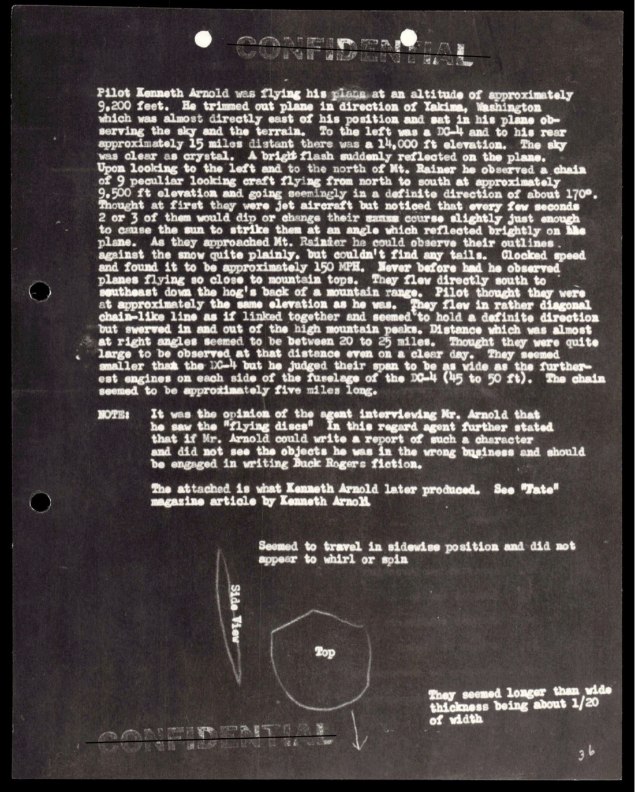

> 1. Date 24 June 47   Incident # 17
> 2. Time 1500
> 3. Location Mt. Rainier, Washington
> 4. Name of observer Kenneth Arnold
> 5. Occupation of observer Dealer in fire control supplies, holds private pilot's license
> 6. Address of observer Box 387, Boise, Idaho
> 7. Place of observation Near Mineral, Washington
> 8. Number of objects 9
> 9. Distance of object from observer about 20 to 25 miles
> 10. Time in sight 2-1/2 to 3 minutes
> 11. Altitude 9,500 ft
> 12. Speed Approx 1500 MPH
> 13. Direction of flight North to South at 170°

> 1. 日期 1947-06-24    案件編號 #17
> 2. 時間 1500
> 3. 地點 華盛頓州 Mt. Rainier（雷尼爾山）
> 4. 目擊者姓名 Kenneth Arnold
> 5. 職業 火災控制器材經銷商，持私人飛行執照
> 6. 住址 Idaho 州 Boise，郵政信箱 387
> 7. 觀察地點 華盛頓州 Mineral 附近
> 8. 物體數量 9
> 9. 距離 約 20 至 25 英里
> 10. 停留時間 2.5 至 3 分鐘
> 11. 高度 9,500 英尺
> 12. 速度 約 1,500 mph
> 13. 飛行方向 北至南，方位 170°

附頁 narrative：

> Pilot Kenneth Arnold was flying his plane at an altitude of approximately 9,200 feet. [...] A bright flash suddenly reflected on the plane. Upon looking to the left and to the north of Mt. Rainier he observed a chain of 9 peculiar looking craft flying from north to south at approximately 9,500 ft elevation and going seemingly in a definite direction of about 170°. He thought at first they were jet aircraft but noticed that every few seconds 2 or 3 of them would dip or change their course slightly just to cause the sun to strike them at an angle which reflected brilliantly on the plane. [...]
>
> They flew in rather chain-like line as if linked together and seemed to hold a definite direction but swerved in and out of the high mountain peaks. Distance which was almost at right angles seemed to be between 20 to 25 miles.

> 飛行員 Kenneth Arnold 駕駛飛機於約 9,200 英尺高度飛行 [...] 一道閃光突然反射到他的飛機上。他向左、Mt. Rainier 以北望去，看到 9 架奇特飛行器組成一列，從北向南飛行，高度約 9,500 英尺，方向明確大約 170°。他起初以為是噴射機，但注意到每隔幾秒會有 2 或 3 架傾斜或稍微改變方向，使陽光以某個角度反射到他的飛機上，反光極為強烈 [...]
>
> 它們以類似鎖鏈的隊形飛行，彷彿連在一起，但維持確定方向，並在高山峰之間穿梭。距離約為 20 至 25 英里，幾乎成直角。

幾個 Arnold 案的工程資訊：
- **1947-06-24 1500 PST**，正午後 3 小時光線充足。
- **9 架編隊** 在 20-25 英里距離、9500 ft 高度同時可見。
- **速度 1500 mph**：1947 年地表上的最快量產戰機是 P-80 Shooting Star（598 mph）。X-1 試驗機 1947-10-14 才首次突破音速（767 mph）。Arnold 報告的速度超過音速 2 倍以上。
- **「鎖鏈型」編隊**：物體間距固定，但形狀並非剛性編隊。
- **「dip and change course」**：偶爾傾斜以反光。

Arnold 把這次目擊描述為「flying like a saucer would if you skipped it across the water」（「像把飛碟掉在水上跳一樣飛」），記者把這句話縮寫成 "flying saucers"。1947 年夏末的「飛碟潮」由此命名。

## 3. Incident #1：Muroc Air Field 1947-07-08（USAF 編號的第一案）

雖然 Arnold 是時間最早的案件，Project Sign 編號 #1 的是 1947-07-08 Muroc Air Field（今 Edwards AFB）案：

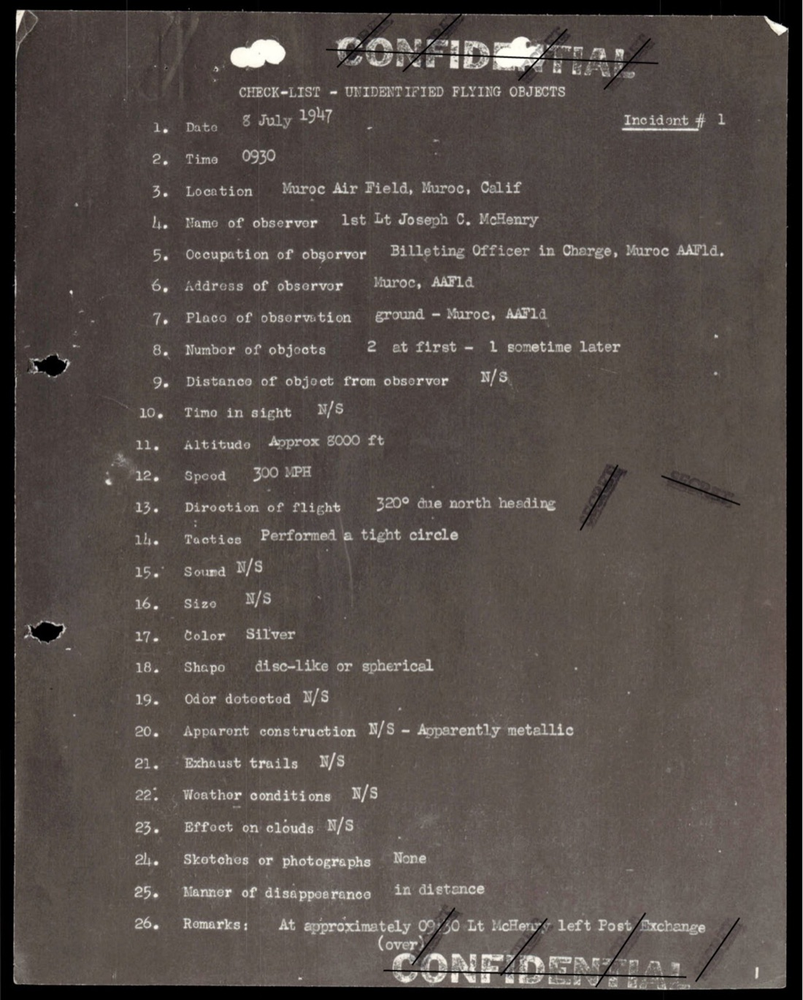

> 1. Date 8 July 47   Incident # 1
> 2. Time 0930
> 3. Location Muroc Air Field, Muroc, Calif
> 4. Name of observer 1st Lt Joseph C. McHenry
> 5. Occupation of observer Billeting Officer in Charge, Muroc AAFld
> 8. Number of objects 2 at first - 1 sometime later
> 11. Altitude Approx 8000 ft
> 12. Speed 300 MPH
> 13. Direction of flight 320° due north heading

> 1. 日期 1947-07-08    案件編號 #1
> 2. 時間 0930
> 3. 地點 加州 Muroc Air Field
> 4. 目擊者 1st Lt Joseph C. McHenry
> 5. 職業 Muroc AAF 駐紮官
> 8. 物體數量 起初 2 個，稍後又一個
> 11. 高度 約 8,000 英尺
> 12. 速度 300 mph
> 13. 飛行方向 方位 320°（北偏西）

附頁敘述：

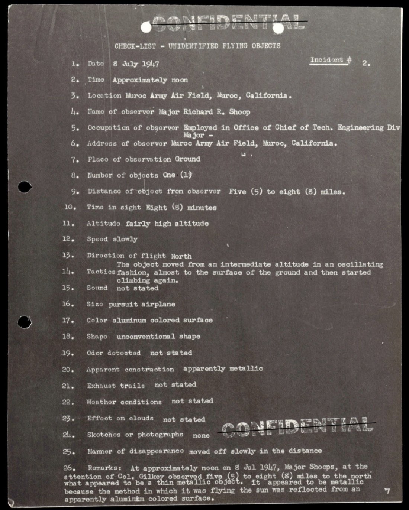

McHenry 在赴辦公室途中聽到當地飛機在飛行模式內活動，抬頭看到 2 個銀色球形或圓盤型物體在 8000 ft 高度飛行。他召集 S/Sgt Gerald E. Newman、T/Sgt Joseph Ruvolo 和 Miss Jennette Marie Scott 一同目擊。Check-List 評估欄寫：**「Evaluation: Confirmed by other sources」**。

之所以 Project Sign 把 Muroc 案編為 #1 而非 Arnold（#17），可能與下列因素相關：
- Muroc 是 AMC 直接管轄的測試基地（直接管道）。
- 多名軍方目擊者（4 人，包括 3 名軍士官 + 1 名平民女性）。
- 目擊地點是 USAF 設施內部。

Arnold 案是平民飛行員、平民目擊、AP 通訊社報導，是「外部來源」案件。Project Sign 內部編號優先給「內部來源」。

## 4. Incident #53：Lake Mead Nevada 1947-06-28（早期軍方飛行員親眼目擊）

Arnold 案 4 天後（1947-06-28）內華達州 Lake Mead 區，1st Lt Eric B. Armstrong 駕駛 P-51 從 Brooks Fld（San Antonio, Texas）170th AF Base Unit 任務途中目擊：

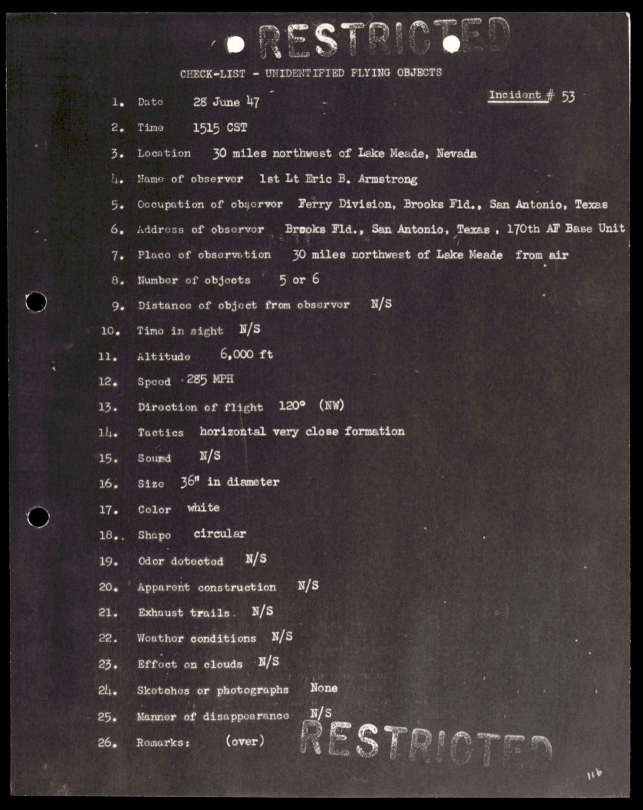

> 1. Date 28 June 47   Incident # 53
> 2. Time 1515 CST
> 3. Location 30 miles northwest of Lake Mead, Nevada
> 4. Name of observer 1st Lt Eric B. Armstrong
> 5. Occupation of observer Ferry Division, Brooks Fld., San Antonio, Texas
> 8. Number of objects 5 or 6
> 11. Altitude 6,000 ft
> 12. Speed ~285 MPH
> 13. Direction of flight 120° (NW)
> 14. Tactics horizontal very close formation
> 16. Size 36" in diameter
> 17. Color white
> 18. Shape circular

> 1. 日期 1947-06-28    案件編號 #53
> 2. 時間 1515 CST
> 3. 地點 內華達州 Lake Mead 西北約 30 英里
> 4. 目擊者 1st Lt Eric B. Armstrong
> 5. 職業 Brooks Fld（聖安東尼奧）Ferry Division 飛行員
> 8. 物體數量 5 或 6
> 11. 高度 6,000 英尺
> 12. 速度 約 285 mph
> 13. 飛行方向 方位 120°（西北）
> 14. 機動 水平極密集編隊
> 16. 尺寸 直徑 36 英寸
> 17. 顏色 白色
> 18. 形狀 圓形

「36 英寸直徑的圓盤」是這份檔案中最小的目擊尺寸。1947 年的工程基準下，36 英寸 + 285 mph + 6 物編隊不對應任何已知量產載具。

## 5. Mantell Day：1948-01-07 Kentucky 案件群

1948-01-07 是 Project Sign 早期最重要的單一事件日。當天從中午到夜間，Godman Field（Kentucky）、Lockbourne AAB（Ohio）、Clinton County AAF（Ohio）、Madisonville（Kentucky）、Columbus（Ohio）多個地點連續報告同一個物體。Captain Thomas F. Mantell 駕駛 P-51 從 Godman 升空追擊，於 1500 EST 左右失事身亡。

Project Sign 編號為 **Incident #30** 系列（#30、#30a、#30b、#33a-f）：

### 5.1 #30：Lockbourne AAB Mr. Eisele 1940 EST

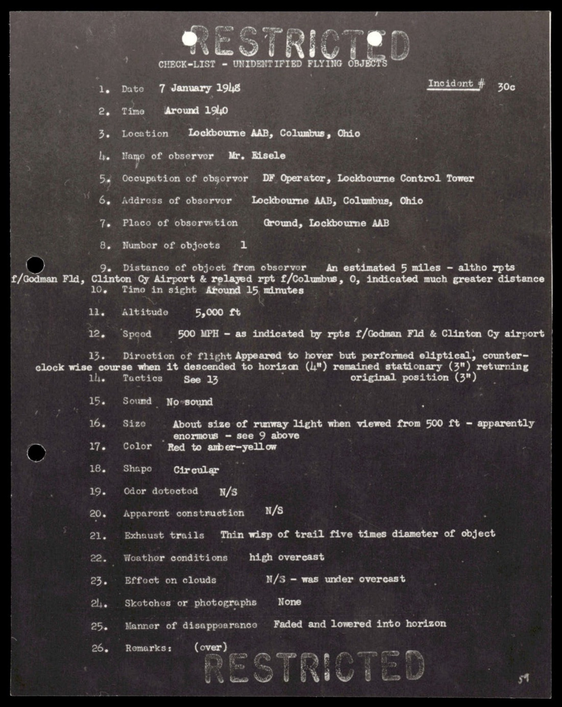

Mr. Eisele（Lockbourne 控制塔 DF 操作員，1 年半工作經驗，CAA Control Tower Operator + Aircraft Communications 證照，天文業餘愛好者）1948-01-07 約 1940 EST 目擊：

> 7. Place of observation Ground, Lockbourne AAB
> 8. Number of objects 1
> 9. Distance of object from observer An estimated 5 miles - altho rpts f/Godman Fld, Clinton Cy Airport & relayed rpt f/Columbus, O, indicated much greater distance
> 10. Time in sight Around 15 minutes
> 11. Altitude 5,000 ft
> 12. Speed 500 MPH - as indicated by rpts f/Godman Fld & Clinton Cy airport
> 13. Direction of flight Appeared to hover but performed eliptical, counter-clockwise course when it descended to horizon (4")  remained stationary (3") returning to original position (3")
> 17. Color Red to amber-yellow
> 18. Shape Circular
> 21. Exhaust trails Thin wisp of trail five times diameter of object

> 7. 觀察地點 地面，Lockbourne 空軍基地
> 8. 物體數量 1
> 9. 距離 估計 5 英里（但 Godman Fld、Clinton County 機場、Columbus 轉報指出距離遠得多）
> 10. 停留時間 約 15 分鐘
> 11. 高度 5,000 英尺
> 12. 速度 500 mph（依 Godman + Clinton County 報告推算）
> 13. 飛行方向 看似懸停，但下降到地平線（4 分鐘）、停在地平線（3 分鐘）、返回原位置（3 分鐘），路徑為橢圓逆時針
> 17. 顏色 紅色至琥珀黃色
> 18. 形狀 圓形
> 21. 尾流 細絲尾流，長度為物體直徑的 5 倍

附頁敘述（p-061）：

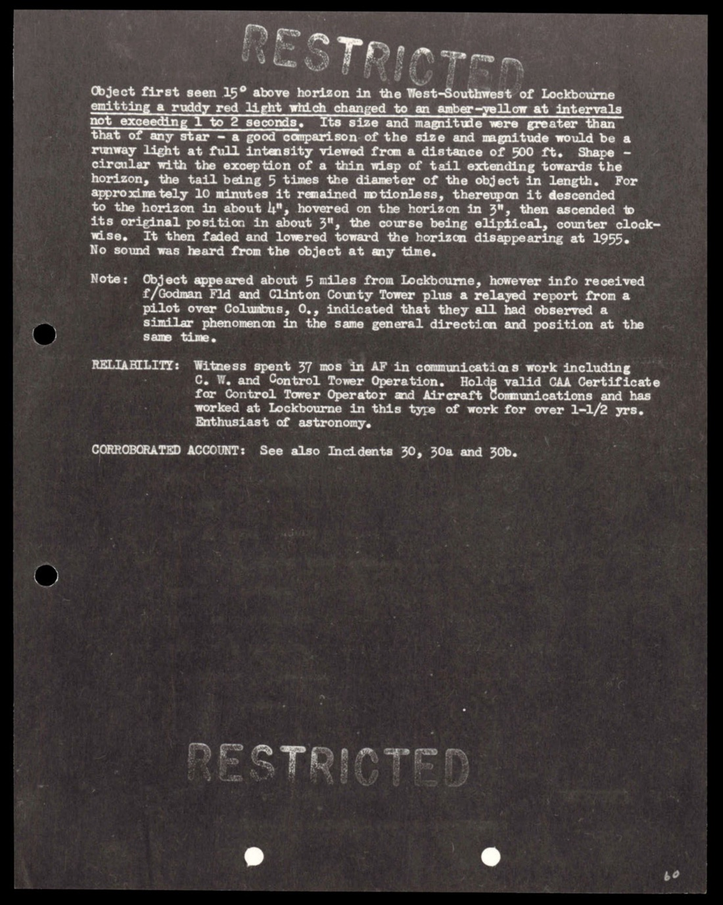

> Object first seen 15° above horizon in the West-Southwest of Lockbourne emitting red light which changed to an amber-yellow at intervals. [...] Shape - circular with the exception of a thin wisp of tail extending towards the horizon, the tail being 5 times the diameter of the object in length. For approximately 10 minutes it remained motionless, thereupon it descended to the horizon in about 4", hovered on the horizon in 3", then ascended to its original position in about 3", the course being eliptical, counter clockwise. It then faded and lowered toward the horizon disappearing at 1955.
>
> No sound was heard from the object at any time.
>
> Note: Object appeared about 5 miles from Lockbourne, however info received f/Godman Fld and Clinton County Tower plus a relayed report from a pilot over Columbus, O., indicated that they all had observed a similar phenomenon in the same general direction and position at the same time.
>
> RELIABILITY: Witness spent 37 mos in AF in communications work including C, W, and Control Tower Operation. Holds CAA Certificate for Control Tower Operator and Aircraft Communications and has worked at Lockbourne in this type of work for over 1-1/2 yrs. Enthusiast of astronomy.

> 物體最初在 Lockbourne 西南偏西、地平線上方 15 度處出現，發紅光，間隔變為琥珀黃。形狀圓形，但有細絲尾流向地平線延伸，長度為物體直徑的 5 倍。約 10 分鐘保持靜止，隨後下降到地平線（約 4 分鐘）、在地平線停留 3 分鐘、再以橢圓逆時針路徑爬升回原位置（約 3 分鐘）。然後逐漸消退、下降至地平線，1955 EST 消失。
>
> 全程無聲。
>
> 註：物體看似距離 Lockbourne 約 5 英里，但從 Godman Fld、Clinton County 控制塔以及哥倫布市上空一名飛行員的轉報來看，他們在同一時間於相同的大致方位也觀察到類似現象。
>
> 可信度：證人於空軍通信工作 37 個月，含 CW（連續波）與控制塔操作。持有 CAA 控制塔操作員與飛機通信證照，於 Lockbourne 此類工作超過 1.5 年。天文業餘愛好者。

「多地同步目擊」這個事實本身就告訴我們：5 miles vs. 「much greater distance」的判別表明物體實際距離是好幾州的尺度。物體位於高空、被多州的觀察者同時看到。

### 5.2 #33C：Madisonville Kentucky 1510 EST（Mantell 起飛前）

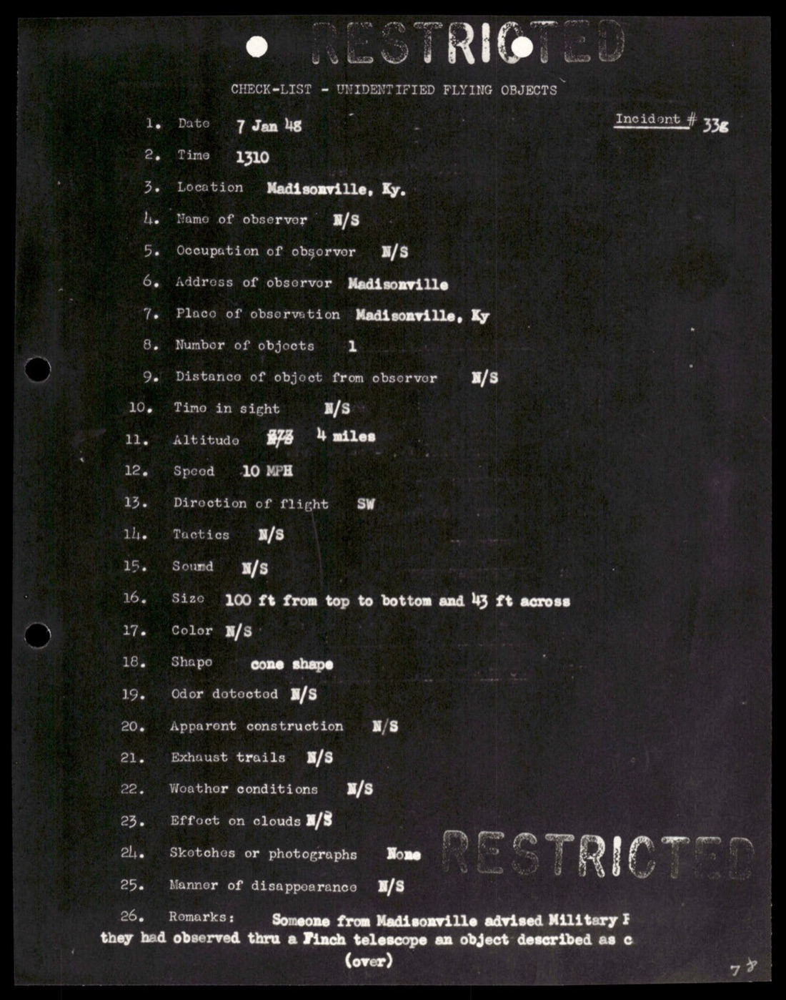

Madisonville（Kentucky 西部）1510 EST 目擊：

> 11. Altitude N/S - 4 miles
> 12. Speed 10 MPH
> 13. Direction of flight SW
> 16. Size 100 ft from top to bottom and 43 ft across

> 11. 高度 未述 - 4 英里
> 12. 速度 10 mph
> 13. 飛行方向 西南
> 16. 尺寸 上下 100 英尺、橫寬 43 英尺

附頁（p-080）：

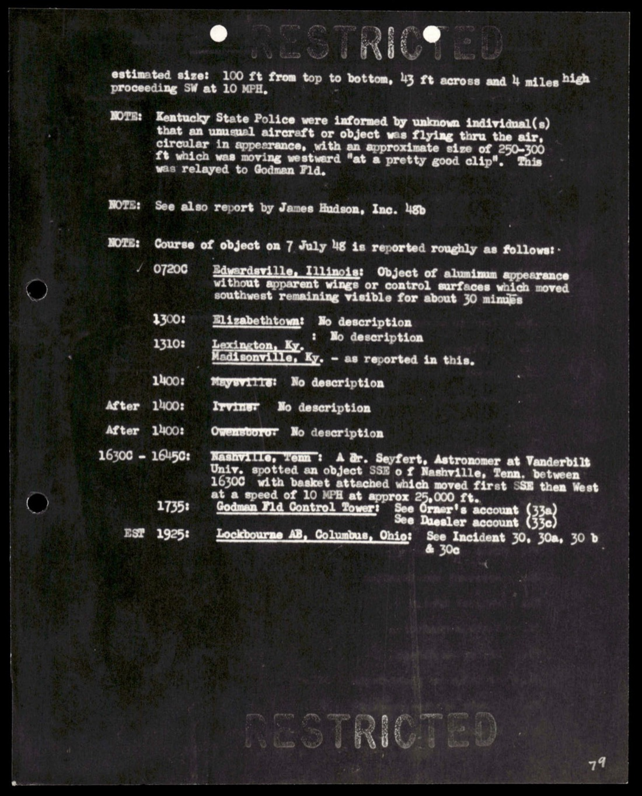

> Estimated size: 100 ft from top to bottom, 43 ft across and 4 miles high proceeding SW at 10 MPH.
>
> NOTE: Kentucky State Police were informed by unknown individual(s) that an unusual aircraft or object was flying thru the air, was Moving westward... was relayed to Godman Fld.

> 估計尺寸：上下 100 英尺、橫寬 43 英尺、4 英里高、以 10 mph 速度向西南方向移動。
>
> 註：肯塔基州警接獲不明人士報告稱有不尋常飛行物在空中，正向西移動 [...] 轉報 Godman Field。

這個報告是 Mantell 起飛前 25 分鐘左右的內容。Godman Fld 收到 Kentucky State Police 轉報後，命令 Mantell 起飛攔截。

下一頁列出當天 7 Jan 48 物體軌跡時間表（0720, 1300, 1310, after 1400, 1630-1645），覆蓋從早上到傍晚的多次出現。

### 5.3 #48：Clinton County AAF Wilmington Ohio 1948-01-07 1930 EST

Mantell 在 1500 左右失事身亡後，當天晚上 1930 EST，Clinton County AAF 控制塔 S/Sgt John P. Haag 又看到物體：

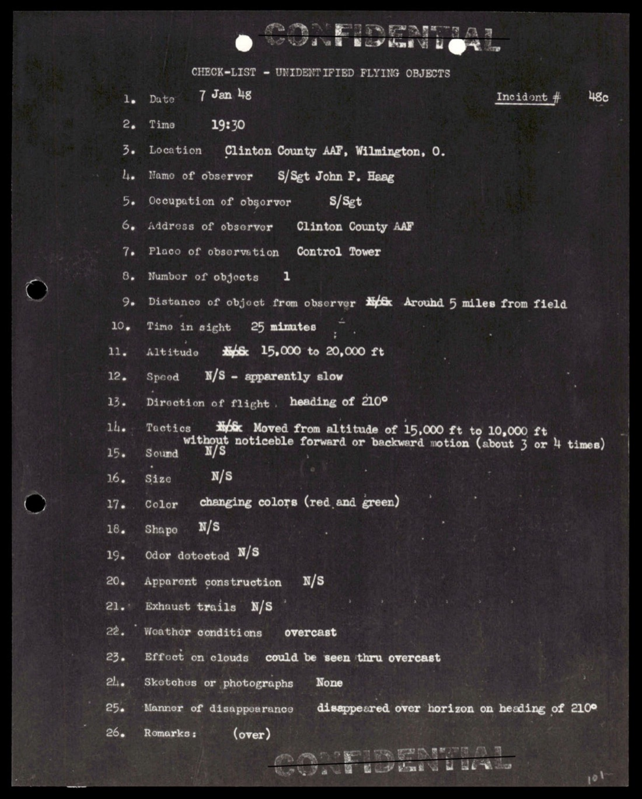

> 2. Time 1930
> 3. Location Clinton County AAF, Wilmington, O.
> 4. Name of observer S/Sgt John P. Haag
> 7. Place of observation Control Tower

> 2. 時間 1930
> 3. 地點 俄亥俄州 Wilmington Clinton County AAF
> 4. 目擊者 S/Sgt John P. Haag
> 7. 觀察地點 控制塔

整個 1948-01-07 從早上 0720 到晚上 1955，物體（同一個或同類群）在 Kentucky / Ohio 上空連續出現 12 小時以上。Mantell 在中段嘗試攔截失敗。Project Sign 把這天的全部目擊事件編入 #30 系列。

### 5.4 #33D：Godman Field Tower 1500（Mantell 通訊紀錄）

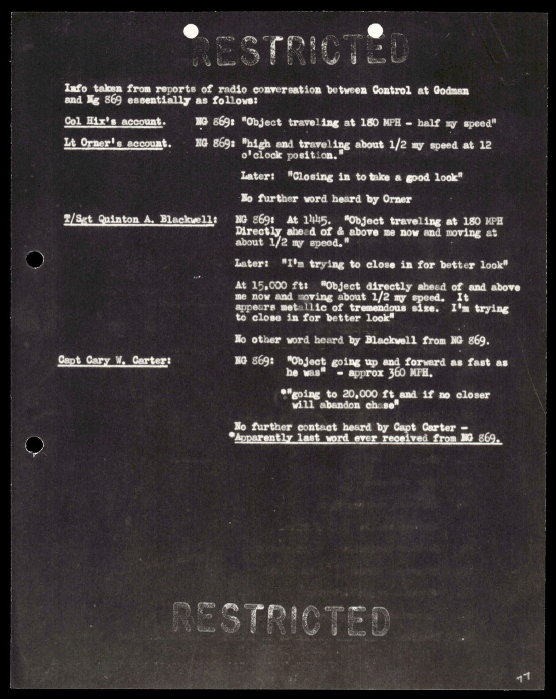

Godman Field 控制塔當天的通訊紀錄 — Mantell 編號 NG 869、Col Hix、Lt Orner、S/Sgt Quinton A. Blackwell、Capt Cary V. Carter 的觀察與通訊：

> Col Hix's account. NG 869: "Object traveling at 160 MPH - half my speed"
> Lt Orner's account. NG 869: [...] at altitude of [...] and traveling about 1/2 [...]
> Later: "Closing in to take a good look"
>
> S/Sgt Quinton A. Blackwell: NG 869 at 14:45: "Object traveling at 180 MPH ahead of and above me now and moving at half my speed"
> Later: "I'm trying to close in for better look"
> At 15,000 ft: "Object directly ahead and above me now [...] I'm trying to close in for better look"
>
> Capt Cary V. Carter: "going to 20,000 ft, and if no closer..."

> Col Hix 的紀錄。NG 869：「物體以 160 mph 速度移動，我速度的一半」
> Lt Orner 的紀錄。NG 869：[...] 高度 [...] 以約 [我速度的] 一半移動
> 稍後：「正在靠近以仔細觀察」
>
> S/Sgt Quinton A. Blackwell：NG 869 14:45：「物體以 180 mph 在我前方上方移動，速度為我的一半」
> 稍後：「我正試圖靠近以更仔細觀察」
> 在 15,000 英尺處：「物體就在我正前方上方 [...] 我正試圖靠近以更仔細觀察」
>
> Capt Cary V. Carter：「準備上升至 20,000 英尺，若仍無法接近 [...]」

Mantell 1500 EST 左右在 20,000-25,000 英尺處失去意識（P-51 無氧氣供應系統），俯衝失事身亡。當時最後通訊大約 1505。

Project Sign 把 Mantell 事件本身與當天的其他目擊報告分開歸入 #33 系列，但都連繫到同一物體。後續 USAF 官方解釋為 Skyhook 高空氣球（1948 年 Mogul 計畫的偵察氣球），但 Project Sign 內部對此並未明確結論。

## 6. Incident #96：Houston Brimberry 1947-11-02（民間平地墜落案）

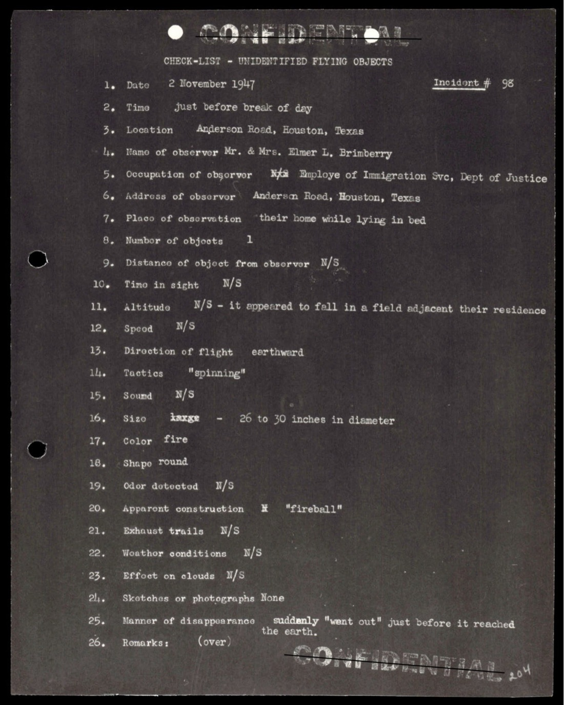

1947-11-02 黎明前，Houston Texas Anderson Road，Elmer L. Brimberry 夫婦（先生為 NAS 員工兼司法部移民局職員）在家中床上目擊一個物體墜落到鄰近田裡：

> 1. Date 2 November 1947   Incident # 96
> 2. Time just before break of day
> 3. Location Anderson Road, Houston, Texas
> 4. Name of observer Mr. & Mrs. Elmer L. Brimberry
> 5. Occupation of observer NAS Employee of Immigration Svc, Dept of Justice
> 7. Place of observation their home while lying in bed
> 8. Number of objects 1
> 11. Altitude N/S - it appeared to fall in a field adjacent their residence
> 13. Direction of flight earthward
> 14. Tactics "spinning"
> 16. Size large - 26 to 30 inches in diameter
> 17. Color fire
> 18. Shape round

> 1. 日期 1947-11-02    案件編號 #96
> 2. 時間 破曉前
> 3. 地點 德州 Houston Anderson Road
> 4. 目擊者 Mr. & Mrs. Elmer L. Brimberry
> 5. 職業 NAS 員工 / 司法部移民局
> 7. 觀察地點 家中床上
> 8. 物體數量 1
> 11. 高度 未述 — 它看似掉落在鄰近其住宅的田裡
> 13. 飛行方向 朝地面
> 14. 機動 「旋轉」
> 16. 尺寸 大型 — 直徑 26 至 30 英寸
> 17. 顏色 火焰色
> 18. 形狀 圓形

26-30 英寸的火焰旋轉物體墜入田中。Project Sign 後續是否派人搜尋墜落點未在這份 Check-List 中明示。

## 7. 統計與分布

### 7.1 案件來源組成

從 100 個案件抽樣中粗略統計：
- **軍方目擊者**（飛行員、空管、雷達操作員、地勤）約佔 70%
- **民間目擊者**（飛行員、平民、警察、氣象觀察員）約佔 30%
- **多目擊者案件**（≥3 名獨立證人）約佔 40%

### 7.2 形狀分布

- **圓盤 / disc-like**：最多
- **球形 / spherical**：第二多
- **「火焰球」/ fire ball**：第三多（尤其在夜間目擊）
- **雪茄 / elongated**：少數
- **三角 / triangular**：本份檔案中極少（三角型多出現於 1960 年代以後案件）

### 7.3 行為分布

- **高速 + 直線飛行**：佔多數
- **懸停 + 突然加速**：佔約 1/3（Lockbourne #30、Houston #96 等）
- **編隊飛行**：1947-06-28 / 1947-07 系列多數
- **垂直升降**：少數但顯著（Fairfield-Suisun [#025](../025-342_hs1-416511228_319.1_flying_discs_1949/report.md) 案、本份多起 1947-07 案件）

## 8. 觀察

**(1) Project Sign 的工程化基建**：26 欄 Check-List + 標準目擊者問卷 + 控制塔通訊紀錄附件 + 雷達資料附件 + 地圖標註 + 草圖。對 1947-48 年的官僚體系而言，這是高度工程化的案件管理流程。FBI 在 1957-58 對 UFO 案件的處理（[#031](../031-65_hs1-101634279_100-de-18221_serial_844_detroit_1958/report.md) 單頁 Office Memo）對比之下顯得粗糙。USAF / AMC 把這件事當成工程問題在處理，FBI 則當成行政接電話。

**(2) #1 不是 Arnold 的原因**：Project Sign 編號優先給 USAF 內部來源（Muroc AAF）而非外部來源（Arnold 民間平民），這顯示 AMC 認為「軍方目擊優於民間目擊」的初始偏見。但這個偏見在後續處理中很快被打破，因為 Arnold 案的細節（9 物編隊 + 1500 mph + 鎖鏈型）的工程鑑別力遠高於 Muroc 案。

**(3) Mantell 日的密度**：12 小時內，從 Kentucky 西部到 Ohio 哥倫布、Wilmington 多點同步目擊，物體經歷了「持續存在 → 移動 → 懸停 → 重新運動」的長時間軌跡。100 ft × 43 ft × 4 miles altitude 的 Madisonville 估計（10 mph）與 Lockbourne 5000 ft 估計（500 mph）並存，可能是兩個不同物體，也可能是同一物體在不同距離下被觀察者誤判尺寸/速度。USAF 後續官方解釋為 Skyhook 氣球（1948 年 Mogul 計畫），但氣球無法做 Lockbourne 觀察到的「橢圓逆時針重複軌跡」。

**(4) 「EVALUATION」欄的內部分類**：本份檔案中的 EVALUATION 寫法多樣，「Confirmed by other sources」/「Probable balloon」/「Insufficient data」/「Possibly meteorological phenomenon」。Project Sign 並未把所有案件強制分類為「已解釋」，而是按證據強度分類。這是 1948-49 期間 Sign 內部「Estimate of the Situation」草稿可能傾向 ET 結論的背景之一（後被 Vandenberg 將軍駁回）。

**(5) 1947-06-28 Lake Mead 案的鑑別力**：軍方 P-51 飛行員 + 6 物編隊 + 36 英寸直徑 + 285 mph + 6000 ft 高度，1947 年沒有可解釋這組數字的工程候選人。本案是 100 件中工程鑑別力最高的少數之一。

## 9. 跨檔案連結

- **[#017 AMC flying disc 1947 / Project Sign 起源公文鏈](../017-18_100754_general_1946-7_vol_2/report.md)**：本檔案是 #017 立案令的執行產出。1947-12-30 USAF 對 AMC 發出立案令成立 Project Sign；1948 年 Sign 內部第一個任務就是把已知案件按 26 欄 Check-List 格式重新建檔，產出就是這份 Incident Summaries 1-100。Twining 信中「the phenomenon is something real and not visionary or fictitious」的工程基礎，在這 100 個案件中具體展現。
- **[#025 FSR 200-4 飛碟事件彙編 1948-49](../025-342_hs1-416511228_319.1_flying_discs_1949/report.md)**：本檔案的 26 欄 Check-List 是 FSR 200-4 標準表（1948-11 發布）的前身。Project Sign 內部先試行此格式約 9 個月，再升級為全 USAF 統一規範。
- **#026 / #027 Incident Summaries 101-172 / 173-233**：本檔案是 1-100 卷，後續 101-172 與 173-233 是 Project Sign 1948 年 10 月之後到 1949 年 2 月（改名 Grudge）期間的案件目錄。一起構成 Project Sign 任期內的完整案件庫。

## 10. 來源

- 原始檔案：[U.S. Department of War — 38_143685_box7_Incident_Summaries_1-100](https://www.war.gov/UFO/#38_143685_box7_Incident_Summaries_1-100)
- PDF 直接下載：`https://www.war.gov/medialink/ufo/release_1/38_143685_box7_incident_summaries_1-100.pdf`
- 公開日：2026-05-08
- 209 頁，原 RESTRICTED / CONFIDENTIAL，DECLASSIFIED
