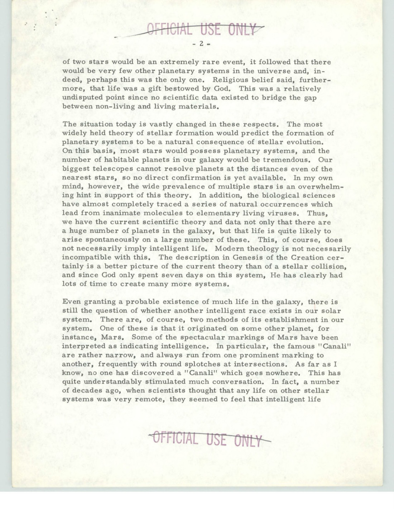
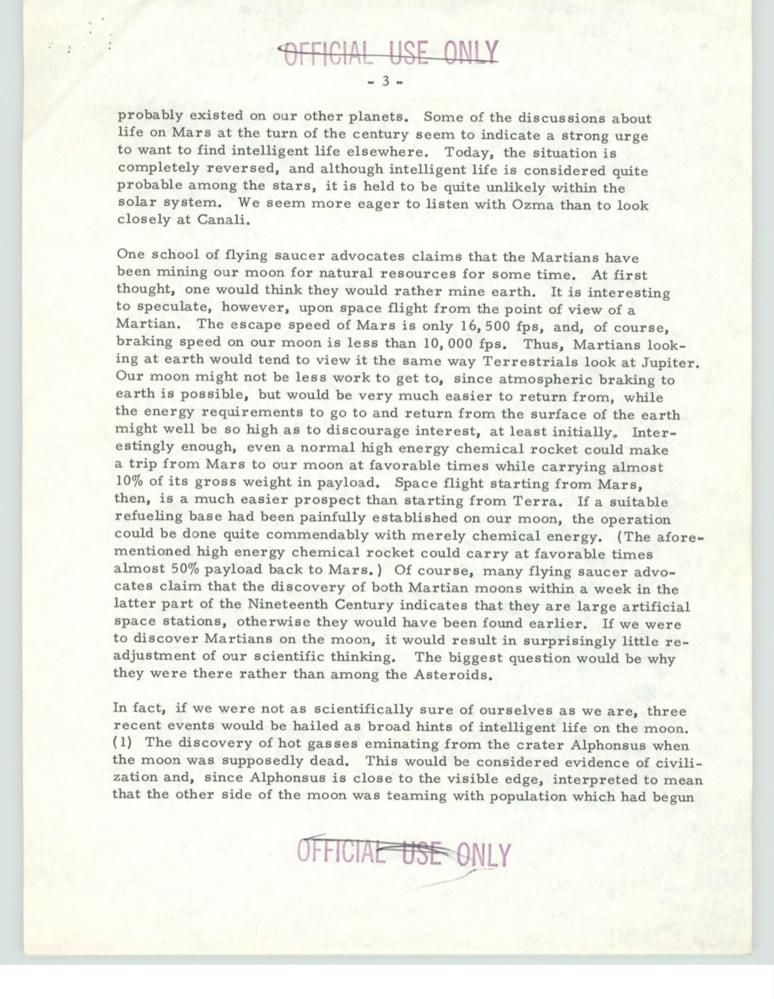
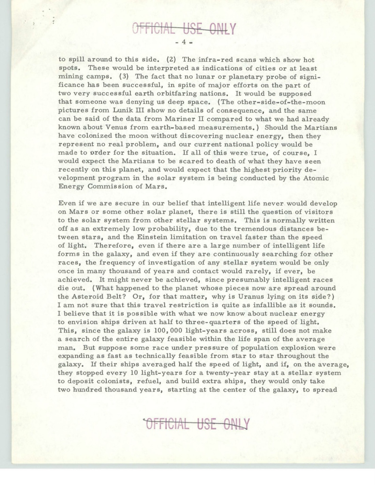
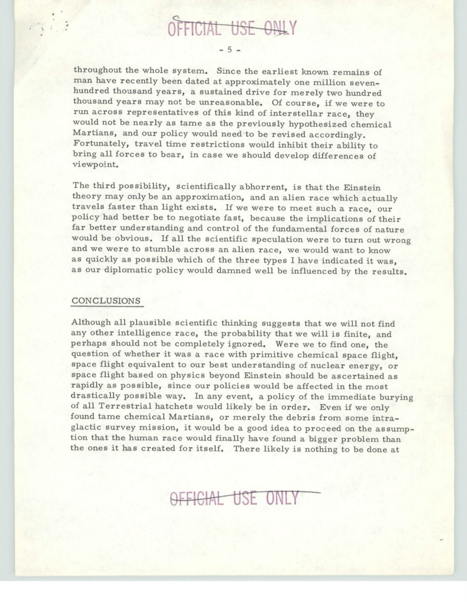
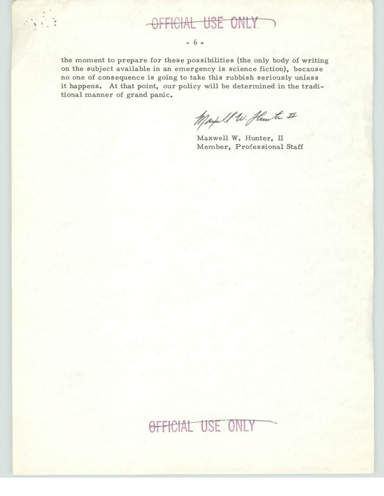

# #029 白宮 Space Council 1963-07-18：Thoughts on the Space Alien Race Question

| 欄位 | 內容 |
|---|---|
| 檔案編號 | 59_214434_SP 16 [7.18.1963] |
| 來源機關 | Executive Office of the President / National Aeronautics and Space Council |
| 收件機關 | Department of State / Office of International Scientific Affairs |
| 作者 | Maxwell W. Hunter II（NASC Professional Staff Member） |
| 收件人 | Robert F. Packard |
| 日期 | 1963-07-18 |
| 頁數 | 6 頁 |
| 機密層級 | OFFICIAL USE ONLY ／ DECLASSIFIED |
| 公開日 | 2026-05-08 |

## 為什麼這份檔案重要

1963 年 7 月 18 日，白宮國家航空暨太空委員會（National Aeronautics and Space Council, NASC，副總統 Lyndon B. Johnson 主持的部門級委員會）專業幕僚 **Maxwell W. Hunter II** 寫了一份 6 頁備忘，發給美國國務院國際科學事務辦公室（OES 前身 SCI）的 Robert F. Packard，主旨：「Thoughts on the Space Alien Race Question」。

這份備忘不是飛碟目擊報告，也不是 USAF 內部技術文件。它是 **白宮幕僚層級對「如果發現外星智慧文明，美國應該採取什麼政策」這個問題的書面思考**。Hunter 用工程師的嚴謹度把 ET 接觸的三種可能性拆開、估算各自的物理可行性、並推導對應的美國外交立場。

歷史意義：

1. **是美國已解密政府文件中極少數從「政策準備」角度討論 ET 接觸的內部備忘**。同等級的文件還有 1960 年 Brookings Institution 報告（NASA 委託、討論 ET 文明發現對地球社會的衝擊），但 Brookings 是外部委託；本檔案是 NASC 內部直接寫給國務院的政策幕僚分享。
2. **作者 Maxwell W. Hunter II 是真實的航太工程師**：1922-2001，曾任職於 Douglas Aircraft（Thor 飛彈、Saturn V 設計）、Lockheed（後來的 SDI 設計師）、NASC（1960-65）。他寫這份備忘時 41 歲。
3. **時間點高度敏感**：1963-07-18 是 NASA Mariner II 1962 年金星飛掠成功後 7 個月；甘迺迪總統 1962-09 Rice University「we choose to go to the moon」演講後 10 個月；同月 NASA 公開 X-15 突破 200,000 ft 紀錄。Hunter 寫這份備忘時，美國正在 Mercury → Gemini → Apollo 過渡期。
4. **內容明確排除幽默或修辭**：Hunter 不是在開玩笑。他用工程數據（火星脫離速度 16,500 fps、月球煞車速度 < 10,000 fps、銀河系 100,000 光年跨度、人類化石 170 萬年史）推導三種 ET 接觸場景的對應外交政策。
5. **結論句的歷史性**：「our policy will be determined in the traditional manner of grand panic」（我們的政策將以傳統的「大恐慌」方式決定）。這是白宮內部對 ET 接觸政策準備度的清醒自評。

## 1. 公文路由

收件人 **Robert F. Packard** 當時任職國務院國際科學事務辦公室（SCI），SCI 是國務院內負責科技外交、國際科學合作的單位。SCI 1957 年成立，1974 年改組為 Bureau of Oceans, Environment, and Scientific Affairs (OES)。

發信單位 **National Aeronautics and Space Council** (NASC) 1958 年由國家航空暨太空法案（與 NASA 同法）創立，由副總統主持，目的是協調 NASA、DoD、AEC 等機構的太空政策。1963 年 NASC 主席是副總統 Lyndon B. Johnson；NASC 執行秘書是 Edward C. Welsh。Maxwell Hunter II 是 NASC 的常駐 Professional Staff Member（專業幕僚），1960-1965 任職。

文件分類「OFFICIAL USE ONLY」（簡稱 FOUO）是美國政府最低敏感性標籤，意味文件可在政府內部流通但不對外公開。

## 2. 開場：問題的提出

> SUBJECT: Thoughts on the Space Alien Race Question
>
> During recent discussions the question has occasionally, though rarely, arisen that perhaps we should consider the policy question of what to do if an alien intelligence is discovered in space. Some discussion of this occurred, as you will recall, during deliberations on BNSP Task I. This memo contains some miscellaneous thoughts on the question.
>
> The consensus of scientific view says, with quite good reasons, that the possibility of running across an alien intelligent race in our solar [system is] negligible. This is due primarily to the presumed unsuit-[ability of other planets for life]
>
> The flying saucer advocates claim, of course, that the scientific viewpoint is nonsense, and that there is overwhelming evidence of such beings. In my own mind, I find it difficult to side with the flying saucer advocates, but the almost total impossibility envisioned by most scientists also is disturbing. Therefore, I present the problem in current perspective, as I see it.

> 主旨：對「太空外星種族問題」之思考
>
> 在最近的討論中，偶爾（雖然不常）會浮現一個問題：我們是否應該考慮一個政策性問題——如果在太空中發現外星智慧文明，該怎麼辦。您應該記得，在 BNSP Task I 的討論中也曾提及。本備忘提供關於此問題的一些雜想。
>
> 科學界主流觀點認為（有相當好的理由）：在我們太陽系中遇到外星智慧種族的可能性 [極低]。主要原因是 [假設其他行星不適合生命存在]。
>
> 飛碟支持者當然主張這個科學觀點是無稽之談，並稱有壓倒性的證據顯示此類生命的存在。我個人很難站在飛碟支持者一邊，但大多數科學家設想的「幾乎完全不可能」也令人不安。因此，我將問題呈現如下，並以我自己的觀點來看。

關鍵語句：
- **「BNSP Task I」**：BNSP 是 Basic National Security Policy（NSC 級別文件），1959-1962 期間由國務院政策計畫部門撰寫。Task I 是 BNSP 之下的某個工作分組，本備忘暗示在 BNSP 制訂過程中曾討論 ET 接觸政策。
- **「In my own mind, I find it difficult to side with the flying saucer advocates」**：Hunter 不認同 UFO 研究者的「外星人已經來過」立場。
- **「but the almost total impossibility envisioned by most scientists also is disturbing」**：但他也不接受主流科學界「ET 幾乎完全不可能存在」的全否認立場。他要找一個中間框架。

## 3. 主流科學的轉變：行星形成理論

Hunter 用約 1 頁分析「過去幾十年科學觀點如何轉變」：

- **舊理論**：恆星近距離擦撞形成行星系統 → 行星系統極為罕見 → 我們可能是宇宙中唯一的行星系統
- **新理論**（1960 年代初的主流）：恆星演化自然產生行星系統 → 大多數恆星都有行星 → 銀河系中可居住行星「數量驚人」
- **生物學支持**：分子 → 元素生命病毒的自然過程已被生物化學追蹤
- **神學調和**：「Genesis 中創世的描述更符合當前理論，而非恆星擦撞理論。且既然神只花 7 天在我們這個系統，祂顯然有足夠時間創造其他系統」

Hunter 在這裡用「修辭式邏輯」處理科學/宗教的整合，這是 1960 年代美國政府幕僚常見的修辭策略。

## 4. 三種接觸場景

### 4.1 Type I：火星人（化學動力太空飛行）

> The escape speed of Mars is only 16,500 fps, and, of course, braking speed on our moon is less than 10,000 fps. Thus, Martians looking at earth would tend to view it the same way Terrestrials look at Jupiter. Our moon might not be less work to get to, since atmospheric braking to earth is possible, but would be very much easier to return from, while the energy requirements to go to and return from the surface of the earth might well be so high as to discourage interest, at least initially. Interestingly enough, even a normal high energy chemical rocket could make a trip from Mars to our moon at favorable times while carrying almost 10% of its gross weight in payload.

> 火星脫離速度僅 16,500 fps，月球煞車速度小於 10,000 fps。因此，火星人看地球會像地球人看木星一樣。月球可能不會比較好抵達，因為地球可以用大氣煞車，但月球返程容易得多。從地球表面起飛和返回的能量需求可能高到讓他們失去興趣，至少初期如此。有趣的是，一般高能化學火箭都能在有利時機下從火星到月球，並攜帶近 10% 毛重的酬載。

Hunter 用 1963 年最新的化學火箭性能估算，計算出火星到月球的化學火箭軌道是可行的（10% 酬載）。返程則可達 50% 酬載。也就是「如果火星上有文明，他們的太空飛行能力可能跟我們類似」。

緊接著他考慮三個證據暗示：

> (1) [The fact that] the slight axial tilt of Mars [enables] [...]
> (2) The infra-red scans which show hot spots. These would be interpreted as indications of cities or at least mining camps.
> (3) The fact that no lunar or planetary probe of significance has been successful, in spite of major efforts on the part of two very successful earth orbitfaring nations. It would be supposed that someone was denying us deep space.

> (1) 火星輕微的自轉軸傾斜 [使得 ...]
> (2) [火星] 紅外線掃描顯示熱點。這些可被解釋為城市或至少是採礦營地的跡象。
> (3) 儘管兩個非常成功的地球軌道國家（美國 + 蘇聯）的重大努力，卻沒有任何重要的月球或行星探測任務獲得成功。可以推測是有人在拒絕我們進入深空。

第 (3) 點是關鍵：Hunter 提到 1959 蘇聯 Luna 系列、1962 美國 Mariner II 等都「沒有顯著結果」（the other-side-of-the-moon pictures from Lunik III show no details of consequence；Mariner II compared to what we had already known about Venus from earth-based measurements）。Hunter 寫到「Someone was denying us deep space」，也就是「有外星人在阻擋我們進入深空」這個假設被當作探測失敗的解釋之一。

對應政策結論：

> Should the Martians have colonized the moon without discovering nuclear energy, then they represent no real problem, and our current national policy would be made to order for the situation. [...] I would expect the Martians to be scared to death of what they have seen recently on this planet, and would expect that the highest priority development program in the solar system is being conducted by the Atomic Energy Commission of Mars.

> 假使火星人在尚未發現核能的情況下已經殖民月球，他們對我們不構成真正威脅，我國當前的國家政策可以正好應對此狀況。[...] 我會預期火星人對最近在這顆星球上看到的事物感到極度驚恐，並會預期太陽系中最高優先順序的研發計畫，正由火星原子能委員會執行。

Hunter 的幽默感很黑色，「我們最近的事」指 1945-63 期間的核試驗（廣島、長崎、Castle Bravo、Tsar Bomba 等）。「火星原子能委員會」是他對「外星人正在火急追趕」的擬人化。

### 4.2 Type II：核動力星際文明（0.5-0.75c）

> I am not sure that this travel restriction is quite as infallible as it sounds. I believe that it is possible with what we now know about nuclear energy to envision ships driven at half to three-quarters of the speed of light. This, since the galaxy is 100,000 light-years across, still does not make a search of the entire galaxy feasible within the life span of the average man. But suppose some race under pressure of population explosion were expanding as fast as technically feasible from star to star throughout the galaxy. If their ships averaged half the speed of light, and if, on the average, they stopped every 10 light-years for a twenty-year stay at a stellar system to deposit colonists, refuel, and build extra ships, they would only take two hundred thousand years, starting at the center of the galaxy, to spread throughout the whole system.

> 我不確定這個旅行限制如其聽起來那般絕對。基於我們目前對核能的理解，我認為可以設想以光速一半到四分之三的船隻。由於銀河系跨度 100,000 光年，這仍無法在常人壽命內搜索整個銀河系。但假設某個種族在人口爆炸壓力下，以技術可能的最快速度從一顆恆星擴展到下一顆恆星。若其船隻平均速度為光速的一半，且平均每 10 光年停留 20 年作為殖民、補給、造船基地，則從銀河中心開始，僅需 20 萬年即可遍及整個銀河系。

Hunter 把 Fermi paradox（費米悖論）拆成兩個工程量。給定 0.5c 核動力推進 + 每 10 光年中繼站 + 20 年停留時間，20 萬年可以覆蓋整個銀河系。他接著比較：

> Since the earliest known remains of man have recently been dated at approximately one million seven-hundred thousand years, a sustained drive for merely two hundred thousand years may not be unreasonable.

> 由於人類最早化石近期已被測定為約 170 萬年前，僅持續 20 萬年的擴張計畫並非不合理。

也就是說：1963 年的科學知識下，銀河系應該已經被早期文明的核動力擴張覆蓋過。Fermi 1950 年提出「他們在哪？」的悖論，Hunter 1963 年用具體數字推導同樣的問題。

對應政策：

> Of course, if we were to run across representatives of this kind of interstellar race, they would not be nearly as tame as the previously hypothesized chemical Martians, and our policy would need to be revised accordingly. Fortunately, travel time restrictions would inhibit their ability to bring all forces to bear, in case we should develop differences of viewpoint.

> 當然，如果我們遇到這類星際種族的代表，他們將遠不如先前假設的化學動力火星人那麼溫和，我們的政策需要相應調整。所幸旅行時間的限制將抑制他們在我們發生觀點分歧時動用全部兵力的能力。

「旅行時間限制讓他們無法集結全部兵力」，Hunter 把外交談判延遲的工程含義也思考過。

### 4.3 Type III：超光速文明（Einstein 理論只是近似）

> The third possibility, scientifically abhorrent, is that the Einstein theory may only be an approximation, and an alien race which actually travels faster than light exists. If we were to meet such a race, our policy had better be to negotiate fast, because the implications of their far better understanding and control of the fundamental forces of nature would be obvious.

> 第三種可能，科學上令人厭惡的是，Einstein 理論可能只是一種近似，而一個確實能超光速旅行的外星種族存在。如果我們遇到這樣的種族，我們的政策最好快速協商，因為他們對自然基本力的更深理解與控制的含義不言而喻。

「Negotiate fast」是 Hunter 的判決，遇到 FTL 文明，沒有時間考慮，先談判。

## 5. 結論

> Although all plausible scientific thinking suggests that we will not find any other intelligence race, the probability that we will is finite, and perhaps should not be completely ignored. Were we to find one, the question of whether it was a race with primitive chemical space flight, space flight equivalent to our best understanding of nuclear energy, or space flight based on physics beyond Einstein should be ascertained as rapidly as possible, since our policies would be affected in the most drastically possible way. In any event, a policy of the immediate burying of all Terrestrial hatchets would likely be in order. Even if we only found tame chemical Martians, or merely the debris from some intra-galactic survey mission, it would be a good idea to proceed on the assumption that the human race would finally have found a bigger problem than the ones it has created for itself.

> 雖然所有可信的科學思考都顯示我們不會找到其他智慧種族，但找到的可能性是有限的，也許不應完全忽視。若我們找到，則該種族屬於三類中的哪一類，應盡快確定——原始化學動力太空飛行、相當於我們對核能最佳理解的太空飛行、或基於 Einstein 之外物理的太空飛行——因為我們的政策將受到最劇烈的影響。在任何情況下，立即埋葬所有地球分歧的政策很可能是合適的。即使我們只找到溫和的化學動力火星人，或僅僅是某個跨銀河系勘查任務的殘骸，按照「人類終於找到比自己創造的問題更大的問題」這個假設來行事，會是個好主意。

關鍵政策建議：
- **立即埋葬所有地球分歧**：意指 ET 接觸發生後，地球國家之間的政治分歧應立即擱置。
- **「比自己創造的問題更大的問題」**：1963 年冷戰背景下，「自己創造的問題」指核戰爭威脅。Hunter 暗示 ET 接觸的規模比核武器更大。

結束句：

> There likely is nothing to be done at the moment to prepare for these possibilities (the only body of writing on the subject available in an emergency is science fiction), because no one of consequence is going to take this rubbish seriously unless it happens. At that point, our policy will be determined in the traditional manner of grand panic.
>
> Maxwell W. Hunter, II
> Member, Professional Staff

> 目前可能沒有任何準備工作可以為這些可能性做（緊急情況下唯一可用的相關書寫只有科幻小說），因為除非真的發生，否則沒有任何有影響力的人會把這種瓦礫垃圾當回事。到那時，我國政策將以傳統的「大恐慌」方式決定。
>
> Maxwell W. Hunter II
> 專業幕僚

「the traditional manner of grand panic」這句話是這份備忘最被引用的句子。Hunter 1963 年清醒地承認：白宮對 ET 接觸沒有任何準備；發生時將是 ad hoc 危機處理。

## 6. 觀察

**(1) Hunter 的工程基礎**：Hunter 在 Douglas Aircraft 期間參與 Thor 中程彈道飛彈與 Saturn V 火箭設計。1963-07 寫這份備忘時，他對化學火箭性能（escape velocity、payload fraction、Hohmann transfer）有第一手經驗。所有關於「火星人化學火箭到月球能力」的計算都是工程級的，不是猜測。

**(2) 跨機構傳遞的政策性質**：NASC（白宮）→ State Department（國務院）的傳遞顯示這份備忘的目的是讓國務院科技外交部門 read in 一個尚未被認真處理的政策議題。Packard 與 Hunter 都是次部長級（assistant secretary）以下的幕僚，不是決策者，他們之間的通信目的是「準備中層共識」。

**(3) BNSP Task I 的暗示**：Basic National Security Policy 是 NSC 級別文件，1953-1961 期間是美國總統的最高國家安全政策框架。1962 後甘迺迪政府改用更分散的政策架構，但 BNSP Task I 在 1963 仍被引用，意味在 NSC 體系內部，ET 接觸議題曾被列入正式討論清單。具體 BNSP Task I 是什麼，本檔案沒有展開，這條線是後續研究 1960 年代初白宮 ET 政策的關鍵索引。

**(4) Brookings Report 的比較**：1960 年 Brookings Institution 應 NASA 委託撰寫《Proposed Studies on the Implications of Peaceful Space Activities for Human Affairs》報告，在「人類對 ET 文明發現的反應」段落警告「過早公開 ET 發現可能造成社會崩潰」。Hunter 1963 年的備忘明顯延續這條線，但更具體：他不只討論「ET 接觸的社會衝擊」，更討論「ET 接觸的外交政策準備」。

**(5) 三種 ET 場景的政策距離**：(a) 化學火星人，美國現有國家政策可應對；(b) 核動力星際，需要修訂政策但有外交談判時間；(c) FTL 文明，「negotiate fast」（沒有時間）。三種場景的政策準備複雜度呈指數成長。Hunter 暗示美國應該至少為 (a) (b) 做基本準備，但實際上連 (a) 都沒有準備好。

**(6) 「grand panic」這句的歷史延續**：Hunter 1963 年寫「我們的政策將以傳統的『大恐慌』方式決定」。2017 年 New York Times 揭露 AATIP（國防部 UAP 計畫）、2020 年 DNI 報告、2023 年 David Grusch 國會證詞、2024-26 USAF/AARO 資訊釋出，每一階段美國政府的反應都符合「ad hoc 危機處理」而非「事先準備好的政策框架」這個 Hunter 1963 年的預測。

## 7. 跨檔案連結

- **[#024 Russell 參議員 1955-10 蘇聯境內飛碟目擊](../024-341_110677_numerical_file_5-2500_azerbaijan/report.md)**：1955 年美國最高位階國防議題守門人之一（Senate Armed Services 主席）的私人目擊；本檔案 1963 年白宮 NASC 幕僚對 ET 接觸政策的書面思考。兩份檔案間隔 8 年，前者是「個人面對未知物的工程描述」，後者是「政府幕僚面對未知文明的政策準備」。
- **[#017 AMC flying disc 1947 / Project Sign 起源公文鏈](../017-18_100754_general_1946-7_vol_2/report.md)**：1947 Twining 信第 2.h.(3) 段「foreign nation with form of propulsion possibly nuclear, which is outside of our domestic knowledge」這個括號裡的「外國」，Hunter 1963 年的 Type II「核動力星際文明」場景，是把這個括號的「foreign」從「地球外國」擴展到「銀河外國」的政策版本。
- **後續 #150-155 NASA Apollo + State Dept UAP Cable 系列**：本檔案是這條政策線在 1963 年的書面起點。1985-2004 國務院 UAP 外交電報是這條線的後續實作。

## 8. 來源

- 原始檔案：[U.S. Department of War — 59_214434_SP 16 [7.18.1963]](https://www.war.gov/UFO/#59_214434_SP%2016%20[7.18.1963])
- PDF 直接下載：`https://www.war.gov/medialink/ufo/release_1/59_214434_sp_16_[7.18.1963].pdf`
- 公開日：2026-05-08
- 6 頁，原 OFFICIAL USE ONLY，DECLASSIFIED
