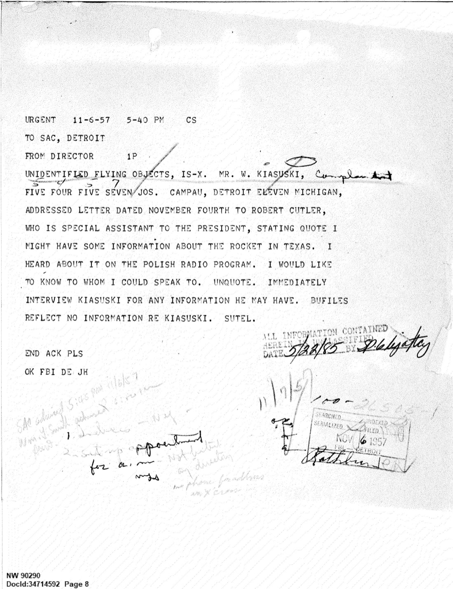
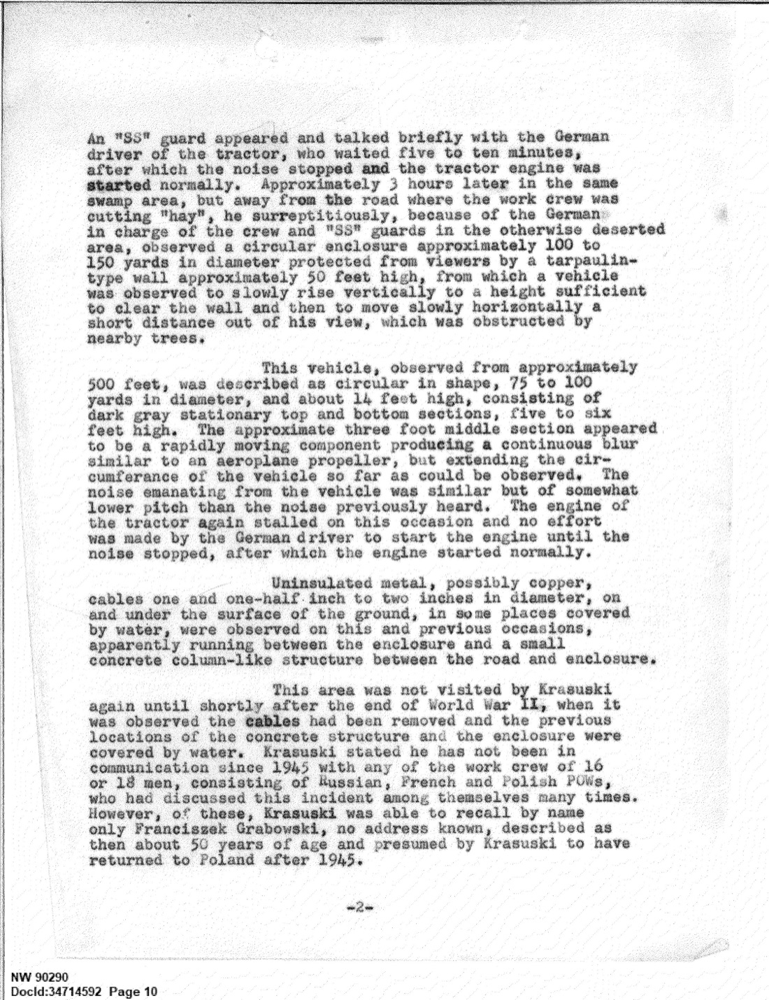
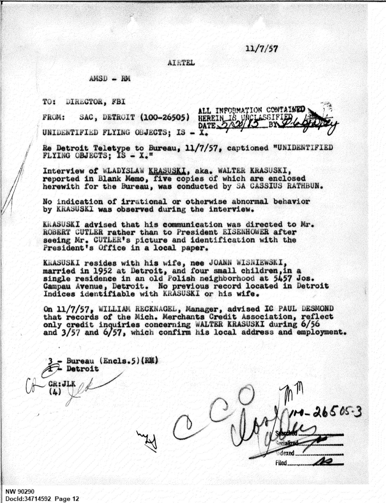
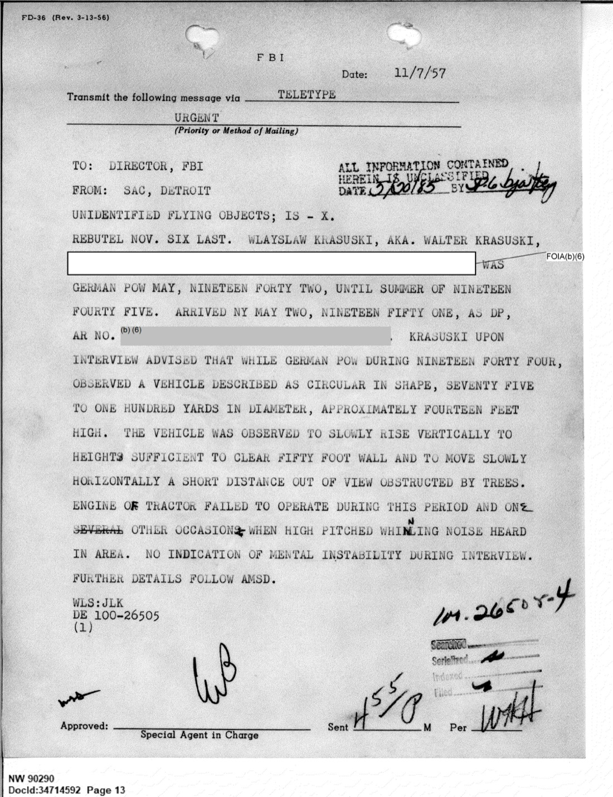

# #032 FBI 1957-11-07：波蘭戰俘 Krasuski 證述 1944 Gut Alt Golssen 圓盤型載具

| 欄位 | 內容 |
|---|---|
| 檔案編號 | 65_HS1-101634279_100-DE-26505（FBI Detroit Field Office 100-26505） |
| 來源機關 | FBI Detroit Field Office, SA Cassius Rathbun |
| 報告日期 | 1957-11-07 |
| 事件日期 | 1944 年某月（月份不詳）|
| 頁數 | 15 頁 |
| 地點 | Gut Alt Golssen（柏林東約 30 英里，今 Brandenburg 邦 Alt Golßen，Spreewald 沼澤區）|
| 機密層級 | 原機密狀態未明（FBI 標準保護）／ DECLASSIFIED |
| 公開日 | 2026-05-08 |

## 為什麼這份檔案重要

1957-11-02 到 11-03 美國德州 **Levelland UFO 事件**：多名平民駕車途中遭遇大型發光物體，車輛引擎與大燈集體熄火，物體離開後車輛恢復正常。此案在全美媒體（包括波蘭語電台）廣泛報導。

報導觸發了一位居住在底特律的波蘭裔工人 **Wladyslaw Krasuski**（化名 Walter Krasuski，前波蘭戰俘）：1944 年他在德國 Gut Alt Golssen 沼澤地強迫勞動時，曾目睹一個圓盤型載具垂直升空，現場拖拉機引擎兩度被「高頻嗡鳴」停掉、噪音消失後恢復正常。Levelland 的引擎熄火報導讓他想起 1944 年的場景。

1957-11-04 Krasuski 寫信給美國總統艾森豪的特別助理 **Robert Cutler**，說他「可能對德州那個火箭有些資訊」。Cutler 將信轉給 FBI。FBI 局長（時任 J. Edgar Hoover）1957-11-06 發 URGENT 加急電報到 Detroit Field Office，要求**當天**訪問 Krasuski。

1957-11-07 Detroit SA Cassius Rathbun 完成訪談。訪談 5 份報告同日 air mail 寄回 FBI Headquarters。

這份檔案的歷史意義：

1. **這是 FBI 已解密檔案中關於「1944 年納粹圓盤型飛行載具」的最完整目擊者證述**。
2. **目擊者是強迫勞動戰俘**（不是德國科學家、不是 SS 軍官），他的觀察是「偷看」而非「被授權看」。
3. **直接連結到 1957-11 Levelland Texas UFO 案**（自帶引擎熄火、EM 干擾現象）：Krasuski 主動建立的連結是「兩個現象的引擎停機效應相同」。
4. **FBI 的處理速度極快**：Cutler 1957-11-04 收信 → Hoover 1957-11-06 發加急 → Rathbun 1957-11-07 訪談 → 同日 5 份報告寄出。三天內走完。

## 1. 觸發點：1957-11 Levelland Texas UFO 案

1957-11-02 到 11-03 凌晨，德州 Levelland（人口約 1 萬，棉花田小鎮）出現多起 UFO 目擊。Lubbock 警局接到至少 7 通報案電話，描述：
- 巨大發光物體（橄欖球形 / 雪茄形）出現在道路上方或路面
- 駕車經過時車輛引擎與大燈集體熄火
- 物體離開後車輛立即恢復正常啟動
- 多名證人獨立報案、地點分散方圓 20 英里

新聞透過 AP/UPI 全美播報，包含底特律的波蘭語電台。Krasuski 聽到後，記起 1944 年的場景，提筆寫信給白宮。

## 2. FBI 局長加急電報：當天訪問

1957-11-06 17:40 EST，FBI Director Hoover 對 Detroit SAC 發 URGENT 加急電報：

> URGENT 11-6-57 5-40 PM CST
>
> TO SAC, DETROIT
> FROM DIRECTOR
>
> UNIDENTIFIED FLYING OBJECTS, IS-X. MR. W. KRASUSKI, [...] FIVE FOUR FIVE SEVEN JOS. CAMPAU, DETROIT ELEVEN MICHIGAN, ADDRESSED LETTER DATED NOVEMBER FOURTH TO ROBERT CUTLER, WHO IS SPECIAL ASSISTANT TO THE PRESIDENT, STATING QUOTE I MIGHT HAVE SOME INFORMATION ABOUT THE ROCKET IN TEXAS. HEARD ABOUT IT ON THE POLISH RADIO PROGRAM. I WOULD LIKE TO KNOW TO WHOM I COULD SPEAK TO. UNQUOTE. IMMEDIATELY INTERVIEW KRASUSKI FOR ANY INFORMATION HE MAY HAVE. BUFILES REFLECT NO INFORMATION RE KRASUSKI. SUTEL.

> 加急 1957-11-06 17:40 CST
>
> 致 Detroit SAC
> 自 局長
>
> 不明飛行物，IS-X。Mr. W. Krasuski（住址 5457 Jos. Campau, Detroit 11, Michigan）於 11 月 4 日致信總統特別助理 Robert Cutler，內容引用：「我可能對德州那個火箭有些資訊。我是從波蘭語電台節目聽到的。我想知道應該對誰說。」立即訪問 Krasuski 取得他可能擁有的任何資訊。FBI 檔案中無 Krasuski 相關紀錄。電報回報。

幾個動作細節：
- **「IS-X」**：FBI 內部分類碼，「Internal Security - X」，意指「無法歸類的國安事項」。1956-57 年 FBI 對 UFO 議題的標準分類碼。
- **「IMMEDIATELY INTERVIEW」**：當天就要做，不能等。
- **「BUFILES REFLECT NO INFORMATION RE KRASUSKI」**：FBI 已先掃過自己的檔案系統，確認 Krasuski 沒有任何先前紀錄（無犯罪、無情報、無政治追蹤）。這是個「乾淨」的證人。
- **「SUTEL」**：summary by teletype，要求 Detroit 用電報回傳摘要。

## 3. 訪談：1957-11-07 SA Cassius Rathbun

隔日 11-07，Detroit Field Office 派 SA Cassius Rathbun 訪問 Krasuski。Rathbun 在 5 頁的 Blank Memo 報告中記錄如下：

### Krasuski 背景

> Wladyslaw Krasuski, 5457 Joseph Campau, Detroit, was interviewed November 7, 1957 [...]
>
> Krasuski was brought from Poland as a Prisoner of War to Gut Alt Golssen, approximately 30 miles east of Berlin, Germany, in May, 1942, where he remained until a few weeks after the end of World War II. He spent the following years at Displaced Persons Camps at Kork, Strasburg, Offenburg, Mulheim and Freiburg, Germany. He attended a radio technician school at Freiburg and for about a year was employed in a textile mill at Laurachbaden, Germany. He arrived in the United States at New York, May 2, 1951, via the "S.S. General Stewart" as a Displaced Person, destined to the Reverend Father Peter Walkowiak, Hamtramck, Michigan; his alien registration number [redacted].
>
> Since May, 1951, he has been employed at the Gobel Brewery, Detroit.

> Wladyslaw Krasuski（住 5457 Joseph Campau, Detroit）於 1957-11-07 受訪 [...]
>
> Krasuski 於 1942-05 以戰俘身分由波蘭帶到 Gut Alt Golssen（柏林東約 30 英里），在當地待到二戰結束後數週。戰後幾年他住在 Kork、Strasburg、Offenburg、Mulheim 和 Freiburg 等地的流民營（DP camps）。他在 Freiburg 上過無線電技師學校，並在 Laurachbaden 一家紡織廠工作了約一年。1951-05-02 他搭乘「S.S. General Stewart」抵達紐約，以流民身分定居 Hamtramck（Michigan）的 Peter Walkowiak 神父處；他的外國人登記號碼 [遮蔽]。
>
> 1951 年 5 月起在底特律 Gobel 啤酒廠工作。

身分核驗點：
- 1942-1945 在 Gut Alt Golssen 強迫勞動，三年。
- 戰後在德國多個 DP camps 流轉，含 Freiburg、Strasburg。
- 1951 經紅十字會程序作為流民移民美國。
- 1951 起在底特律 Gobel Brewery 穩定工作 6 年。

FBI 訪後評語（p-12）：

> No indication of irrational or otherwise abnormal behavior by KRASUSKI was observed during the interview.

> 訪談期間未見 Krasuski 有任何不理性或異常行為跡象。

接著 Rathbun 還特別查了 Detroit Indices（FBI 在地檔案系統）和 Mich. Merchants Credit Association：Krasuski 與妻子 Joann Wisniewski（1952 結婚於底特律，育有 4 名幼兒）無任何問題紀錄，信用查詢只有 1956-57 之間 3 筆例行就業確認查詢。

是一個非常乾淨的中產勞工證人。

## 4. 1944 年的場景

### 4.1 拖拉機停機事件

> During 1944, month not recalled, while enroute to work in a field a short distance north of Gut Alt Golssen, their tractor engine stalled on a road through a swamp area. No machinery or other vehicle was then visible although a noise was heard described as a high-pitched whine similar to that produced by a large electric generator.
>
> An "SS" guard appeared and talked briefly with the German driver of the tractor, who waited five to ten minutes, after which the noise stopped and the tractor engine was started normally.

> 1944 年（月份不詳），在前往 Gut Alt Golssen 以北不遠處田地工作途中，他們的拖拉機引擎在穿過沼澤區的道路上熄火。當時看不到任何機械或其他車輛，但聽到一種被描述為「高頻嗡鳴」、類似大型發電機產生的噪音。
>
> 一名 SS 警衛出現，與拖拉機的德國駕駛簡短交談，駕駛等候了 5 到 10 分鐘，之後噪音停止，拖拉機引擎正常啟動。

技術細節：
- **拖拉機引擎熄火**：與外部噪音同時發生。
- **「沒有任何機械或車輛在視野中」**：噪音來自不可見的源頭。
- **SS 警衛主動介入**：知道發生了什麼、不需要工人發問。德國駕駛「等候」5-10 分鐘，被告知不要嘗試重啟引擎，這意味駕駛知道引擎不會回應。
- **噪音停止後引擎正常啟動**：強烈暗示是電磁性的引擎干擾，而非機械故障。
- **「類似大型發電機」**：高頻、持續、穩定的旋轉電機特徵噪音。

### 4.2 圓盤型載具的偷看

3 小時後，工作隊在同一區附近割「乾草」（hay）。Krasuski 趁 SS 警衛不注意時偷看：

> Approximately 3 hours later in the same area, but away from the road where the work crew was cutting "hay", he surreptitiously, because of the Germans in charge of the crew and "SS" guards in the otherwise deserted area, observed a circular enclosure approximately 100 to 150 yards in diameter protected from viewers by a tarpaulin-type wall approximately 50 feet high, from which a vehicle was observed to slowly rise vertically to a height sufficient to clear the wall and then to move slowly horizontally a short distance out of his view, which was obstructed by nearby trees.
>
> This vehicle, observed from approximately 500 feet, was described as circular in shape, 75 to 100 yards in diameter, and about 14 feet high, consisting of dark gray stationary top and bottom sections, five to six feet high. The approximate three foot middle section appeared to be a rapidly moving component producing a continuous blur similar to an aeroplane propeller, but extending the circumference of the vehicle so far as could be observed. The noise emanating from the vehicle was similar but of somewhat lower pitch than the noise previously heard. The engine of the tractor again stalled on this occasion and no effort was made by the German driver to start the engine until the noise stopped, after which the engine started normally.

> 約 3 小時後在同一區，但遠離道路，工作隊正在割「乾草」。由於現場有德國工頭和 SS 警衛、其餘為荒地，他偷偷觀察到一個圓形圍場，直徑約 100 到 150 碼，被一面約 50 英尺高的帆布型牆遮蔽以阻擋視線。從圍場中觀察到一個載具緩慢垂直升起，升到足以越過牆面的高度，然後緩慢水平移動了短距離後消失在他視野外（被附近樹木遮擋）。
>
> 從約 500 英尺距離觀察，這個載具被描述為：圓形、直徑 75 到 100 碼、約 14 英尺高，由深灰色的靜止上下段組成，每段 5 到 6 英尺高。中間約 3 英尺的部分像是一個快速移動的構件，產生類似飛機螺旋槳的連續模糊影像，但在可觀察範圍內延伸覆蓋整個載具的圓周。從載具發出的噪音與先前聽到的相似，但音調稍低。拖拉機引擎在此時再次熄火，德國駕駛不嘗試啟動引擎，直到噪音停止後引擎正常啟動。

技術描述的鑑別力：
- **尺寸**：直徑 75-100 碼（約 70-90 公尺）、高 14 英尺（約 4.3 公尺）。這是巨型載具，比 B-29 翼展（43 m）大得多。
- **三段結構**：上段（5-6 ft 靜止深灰）+ 中段（~3 ft，旋轉模糊環）+ 下段（5-6 ft 靜止深灰）。
- **中段旋轉**：類似螺旋槳但「延伸整個圓周」。也就是中段是一個整圈旋轉、產生 propeller-like blur 的環，圍著整個載具一周。
- **運動學**：垂直升空 → 越過 50 ft 圍牆 → 水平短距離移動。沒有翅膀、沒有尾旋翼、沒有可見推進機構。
- **噪音與引擎熄火同步**：垂直升空期間引擎熄火，噪音停止後引擎恢復。

這個「上下兩段靜止、中段旋轉」的構造與 **Richard B. Russell 1955 蘇聯外高加索目擊**（[#024 報告](../024-341_110677_numerical_file_5-2500_azerbaijan/report.md)）中描述的「外殼旋轉、內部燈靜止」運動學在大方向上是同類運動學：旋轉部件 + 靜止部件 + 圓盤本體。

### 4.3 地面上的電纜

> Uninsulated metal, possibly copper, cables one and one-half inch to two inches in diameter, on and under the surface of the ground, in some places covered by water, were observed on this and previous occasions, apparently running between the enclosure and a small concrete column-like structure between the road and enclosure.

> 未絕緣的金屬（可能是銅）電纜，直徑 1.5 至 2 英寸，鋪設於地面及地下，部分被水覆蓋，這次以及之前幾次在現場都觀察到，明顯走線於圍場和路與圍場之間一個小型混凝土柱狀結構之間。

工程含義：
- **直徑 1.5-2 英寸銅纜**：對應數百安培級的大電流傳輸。
- **未絕緣 + 部分被水覆蓋**：典型的高壓接地系統設計，沼澤地的高導電水體被當作接地網。
- **混凝土柱狀結構**：可能是變電站或大型發電/儲能裝置外殼。

戰俘看到的是一個正在運作中的大功率電力系統，其電源系統與載具的「中段旋轉 + 引擎熄火」現象高度相關。

### 4.4 戰後重訪

> This area was not visited by Krasuski again until shortly after the end of World War II, when it was observed the cables had been removed and the previous locations of the concrete structure and the enclosure were covered by water.

> Krasuski 直到二戰結束後不久才再次造訪該地，當時觀察到電纜已被移除，先前混凝土結構和圍場的位置都被水淹沒。

「被水淹沒」可能是德軍撤退前主動破壞 + 地下水回填，或是德國末期沼澤水位變化。電纜被移除而非任由腐爛，意味退場是有計畫的，這條線本身就是這項計畫存在的證據。

### 4.5 工作隊組成

> Krasuski stated he has not been in communication since 1945 with any of the work crew of 16 or 18 men, consisting of Russian, French and Polish POWs, who had discussed this incident among themselves many times. However, of these, Krasuski was able to recall by name only Franciszek Grabowski, no address known, described as then about 50 years of age and presumed by Krasuski to have returned to Poland after 1945.

> Krasuski 表示自 1945 年起未與工作隊 16 或 18 人的任何成員聯繫過，該工作隊由蘇聯、法國和波蘭戰俘組成，他們之間曾多次討論此事件。但其中他只能記得 Franciszek Grabowski 的名字（地址不明，當時約 50 歲，Krasuski 推測戰後返回波蘭）。

這個關鍵細節：**16-18 名 POW 同時目擊並多次討論此事**。Krasuski 不是孤證。但這 12 年後，這些目擊者分散在蘇聯、法國、波蘭，冷戰期間 FBI 無法循線追訪。

## 5. FBI 處理流程

訪談完當天，Rathbun 寫了 5 份 Blank Memo 報告，5 份副本同時 air mail 寄到 FBI Headquarters。Detroit SAC 同日 11-07 又發了 URGENT 加急電報摘要回報 Director：

> WLADYSLAW KRASUSKI, AKA. WALTER KRASUSKI, [redacted], GERMAN POW MAY, NINETEEN FORTY TWO, UNTIL SUMMER OF NINETEEN FORTY FIVE. [...] KRASUSKI UPON INTERVIEW ADVISED THAT WHILE GERMAN POW DURING NINETEEN FORTY FOUR, OBSERVED A VEHICLE DESCRIBED AS CIRCULAR IN SHAPE, SEVENTY FIVE TO ONE HUNDRED YARDS IN DIAMETER, APPROXIMATELY FOURTEEN FEET HIGH. THE VEHICLE WAS OBSERVED TO SLOWLY RISE VERTICALLY TO HEIGHTS SUFFICIENT TO CLEAR FIFTY FOOT WALL AND TO MOVE SLOWLY HORIZONTALLY A SHORT DISTANCE OUT OF VIEW OBSTRUCTED BY TREES. ENGINE OR TRACTOR FAILED TO OPERATE DURING THIS PERIOD AND ONE SEVERAL OTHER OCCASIONS WHEN HIGH PITCHED WHIRLING NOISE HEARD IN AREA. NO INDICATION OF MENTAL INSTABILITY DURING INTERVIEW. FURTHER DETAILS FOLLOW AMSD.

> Wladyslaw Krasuski（化名 Walter Krasuski），1942 年 5 月至 1945 年夏天為德國戰俘 [...] 訪談中 Krasuski 陳述，在 1944 年作為德國戰俘期間，目擊一個圓盤型載具，直徑 75 至 100 碼，約 14 英尺高。載具被觀察到緩慢垂直升空到足以越過 50 英尺牆的高度，並水平短距離移動後消失於樹林遮擋之外。在此期間及其他幾次區域內聽到高頻旋轉噪音時，拖拉機引擎都無法運作。訪談中未見任何精神不穩跡象。完整細節將以航空郵件後送。

FBI 對 UFO 報告的標準處理是「IS-X 歸檔，不主動調查」。但這份 Krasuski 案的處理速度（接信→局長加急→當天訪問→當天報告→當天回電）顯示 1957-11 Levelland 事件當下，FBI 對「引擎熄火現象 + 1944 納粹原型」這條線是有興趣的。

最終本案的下落：報告歸 FBI 100-DE-26505 卷宗，FBI 沒有作任何後續調查（沒有要求美方軍情單位確認 Gut Alt Golssen 1944 年的德軍設施紀錄，沒有試圖追訪其他 POW，沒有比對德國當代航空檔案）。檔案沉澱了 69 年，直到 2026-05-08 公開。

## 6. 歷史脈絡：Gut Alt Golssen 是哪裡？

**Gut Alt Golssen** 是位於今 Brandenburg 邦的小村莊 Alt Golßen（屬 Spreewald 沼澤區）。「Gut」是德文「莊園、農場」之意，所以「Gut Alt Golssen」是 Alt Golßen 村裡的某個農場/莊園。地理上：
- 柏林東南方約 80 km（Krasuski 估計「30 miles east」略偏，實際距離較遠且方位偏東南）。
- 位於 Spree 河沼澤水網區，地形吻合 Krasuski 描述的「swamp area」。
- 1942-1945 是 SS 控制下的強迫勞動區域，附近有 Sachsenhausen 集中營分支。

戰後盟軍對德國「Wunderwaffe」（神奇武器）計畫的接收與審訊（Operation Paperclip、Operation Lusty）紀錄中，Brandenburg 區域有多個「未列名」的 SS 工程計畫地點。Gut Alt Golssen 不在主要的 Peenemünde / Mittelwerk 名單上，符合「次要、外圍、地下」型計畫的地理特徵。

戰後德國 SS Geheimwaffe / Die Glocke / Vril / Haunebu 等納粹圓盤傳說的書面與口述來源，幾乎全部是 1960 年代以後出現的，主要源頭包括 Polish 工程師 Igor Witkowski 1990 年代的著作。Krasuski 這份 1957-11 證述比所有公開的「納粹圓盤」文獻早了 3-30 年，且來源是 FBI 正式檔案，不是民間傳聞。

## 7. 觀察

**(1) 證人的可信度**：Krasuski 是強迫勞動戰俘出身、戰後流民、底特律啤酒廠工人、與妻 Joann 育 4 子的中產家庭男子。FBI 在地檔案系統與信用查詢顯示乾淨紀錄。SA Rathbun 訪後評語「未見任何不理性或異常行為」。他不是 UFO 愛好者、不是政治運動者、不是經濟收益者，他主動寫信給白宮的動機只能用「看到 Levelland 報導後產生的時隔 13 年的辨識感」解釋。

**(2) 證述本身的內部一致性**：兩次「拖拉機停機」事件在邏輯上連貫，第一次先聽到噪音，再有 SS 警衛來通知「等等」；第二次目擊載具升空時引擎再次熄火、噪音停止後恢復。中段旋轉 + 上下段靜止的描述具體到工程細節（5-6 ft + 3 ft + 5-6 ft 三段，深灰色，旋轉如螺旋槳但繞圓周）。電纜的工程描述（直徑 1.5-2 英寸、未絕緣、地下走線、混凝土柱狀結構）也是技工級的描述粒度。

**(3) FBI 處理速度的反差**：Hoover 加急 + 當天訪問 + 當天 5 份報告寄出 + 當天 URGENT 回電。對應後續完全無後續調查的反差。可能的解釋：FBI 在 1957-11 Levelland 當下被白宮要求快速回報，但 FBI 本身對「戰時德國原型」這條線沒有後續資源或意願追下去。

**(4) 「中段旋轉」與其他案件的呼應**：本案描述的旋轉部件 + 靜止部件三段結構，與 [#024 Russell 1955 蘇聯外高加索目擊](../024-341_110677_numerical_file_5-2500_azerbaijan/report.md)「外殼順時針旋轉、內部兩盞燈靜止」屬於同類運動學。兩個案件目擊地點分別是 1944 納粹德國、1955 蘇聯外高加索，相隔 11 年。

**(5) 引擎熄火與 EM 干擾**：Krasuski 描述的「噪音 → 引擎熄火 → 噪音停 → 引擎恢復」與 1957-11 Levelland 多名駕駛報告的引擎/大燈熄火現象是同一種電磁干擾 signature。1944 年的工程技術背景中，能在 50-500 ft 距離以非接觸方式停掉內燃機引擎的裝置，1957 年依然不存在於公開工程文獻中。

**(6) 為何 FBI 不繼續追**：可能的原因組合，(a) 工程證據（電纜、混凝土結構）已被淹沒，不可現場驗證；(b) 其他證人（蘇聯、法國、波蘭 POWs）分散在鐵幕兩側，冷戰背景下無法跨境追訪；(c) Krasuski 本人對 1944 後續無資訊可提供；(d) 案件落在「IS-X」分類，FBI 本就不負責 UFO 研究主動調查。

## 8. 跨檔案連結

- **[#022 SHAEF foofighters 1944-1945](../022-331_120752_numeric_files_1944-1945_37153_german_armament_equipment_documents/report.md)**：本檔案的直接時間鄰居。SHAEF 1944-12 → 1945-03 公文鏈描述 415th NFS 在德國上空看到「foofighters」並追問德軍是否有對應武器。Krasuski 1944 年在 Gut Alt Golssen 沼澤地看到的，是 SHAEF 公文鏈中那條「未知德軍武器」假設的潛在物理候選人之一。SHAEF 結案信「Me 262 + flak rocket，但 still a mystery」中那個「mystery」括號，本檔案的 1944 證述提供了一個非傳統候選人（圓盤型 + 旋轉中段 + EM 干擾推進）。
- **[#024 Russell 1955 蘇聯外高加索目擊](../024-341_110677_numerical_file_5-2500_azerbaijan/report.md)**：本檔案描述的「上下靜止 + 中段旋轉」與 #024 Russell 看到的「外殼旋轉 + 內部燈靜止」屬於同類運動學。兩個目擊地點分別是 1944 納粹德國 + 1955 蘇聯。如果這真的是同一條技術線（德國原型 → 戰後蘇聯接收），那麼 [#017 Twining 信](../017-18_100754_general_1946-7_vol_2/report.md)第 2.h.(3) 段「foreign nation with form of propulsion possibly nuclear, which is outside of our domestic knowledge」括號裡的「外國」，1944 是德國，1955 是蘇聯。
- **後續 FBI Levelland 1957-11 卷宗**：Krasuski 案是 FBI 對 Levelland 事件之回應的支線。Levelland 主案在後續 FBI 卷宗中。

## 9. 來源

- 原始檔案：[U.S. Department of War — 65_HS1-101634279_100-DE-26505](https://www.war.gov/UFO/#65_HS1-101634279_100-DE-26505)
- PDF 直接下載：`https://www.war.gov/medialink/ufo/release_1/65_hs1-101634279_100-de-26505.pdf`
- 公開日：2026-05-08
- 15 頁，FBI Detroit Field Office 100-26505，DECLASSIFIED (NW 90290 / DocID 34714592)
