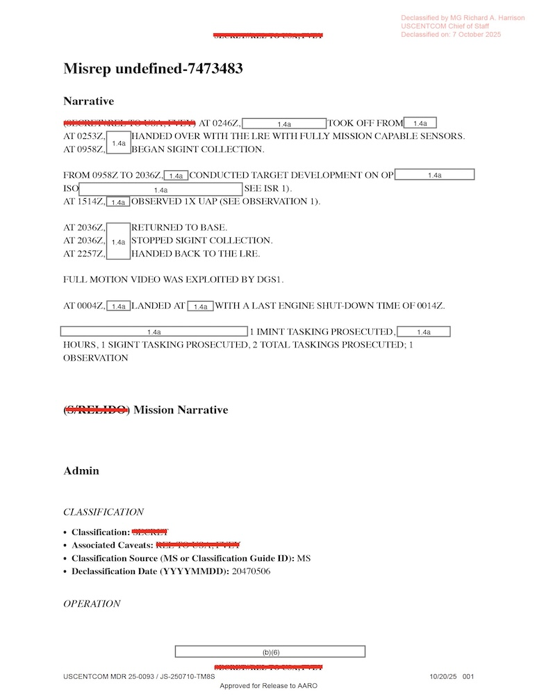

# DOW-UAP-D10, Mission Report, Middle East, May 2022

| 機關 | Department of War |
| --- | --- |
| 類型 | PDF |
| 事件日期 | 2022-05-06 |
| 地點 | Iraq |
| 釋出日期 | 2026-05-08 |

> 由 Claude Opus 4.7 整理

## 摘要

2022 年 5 月 6 日，美軍一架 ISR 飛機（機型遭塗黑）在伊拉克上空執行反 ISIS 目標發展任務。從 1514Z 到 1934Z 約 4 小時 20 分鐘的觀察期間，操作員透過全動態影像（FMV）看到 5 個物體飛越視野，並自行給出常規解釋：1 個看起來像飛彈，4 個看起來像鳥。報告依 MISREP 制式格式呈報給 AARO，標記為 unresolved，意指感測器資料不足以做最終分類。

## 內容

報告封面是標準解密章與機密分級欄。內文採用 USCENTCOM 制式的 MISREP 表單，共 6 頁，欄位涵蓋作戰、機組、裝備、時間軸、ISR 任務與觀察。

任務從 0246Z 起飛開始。飛機從某基地（地點塗黑）升空，0958Z 進入任務區並啟動 SIGINT（訊號情報）蒐集。在那之後直到 2036Z 共 11 小時，飛機對某行動執行目標發展（Target Development），任務目的是回報人員、車輛、武器、足跡、通訊裝備等情資。

1514Z 是事件的轉折點。操作員在 FMV 視野中第一次看到不明物體，視覺偵察判讀（VISRECCE）寫成「可能是某型飛彈」，地點靠近座標 38SMC53。到 1934Z 為止，視野裡陸續出現另 4 個物體，被判讀為「較符合鳥的特徵」。GENTEXT/OBSERVATION 欄位明確記錄：「FROM 1514Z to 1934Z, observed 5x UAP fly across the screen.」當天有沙塵，官方註記阻礙 FMV 對地面的蒐集。

機密分級為 SECRET // REL TO USA, FVEY。2025-10-07 由 USCENTCOM 參謀長 MG Richard A. Harrison 解密（案號 MDR 25-0093 / JS-250710-TM8S），最後經「批准釋出予 AARO」流程進入 2026 年 5 月的 PURSUE 公開。報告中的飛機機型、起降基地、航向、高度、空速、座標尾段全被《行政命令 13526》§1.4(a) 抹除。

> **小結**：文件本身真實性高，USCENTCOM、432 AEW、609 CAOC、Operation INHERENT RESOLVE 都對得上實際單位與行動，§1.4(a) 與 MGRS 38SMC 也都符合美軍機密管理規範與伊拉克地理範圍。可疑的是判讀只有 FMV 視覺、沒有雷達或紅外交叉，redaction 抹掉機型與座標尾段使讀者無法重建觀測幾何，且報告批准釋出予 AARO 之後的最終結論並未對外公開。觀察事件本身可確認為真，5 個物體的真實身分超出文件本身可確認的範圍。

## 完整內容

> Declassified by MG Richard A. Harrison, USCENTCOM Chief of Staff
> Declassified on: 7 October 2025
> Approved for Release to AARO
> USCENTCOM MDR 25-0093 / JS-250710-TM8S
> 機密等級：SECRET // REL TO USA, FVEY

### 任務概要（Mission Narrative）

> （SECRET\\REL TO USA, FVEY）

於 0246Z 時，`1.4a` 自 `1.4a` 起飛。
於 0253Z 時，由 LRE（Launch & Recovery Element，起降單位）完成移交，所有任務感測器運作正常。`1.4a`
於 0958Z 時，`1.4a` 開始進行 SIGINT（訊號情報）蒐集。

從 0958Z 至 2036Z 期間，`1.4a` 對 `1.4a` 行動執行目標發展（Target Development），ISO（in support of，支援）`1.4a`（詳見 ISR 1）。
於 1514Z 時，`1.4a` 觀察到 1 個 UAP（詳見 OBSERVATION 1）。

於 2036Z 時，`1.4a` 返航。
於 2036Z 時，`1.4a` 停止 SIGINT 蒐集。
於 2257Z 時，移交回 LRE。

全動態影像（Full Motion Video，FMV）由 DGS1 進行判讀利用。

於 0004Z 時，`1.4a` 在 `1.4a` 降落，最後引擎關機時間 0014Z。

`1.4a` 共執行 1 項 IMINT（影像情報）任務，`1.4a` 小時，1 項 SIGINT 任務，合計 2 項任務；產生 1 筆觀察。

> （S/RELIDO）Mission Narrative（任務敘事）

### Admin（行政欄位）

#### CLASSIFICATION（機密分級）
- Classification（機密等級）：SECRET
- Associated Caveats（附加限制）：REL TO USA, FVEY
- Classification Source（機密來源，MS 或機密指南 ID）：MS
- Declassification Date（解密日期，YYYYMMDD）：20470506

### OPERATION（作戰）
- Operation（行動代號）：INHERENT RESOLVE
- Domain（領域）：AIR（空中）
- Operations Center（作戰中心）：609th
- Major Command, MAJCOM（主要司令部）：AFCENT（美空軍中央司令部）
- Combatant Command, COCOM（戰鬥司令部）：USCENTCOM（美中央司令部）

### MSGID（訊息識別）
- Report Type（報告類型）：MISREP
- Originator（發出單位／中隊）：`1.4a`
- Submit Date（提交日期）：（空白）

### MSNID（任務識別）
- Tasking Order, ATO（任務指派令）：AB
- Mission Type（任務類型）：XCAS
- ATO Mission Number（任務編號）：`1.4a`
- Country Tasked（指派國家）：US（美國）
- Service Tasked（指派軍種）：A（空軍）

### POC（聯絡人，Point of Contact）
- Rank（軍階）：SSgt（Staff Sergeant，士官長）
- Full Name（全名）：(b)(3), 130b, (b)(6)
- Unit（單位）：`1.4a`
- Wing（聯隊）：432 AEW（第 432 遠征空中聯隊）
- Phone Number（電話）：(b)(6)
- Email：(b)(6)
- Service（軍種）：Air Force（空軍）
- Operations Center（作戰中心）：609 CAOC（第 609 聯合空中作戰中心）

### QC（品管，Quality Control）
- Rank：SrA（Senior Airman，高級航空兵）
- Full Name：(b)(3), 130b, (b)(6)
- Unit：`1.4a`
- Wing：432 AEW
- Phone Number：(b)(6)
- Email：(b)(6)
- Service：Air Force
- Operations Center：609 CAOC

### APPROVER（核可人）
- Rank：SSgt
- Full Name：(b)(3), 130b, (b)(6)
- Unit：ISRD（情監偵單位）
- Wing：379 AEW（第 379 遠征空中聯隊）
- Phone Number：(b)(6)
- Email：(b)(6)
- Service：Air Force
- Operations Center：609 CAOC

### INGEST（接收欄位）
全部空白。

### ACEQUIP（飛機裝備）
- Aircraft Callsign（飛機呼號）：`1.4a`
- Radar Name or Destination（雷達名稱／目的）：（空白）
- Radar Software Load or Mission Data（雷達軟體載入／任務資料）：（空白）
- Radar Warning Receiver, RWR（雷達告警接收機）：（空白）
- RWR Software Load or Mission Data：（空白）
- MWS Name or Designator（飛彈警告系統）：（空白）
- MWS Software Load or Mission Data：（空白）
- IRCM Name or Designator（紅外反制）：（空白）
- IRCM Software Load or Mission Data：（空白）
- ECM Name or Designator（電子反制）：（空白）
- ECM Software Load or Mission Data：（空白）
- CMD Name or Designator（CMD 名稱／代號）：（空白）
- Chaff Designator（金屬箔絲代號）：（空白）
- Num Chaff or Cartridges（金屬箔絲／彈匣數量）：（空白）
- Flare Designator（熱焰彈代號）：（空白）
- Num Flares（熱焰彈數量）：（空白）
- Towed Decoy Name or Designator（拖曳誘標）：（空白）
- Towed Decoy Software Load or Mission Data：（空白）
- Num Towed Decoys（拖曳誘標數量）：（空白）
- Type of Radar-Guided AAM（雷達導引空對空飛彈類型）：（空白）
- Num Radar-Guided AAM（雷達導引空對空飛彈數量）：（空白）
- Type of IR-Guided AAM（紅外導引空對空飛彈類型）：（空白）
- Num IR-Guided AAM（紅外導引空對空飛彈數量）：（空白）
- Gun Name or Designator（機砲名稱／代號）：（空白）
- Num Gun Rounds（機砲彈數）：（空白）
- Air-to-Ground Wpn to Include Num of Each（空對地武器與各自數量）：`1.4a`
- TGT Pod Name or Designator（目標標定莢艙名稱／代號）：`1.4a`
- Additional Avionics（額外航電）：`1.4a`
- Data Link（資料鏈）：（空白）
- Gentext：（空白）

### Timeline（時間軸）

#### Takeoff（起飛）
- Callsign（呼號）：`1.4a`
- Number of Aircraft（飛機數量）：1
- Asset Type, Aircraft（機型）：`1.4a`、`1.4g`
- Aircraft Tail Number(s)（機尾編號）：`1.4a`
- Takeoff Location, ICAO Code（起飛地點，ICAO 代碼）：`1.4a`
- Takeoff Time DTG（起飛時間，日時組）：060246:00ZMAY22（即 2022-05-06 02:46Z）
- Mode 3, IFF Codes（敵我識別碼）：（空白）
- Gentext/Additional Details：-
- Mission Canceled（任務是否取消）：（空白）

#### On Station（進入任務區）
- Time On Station DTG：060958:00ZMAY22（2022-05-06 09:58Z）
- Callsign：`1.4a`
- JTAR Number（聯合戰術空中要求編號）：-
- Killbox, Location（攻擊區位置）：-
- Mission Type：REC\XCAS（偵察／延伸密接空中支援）
- JTAC Callsign（聯合終端攻擊管制員呼號）：-
- Gentext/Additional Details：-
- Did not Arrive On Station（未抵達任務區）：（空白）

#### Off Station（脫離任務區）
- Time Off Station DTG：062036:00ZMAY22（2022-05-06 20:36Z）
- Total Time On Station（任務區停留總時間）：`1.4a`
- Gentext/Additional Details：（空白）

#### Landing（降落）
- Last Land Location, ICAO Code：`1.4a`
- Last Land Time：070004:00ZMAY22（2022-05-07 00:04Z）
- Last Engine Shutdown Time：070014:00ZMAY22（2022-05-07 00:14Z）
- Total Mission Time（總任務時間）：`1.4a`
- Gentext/Additional Details：-

### ISR（情報、監控、偵察）

- Time-on Station DTG：060958:00ZMAY22
- Time-off Station DTG：062036:00ZMAY22
- Aircraft Callsign：`1.4a`
- Msn Type：REC\XCAS
- Primary Sensor（主要感測器）：FMV\SI（全動態影像／訊號情報）
- Sensors Available（可用感測器）：`1.4a`
- Tasking Type（指派類型）：PLANNED（預劃）
- Tasking or Request Number（指派或請求編號，JTAR#、AEM#、PRI# 或 TIC#）：-
- BE Number, if NTISR（基本目標編號，若為非傳統 ISR）：-
- Tasked Start Point（指派起始點）：38SMC54 `1.4a` 96 `1.4a`
- Activity Description（活動描述）：TARGET DEVELOPMENT（目標發展）
- FMV or Image File Name, if NTISR：-
- EEIs Observed（觀察到的關鍵情報要素）：（空白）
- Number of EEIs：（空白）

#### GENTEXT/ISR
> （SECRET//REL TO USA, FVEY）

`1.4a` 對 `1.4a` 行動執行目標發展。任務指派的目的是回報所有人員、車輛、武器、足跡、通訊裝備與被佔據的橋樑著陸點（BDLS）。於 1515Z 時，`1.4a` 在其視野（FOV）內、靠近 38SMC54 `1.4a` 96 `1.4a` 處，觀察到一個可能的 UAP（詳見 OBVS 1）。`1.4a` 持續執行 `1.4a` 活動直至 RTB（return to base，返航）。

#### ISR ASSET UTILIZATION（情監偵資產運用）
- Supported Unit（支援單位）：MAG
- Supported Operation（支援行動）：OP `1.4a`
- Precoord Time（事前協調時間）：240 MINUTES
- Precoord Effectiveness（事前協調效益）：SATISFACTORY（滿意）

### WEATHER（天氣）
> （SECRET\\REL TO USA, FVEY）

DUST HINDERED MOST FMV COLLECTION OF THE GROUND.（沙塵阻礙了大部分對地面的全動態影像蒐集。）

### EFFECTIVENESS（任務效益）
- Tasker（指派者）：（空白）
- Intel Gap Filled?（情報缺口是否補足）：Yes
- Gentext：-

### OBSERVATION（觀察）

- Observation DTG：061514:00ZMAY22（2022-05-06 15:14Z）
- Aircraft Callsign：`1.4a`
- Aircraft Location（飛機位置）：38SMC53 `1.4a` 96 `1.4a`
- Aircraft Heading（航向）：-
- Aircraft Altitude（高度）：`1.4a`
- Aircraft Airspeed（空速）：-
- Relative Bearing or Clock Position（相對方位或時鐘位置）：-
- Range（距離）：-
- Killbox & Keypad（攻擊區與小區）：-
- Observed Activity Location（觀察到的活動位置）：38SMC53 `1.4a` 96 `1.4a`
- Observed Activity Description（觀察到的活動描述）：1X UAP（一個 UAP）
- Method of Observation（觀察方式）：FMV（全動態影像）
- EEIs Observed：（空白）
- Number of EEIs：（空白）

#### GENTEXT/OBSERVATION
> （SECRET//REL TO USA, FVEY）

從 1514Z 至 1934Z，`1.4a` 觀察到 5 個 UAP 飛越螢幕。於 1514Z 時，`1.4a` 觀察到一個視覺偵察判讀（VISRECCE）疑似為 `1.4a` 飛彈的 UAP，飛越其視野，靠近 38SMC53 `1.4a` 96 `1.4a` 處。`1.4a` 隨後在其視野中持續觀察到另外 4 個 UAP，直至 1934Z。其餘 4 個 UAP 較符合可能為鳥類的特徵。

### WEATHER（重複欄位）
> （SECRET\\REL TO USA, FVEY）

DUST HINDERED MOST FMV COLLECTION OF THE GROUND.

[官方 PDF](https://www.war.gov/medialink/ufo/release_1/dow-uap-d10-mission-report-middle-east-may-2022.pdf)
