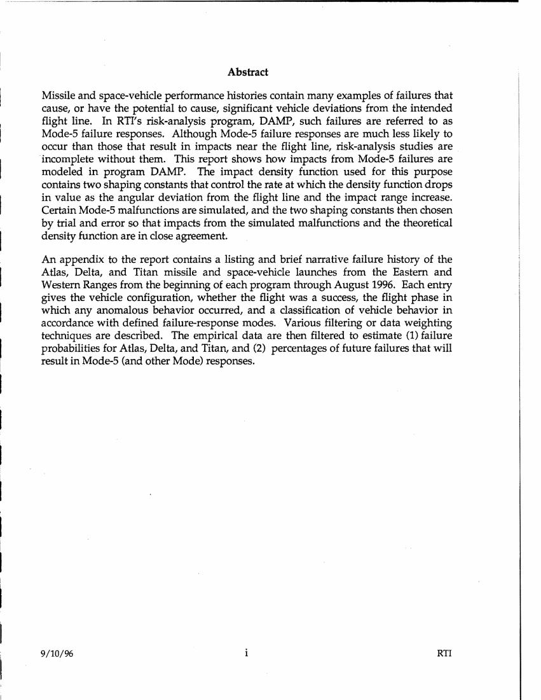
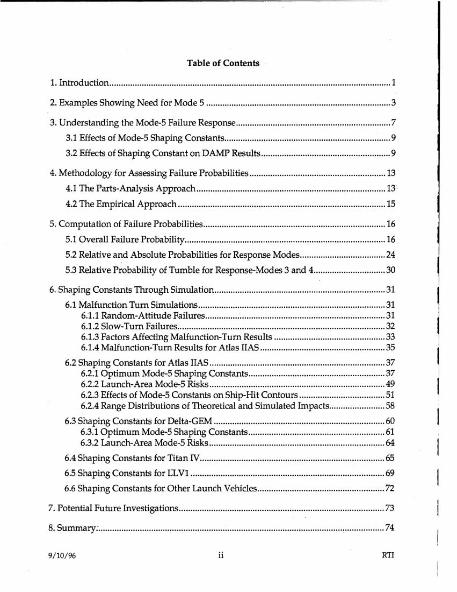
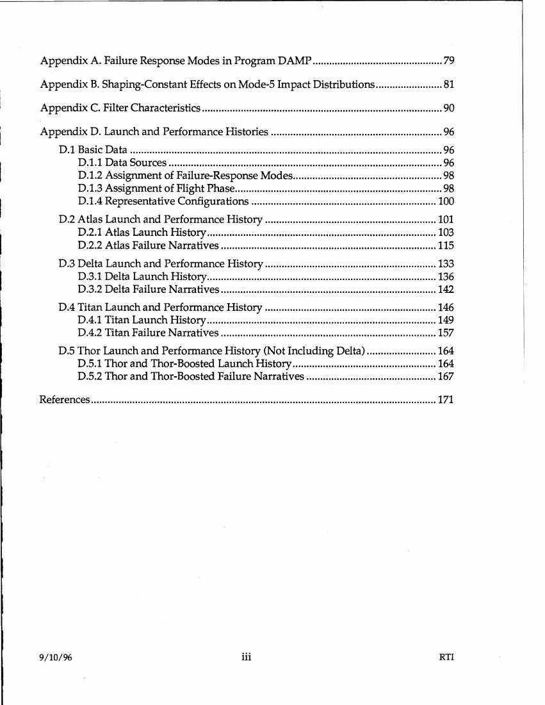

# #057 DOW-UAP-D48：1996-09-10 RTI（Research Triangle Institute）為 USAF 30/45 Space Wing 安全室撰寫的「太空助推器不太可能失效之風險建模」最終報告，181 頁純 Range Safety 技術文件，**全文無 UAP 內容**

| 欄位 | 內容 |
|---|---|
| 報告類型 | **技術契約最終報告**（RTI/5180/77-43F） |
| 識別碼 | DOW-UAP-D48 |
| 日期 | **1996-09-10** |
| 標題 | "Modeling Unlikely Space-Booster Failures in Risk Calculations" |
| 契約編號 | **F04703-91-C-0112**（Air Force Space Command） |
| 主執行單位 | **ACTA, Inc.**（Torrance, CA）|
| 分包單位 | **Research Triangle Institute** Center for Aerospace Technology, Launch Systems Safety Department（Cocoa Beach, FL） |
| 作者 | James A. Ward, Jr.（RTI）+ Robert M. Montgomery（RTI） |
| 客戶單位 1 | **Department of the Air Force, 45th Space Wing (AFSPC), Safety Office (45 SW/SE)**, Patrick AFB, FL 32925（東岸 ER 範圍） |
| 客戶單位 2 | **Department of the Air Force, 30th Space Wing (AFSPC), Safety Office (30 SW/SE)**, Vandenberg AFB, CA 93437（西岸 WR 範圍） |
| 對接窗口 | Mr. Martin Kinna (30 SW/SEY) + Louis J. Ullian, Jr. (45 SW/SED) |
| 機密層級 | **Unclassified**（但限 US Government agencies and their contractors） |
| 分發限制 | Distribution authorized to US Government agencies and their contractors to protect administrative/operational use data, 10 September 96 |
| DTIC 編號 | 19961025 122 |
| PDF 頁數 | **181 頁** |
| 公開日 | 2026-05-08 |

## 為什麼一份 1996 年 RTI 火箭失效建模報告會出現在 UAP 釋出包

D48 與 D 系列其他案件（軍方 MISREP / SPEAR Range Fouler Form）有根本性質差異。**全文 181 頁無任何 UAP / UFO / unidentified object / anomalous object 相關詞彙**，內容完全是太空助推器（Atlas / Delta / Titan）在「Mode-5 失效」下偏離飛行線的衝擊範圍機率建模。

收錄在 DOW UAP 釋出包的可能原因：

1. **Range Safety Office 檔案重疊**：**45 SW/SE（Patrick AFB）**與 **30 SW/SE（Vandenberg AFB）**這兩個太空安全室同時也負責「**Range Fouler**」追蹤，即在火箭發射期間進入測試走廊的任何未識別飛行物 / 船舶 / 飛機 / **UAP**。D48 來自同一檔案庫，DOW / AARO 在批量檢索 Range Safety 檔案時可能將其一併釋出。
2. **「Mode-5 unlikely failure」字面語義對應 UAP signature 之數學處理**：D48 處理「不太可能但會大幅偏離預期軌跡」的失效模式，這個機率分布建模技術概念上與 UAP「五項異常觀察」中「instantaneous acceleration / hypersonic velocities without signatures」相鄰（但實際內容無 UAP 應用）。
3. **AARO 對歷史檔案的全面盤點**：AARO 可能要求 USAF 釋出 30 SW / 45 SW 所有歷史 Range Safety 文件以建立基線，用於對比 UAP 觀測。

無論收錄理由為何，**D48 本身不含 UAP 資訊**。

## 1. 報告核心內容（Abstract 譯文）

> "Missile and space-vehicle performance histories contain many examples of failures that cause, or have the potential to cause, significant vehicle deviations from the intended flight line. In RTI's risk-analysis program, DAMP, such failures are referred to as Mode-5 failure responses. Although Mode-5 failure responses are much less likely to occur than those that result in impacts near the flight line, risk-analysis studies are incomplete without them."

> 「飛彈與太空載具的性能歷史紀錄包含許多失效範例，這些失效會導致或有可能導致載具大幅偏離預定飛行線。在 RTI 的風險分析程式 DAMP 中，這類失效稱為 Mode-5 failure responses。雖然 Mode-5 failure responses 比沿飛行線附近撞擊的失效模式發生機率小得多，但缺少這類分析的風險研究是不完整的。」

> "This report shows how impacts from Mode-5 failures are modeled in program DAMP. The impact density function used for this purpose contains two shaping constants that control the rate at which the density function drops in value as the angular deviation from the flight line and the impact range increase."

> 「本報告說明 DAMP 程式中如何建模 Mode-5 失效導致的衝擊。所使用的衝擊密度函數包含兩個 shaping constants，控制密度函數隨著相對飛行線的角度偏差與衝擊距離增加而下降的速率。」

> "An appendix to the report contains a listing and brief narrative failure history of the Atlas, Delta, and Titan missile and space-vehicle launches from the Eastern and Western Ranges from the beginning of each program through August 1996. Each entry gives the vehicle configuration, whether the flight was a success, the flight phase in which any anomalous behavior occurred, and a classification of vehicle behavior in accordance with defined failure-response modes."

> 「附錄包含 Atlas、Delta、Titan 飛彈與太空載具從東岸（ER）與西岸（WR）範圍計畫起始至 1996 年 8 月為止的失效歷史清單與簡短敘述。每個條目給出載具構型、飛行成功與否、發生異常行為的飛行階段、以及依據定義失效應答模式對載具行為的分類。」

## 2. 內容結構

主要章節（前三頁目錄）：

1. **Introduction & Background**（介紹與背景，DAMP 風險分析程式）
2. **Mode-5 Failure Definition**（Mode-5 失效定義：載具超出 ±10° 飛行線錐角）
3. **Mode-5 Impact Density Function**（衝擊密度函數，含 shaping constants A 與 B）
4. **Atlas / Delta / Titan / LLV1 Best-Fit Shaping Constants**（4 種載具的最佳擬合常數）
5. **Trial-and-Error Simulation Methodology**（模擬方法）
6. **Appendix D: Launch Vehicle Failure Histories**（**完整 Atlas / Delta / Titan 失效史**，從計畫起始到 1996-08）

附錄 D 是技術上最具歷史價值的部分，包含 **1957-1996 年所有美軍 Atlas / Delta / Titan 任務**的：
- 載具構型（A, B, C, D, E, F, LV-3A 等 Atlas 構型；Delta II/III；Titan I/II/IIIA-D/IV）
- 任務成功與否
- 異常行為發生階段
- 失效應答模式分類（Mode-1 ~ Mode-5）

## 3. 與其他 D 系列文件的對比

| 項目 | 典型 D 系列 MISREP | D 系列 SPEAR Range Fouler | **D48 RTI 報告** |
|---|---|---|---|
| 內容 | UAP 觀測任務報告 | UAP 觀測 SPEAR 表格 | **太空助推器失效建模** |
| 頁數 | 5-10 頁 | 1 頁 | **181 頁** |
| 機密層級 | SECRET // NOFORN | SECRET (FOUO/PA) | **Unclassified**（限分發） |
| 時間 | 2016-2025 | 2020-2024 | **1996** |
| 主執行單位 | USAF / Navy / AFSOC / AFRC / ANG 軍方單位 | F/A-18 / MQ-9 機組 | **RTI（私人研究機構）+ ACTA（Lockheed 衍生）** |
| 客戶單位 | USCENTCOM AOC | USCENTCOM AOR | **45 SW + 30 SW Safety Office**（無 USCENTCOM） |
| 解密路徑 | USCENTCOM MDR 26-XXXX | USCENTCOM MDR 26-XXXX | **無 MDR 號碼**（公開可用文件） |
| UAP 相關度 | 直接（UAP 觀測核心） | 直接（UAP 觀測核心） | **無**（純 Range Safety 技術文件） |

**D48 是 D 系列首份「非 UAP 觀測」案件**。與其他 D 系列檔案的 USCENTCOM AOR 戰場 ISR 脈絡完全脫節。

## 4. 觀察

**(1) D 系列收錄範圍超出「UAP 觀測」單一類別**：先前 56 份 D 系列檔案全部為軍方 UAP 觀測，D48 是第一個例外。意味 AARO 與 DOW 在「UAP 文件釋出」定義上，將「**支援 UAP 分析的歷史技術基線文件**」也納入。對應 [#020 NASA Apollo 10 / Apollo 11 MET](../020-nasa_apollo_met/report.md) 等 NASA 系列檔案，也是「**支援 UAP 分析的非觀測技術文件**」。

**(2) Range Safety Office 是 USAF 內部 UAP 處理鏈一環**：45 SW/SE 與 30 SW/SE 兩個太空安全室同時負責火箭發射期間的 Range Fouler 追蹤。D48 公開可能反映 AARO 對 **Range Safety / UAP 共用檔案庫**的全面盤點。**Mr. Martin Kinna（30 SW/SEY）**與 **Louis J. Ullian, Jr.（45 SW/SED）**這兩位 1996 年的窗口姓名，可能對應同一辦公室的 1996 年 UAP 觀測紀錄管理人。

**(3) Mode-5 「不太可能但偏離飛行線」失效模式概念與 UAP「unobserved acceleration」signature 相鄰**：D48 處理的核心問題是「在 99%+ 機率下不會發生的大幅偏離行為」的數學建模。這個機率分布處理技術上可移植至 UAP「instantaneous acceleration」「hypersonic velocities w/o signatures」等異常觀察。但 D48 本身**未討論這個對應關係**。

**(4) 1996-09 vs. 1996-10-25 DTIC 編號**：報告日期 1996-09-10，DTIC（國防技術資訊中心）編號 19961025 122 對應 1996-10-25。意味報告完成 6 週後送 DTIC 公開檢索。已是 1996 年公開可用文件。**DOW UAP 2026 釋出版本沒有任何新增資訊或重新解密的痕跡**，純粹是「將既有公開報告納入 UAP 釋出包」的策展性決定。

**(5) Atlas / Delta / Titan 失效史（附錄 D）的 UAP 相關性疑問**：附錄 D 列出 1957-1996 年所有 Atlas / Delta / Titan 任務的失效紀錄。**有沒有任何一筆失效紀錄與 UAP / 不明飛行物相關？需要逐筆掃描附錄 D 內容**才能確認。本報告未深入分析附錄 D，留待後續驗證。

**(6) D 系列首份「非 SECRET」文件**：前 56 份 D 系列檔案全部標註 SECRET 或 SECRET // FOUO/PA。D48 標註為 **Unclassified**（但限分發）。對應 D 系列首份 SECRET // REL TO USA, FVEY 案件（[#054 D4](../054-dow_uap_d4_mission_report_arabian_gulf_2020/report.md)）的另一個極端：機密層級分布從 Unclassified（D48）到 SECRET // NOFORN（多數 MISREP）跨越完整光譜。

## 5. 跨檔案連結

- **[#020 NASA Apollo 11 MET 任務時間軸](../020-nasa_apollo_11_met/report.md)**：D 系列收錄的另一份「支援 UAP 分析的歷史技術基線文件」。NASA MET 是太空任務時間軸，D48 是太空安全失效建模，兩者都不直接觀測 UAP，但提供分析基線。
- **[#054 D4 阿拉伯灣 2020](../054-dow_uap_d4_mission_report_arabian_gulf_2020/report.md)**：D 系列機密層級的另一極端（SECRET // REL TO USA, FVEY），與 D48（Unclassified）構成完整光譜。

## 6. 來源

- 原始檔案：[U.S. Department of War — DOW-UAP-D48, Department of the Air Force Report, 1996](https://www.war.gov/UFO/#DOW-UAP-D48,%20Department%20of%20the%20Air%20Force%20Report,%201996)
- PDF 直接下載：`https://www.war.gov/medialink/ufo/release_1/dow-uap-d48-report-september-1996.pdf`
- 181 頁，Unclassified（限分發）
- 主執行單位：ACTA, Inc.（Torrance, CA）+ Research Triangle Institute（Cocoa Beach, FL）
- 客戶單位：USAF 45 SW/SE（Patrick AFB, FL）+ 30 SW/SE（Vandenberg AFB, CA）
- 報告完成日：1996-09-10
- DTIC 編號：19961025 122（1996-10-25 收錄）
- 公開日：2026-05-08（DOW UAP 釋出包，無新增 MDR 編號）
- 注意：**全文無 UAP 相關內容**。收錄在 UAP 釋出包的理由推測為 45 SW/SE + 30 SW/SE 同時負責火箭發射期間 Range Fouler 追蹤，AARO 在批量檢索同辦公室檔案時一併釋出。
