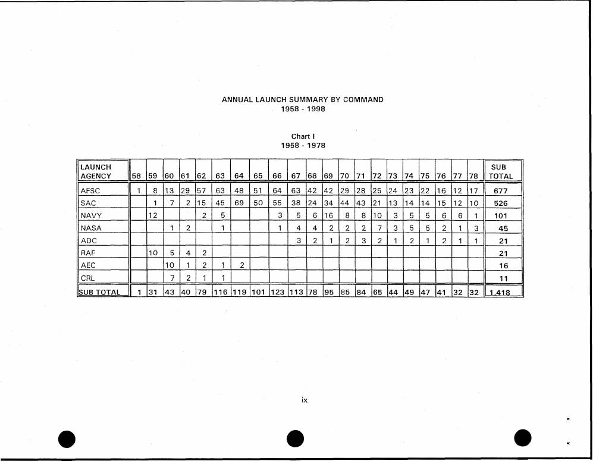

# #058 DOW-UAP-D49：2000-02-03 30th Space Wing Office of History 編製的「Vandenberg AFB Launch Summary 1958–2000」官方登記冊，113 頁完整列出 1958-12-16 至 2000 年初 Vandenberg 西岸測試場所有主要火箭發射，**全文無 UAP 內容**

| 欄位 | 內容 |
|---|---|
| 報告類型 | **官方登記冊**（Launch Summary book） |
| 識別碼 | DOW-UAP-D49 |
| 日期 | **2000-02-03**（封面 "As of: 3 February 2000"） |
| 標題 | "Vandenberg AFB Launch Summary 1958-2000" |
| 編製單位 | **30th Space Wing Office of History (30th SW/HO)**, Vandenberg AFB, CA |
| 編製人 | **Jeffrey Geiger**（30 SW 歷史辦公室） |
| 涵蓋期間 | **1958-12-16 至 2000-02-03**（41 年又 2 個月） |
| 機密層級 | **無分類標記**（公開歷史文獻） |
| PDF 內部 metadata 標題 | **"DoW-UAP-D27"**（DOW 上傳時 metadata 錯誤；正確應為 D49） |
| PDF 頁數 | **113 頁** |
| 公開日 | 2026-05-08 |

## 為什麼 D49 與 D48 構成「30 SW Range Safety / Office of History」批次

D48（1996 RTI 太空助推器失效建模）+ D49（2000 Vandenberg 發射總表）都源自 **30th Space Wing（Vandenberg AFB）內部歷史辦公室與安全辦公室**，且**都無 UAP 觀測內容**：

| 項目 | D48 | D49 |
|---|---|---|
| 文件類型 | RTI 契約最終報告 | 30 SW/HO 官方登記冊 |
| 年份 | 1996-09-10 | 2000-02-03 |
| 編製單位 | RTI + ACTA（外包） | **30 SW/HO**（內部） |
| 客戶單位 | 45 SW/SE + 30 SW/SE Safety Office | **30 SW Office of History** |
| 頁數 | 181 | 113 |
| 機密層級 | Unclassified 限分發 | **無分類標記**（公開歷史文獻） |
| UAP 相關度 | 無 | **無**（唯一命中為 SAMPEX 衛星縮寫） |
| 收錄理由 | Range Safety 共用檔案庫 | **30 SW Office of History 共用檔案庫** |

兩份文件指向同一個事實：**AARO 與 DOW 在 UAP 釋出包中包含了 30th Space Wing 歷史辦公室的非 UAP 技術文件**。這個收錄模式可能是 AARO 對 Range Safety 與 Office of History 兩個共用檔案庫的全面盤點。

## 1. 報告核心內容（Foreword 譯文）

> "This is the official registry of all major launch operations conducted from Vandenberg Air Force Base, California. The vehicles are presented in chronological order beginning with the first launch on 16 December 1958. Launch dates reflect Vandenberg local time."

> 「本報告為 California Vandenberg 空軍基地進行的所有主要發射作業之官方登記冊。載具按時序排列，起始於 1958 年 12 月 16 日的第一次發射。發射日期以 Vandenberg 當地時間為準。」

> "The information is further grouped into two matrixes titled: 'ANNUAL LAUNCH SUMMARY BY BOOSTER' and 'ANNUAL LAUNCH SUMMARY BY COMMAND.' Two additional items contained in this document are a 'LAUNCH FACILITY GUIDE' and a 'GLOSSARY.'"

> 「資訊進一步分為兩個矩陣：『按助推器類型的年度發射總表』與『按指揮部的年度發射總表』。文件另包含『發射設施指南』與『縮寫表』兩個項目。」

> "The 30th Space Wing History Office (30th SW/HO) periodically updates the Vandenberg AFB Launch Summary book. Questions may be directed to the undersigned at DSN 275-6421 or commercially at (805) 605-6421."

> 「30th Space Wing 歷史辦公室（30th SW/HO）會定期更新 Vandenberg AFB 發射總表。問題可透過 DSN 275-6421 或商業電話 (805) 605-6421 聯繫下方署名人。」

簽名為 **Jeffrey Geiger, Office of History**。

## 2. 文件結構

D49 主要章節：

1. **Distribution List**（分發清單）：30 SW 各部門、HQ USAF/XOFS、HQ AFSPC/HO、HQ USSPACECOM、HQ NASA、Aerospace Corporation、Boeing Defense、TRW、JPL、Kennedy Space Center 等
2. **Foreword**（前言，Jeffrey Geiger 署名）
3. **Glossary**（縮寫表，3 頁，從 ABRES 到 SPACE）
4. **Launch Facility Guide**（發射設施指南）
5. **Annual Launch Summary by Booster Chart**（按助推器類型的年度總表）
6. **Annual Launch Summary by Command Chart**（按指揮部的年度總表）
7. **Chronological Launch List**（時序發射清單，1958-12-16 至 2000）

## 3. 1958-1978 按指揮部年度發射總表

「按指揮部年度發射總表」（Chart I, 1958-1978）顯示：

| 指揮部 | 總計 | 主導期間 |
|---|---|---|
| **AFSC**（Air Force Systems Command） | **677** | 1958-1978 主導 |
| **SAC**（Strategic Air Command） | 526 | 1959-1978 ICBM 試射 |
| **NAVY** | 101 | 1959-1978 海軍試射 |
| **NASA** | 45 | 1960-1978 太空科學任務 |
| **ADC**（Aerospace Defense Command） | 21 | 1966-1978 |
| **RAF**（Royal Air Force, 英國） | 21 | 1959-1962 試射（早期 Thor 計畫） |
| **AEC**（Atomic Energy Commission） | 16 | 1960-1964 核試衛星 |
| **CRL**（USAF Cambridge Research Lab） | 11 | 1960-1963 |

**1958-1978 Vandenberg 總發射數：1,418 次**。

主導指揮部為 AFSC（Air Force Systems Command），執行美國西岸彈道飛彈試射、太空科學發射、衛星部署。

## 4. Vandenberg 1958-2000 在 UAP 歷史中的位置

Vandenberg AFB（位於加州中部海岸）是美軍**西岸測試範圍（Western Range, WR）**的主基地，與 Patrick AFB / Cape Canaveral（東岸 ER）構成美國兩大太空 / ICBM 試射場。

D49 涵蓋 41 年（1958-12-16 至 2000-02-03）的發射歷史中，幾個 UAP 相關事件背景：

- **1947-1969 Project Blue Book 時代**：USAF 系統性 UFO 報告期間，Vandenberg 發射期間的雷達異常與目擊
- **1980 Vandenberg AFB UFO 事件**：1980 年代 Vandenberg 有公開 UFO 目擊報告（前空軍士官 Robert Jacobs 1980 年宣稱）
- **1985 Atlas-Centaur 71 任務失敗**：美軍歷史上一系列「異常」太空任務失敗

D49 的詳細發射清單可作為**對比歷史 UAP 觀測與發射事件相關性**的基線資料。但 D49 本身**未討論 UAP**，需要逐筆與 Project Blue Book / FBI UFO 檔案 / Vandenberg UFO 事件清單交叉比對。

## 5. 觀察

**(1) D49 是 D 系列第二份「非 UAP 觀測」案件**：繼 D48 之後，D49 進一步確認 D 系列涵蓋範圍包含「**支援 UAP 分析的歷史技術 / 行政基線文件**」。兩份文件都來自 Vandenberg AFB 30th Space Wing 內部。

**(2) D 系列首份「無分類標記」文件**：D48 是 Unclassified（限分發），D49 是**完全無分類標記**（公開歷史文獻）。D 系列機密層級分布從「無分類」（D49）→ Unclassified 限分發（D48）→ SECRET (FOUO/PA)（D38, D42, D44）→ SECRET（多數 MISREP）→ SECRET // NOFORN（部分 MISREP）→ SECRET // REL TO USA, FVEY（D4）構成完整光譜。

**(3) PDF 內部 metadata 寫 "DoW-UAP-D27"**：D27 是 [#045 Gulf of Oman 2024-06](../045-dow_uap_d27_mission_report_gulf_of_oman_june_2024/report.md)，與 D49 完全無關。意味 DOW 在 PDF 上傳處理時，PDF 內部 metadata 重用了 D27 的 title 字段，但 URL 與 portal 顯示為 D49。**第 7 處 DOW UAP 釋出包 metadata 錯誤**（前 6 處：D19 高度單位錯誤、D20 地理錯誤、D27 標題錯誤、D28 標題錯誤、D42 標題錯誤、D4 標題地理錯誤）。

**(4) Jeffrey Geiger 是公開可查的 USAF 史學家**：他編寫的 Vandenberg 發射總表 1990 年代陸續對外發布，被太空愛好者社群（如 Astronautix.com）長期引用。D49 發布版本（2000-02-03）並非新解密內容，**完全是 2000 年既有公開文件**。

**(5) 分發清單揭露 Vandenberg 1990s 末期太空生態系**：30 SW 內部部門 + HQ AFSPC + HQ USSPACECOM + HQ NASA + Aerospace Corporation + Boeing + TRW + ITT Federal Services + JPL + Kennedy Space Center + Orbital Sciences。**Aerospace Corp、TRW、Boeing、Orbital Sciences 都是 1990s-2000s 期間 USAF Range Safety 系統的承包商**。

**(6) 1980 Vandenberg UFO 事件追蹤的可能線索**：D49 詳細列出 1980-1981 Vandenberg 發射，可作為對比 Robert Jacobs（1980 年 USAF 士官）公開宣稱「USAF 太空試射期間目擊 UFO」之資料來源。然而 D49 純發射總表，**未提供任何雷達 / 影像 / 觀測異常記錄**。

## 6. 跨檔案連結

- **[#057 D48 1996 RTI 太空助推器失效建模](../057-dow_uap_d48_air_force_space_booster_risk_report_1996/report.md)**：D48 + D49 構成「30 SW 內部歷史 / 安全辦公室」共用檔案庫批次。
- **[#045 D27 Gulf of Oman 2024-06](../045-dow_uap_d27_mission_report_gulf_of_oman_june_2024/report.md)**：D49 PDF 內部 metadata 誤標 D27，但 URL 與內容皆為 D49。

## 7. 來源

- 原始檔案：[U.S. Department of War — DOW-UAP-D49, Launch Summary, Vandenberg AFB, 2000](https://www.war.gov/UFO/#DOW-UAP-D49,%20Launch%20Summary,%20Vandenberg%20AFB,%202000)
- PDF 直接下載：`https://www.war.gov/medialink/ufo/release_1/dow-uap-d49-launch-summary-february-2000.pdf`
- 113 頁，無分類標記
- 編製單位：30th Space Wing Office of History（30 SW/HO），Vandenberg AFB
- 編製人：Jeffrey Geiger
- 編製日期：2000-02-03
- 公開日：2026-05-08（DOW UAP 釋出包，無新增 MDR 編號）
- 注意：**全文無 UAP 相關內容**，唯一詞彙命中為「SAMPEX（Solar, Anomalous and Magnetospheric Particle Explorer）」衛星縮寫。PDF 內部 metadata 標題誤標為 "DoW-UAP-D27"，是 D 系列第 7 處 DOW metadata 錯誤。
