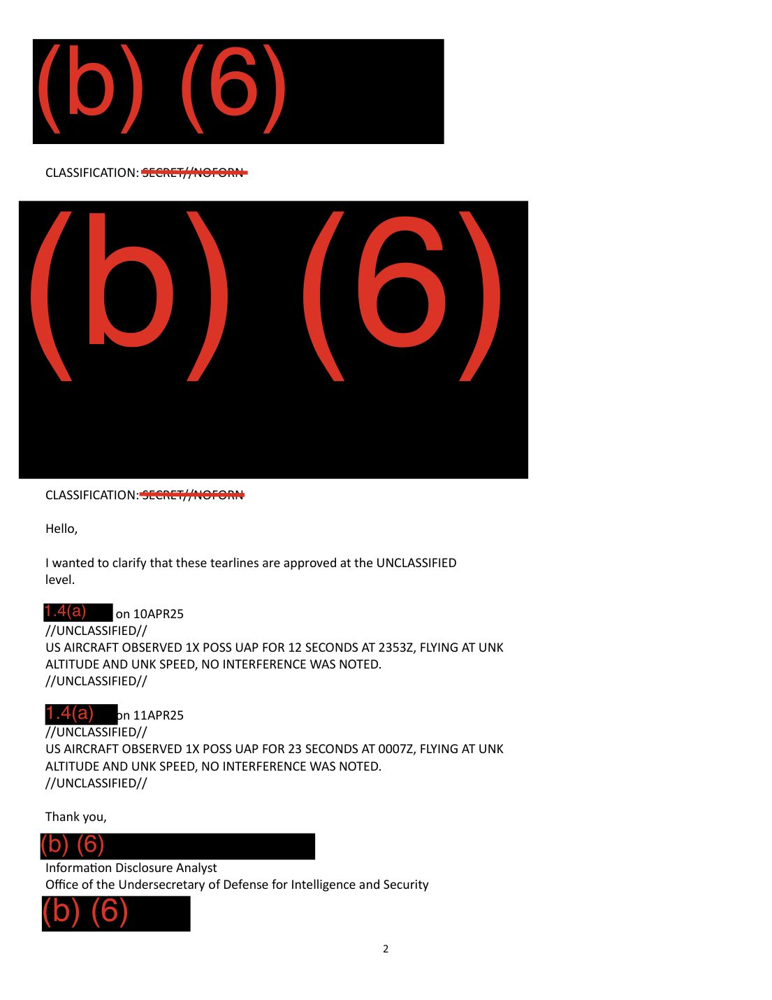

# #060 DOW-UAP-D50：2025-04-10 / 2025-04-11 USD(I&S) Information Disclosure Analyst 與 12 AF / DET 3 PAROC Intel Data Analysis Technician Team Lead 之間的解密工作流程 email 對話，首份 INDOPACOM AOR 案件，內含兩筆獨立 UAP tearline 觀測

| 欄位 | 內容 |
|---|---|
| 報告類型 | **Email Correspondence**（國防部內部 email 對話，**D 系列首份此類別**） |
| 識別碼 | DOW-UAP-D50 |
| 日期 | **2025-04-10 至 2025-04-11**（兩日往返 email） |
| **戰區 / AOR** | **INDOPACOM（U.S. Indo-Pacific Command）** ← **D 系列首份非 USCENTCOM AOR 案件** |
| email 主題 | 驗證兩筆 UAP tearline 是否可以 UNCLASSIFIED 級別釋出 + 確認 AOR 標記為 INDOPACOM |
| email 機密層級 | **SECRET // NOFORN**（email 本身），但 tearlines 確認為 **UNCLASSIFIED** |
| 寄件方 | **Information Disclosure Analyst, Office of the Undersecretary of Defense for Intelligence and Security**（USD(I&S)）|
| 收件 / 回應方 | **PAROC Intel Data Analysis Technician Team Lead, 12 AF / DET 3**（12th Air Force, Detachment 3）|
| **UAP 觀測 #1** | **2025-04-10 23:53Z, 1 個 POSS UAP, 12 秒, US AIRCRAFT 觀測**, UNK altitude, UNK speed, no interference |
| **UAP 觀測 #2** | **2025-04-11 00:07Z, 1 個 POSS UAP, 23 秒, US AIRCRAFT 觀測**, UNK altitude, UNK speed, no interference |
| **兩次觀測間隔** | **14 分鐘**（23:53Z → 00:07Z）|
| PDF 內部 metadata 標題 | **"DoW-UAP-D28"**（DOW 上傳時 metadata 錯誤；正確為 D50） |
| 公開日 | 2026-05-08 |
| PDF 頁數 | 2 頁 |


## 為什麼 D50 揭示 D 系列方法論

前 59 份 D 系列檔案都是「UAP 觀測本體」的文件（MISREP、SPEAR 表格、技術報告、發射總表）。D50 是揭示 AARO 解密工作流程的 email，展示 USAP 觀測從「機組現場觀測」到「公開 tearline」之間的具體人員、單位、流程、機密層級轉換：

```
原始 USAP 觀測（SECRET//NOFORN）
     ↓ 12 AF/DET 3 PAROC 內部分析
     ↓ Information Disclosure Analyst @ USD(I&S) 準備 tearline
     ↓ email 來回確認（這份 D50 email 即為此階段紀錄）
     ↓ 12 AF/DET 3 致電原始飛行單位
     ↓ 原始飛行單位確認 tearline 與 AOR 標記可 UNCLASSIFIED 釋出
     ↓ 12 AF/DET 3 回覆 USD(I&S) 確認
     ↓ AARO 收到 UNCLASSIFIED tearline
     ↓ 公開釋出（war.gov UFO portal 等）
```

D50 揭示了三個關鍵節點：

1. **USD(I&S) Information Disclosure Analyst** = 國防部副部長（情報與安全）辦公室的資訊揭露分析師，負責**處理 AARO 公開釋出請求**
2. **12 AF / DET 3 PAROC** = 第 12 空軍第 3 分遣隊的 PAROC（推測為 **Pacific Air Reconnaissance Operations Center** 或 Pacific Area Reconnaissance Operations Center）, 負責**INDOPACOM 戰區情報分析**
3. **原始飛行單位**（被遮蔽，「the unit that flies [1.4(a)]」）= 實際執行 UAP 觀測任務的飛行中隊

D50 不只是文件，而是 D 系列方法論的「ground truth」：所有 D 系列觀測都經過類似這條工作流程。

## 1. email 對話內容（時序還原）

D50 email 對話按時序排列：

### Email #1（USD(I&S) → 12 AF/DET 3, 2025-04-10）

寄件方（USD(I&S) Information Disclosure Analyst）：

> "Hello, Per our conversation, can you please confirm that the 1.4(a) tearlines below are at the UNCLASSIFIED level? Also, could you please confirm that we can use the AOR INDOPACOM."

> 「您好，依照我們之前的討論，可否請您確認下方 1.4(a) tearlines 是否為 UNCLASSIFIED 等級？另外可否確認我們可以使用 AOR INDOPACOM 此標記？」

寄送 email 含兩段 tearline（內容詳見下文「2. Tearline 內容」）。Email 本身機密層級：**SECRET // NOFORN**。

### Email #2（12 AF/DET 3 → USD(I&S), 2025-04-11）

回應方（PAROC Intel Data Analysis Technician Team Lead）：

> "I just got off the phone with the unit that flies [1.4(a)]. They said to me that the two lines listed are on the UNCLASSIFIED level and that adding in the AOR as INDOPACOM is also at the UNCLASSIFIED level."

> 「我剛和**飛行 [1.4(a)] 的單位**通完電話。他們告訴我：列出的兩筆 tearline 在 UNCLASSIFIED 等級，而加上 AOR 為 INDOPACOM 也是 UNCLASSIFIED 等級。」

簽名：「PAROC Intel Data Analysis Technician Team Lead, 12 AF / DET 3」

### Email #3（USD(I&S) 內部確認, 2025-04-11）

USD(I&S) Information Disclosure Analyst 確認回覆：

> "Hello, I wanted to clarify that these tearlines are approved at the UNCLASSIFIED level."

> 「您好，我想確認這些 tearlines 已批准在 UNCLASSIFIED 等級。」

簽名：「Information Disclosure Analyst, Office of the Undersecretary of Defense for Intelligence and Security」

## 2. Tearline 內容（兩筆獨立 UAP 觀測）



### UAP #1 — 10APR25 23:53Z

```
//UNCLASSIFIED//
US AIRCRAFT OBSERVED 1X POSS UAP FOR 12 SECONDS AT 2353Z, FLYING AT UNK
ALTITUDE AND UNK SPEED, NO INTERFERENCE WAS NOTED.
//UNCLASSIFIED//
```

譯：

> 「美軍飛機在 2025-04-10 23:53Z 觀測 1 個 POSS UAP **持續 12 秒**，飛行高度與速度皆未知（UNK），**未注意到干擾**（NO INTERFERENCE WAS NOTED）。」

### UAP #2 — 11APR25 00:07Z

```
//UNCLASSIFIED//
US AIRCRAFT OBSERVED 1X POSS UAP FOR 23 SECONDS AT 0007Z, FLYING AT UNK
ALTITUDE AND UNK SPEED, NO INTERFERENCE WAS NOTED.
//UNCLASSIFIED//
```

譯：

> 「美軍飛機在 2025-04-11 00:07Z 觀測 1 個 POSS UAP **持續 23 秒**，飛行高度與速度皆未知（UNK），**未注意到干擾**。」

## 3. 14 分鐘間隔雙 UAP — D 系列 INDOPACOM 首例

兩筆觀測相隔 **14 分鐘**（23:53Z 到 00:07Z 跨日），同 US AIRCRAFT 觀測者。可能解讀：

1. **同一物體被觀測 2 次**：機組短暫失去後重新捕捉到同一 UAP（持續時間 12+23 = 35 秒總計）
2. **不同物體在連續時段觀測**：兩個獨立 UAP 在同一空域連續經過
3. **同一物體完成 1 次觀測後機組轉向**：機組調整 sensor 後再觀測到第 2 個（或同個重現）

「**UNK altitude and UNK speed**」共構：機組或 sensor 平台**無法量化 UAP 的高度與速度**（與 D 系列其他案件多有精確或估算數值不同）。可能原因：
- **觀測距離過遠**，無法用 sensor 估算
- **觀測時間過短**（12 秒與 23 秒）不足以建立 track
- **sensor 平台不具備 ranging 能力**（如 EO/IR 但無雷達或 LIDAR）

「**NO INTERFERENCE WAS NOTED**」是新述語：未注意到對美軍機任務的干擾。對比其他 D 系列案件：
- D27（Gulf of Oman 2024）= "no impact to mission"
- **D50（INDOPACOM 2025-04）= "no interference"**

意味該 UAP 不對美軍機構成電子戰干擾、無線電干擾、飛行操作干擾。

## 4. INDOPACOM AOR：地理範圍與意義

**INDOPACOM（U.S. Indo-Pacific Command）**涵蓋：
- **太平洋**（含日本、菲律賓、夏威夷）
- **印度洋**（含澳洲、印度、新加坡）
- **東南亞**（含越南、泰國、印尼）
- **東亞**（含韓國、台灣、中國沿岸）

D 系列前 59 份案件分布：
- USCENTCOM AOR（中東、中地中海以南）：絕大多數
- USEUCOM AOR（歐洲、地中海以北）：D5（地中海戰區）
- USNORTHCOM AOR（北美）：少數（部分 NASA 任務）
- **INDOPACOM AOR：D50 是首例**

意味 D 系列檔案在 2025 年釋出時，AARO 已開始納入太平洋戰區 UAP 案件。對應 [#031 D14 2024-04-08 East China Sea](../031-dow_uap_d14_mission_report_east_china_sea_april_2024/report.md)（196 ATKS California ANG 在東中國海觀測，標題已標 East China Sea），但 D14 屬於 USINDOPACOM 戰場的早期案件、且為完整 MISREP 格式。D50 是明確以 INDOPACOM 為 AOR 的 tearline-only 案件。

## 5. 觀察

**(1) D50 揭示 D 系列方法論**：揭示 AARO 解密工作流程從 SECRET // NOFORN 原始觀測、12 AF/DET 3 PAROC 中介、原始飛行單位確認、USD(I&S) Information Disclosure Analyst 公開釋出的完整鏈條。所有 D 系列觀測都隱含類似流程，D50 是明確紀錄此流程的 case。

**(2) D 系列首份 INDOPACOM 案件**：意味 DOW UAP 釋出包擴展超出 USCENTCOM AOR。對應 [#031 D14 East China Sea 2024-04-08](../031-dow_uap_d14_mission_report_east_china_sea_april_2024/report.md) 屬於早期太平洋戰區案件，但 D14 標題未明示 INDOPACOM。D50 是首份在文件本身明確標註 INDOPACOM AOR 的案件。

**(3) D 系列 email 對話文件類型**：前 59 份案件都是任務報告、表格、技術文件。D50 是內部行政 email，揭示官僚層級互動。未來其他 D 系列 email correspondence 案件可能類似。

**(4) PDF 內部 metadata 誤標 "DoW-UAP-D28"**：第 8 處 DOW PDF metadata 錯誤。D28 是 [#046 Ayn al Asad 2024-09-20 AC-130J Ghostrider Griffin 飛彈案件](../046-dow_uap_d28_mission_report_ayn_al_asad_iraq_september_2024/report.md)。**D50 的 PDF metadata 與 [#058 D49](../058-dow_uap_d49_vandenberg_launch_summary_1958_2000/report.md) 的 D27 metadata 錯誤模式相同**：DOW 上傳系統可能批次重用前案 metadata title，導致系統性錯誤。

**(5) PAROC 與 12 AF / DET 3 的組織學意義**：
   - **12 AF** = Twelfth Air Force, US Air Combat Command（總部 Davis-Monthan AFB, AZ）
   - **DET 3** = Detachment 3, 12 AF 的小單位分遣隊
   - **PAROC** = Pacific Air Reconnaissance Operations Center（推測）或 Pacific Area Recon Operations Cell
   
   12 AF / DET 3 PAROC 似乎是**12 AF 在太平洋戰區的偵察情報分析分遣隊**。**該單位在 D50 中扮演「飛行單位 vs. USD(I&S)」中介角色**，意味 USAP 情報分析的官僚層級包含 numbered Air Force → Detachment → Operating Squadron 三層。

**(6) "1.4(a)" 的兩種用途**：
   - 在 D 系列 MISREP 中：classification 遮蔽標記
   - 在 D50 email 中：**用於遮蔽「飛行單位」與「UAP tearline ID」**（"the unit that flies [1.4(a)]" + "1.4(a) on 10APR25"）
   
   D50 揭示 1.4(a) 是**通用機密遮蔽標記**，不限於 UAP 觀測內容，**還可用於遮蔽行政層級的單位識別**。

**(7) email 機密層級 SECRET // NOFORN，但 tearlines 為 UNCLASSIFIED**：是**信件框架 vs. 信件內容** classification mismatch 的好案例。email 整體（含 (b)(6) 個資與 1.4(a) 單位識別）需要 NOFORN 保護，但 email 內的兩段 tearline 是已批准的 UNCLASSIFIED 釋出版本。D50 揭示 DOD 的 **multi-level classification handling**。

## 6. 跨檔案連結

- **[#031 D14 East China Sea 2024-04-08](../031-dow_uap_d14_mission_report_east_china_sea_april_2024/report.md)**：D 系列前一份太平洋戰區案件（196 ATKS California ANG），D50 是首份明確標 INDOPACOM AOR 的案件。
- **[#046 D28 Ayn al Asad 2024-09-20](../046-dow_uap_d28_mission_report_ayn_al_asad_iraq_september_2024/report.md)**：D50 PDF metadata 誤標 D28。**D50 第 8 處 DOW metadata 錯誤**。
- **[#058 D49 Vandenberg Launch Summary 2000](../058-dow_uap_d49_vandenberg_launch_summary_1958_2000/report.md)**：兩份檔案皆 PDF metadata 誤標前案編號（D49 → D27, D50 → D28），意味 DOW 上傳系統批次處理錯誤。

## 7. 來源

- 原始檔案：[U.S. Department of War — DOW-UAP-D50, Email Correspondence, INDOPACOM, April 2025](https://www.war.gov/UFO/#DOW-UAP-D50,%20Email%20Correspondence,%20INDOPACOM,%20April%202025)
- PDF 直接下載：`https://www.war.gov/medialink/ufo/release_1/dow-uap-d50-email-correspondence-indopacom-april-2025.pdf`
- 2 頁，email 整體 SECRET // NOFORN，tearlines 為 UNCLASSIFIED
- 寄件方：USD(I&S) Office of the Undersecretary of Defense for Intelligence and Security
- 回應方：12 AF / DET 3 PAROC Intel Data Analysis Technician Team Lead
- 日期：2025-04-10 至 2025-04-11
- 公開日：2026-05-08
- 注意：PDF 內部 metadata 標題誤標為 "DoW-UAP-D28"，是 D 系列第 8 處 DOW metadata 錯誤。「PAROC」具體展開名稱推測為 Pacific Air Reconnaissance Operations Center 或類似，需後續驗證。
