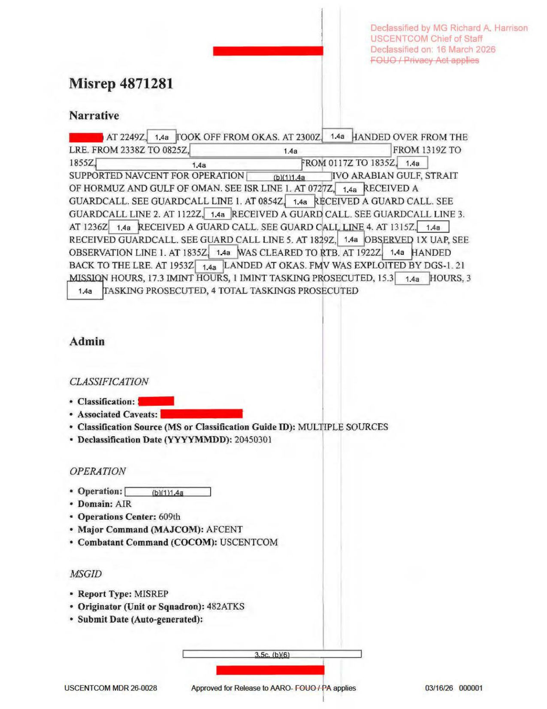

# #072 DOW-UAP-D63：5 次伊朗喊話、Abu Musa 機場 ATR 72-500、然後 1 個 UAP

2020-10-01 至 10-02，482 ATKS / 432 AEW（Air Force Reserve）的 MQ-9 Reaper 從 OKAS 起飛，21 小時 4 分鐘任務，支援 NAVCENT 在荷莫茲海峽、阿曼灣、阿拉伯灣特徵化伊朗 / IRGCN 船舶與 UAS 活動，並建立港口外活動 pattern of life。這是 [#071 D62](../071-dow_uap_d62_mission_report_strait_of_hormuz_sep_2020/report.md) 之後 15 天，同單位、同基地、同戰區的下一次任務。

D62 那次有 3 次伊朗喊話加 2 次 EMI 失聯加 1 個 UAP。D63 把喊話次數推到 5 次，去掉了 EMI，多出一筆機場觀測。

## Pattern of Life 任務的 21 小時時間軸

| 時刻 (UTC) | 事件 |
|---|---|
| 10-01 22:49Z | 起飛 OKAS |
| 10-01 23:00Z | 從 LRE 交接 |
| 10-02 01:17Z | 抵達 ISO NAVCENT station（IVO 阿拉伯灣 / 荷莫茲 / 阿曼灣）|
| 10-02 12:44Z | 觀測 1 個 UI aircraft 停在 Abu Musa Island Airfield 跑道上（評估為 ATR 72-500）|
| 10-02 13:44Z | 觀測 1 個 U/I aircraft 在 Abu Musa Island Airfield |
| 10-02 16:57Z | 觀測 1 個 POSS Naser WAP 停泊在 2 艘 Busherh IRIN boatyard 旁 |
| 10-02 07:27Z | 伊朗 GUARD CALL #1（FL180）|
| 10-02 08:54Z | 伊朗 GUARD CALL #2（FL180）|
| 10-02 11:22Z | 伊朗 GUARD CALL #3（FL160，Directive tone）|
| 10-02 12:36Z | 伊朗 GUARD CALL #4（FL160）|
| 10-02 13:15Z | 伊朗 GUARD CALL #5（FL160，Directive tone）|
| 10-02 18:29Z | **觀測 1 個 UAP** |
| 10-02 18:35Z | Cleared off tasking → RTB |
| 10-02 19:22Z | 移交回 LRE |
| 10-02 19:53Z | 降落 OKAS |

Total Mission Time: 21 小時 4 分鐘。FMV 由 DGS-1 判讀。MISREP 編號 4871281。

## 5 次伊朗喊話的 tone 變化

5 次喊話的 tone 分布。前兩次（0727Z, 0854Z）標為 PROFESSIONAL。第三次（1122Z）轉成 Directive。第四次（1236Z）回到 Professional。第五次（1315Z）又是 Directive。

所有 5 次都記為 NO IMPACT TO THE MISSION，STANDARD CALL / STANDARD RESPONSE 1。每次只有 1 通同 agency 的喊話，意味伊朗防空換了 5 個不同位置或 5 個不同時段對同一架 MQ-9 喊話，而不是一個位置連續打。

從 FL180 到 FL160 的下降配合喊話頻率升高，看起來像 D62 的鏡像：D62 是 FL040 低空時被喊話，D63 是 FL160 中空層被反覆喊話。

## Abu Musa Island 是哪裡

12:44Z 跟 13:44Z 的兩次觀測都指向同一個座標，Abu Musa Island。

Abu Musa 在荷莫茲海峽南口、阿拉伯灣與阿曼灣交界處，是伊朗自 1971 年佔領的爭議性島嶼（UAE 主張主權）。島上有一條 1,800 公尺長跑道，IRGC 駐軍與防空雷達都佈在這裡。ATR 72-500 是法義 ATR 公司製的雙發渦輪螺旋槳客機，伊朗 Iran Air、Mahan Air、IRGC-AF 都用過。在 IRGC 偏遠島嶼基地的跑道上停一架 ATR 72-500 不算稀奇，但美軍 MQ-9 用 ANDAS4 雷達加光電 ISR 把跑道上停哪一架民航構型飛機拍清楚，就是這次任務的重點之一。

## 16:57Z 的 Naser WAP + Busherh IRIN boatyard

第三筆地面觀測：1 個可能 Naser WAP 停泊在 2 個 Busherh IRIN boatyard 旁。

Naser 是 IRGCN 的快攻艇之一，常用於荷莫茲海峽附近騷擾國際航運。Busherh（即 Bushehr，布什爾）位於伊朗西南海岸阿拉伯灣畔，IRIN 是伊朗正規海軍（Islamic Republic of Iran Navy），與 IRGCN 是兩個不同的海上力量。

Naser 屬於 IRGCN，停在 IRIN 的 boatyard 旁有兩種解讀。一是跨單位停泊，IRGCN 借用 IRIN 設施維修或補給。二是報告寫法把 boatyard 歸 IRIN 是因為位置在 Bushehr 港，Naser 只是路過停靠。MQ-9 把這筆觀測寫進 MISREP，意味 NAVCENT 對 IRGCN 與 IRIN 兩股海軍的混合活動有持續關注。

## 18:29Z 的 UAP

整份 MISREP narrative 第一段一句話帶過：

> AT 1829Z, [1.4a] OBSERVED 1X UAP, SEE OBSERVATION LINE 1.

「OBSERVATION LINE 1」應該對應後續被遮蔽的詳細頁面，但 D63 釋出版本沒有保留這一頁。我們知道：

1. UAP 出現在「Cleared off tasking → RTB」前 6 分鐘（18:29Z vs 18:35Z）。
2. 沒有跟 EMI 並列，與 D62 不同。
3. 沒有列出 shape / altitude / speed / heading，narrative 只標籤化記錄 1 個 UAP。
4. Weather 寫 HEAVY HAZE PRECLUDED IMINT ANALYSIS（重霾妨礙了影像情報分析）。

重霾這條最關鍵。D63 整份任務的 IMINT 評估等級可能被霾打折，UAP 觀測的視覺證據強度比 D62（高能見度 FL040）低很多。如果 UAP 被霾遮，FMV 看到的可能只是熱反差殘影或雷達粗略 hit。

## D62 + D63 兩份對照表

| 項目 | D62（2020-09-16）| D63（2020-10-01 至 10-02）|
|---|---|---|
| MISREP 編號 | 4782130 | 4871281 |
| 單位 | 482 ATKS / 432 AEW | 482 ATKS / 432 AEW |
| 起降基地 | OKAS | OKAS |
| Operations Center | 609 CAOC | 609 CAOC |
| 任務總時長 | 21 小時（含 LOST LINK） | 21 小時 4 分鐘 |
| 任務 ATO | DR | DR |
| 任務類型 | AREC | AREC |
| Primary Sensor | ANDAS4 | ANDAS4 |
| Additional Avionics | AH-BS_WARIO | AH-BS_WARIO |
| 伊朗喊話次數 | 3 | 5 |
| Guard Tone 分布 | Professional × 3 | Professional × 3 + Directive × 2 |
| 最低喊話高度 | FL040 | FL160 |
| EMI 事件 | 2 次（11 + 27 = 38 分鐘）| 0 |
| 地面觀測 | 不適用 | Abu Musa Island × 2 + Naser/Busherh × 1 |
| UAP 觀測時刻 | 17:32Z | 18:29Z |
| UAP 描述 | 1 個 | 1 個（霾妨礙 IMINT）|
| Weather | 未列 | HEAVY HAZE |

兩次任務在「同單位 / 同基地 / 同 sensor 配置 / 同任務時段（黃昏前後）/ 同高度層 / UAP 在任務尾段 17-18Z」幾乎完全對齊。差別在 EMI 與地面 ISR 的相對比重。

## 為什麼 IMINT 受霾影響很要緊

ANDAS4 是 MQ-9 的合成孔徑雷達（SAR + MTI），理論上不受霾影響，SAR 用 X-band 微波，能穿過水氣與灰塵。

但 D63 narrative 寫 weather 是 HEAVY HAZE PRECLUDED IMINT ANALYSIS。IMINT（Imagery Intelligence）通常指光電 / 紅外影像，MX-20 EO/IR sensor 才會被霾影響。D63 任務的 IMINT 主軸是 MX-20 EO/IR（用來看 Abu Musa 跑道上的飛機型號），而不是 ANDAS4 SAR。霾妨礙了用 EO/IR 對地面目標的精細判讀。

UAP 在 18:29Z 看到，那個時段中東地區進入黃昏到黑夜過渡，霾的影響更大。這降低了 D63 UAP 觀測的證據強度，也說明為什麼 narrative 沒有給 shape / altitude / speed。

## 影像規格與來源

| 屬性 | 內容 |
|---|---|
| 格式 | PDF（8 頁 MISREP 表格） |
| 影像化解析度 | 150 DPI 轉 JPEG |
| 來源 | USCENTCOM，編號 MDR 26-0028 |
| 原始機密等級 | SECRET（caveats 完全遮蔽）|
| 解密日期（原訂） | 2045-03-01 |
| 解密日期（實際 AARO 釋出） | 2026-03-16 |
| 解密官 | MG Richard A. Harrison, USCENTCOM Chief of Staff |
| AARO 釋出 | Approved for Release to AARO |
| 公開日 | 2026-05-08 |
| MISREP 編號 | **4871281** |
| 事件時間 | 2020-10-01 至 10-02（21 小時 4 分鐘任務）|
| 事件地點 | 荷莫茲海峽、阿曼灣、阿拉伯灣（MGRS 40RCP / 40RCQ / 40RDP 區）|
| 觀測平台 | MQ-9 Reaper（482 ATKS, 432 AEW） |
| 支援單位 | NAVCENT（24 小時 precoord） |
| 任務類型 | AREC（Aerial Reconnaissance） |
| Primary Sensor | ANDAS4 + AH-BS_WARIO 額外航電 |
| UAP 觀測時刻 | **18:29Z**（10-02）|
| UAP 描述 | 1 個（HEAVY HAZE PRECLUDED IMINT ANALYSIS） |
| 地面觀測 #1 | Abu Musa Island Airfield 跑道上 1 架 ATR 72-500 (12:44Z) |
| 地面觀測 #2 | Abu Musa Island Airfield 1 架 U/I aircraft (13:44Z) |
| 地面觀測 #3 | 1 個 POSS Naser WAP 停泊在 2 艘 Busherh IRIN boatyard 旁 (16:57Z) |
| 伊朗喊話次數 | 5 次（07:27Z, 08:54Z, 11:22Z, 12:36Z, 13:15Z） |
| Guard Tone | Professional × 3 + Directive × 2 |
| 總任務時數 | 21 mission hours（17.3 IMINT hours / 1 IMINT tasking prosecuted）|
| 直接下載 | <https://www.war.gov/medialink/ufo/release_1/dow-uap-d63-mission-report-strait-of-hormuz-october-2020.pdf> |
| 官方 portal | [war.gov/UFO/#DOW-UAP-D63](https://www.war.gov/UFO/#DOW-UAP-D63,%20Mission%20Report,%20Strait%20of%20Hormuz,%20October%202020) |

## 相關案件

- [#071 D62 荷莫茲 2020-09-16](../071-dow_uap_d62_mission_report_strait_of_hormuz_sep_2020/report.md)：15 天前同 MQ-9、3 次伊朗喊話加 38 分鐘 EMI 加 UAP。
- [#070 D61 阿拉伯灣 2020-08-27](../070-dow_uap_d61_mission_report_persian_gulf_aug_2020/report.md)：35 天前同單位、FORMATION UAP。
- [#069 D60 阿拉伯灣 2020-08-08](../069-dow_uap_d60_mission_report_persian_gulf_aug_2020/report.md)：54 天前同單位、UAP TRANSITTING。
- [#047 D3 阿拉伯灣 2020](../047-dow_uap_d3_mission_report_arabian_gulf_2020/report.md)：同 AOR / AFCENT MQ-9、27 秒內 4 個 UAP。
