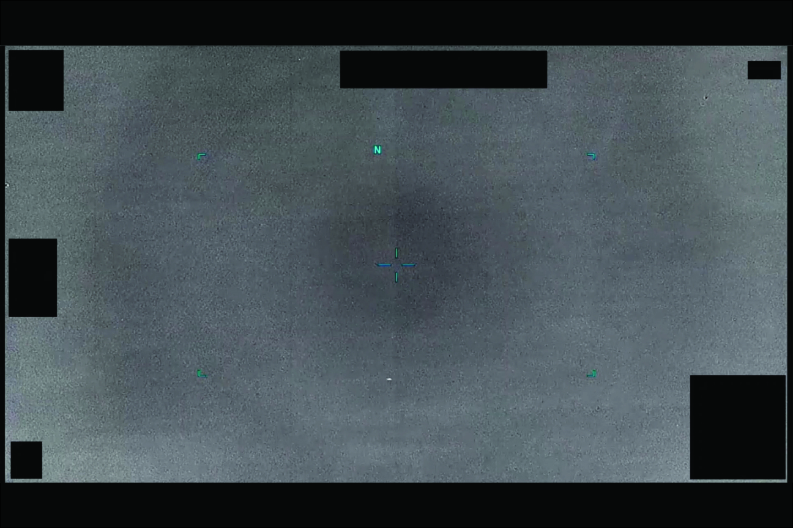

# #091 DOW-UAP-PR34：希臘 2023-10，2 分 57 秒 IR 影片，1 分鐘起藍色十字鎖定，2m22s 失鎖後感測器循環變焦

PR34 是 Part 1 中含有 blue-cross sensor lock 的代表性案例。MQ-9 的 MTS-B sensor 在 auto-track 鎖定後會在目標上疊一個藍色十字 reticle，PR34 在 1 分鐘標記出現藍色十字、2m22s 失鎖。這個鎖定—失鎖序列是評估 UAP 機動性的重要線索。

## 影片內容

2 分 57 秒紅外影片。

- 0-1m：sensor 搜尋海面對比區
- 1m-2m22s：sensor 自動鎖定，藍色十字疊在對比區中央，track 維持 1 分 22 秒
- 2m22s：lock 失敗，藍色十字消失
- 2m22s-2m57s：sensor 進入循環變焦 search pattern，無法 reacquire

藍色十字鎖定持續 1 分 22 秒，意味物體訊號穩定到 auto-track 演算法可以維持，但目標機動或 thermal contrast 變化突破了 lock 容差。

## 對應 D 系列 MISREP

對應 [#051 DOW-UAP-D33](../051-dow_uap_d33_mission_report_greece_october_2023/report.md)（東地中海 35S KD 95X，2023-10-27 00:35:12Z 觀測，33 SOS MQ-9 自希臘 Larissa 起飛 transit 中 3 分鐘內觀測 1 個「貼海面 + 多次 90 度直角轉彎」UAP，80 MPH，00:38Z 脫離 sensor）。

PR34 2 分 57 秒影片正是 D33「3 分鐘觀測」的完整記錄。藍色十字鎖定段對應 80 MPH 直線飛行階段，2m22s 失鎖很可能對應 MISREP 中「多次 90 度直角轉彎」之一造成的軌跡突變。

## 為什麼這份未解

D33 + PR34 是 D 系列中「機動性最反直覺」的案例：

- 80 MPH 速度低（接近 light aircraft），但「多次 90 度直角轉彎」無慣性符合性
- 90 度急轉若是固定翼平台需數秒，若是旋翼或氣球可行但 80 MPH 速度與旋翼不符
- 「貼海面」高度極低（< 100 ft），多數 UAV 巡航高度 > 1,000 ft
- 33 SOS 是 AFSOC，sensor 操作員經驗豐富，不易誤判
- 後續 D35（PR35）在兩日後同任務區記錄相似形態，形成觀測對

## 影像規格與來源

| 欄位 | 內容 |
|---|---|
| 系列 | DOW-UAP-PR34 |
| 地點 | 東地中海（希臘標籤，35S KD grid） |
| 月份 | 2023-10 |
| 影片長度 | 2 分 57 秒 |
| 感測器 | IR（MQ-9 AN/DAS-4） |
| 對應 MISREP | DOW-UAP-D33（[#051](../051-dow_uap_d33_mission_report_greece_october_2023/report.md)） |
| 公開日 | 2026-05-08 |
| 釋出途徑 | USCENTCOM MDR |
| 官方來源 | [DOW-UAP-PR34, Unresolved UAP Report, Greece, October 2023](https://www.war.gov/UFO/#DOW-UAP-PR34,%20Unresolved%20UAP%20Report,%20Greece,%20October%202023) |

公開 mp4 連結未能在 war.gov portal 解析（只有 slideshow JPG），分析以官方 caption 與 D33 MISREP 對應段展開。
