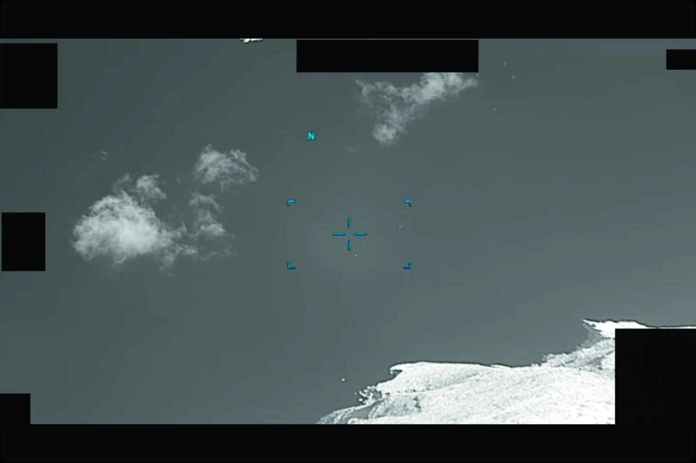

# #092 DOW-UAP-PR35：希臘 2023-10，24 秒 IR 影片，感測器收窄追蹤海面對比區，海→陸過渡時消失

PR35 與 PR34 形成 D 系列觀測對：PR34（D33）2023-10-27 觀測「90 度轉彎 + 貼海面」UAP，PR35（D35）兩日後 2023-10-29 在同 33 SOS 任務區再次觀測「貼海面直線飛向陸地」UAP。兩案 sensor 操作員的描述逐字一致。

## 影片內容

24 秒紅外影片。sensor 從 wide field 開始 narrow zoom-in，鎖定海面上一個對比區。對比區沿水平方向直線移動，sensor 跟隨。在影片末段，物體越過海陸交界（shoreline）後立刻在背景熱亂流中消失，sensor 失鎖。

「海→陸過渡時消失於背景」是 PR35 caption 的關鍵描述。陸地 IR 背景比海面複雜（地表熱輻射、植被、建築熱回波），低 contrast 物體進入陸上即難以分離。

## 對應 D 系列 MISREP

對應 [#052 DOW-UAP-D35](../052-dow_uap_d35_mission_report_greece_october_2023/report.md)（35S MV 3X，2023-10-29 08:11:00Z 觀測，33 SOS MQ-9 在希臘 LGLR 巡邏返航中觀測 1 個「貼海面直線飛向陸地」UAP，30 MPH，「SEEMINGLY CIRCULAR, TOO SMALL TO MAKE OUT DETAILS」描述與 D33 逐字一致）。

D35 的座標 35S MV 與 D33 的 35S KD 在地圖上相距約 100 km grid 區段，仍屬東地中海同一巡邏走廊。

## 為什麼這份未解

D35 + PR35 的特殊之處不在單一觀測，而在「兩日後再現」：

- 兩案形狀描述逐字一致（SEEMINGLY CIRCULAR + TOO SMALL TO MAKE OUT DETAILS）
- 兩案 sensor 平台（33 SOS MQ-9）與任務區（LGLR 起飛、東地中海巡邏）相同
- 速度 30 MPH（D35）與 80 MPH（D33）不同，但都遠低於常規 UAV
- 「飛向陸地」的軌跡指向歐洲大陸，若是入境物體應觸發北約防空 ID，但無 IFF 紀錄

兩日內同任務區出現逐字一致的形狀描述，在 35 份 D 系列 MISREP 中只有 D33/D35 這一組。後續 AARO 分析需要回答的問題：這是同一物體的再現，還是同類物體？

## 影像規格與來源

| 欄位 | 內容 |
|---|---|
| 系列 | DOW-UAP-PR35 |
| 地點 | 東地中海（希臘標籤，35S MV grid） |
| 月份 | 2023-10 |
| 影片長度 | 24 秒 |
| 感測器 | IR（MQ-9 AN/DAS-4） |
| 對應 MISREP | DOW-UAP-D35（[#052](../052-dow_uap_d35_mission_report_greece_october_2023/report.md)） |
| 公開日 | 2026-05-08 |
| 釋出途徑 | USCENTCOM MDR |
| 官方來源 | [DOW-UAP-PR35, Unresolved UAP Report, Greece, October 2023](https://www.war.gov/UFO/#DOW-UAP-PR35,%20Unresolved%20UAP%20Report,%20Greece,%20October%202023) |

公開 mp4 連結未能在 war.gov portal 解析（只有 slideshow JPG），分析以官方 caption 與 D35 MISREP 對應段展開。
