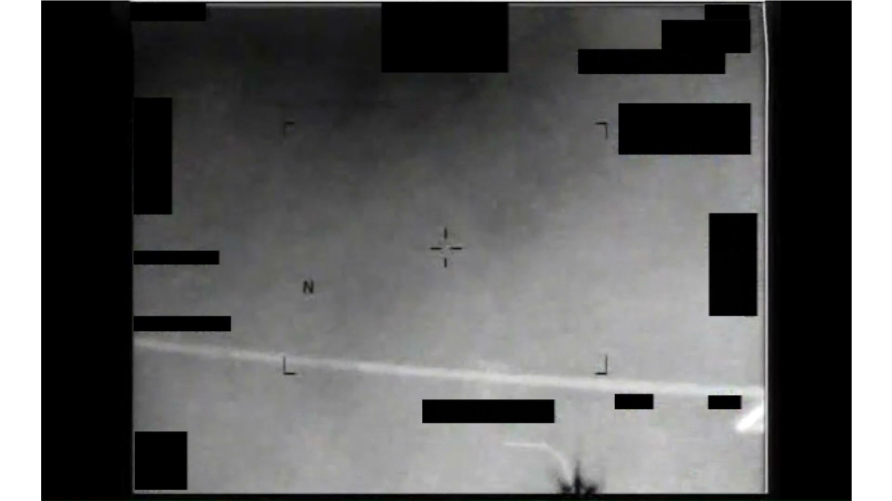
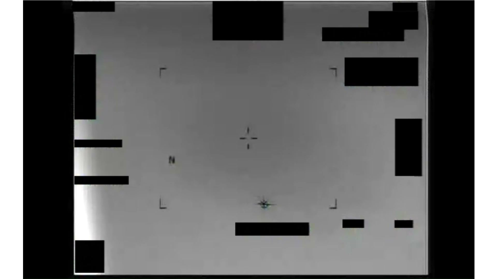
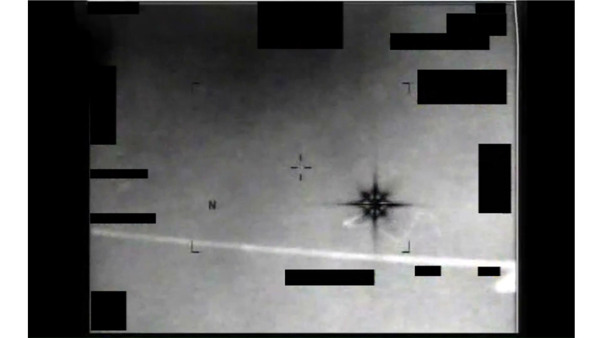
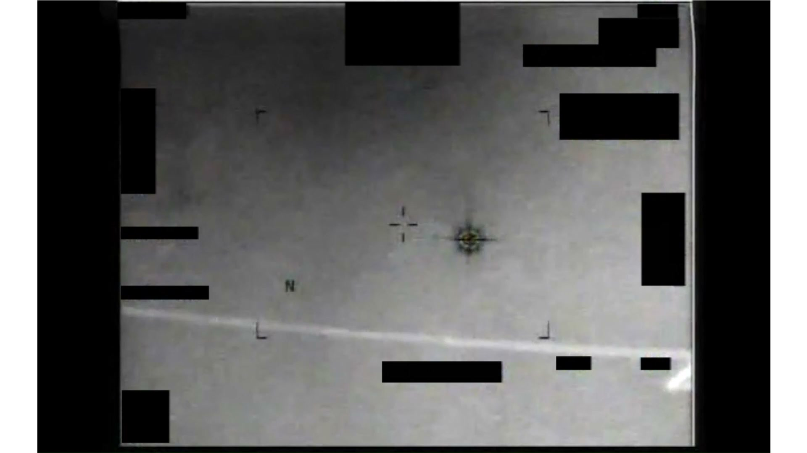

# #095 PR38 中東 2013：1 分 46 秒 IR 影片，對比區形似八角星臂長交替，10 秒放大、30 秒離開後復現

PR38 是 PR 系列中年代最早的影片（2013），地點記為「中東」。AARO 公開時提供 caption 但無對應 D 系列 MISREP，是 PR 系列中少數涵蓋 2013 年代的 IR 影片。

## 影片內容

- 長度：1 分 46 秒（106.4 秒），4:3 比例 IR 畫面，30 fps
- 感測器：IR，White Hot，HUD 含 N 北方標記與十字準星，邊角多塊 1.4(a) 黑色遮蔽
- 開頭：對比區進入畫面，形態被官方 caption 描述為「八角星，臂長交替」（octagonal contrast region with alternating arm lengths）
- 約 10 秒：感測器執行放大（zoom in），對比區尺寸放大
- 約 30 秒：對比區離開畫面後再次出現
- 無人聲、無 HUD annotation

## 為什麼未解

「八角星 + 臂長交替」是 PR 系列中對形狀描述最具體的 caption。可能候選：

- 鏡頭散射造成的星狀繞射圖樣（lens flare / spike artifact），但臂長交替不易由光學鏡頭自然產生
- 高度旋轉物體的 motion blur 殘影
- 感測器 dead pixel cluster 投影（已排除，因為對比區會移動）

AARO 未能歸入任何已知類別，且 2013 年資料無法與現代資料庫（無人機型錄、商業衛星發射）回溯比對，列為 unresolved。

## 影像規格與來源

| 欄位 | 內容 |
|---|---|
| 系列 | DOW-UAP-PR38 |
| 地點 | 中東（未細分） |
| 年份 | 2013 |
| 影片長度 | 1:46（106.4 秒） |
| 解析度 / fps | 1920×1080 / 30 fps（4:3 內容區） |
| 感測器 | IR（型號未知，2013 年常見為 MQ-1 / MQ-9 MTS-A/B） |
| 對應 MISREP | 無（公開資料中未指認對應 D 系列） |
| 機密層級 | 原 SECRET，公開 cleared |
| 公開日 | 2026-05-08 |
| 釋出途徑 | USCENTCOM MDR 25-0094 thru MDR 25-0099 |
| 官方來源 | [DOW-UAP-PR38, Unresolved UAP Report, Middle East, 2013](https://www.war.gov/UFO/#DOW-UAP-PR38,%20Unresolved%20UAP%20Report,%20Middle%20East,%202013) |
| DVIDS 鏡像 | [DVIDS video 1006088](https://www.dvidshub.net/video/1006088/dow-uap-pr38-unresolved-uap-report-middle-east-2013) |
