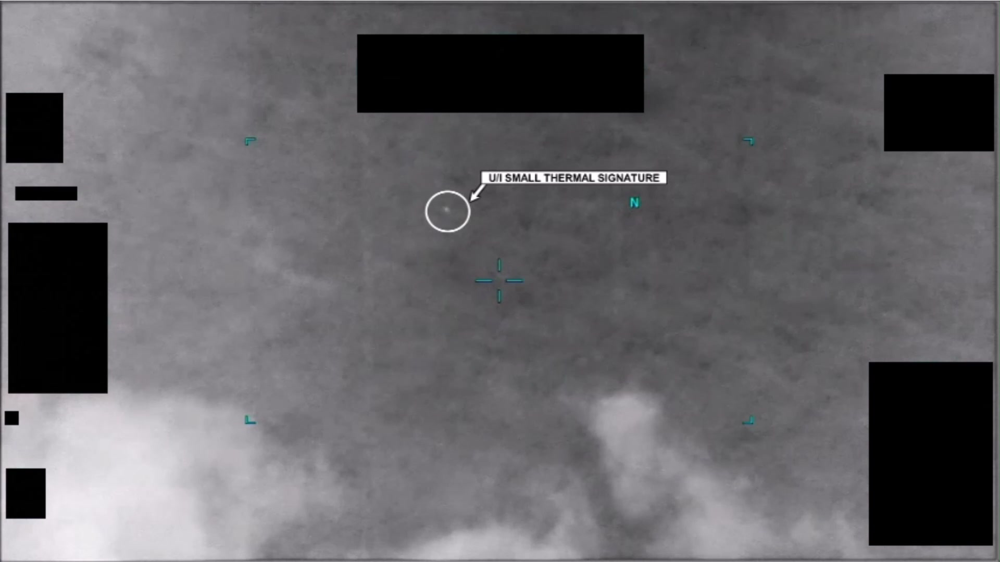
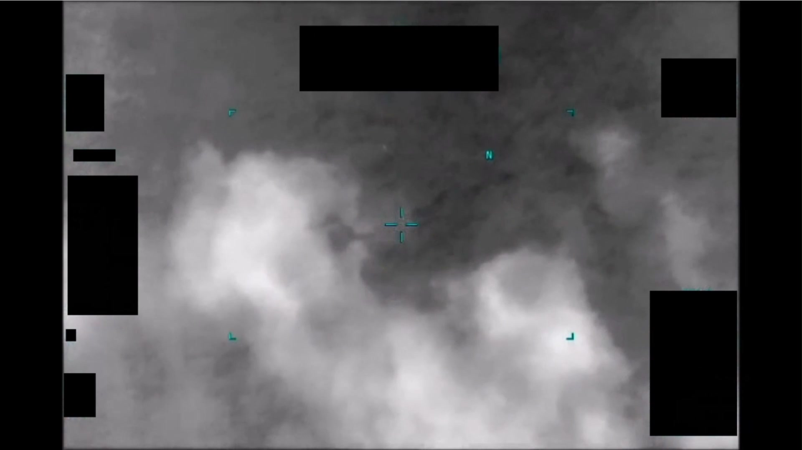
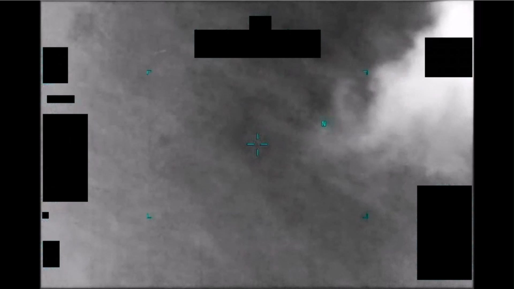

# #097 PR40 中東 2020：1 分 3 秒 IR 影片，10 秒白圈標註「U/I SMALL THERMAL SIGNATURE」

PR40 是 PR 系列中少數帶有官方 HUD 標註（annotation overlay）的影片，AARO 在第 10 秒附近以白色圓圈與引線指向目標，文字標籤寫明「**U/I SMALL THERMAL SIGNATURE**」（Unidentified Small Thermal Signature，未識別的微小熱訊號）。

## 影片內容

- 長度：1 分 3 秒（63.2 秒），1920×1080，30 fps
- 感測器：IR，White Hot，畫面下緣有低空雲層或地平線結構，HUD 邊角多塊 1.4(a) 遮蔽
- 約 10 秒：白色圓圈出現，圈住一個微弱亮點，引線連到右側白色標籤框「U/I SMALL THERMAL SIGNATURE」
- 對比區尺寸極小（圓圈直徑佔畫面寬度約 5 %）
- HUD 含青色十字準星與 N 北方標記

## 為什麼未解

「U/I SMALL THERMAL SIGNATURE」是 AARO 公開影片中極少數帶官方標籤的案件之一，意味影片是經 AARO 編輯後釋出（非原始機載 FMV）。標註本身就是 AARO 給定的分類結果：

- 「Small」：對比區尺寸極小
- 「Thermal」：僅 IR 訊號，無可見光或雷達相關資料
- 「U/I」（unidentified）：未能歸入已知類別

候選包括小型 UAV（DJI 級）、氣球感測器、釋出後的氣球載具、商業衛星墜落殘餘。AARO 沒有距離資料即無法估計絕對大小（圓圈圈住的角度大小可大可小，取決於目標距離）。

## 影像規格與來源

| 欄位 | 內容 |
|---|---|
| 系列 | DOW-UAP-PR40 |
| 地點 | 中東（未細分） |
| 年份 | 2020 |
| 影片長度 | 1:03（63.2 秒） |
| 解析度 / fps | 1920×1080 / 30 fps |
| 感測器 | IR |
| HUD 標註 | 白圈 + 「U/I SMALL THERMAL SIGNATURE」標籤（AARO 後製） |
| 對應 MISREP | 無 |
| 機密層級 | 原 SECRET，公開 cleared |
| 公開日 | 2026-05-08 |
| 釋出途徑 | USCENTCOM MDR 25-0094 thru MDR 25-0099 |
| 官方來源 | [DOW-UAP-PR40, Unresolved UAP Report, Middle East, 2020](https://www.war.gov/UFO/#DOW-UAP-PR40,%20Unresolved%20UAP%20Report,%20Middle%20East,%202020) |
| DVIDS 鏡像 | [DVIDS video 1006093](https://www.dvidshub.net/video/1006093/dow-uap-pr40-unresolved-uap-report-middle-east-2020) |
