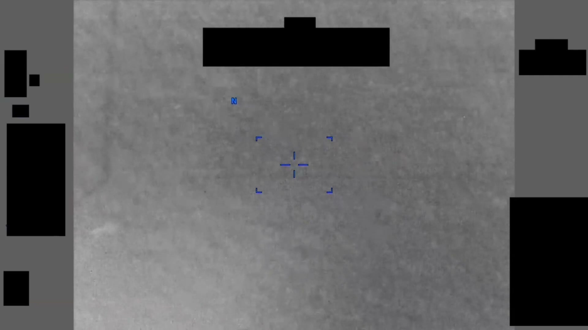
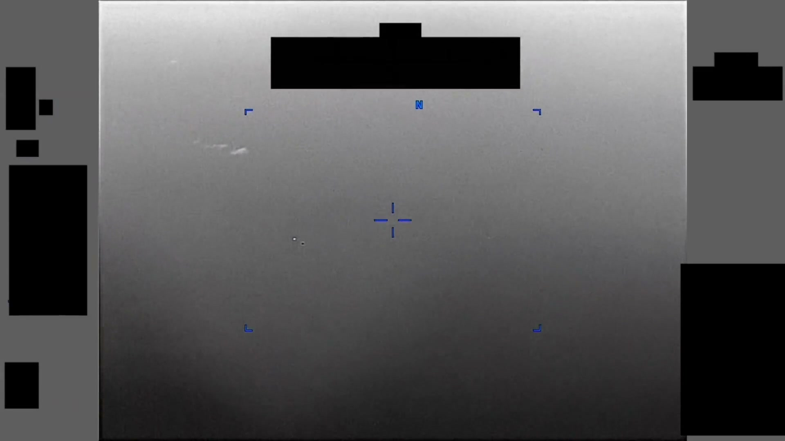
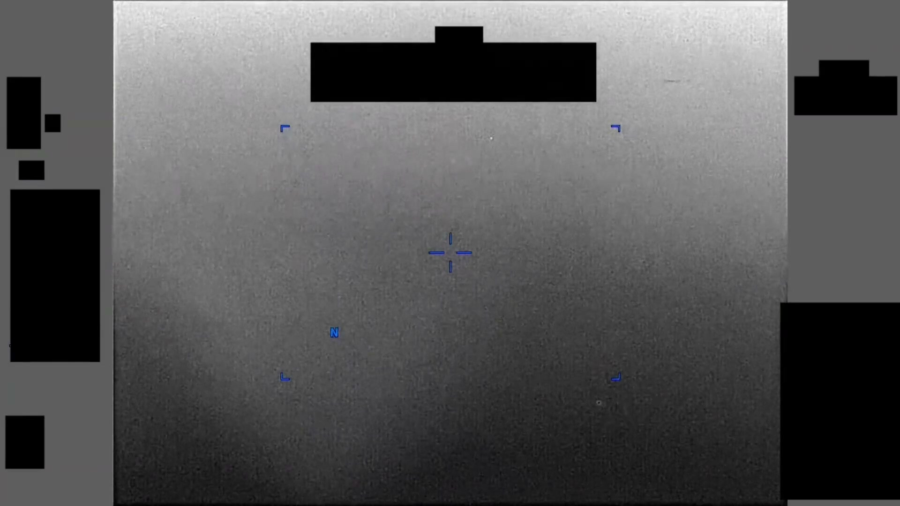

# #099 PR42 中東 2020：4 分 53 秒 IR 影片，對比區中段間歇消失與重現，感測器多次切換成像模態

PR42 長達 4 分 53 秒，是 PR 系列中東 2020 案件裡最長的之一。看點不在長度本身，而在這段時間裡操作員一直在切感測器設定：White Hot 換 Black Hot、再換模態、再切回來。每次切換都意味目標消失了幾秒到十幾秒，操作員試著重新捕捉。這種「intermittent visibility + sensor mode switching」組合，正是 unresolved UAP 的典型訊號。

## 影片內容

- 長度：4 分 53 秒（293.2 秒），1920×1080，30 fps
- 感測器：IR，全片至少切換 2 - 3 次成像模態（推測為 White Hot ↔ Black Hot 極性切換、或 IR ↔ EO 模態切換）
- 目標在中段間歇性消失與重現，每次消失約數秒至十餘秒
- HUD 邊角受 1.4(a) 黑塊遮蔽

## 為什麼未解

「Intermittent visibility + sensor mode switching」組合是 unresolved UAP 的典型 signature：

- 操作員嘗試不同 sensor 設定（極性、gain、polarity、IR↔EO）以重新捕捉目標，意味目標 thermal contrast 邊界跨越某些設定的偵測閾值
- 目標消失再現可能來自雲層遮蔽、距離變化、姿態變化（如旋轉物體在某些角度反光減弱）
- 4 分 53 秒長片可允許更完整的運動學分析，但 HUD redaction 移除高度／距離／速度資料後仍無法解算

AARO 將本片歸為 unresolved，未提供候選解釋。

## 影像規格與來源

| 欄位 | 內容 |
|---|---|
| 系列 | DOW-UAP-PR42 |
| 地點 | 中東（未細分） |
| 年份 | 2020 |
| 影片長度 | 4:53（293.2 秒） |
| 解析度 / fps | 1920×1080 / 30 fps |
| 感測器 | IR（含模態切換） |
| 對應 MISREP | 無 |
| 機密層級 | 原 SECRET，公開 cleared |
| 公開日 | 2026-05-08 |
| 釋出途徑 | USCENTCOM MDR 25-0094 thru MDR 25-0099 |
| 官方來源 | [DOW-UAP-PR42, Unresolved UAP Report, Middle East, 2020](https://www.war.gov/UFO/#DOW-UAP-PR42,%20Unresolved%20UAP%20Report,%20Middle%20East,%202020) |
| DVIDS 鏡像 | [DVIDS video 1006097](https://www.dvidshub.net/video/1006097/dow-uap-pr42-unresolved-uap-report-middle-east-2020) |
