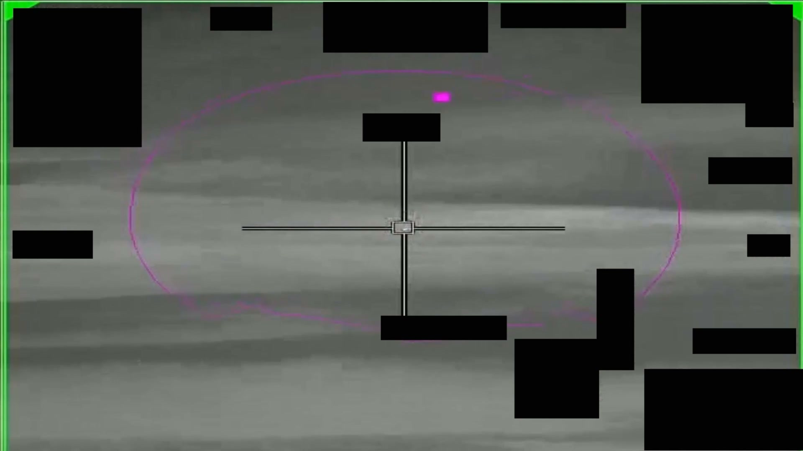
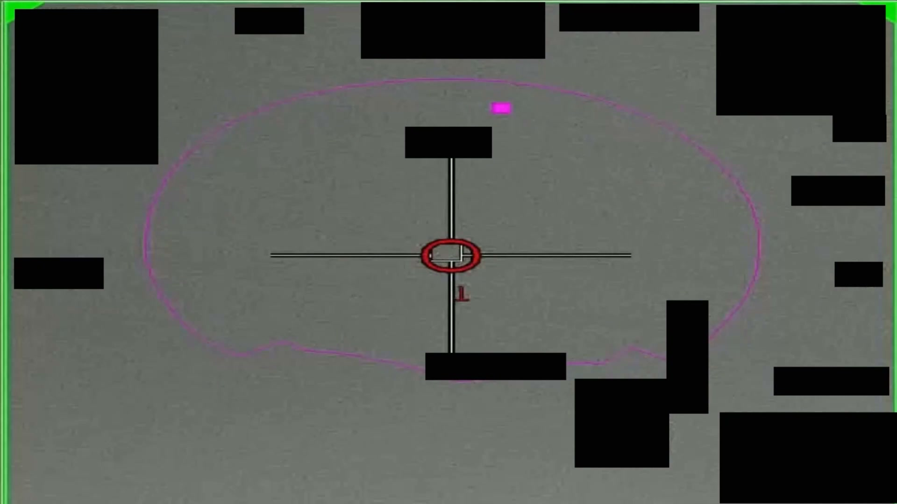
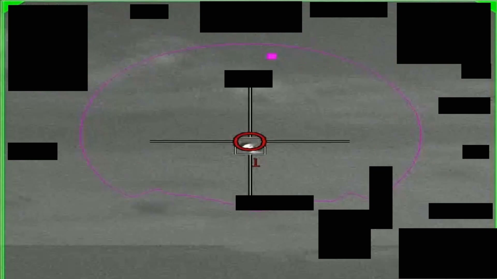

# #102 PR45 中東 2020：58 秒 IR 影片，感測器鎖定對比區漸放大，AARO 註「變大」可能源於平台距離縮短

PR45 是 PR 系列中少數 AARO 在公開時主動加註「**官方解釋備註**」的影片之一。AARO 在 caption 寫明：「**The apparent growth of the contrast region may be attributable to a reduction in the slant range between the observing platform and the target**」（對比區看似變大可能來自觀測平台與目標的斜距縮短）。

## 影片內容

- 長度：58.8 秒，1920×1080，30 fps
- 感測器：IR，HUD 邊角受 1.4(a) 黑塊遮蔽
- 感測器持續鎖定中央對比區，全片皆有 autotrack 反應
- 對比區尺寸隨時間漸增（apparent growth）

## AARO 加註的物理意義

「Slant range 縮短解釋對比區變大」是 IR 觀測的標準解讀模式：

- IR 感測器顯示的對比區大小取決於目標的「角直徑」（angular size）
- 角直徑 = 物理尺寸 / 距離（小角近似）
- 因此「對比區變大」可由（a）物理尺寸增加（不太可能對 rigid 物體）、（b）距離縮短、（c）感測器 zoom 改變
- AARO 註記排除（c）（感測器 zoom 未改變），主張（b）即觀測機平台主動接近目標

這個加註的存在意味 AARO 不希望觀眾誤判「物體在膨脹」這類非物理性詮釋，提前釐清「視角縮短 ≠ 物體變大」。

## 為什麼仍列為 unresolved

雖然 AARO 提供了「距離縮短」的解釋，但本案仍未解：

- 距離縮短說明對比區何以變大，但未說明目標是什麼
- 目標形態仍模糊，無 ID
- 平台距離縮短可能是平台主動追近，也可能是目標主動接近平台或保持位置不動
- HUD redaction 移除速度與距離資料後，無法判別誰主動接近誰

## 影像規格與來源

| 欄位 | 內容 |
|---|---|
| 系列 | DOW-UAP-PR45 |
| 地點 | 中東（未細分） |
| 年份 | 2020 |
| 影片長度 | 58.8 秒 |
| 解析度 / fps | 1920×1080 / 30 fps |
| 感測器 | IR |
| AARO 加註 | apparent growth due to slant range reduction |
| 對應 MISREP | 無 |
| 機密層級 | 原 SECRET，公開 cleared |
| 公開日 | 2026-05-08 |
| 釋出途徑 | USCENTCOM MDR 25-0094 thru MDR 25-0099 |
| 官方來源 | [DOW-UAP-PR45, Unresolved UAP Report, Middle East, 2020](https://www.war.gov/UFO/#DOW-UAP-PR45,%20Unresolved%20UAP%20Report,%20Middle%20East,%202020) |
| DVIDS 鏡像 | [DVIDS video 1006105](https://www.dvidshub.net/video/1006105/dow-uap-pr45-unresolved-uap-report-middle-east-2020) |
