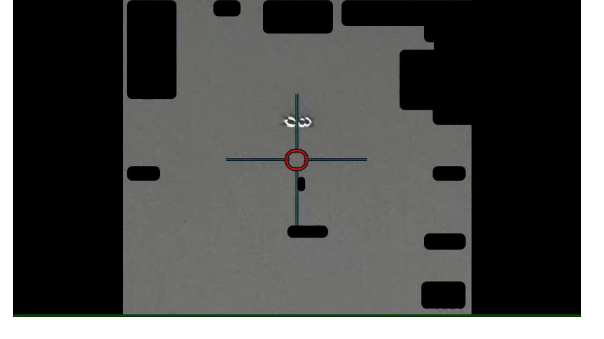
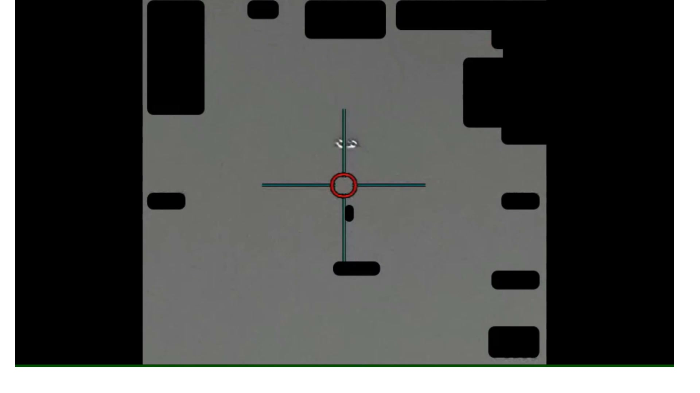
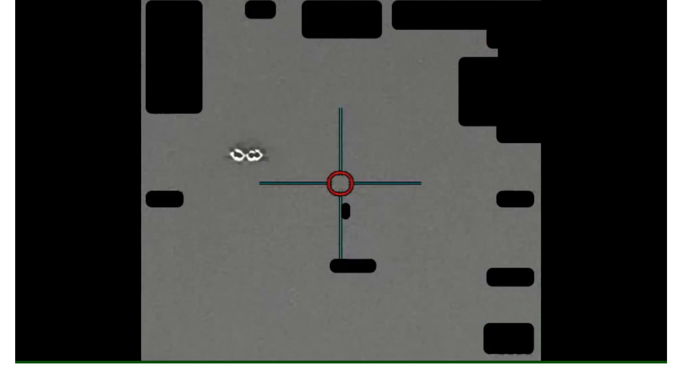

# #104 PR47 INDOPACOM 2023：1 分 59 秒 IR 影片，感測器追蹤 3 處對比區，相對位置與方位固定

PR47 是 PR 系列中少數同時呈現「**多目標 + 編隊式排列**」的影片，地點 INDOPACOM AOR、年份 2023。AARO 公開時無對應 D 系列 MISREP。影片重點在於 3 處對比區之間的相對位置與方位在追蹤期間保持穩定，意味目標可能呈剛體編隊。

## 影片內容

- 長度：1 分 59 秒（119.7 秒），1920×1080，30 fps
- 感測器：IR，HUD 含紅色 autotrack 環、青色十字準星，邊角多塊 1.4(a) 黑色遮蔽
- 3 處對比區可見於畫面中央區域：
  - 2 處對比區位於 autotrack 環上方，水平排列
  - 1 處對比區位於 autotrack 環內或正下方
- 3 處對比區的相對位置與方位在 2 分鐘內保持穩定
- HUD 邊框遭 1.4(a) 黑塊大量遮蔽

## 為什麼「相對位置固定」很關鍵

3 個對比區的相對位置與方位在 2 分鐘內保持穩定，可推得：

- 三點所構成的幾何在感測器視角下不變 → 三點可能黏附於同一剛體
- 或三點彼此維持精準編隊飛行（rigid formation flying）
- 排除「三個獨立物體湊巧出現在同一畫面」（隨機物體不會維持精準幾何）

候選解釋包括：

- 多旋翼 UAV（rotor blades 高速旋轉造成 3 個亮點？需要解析度與快門配合，IR 通常不會這樣顯示）
- 高空汽球攜帶多感測器吊艙
- 衛星發射後上面級殘骸（單一物體三個突出部）
- 真正未知

## 為什麼仍列為 unresolved

INDOPACOM 戰區廣大，2 分鐘影片無雷達 / IFF / RWR 交叉，且 HUD redaction 移除距離、方位變化率，無法解算剛體尺寸或姿態。

## 影像規格與來源

| 欄位 | 內容 |
|---|---|
| 系列 | DOW-UAP-PR47 |
| 地點 | INDOPACOM AOR（未細分） |
| 年份 | 2023 |
| 影片長度 | 1:59（119.7 秒） |
| 解析度 / fps | 1920×1080 / 30 fps |
| 感測器 | IR |
| 對比區數量 | 3 處，相對位置固定 |
| 對應 MISREP | 無 |
| 機密層級 | 原 SECRET，公開 cleared |
| 公開日 | 2026-05-08 |
| 釋出途徑 | 推測 INDOPACOM 解密通道 |
| 官方來源 | [DOW-UAP-PR47, Unresolved UAP Report, INDOPACOM, 2023](https://www.war.gov/UFO/#DOW-UAP-PR47,%20Unresolved%20UAP%20Report,%20INDOPACOM,%202023) |
| DVIDS 鏡像 | [DVIDS video 1006107](https://www.dvidshub.net/video/1006107/dow-uap-pr47-unresolved-uap-report-indopacom-2023) |
