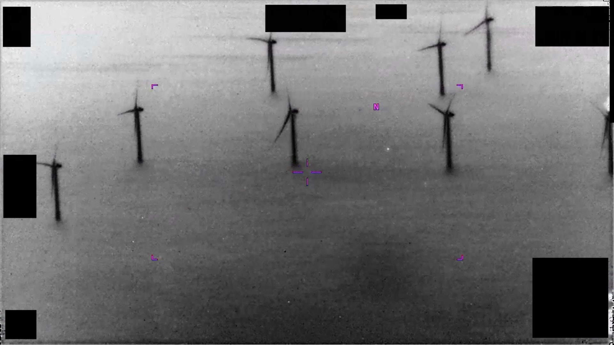
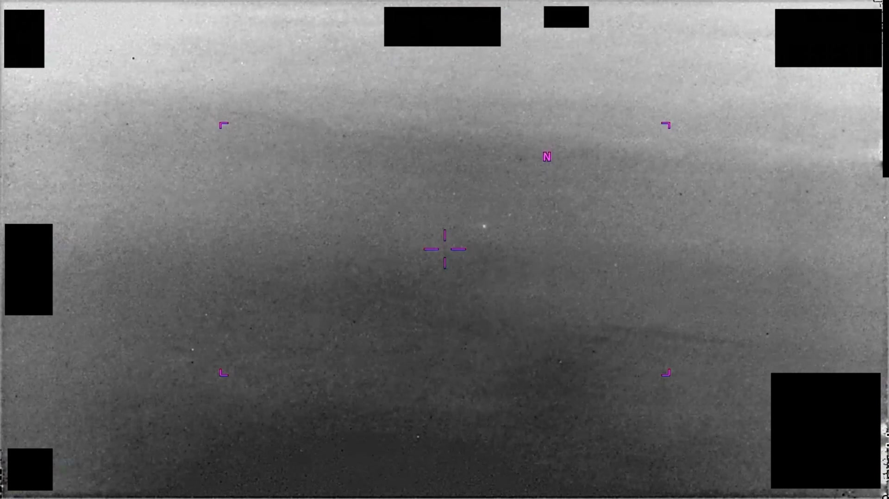
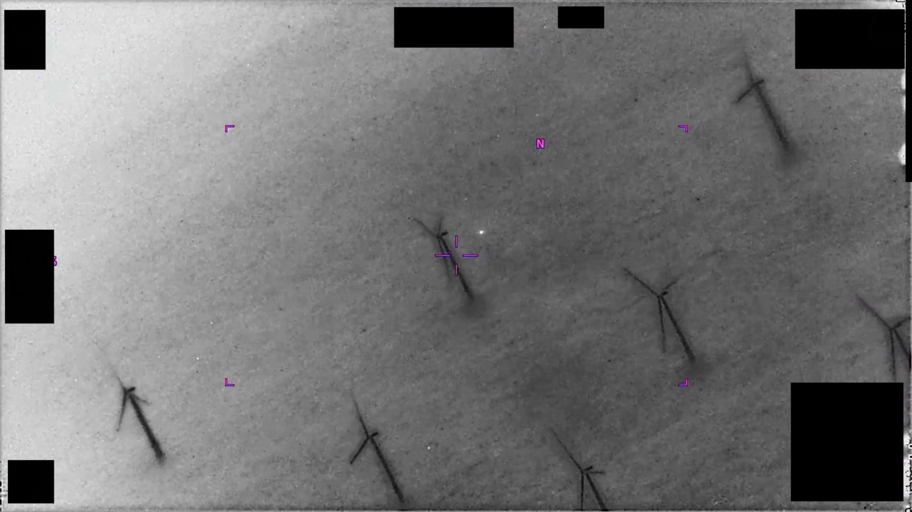

# #105 PR48 INDOPACOM 2024：1 分 39 秒 IR 影片，感測器追蹤一處對比區於畫面中央

PR48 畫面背景出現的東西很罕見：一整片離岸風機，在 IR 下顯影成多個三葉黑色剪影。鎖定環圈在風機之間水域中一個小亮點。INDOPACOM AOR、2024 年、1 分 39 秒。相比 PR46 的橄欖球與 PR47 的編隊，PR48 是「最正規」的單目標追蹤，卻仍被列為 unresolved。

## 影片內容

- 長度：1 分 39 秒（99.4 秒），1920×1080，30 fps
- 感測器：IR，HUD 邊角受 1.4(a) 黑塊遮蔽
- 一處對比區持續位於畫面中央
- 感測器以 autotrack 或手動 slew 方式保持目標於中央

## 為什麼未解

PR48 在三個 INDOPACOM 影片中（PR46、PR47、PR48）是最「正規」的單目標追蹤：

- 沒有 PR46 的特殊形態（橄欖球 + 突出物）
- 沒有 PR47 的多目標編隊
- 僅一處中央對比區，似一般飛行物觀測

但 AARO 仍列為 unresolved，主因應為：

- INDOPACOM 戰區廣大，缺乏 ground-based 雷達或船載雷達交叉
- HUD redaction 移除高度、距離、速度
- 對比區形態太一般化（圓形 / 橢圓），不足以排除已知類別也不足以指認新類別

## 影像規格與來源

| 欄位 | 內容 |
|---|---|
| 系列 | DOW-UAP-PR48 |
| 地點 | INDOPACOM AOR（未細分） |
| 年份 | 2024 |
| 影片長度 | 1:39（99.4 秒） |
| 解析度 / fps | 1920×1080 / 30 fps |
| 感測器 | IR |
| 對比區數量 | 1 處（中央） |
| 對應 MISREP | 無 |
| 機密層級 | 原 SECRET，公開 cleared |
| 公開日 | 2026-05-08 |
| 釋出途徑 | 推測 INDOPACOM 解密通道 |
| 官方來源 | [DOW-UAP-PR48, Unresolved UAP Report, INDOPACOM, 2024](https://www.war.gov/UFO/#DOW-UAP-PR48,%20Unresolved%20UAP%20Report,%20INDOPACOM,%202024) |
| DVIDS 鏡像 | [DVIDS video 1006110](https://www.dvidshub.net/video/1006110/dow-uap-pr48-unresolved-uap-report-indopacom-2024) |
