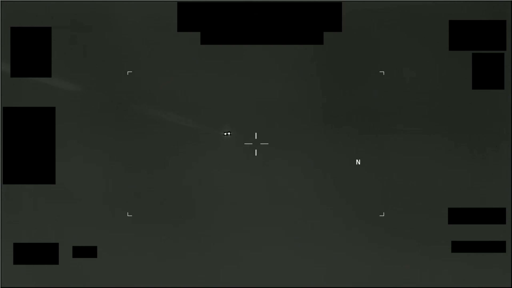
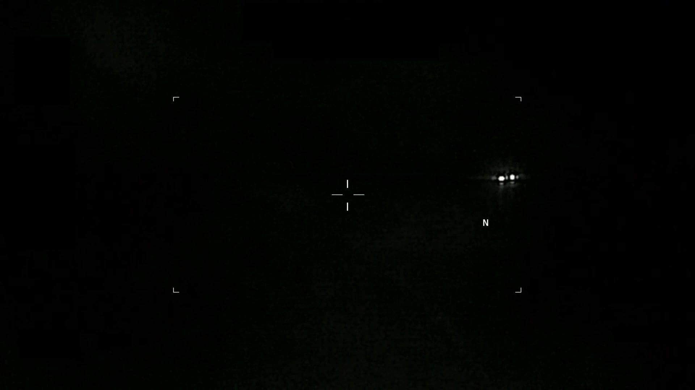
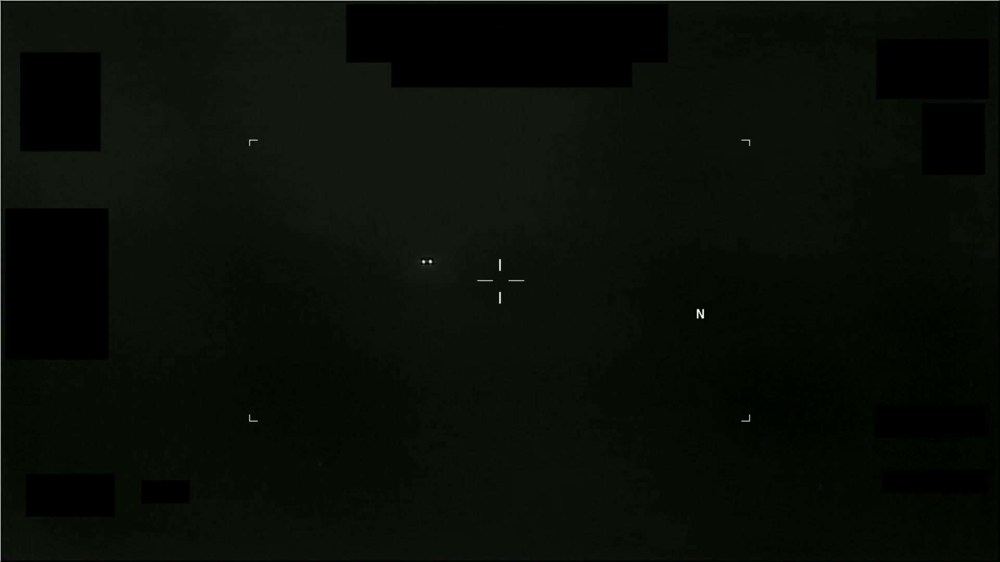

# #106 PR49 美國陸軍 2026：1 分 49 秒 IR 影片，先後追蹤多處對比區，多次調整變焦與對比

PR49 是 PR 系列中時間最新（2026）且通報單位明確為 **Department of the Army**（美國陸軍部）的 IR 影片，AARO 公開時無對應 D 系列 MISREP。本片是 PR 系列中首份來自陸軍的影片，與其他 PR（多為 Navy / Air Force ISR 任務）通報來源不同。

## 影片內容

- 長度：1 分 49 秒（109.2 秒），1920×1080，30 fps
- 感測器：IR，HUD 邊角受 1.4(a) 黑塊遮蔽
- 影片中先後出現多處對比區（非同時，而是時間先後）
- 感測器多次調整：
  - 變焦（zoom in / zoom out）
  - 對比（gain / level 調整，畫面亮度動態變化）

## 為什麼陸軍通報是新訊號

PR 系列其他案件多由：

- Navy F/A-18 ATFLIR pod（如 PR36 對應 D38）
- Air Force MQ-9 MTS-B（如 PR19 對應 D10）
- 海軍 / 空軍 ISR 平台

PR49 是首份明示為「Department of the Army」的影片，可能來自：

- 陸軍直升機（Apache、Black Hawk）的 FLIR / TADS 感測器
- 陸軍地面 FAAD 防空系統的光電 / IR 感測器
- 陸軍特種作戰平台的吊艙感測器

陸軍 IR 平台多用於戰術近距支援，與 Navy / Air Force 的高空 / 海空 ISR 觀測剖面不同，意味本案的觀測高度與距離尺度可能較小，目標也可能更接近地面。

## 為什麼仍列為 unresolved

「多處對比區先後出現 + sensor 多次調整」意味操作員嘗試多種設定，但所有設定下都無法歸入已知類別：

- 變焦改變不解決形態問題
- 對比調整不揭露額外結構細節
- 多目標可能屬於同一個移動實體在時間維度的多次觀測

AARO 沒有提供候選解釋，且 2026 案件（本年度）尚未經完整事後分析（與 2013 - 2024 案件相比，2026 案件 forensic 時間最短）。

## 影像規格與來源

| 欄位 | 內容 |
|---|---|
| 系列 | DOW-UAP-PR49 |
| 通報單位 | **Department of the Army**（美國陸軍部） |
| 年份 | 2026 |
| 影片長度 | 1:49（109.2 秒） |
| 解析度 / fps | 1920×1080 / 30 fps |
| 感測器 | IR（陸軍 FLIR 或 TADS 級平台） |
| 對應 MISREP | 無 |
| 機密層級 | 原 SECRET，公開 cleared |
| 公開日 | 2026-05-08 |
| 釋出途徑 | 推測 Army 解密通道（非 USCENTCOM / INDOPACOM） |
| 官方來源 | [DOW-UAP-PR49, Unresolved UAP Report, Department of the Army, 2026](https://www.war.gov/UFO/#DOW-UAP-PR49,%20Unresolved%20UAP%20Report,%20Department%20of%20the%20Army,%202026) |
| DVIDS 鏡像 | [DVIDS video 1006111](https://www.dvidshub.net/video/1006111/dow-uap-pr49-unresolved-uap-report-department-army-2026) |
