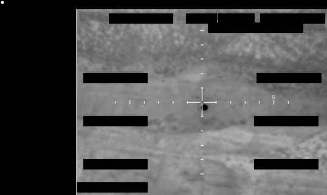

# FBI Photo A2

| 機關 | FBI（聯邦調查局） |
| --- | --- |
| 類型 | IMG |
| 事件日期 | Late 2025（具體日期未提供） |
| 地點 | 未提供 |
| 釋出日期 | 2026-05-08 |

> 由 Claude Opus 4.7 整理

## 摘要

FBI 提交 AARO 的 8 張系列影像之一。單張靜態照片，原始檔送出前已先做遮蔽，沒有附 mission report，操作員的官方結論是「無法正面識別」。

## 內容

單色畫面，背景紋理凹凸不均，看起來像不規則地表。中央十字準線（reticle）正中心位置，可看到一個邊緣清楚的深色圓形物體。AARO 的 narrative description 強調這只是逐字陳述畫面，不代表對事件性質做任何判斷。

A2 與其他 7 張同系列照片共用相同的 metadata 缺失：時間、地點、平台、感測器都沒提供，整份檔案只剩一張被遮蔽的圖。能驗證的事實只有 FBI 提交了它，AARO 收下了它。

> **小結**：通報鏈條真實，FBI 走聯邦 UAP 通報管道送 AARO 是 2022 年起的既有流程。可疑的是缺乏所有可重建觀測幾何的資訊，這張圖獨立來看沒有距離、尺度或方向。可確認的是：圓形物體在準線正中央，FBI 自評無法識別。

## 原始連結

- 主圖（高解析 PNG）：<https://www.war.gov/medialink/ufo/release_1/fbi-photo-a2.png>
- 縮圖（JPG）：<https://www.war.gov/medialink/ufo/release_1/thumbnail/fbi-photo-a2.jpg>
- 官方 portal：<https://www.war.gov/UFO/>
