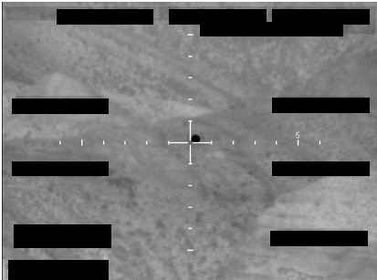

# FBI Photo A3

| 機關 | FBI（聯邦調查局） |
| --- | --- |
| 類型 | IMG |
| 事件日期 | Late 2025（具體日期未提供） |
| 地點 | 未提供 |
| 釋出日期 | 2026-05-08 |

> 由 Claude Opus 4.7 整理

## 摘要

FBI A 系列第 3 張。同樣是單色靜態畫面，原始影像送 AARO 前已遮蔽，沒有事件時間、地點，也沒有 mission report。操作員結論：無法正面識別。

## 內容

畫面中央十字準線正中心對齊一個深色的圓形物體。背景紋理化，看起來像某種地面地形，但細節已被遮蔽抹除。AARO 的 narrative description 一如其他 A 系列照片，僅做逐字陳述，不對物體性質做任何判斷。

A3 與 A6 是 8 張裡少數兩張準星「正中央對齊」的版本。如果是 AI 自動鎖定後拍攝的截圖，這代表感測器當下確實在跟拍目標。但平台與感測器型號都沒揭露，這樣的推論只能停在合理猜想的階段。

> **小結**：來源管道與 AARO 受理流程都對得上。可疑的是 metadata 完全空白，無法判斷準星「正中央」是被動鎖定還是事後人工置中。可確認的是：圓形物體與準星完全重合，FBI 仍將其列為無法識別。

## 原始連結

- 主圖（高解析 PNG）：<https://www.war.gov/medialink/ufo/release_1/fbi-photo-a3.png>
- 縮圖（JPG）：<https://www.war.gov/medialink/ufo/release_1/thumbnail/fbi-photo-a3.jpg>
- 官方 portal：<https://www.war.gov/UFO/>
