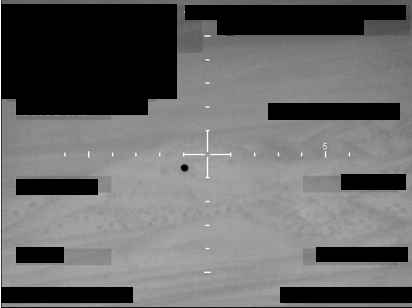

# FBI Photo A6

| 機關 | FBI（聯邦調查局） |
| --- | --- |
| 類型 | IMG |
| 事件日期 | Late 2025（具體日期未提供） |
| 地點 | 未提供 |
| 釋出日期 | 2026-05-08 |

> 由 Claude Opus 4.7 整理

## 摘要

FBI A 系列第 6 張。單色畫面，背景紋理輕淡。原始檔送 AARO 前已遮蔽，沒有事件 metadata 也沒有 mission report。操作員結論：無法正面識別。

## 內容

A6 的背景比其他 A 系列更平滑、紋理更輕，物體輪廓相對突出。中央十字準線正中心位置可看到一個深色的圓形物體，與 A3 同樣是「正中央對齊」的構圖。AARO 的 narrative description 一如其他 A 系列照片，純粹陳述畫面。

平滑背景常見於高空拍向天空（沒有複雜地形熱輻射）、海面或沙漠的低紋理區。但拍攝平台與感測器型號都沒揭露，無從鎖定具體場景。

> **小結**：FBI 通報走 AARO 標準管道。可疑的是平滑背景顯示這可能是低紋理場景，但缺感測器資訊無法精確定位。可確認的是：物體與準星正中央重合，FBI 自評無法識別。

## 原始連結

- 主圖（高解析 PNG）：<https://www.war.gov/medialink/ufo/release_1/fbi-photo-a6.png>
- 縮圖（JPG）：<https://www.war.gov/medialink/ufo/release_1/thumbnail/fbi-photo-a6.jpg>
- 官方 portal：<https://www.war.gov/UFO/>
