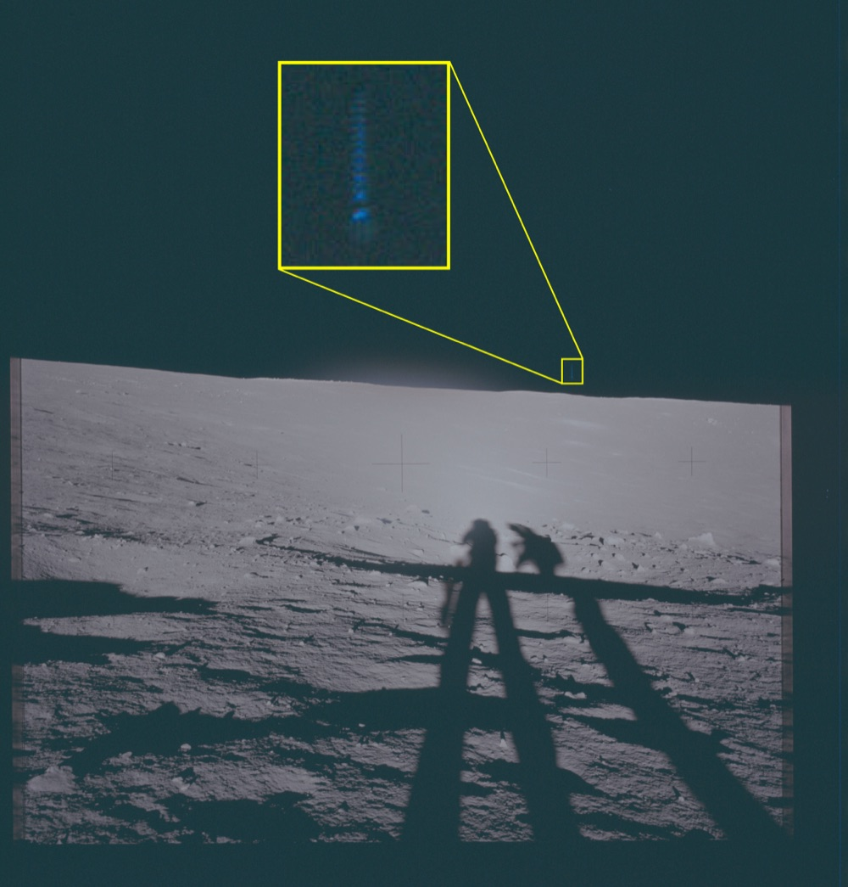
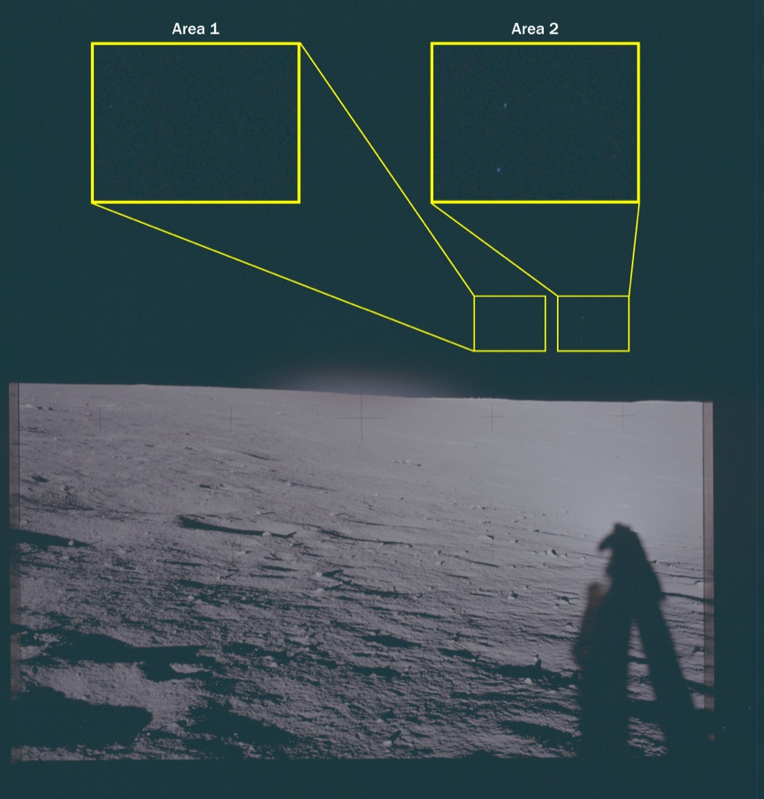
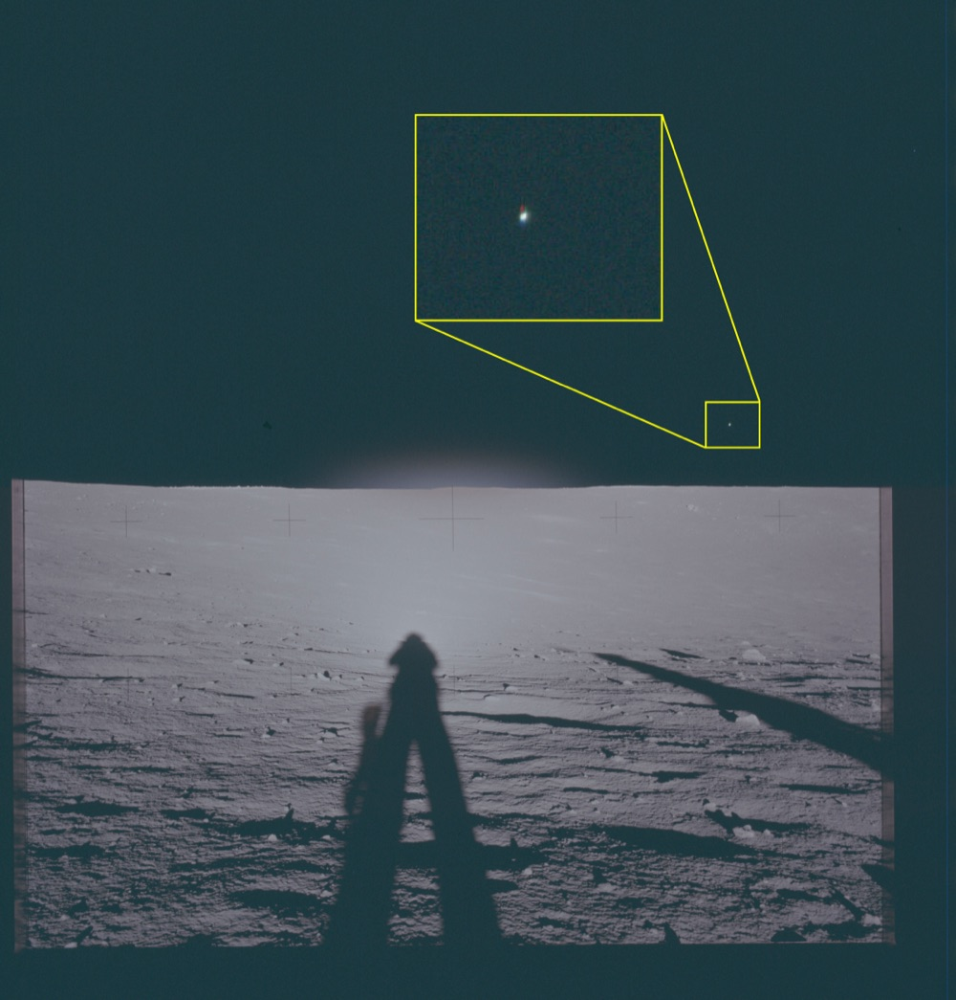
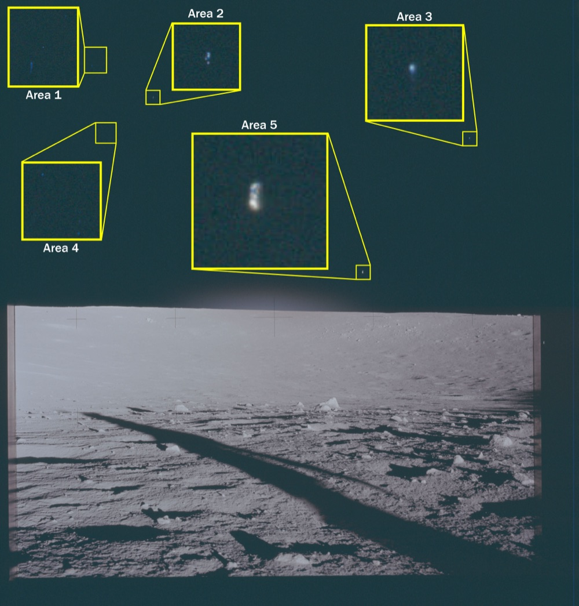
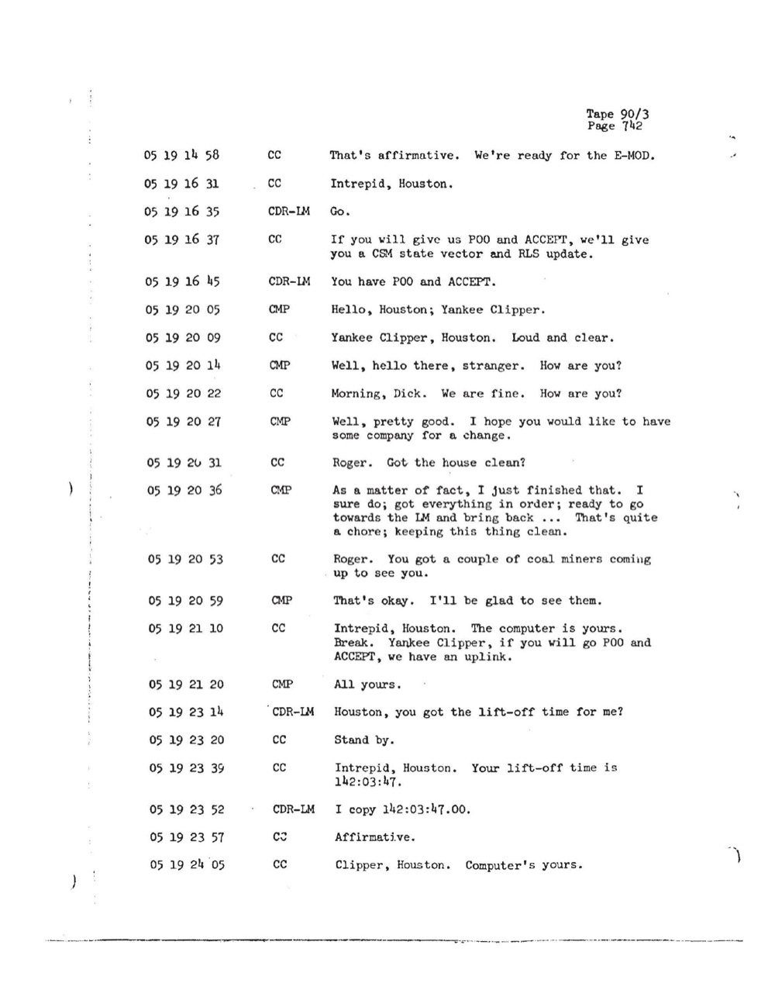
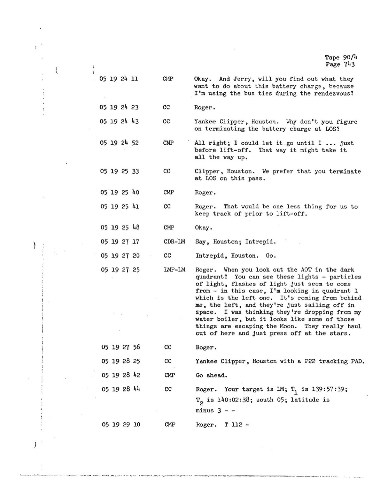
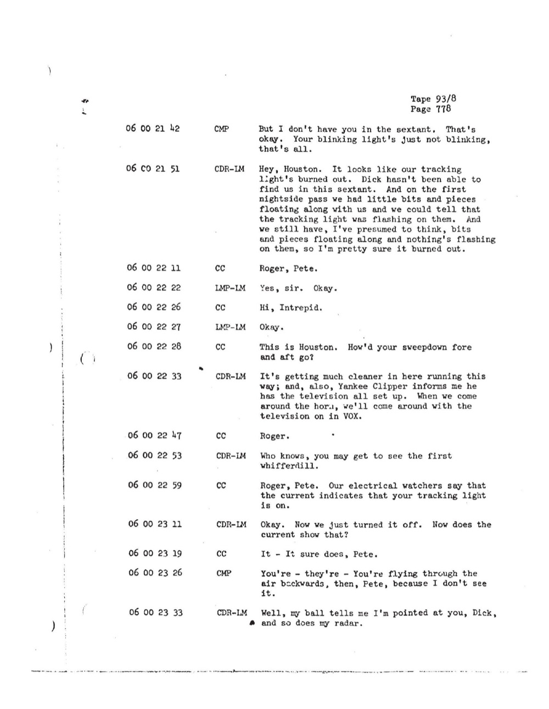

# Apollo 12：五張月面照框出 14 個藍色光點 + Bean 看到 particles 飛離月球

| 機關 | NASA |
| --- | --- |
| 類型 | 1 份 transcript + 5 張月面照 |
| 任務日期 | 1969-11-14 至 1969-11-24 |
| 地點 | 月球 Ocean of Storms（Surveyor 3 著陸點）+ 月球軌道 |
| 釋出日期 | 2026-05-08 |
| 卷宗 | [#139 transcript](https://www.war.gov/UFO/#nasa-uap-d1-apollo-12-transcript-1969) ・ [#145-149 VM1-5 photos](https://www.war.gov/UFO/#nasa-uap-vm1-apollo-12-1969) |

## Overview

Apollo 12 是第二次載人登月。機組 Conrad（CDR）、Bean（LMP）、Gordon（CMP）。1969-11-19 Conrad + Bean 著陸 Surveyor 3 旁邊，Gordon 留 Yankee Clipper 軌道。

DOW 釋出 6 份檔：1 份地對空通訊 transcript + 5 張月面 panorama 照片（VM1-5）。

值得看：

- VM1-5 五張照片黃框標記 14 個觀測點，這是 NASA UAP release 裡照片數量最多的一筆
- 五張照片展示的不是同一個現象：VM1 是垂直藍色光柱、VM2-4 是單點、VM5 一張就標 5 個
- transcript 收 Bean 透過 AOT（光學瞄準鏡）親口報告：「particles ... they're escaping the Moon. They really haul out of here and just press off at the stars」
- 同一份 transcript 後段 Conrad 報告月軌道夜面看到「little bits and pieces floating along with us」，他試圖證明追蹤燈壞了，但 Houston 確認電流正常

## VM1：垂直藍色光柱在地平線上方

panorama 視覺特徵：

- 拍攝者站立月面，鏡頭朝前向地平線
- 前景下方 70% 是月面 regolith + 太空人/相機支架的垂直長影（朝右後方）
- 中段水平亮帶是月平原，太陽幾乎垂直照射
- Hasselblad 70mm 黑色十字 reseau 標記散布全幅
- 上方 30% 是深色太空，無大氣感
- 黃色框上方居中，箭頭指向地平線右上方一個極小區域（約 5 像素寬）

放大區內容：垂直方向的多個亮點堆疊，整體呈藍綠色光柱。從上到下大約 4-5 個分離的亮點，向下逐漸變淡。光柱周圍有藍色漫射暈。

這個結構不像單點光源（如恆星）。可能性：

- 流星進入月球熱層的軌跡（但月球無大氣）
- 衛星或 booster 殘骸自轉時連續閃爍記錄到底片上
- 底片刮痕（但通常呈線性而非離散點）
- 真實未識別物

## VM2：兩個觀測點 Area 1 + Area 2

兩個黃色框並列：

- Area 1（左）：放大後幾乎全黑，僅可見極微弱的單一亮點
- Area 2（右）：放大後是一個明顯的單點藍光，邊緣清晰

兩點在原始 panorama 上的位置不在同一條視線方向，箭頭分別指向地平線上方兩個小目標方框。Area 1 的目標位置比 Area 2 更靠右，較高位。

## VM3：藍紅雙色亮點

只有一個黃色框，箭頭指向地平線右側上方一個極小目標。

放大區內：一個明顯的亮點，可見藍色與紅色雙瓣（上方藍色、下方偏紅）。這種色裂在 Hasselblad 70mm Ektachrome SO-368 底片上不是自然恆星的典型表現（恆星的光譜寬，不會在底片上產生分明色裂）。

可能來源：

- 鏡頭色散瑕疵（chromatic aberration），但底片中其他亮點未呈現相同色裂
- 相對相機運動的物體在曝光期間的色相位移
- 雙星系統（但需考慮恆星色彩通常為連續光譜不會分明二色）

## VM4：橘黃色單點

單一黃色框，箭頭從畫面上方指向地平線中段一個小目標。

放大區：一個橘黃色點，邊緣有暈散。色彩明顯不同於 VM3 的藍紅或 VM2 的純藍。

如果這是恆星，橘黃色光譜對應 K 或 M 型紅巨星（如 Aldebaran、Antares）。但 Apollo 12 panorama 拍攝是月面正午時段，太陽強度遠大於任何恆星，理論上恆星不應該被底片記錄到。

## VM5：一張照片 5 個觀測點

5 個黃色框分別標記。這是 5 張裡訊息最密集的一張：

- Area 1（左上）：放大後微弱單點藍光
- Area 2（中上偏左）：較明亮的單點，藍綠色
- Area 3（右上）：明亮藍點 + 周圍暈散
- Area 4（左下）：放大後幾乎全黑，僅勉強看出一個極微小亮點
- Area 5（中央，方框最大）：垂直延伸的雙瓣結構，上方藍色、下方黃白色，整體形狀類似 VM3 但更明顯

5 個 Area 在原始畫面中的水平分布跨越大半個天空。如果是同一類來源（例如同一群 satellite 軌道），它們應該在底片曝光時間內同時出現。

Area 5 的雙瓣結構與 VM3 類似，可能是同一現象的不同實例。

## Apollo 12 Air-to-Ground Transcript（Tape 90/3 Page 742）

NASA-S-69-23，Tape 90/3，Page 742。

這頁是 Apollo 12 月面停留期間的例行通訊：CSM 狀態向量更新、battery charge、lift-off 時間（142:03:47）。

對話節錄：

**CC**：「That's affirmative. We're ready for the E-MOD.」（GET 05 19 14 58）
**CMP Gordon**：「Hello, Houston; Yankee Clipper.」（05 19 20 05）
**CC**：「Yankee Clipper, Houston. Loud and clear.」
**CMP**：「Well, hello there, stranger. How are you?」
**CC**：「Morning, Dick. We are fine. How are you?」
**CMP**：「Well, pretty good. I hope you would like to have some company for a change.」
**CC**：「Roger. Got the house clean?」
**CMP**：「As a matter of fact, I just finished that. I sure do; got everything in order; ready to go towards the LM and bring back ... That's quite a chore; keeping this thing clean.」
**CC**：「Roger. You got a couple of coal miners coming up to see you.」（Conrad + Bean 月面活動快結束，準備從 LM 升空回到 CSM）
**CMP**：「That's okay. I'll be glad to see them.」

這頁本身沒有 UAP 內容。但時間軸 GET 05 19 是月面活動接近尾聲，Bean 跟 Conrad 即將從 Intrepid LM 升空回到 Yankee Clipper CSM。下頁起 Bean 在 LM 內透過 AOT 回報粒子。

## Bean：透過 AOT 看到 particles 從月球射向恆星（Tape 90/4 Page 743）

Tape 90/4，Page 743。GET 05 19 27 25，Bean 在 LM Intrepid 內，AOT 朝向 quadrant 1（左側）。

對話：

**CMP Gordon**：「OK，Jerry，能不能幫我問一下 battery charge 怎麼處理，我在 rendezvous 期間用 bus ties。」（05 19 24 11）
**CC**：「Roger.」
**CC**：「Yankee Clipper, Houston。建議你們在 LOS 時終止 battery charge？」
**CMP**：「OK，我可以讓它撐到 lift-off 之前 ... 那樣可能可以充滿。」
**CC**：「Clipper, Houston。我們希望你這次 pass 在 LOS 時終止。」
**CMP**：「Roger.」
**CC**：「Roger. 那樣我們 lift-off 前少一件事要追。」

GET 05 19 27 17：

**CDR-LM Conrad**：「Houston，Intrepid 呼叫。」
**CC**：「Intrepid, Houston。Go.」

GET 05 19 27 25，Bean（LMP-LM）：

**Bean**：「Roger。當你從 AOT 看暗面那一象限的時候。可以看到這些 lights，particles of light，flashes of light 看起來就是從，這次我看的是 quadrant 1 也就是左邊那個。它們從我後面、從左邊過來，就直直 sailing off 進太空。我本來以為它們是從我的 water boiler 滴下來的，但看起來其中一些是 escaping 月球。它們真的是 haul out of here，就直接 press off 朝著恆星方向。」

原文：

> LMP-LM: Roger. When you look out the AOT in the dark quadrant? You can see these lights - particles of light, flashes of light just seem to come from - in this case, I'm looking in quadrant 1 which is the left one. It's coming from behind me, the left, and they're just sailing off in space. I was thinking they're dropping from my water boiler, but it looks like some of those things are escaping the Moon. They really haul out of here and just press off at the stars.

Houston 沒有討論這個觀察，下一句直接接 P22 tracking PAD 的軌道資料：

**CC**：「Roger.」
**CC**：「Yankee Clipper, Houston with a P22 tracking PAD.」
**CMP**：「Go ahead.」
**CC**：「Roger. Your target is LM; T₁ is 139:57:39; T₂ is 140:02:38; south 05; latitude is minus 3 - -」

關鍵：

1. AOT（Alignment Optical Telescope）是月艙頂部光學瞄準鏡，視場約 60° 圓錐，6 個象限。Bean 看的是 quadrant 1（左側）。
2. AOT 視場內的 particles 不是恆星，Bean 自己排除了 water boiler 假說，因為他看到的是粒子「press off at the stars」（朝恆星方向消失）。
3. Bean 描述的速度感「they really haul out of here」是 Apollo 任務口語裡指動作非常快。月球第二宇宙速度是 2.4 km/s，這是粒子要真的「escape the Moon」需要的速度。
4. Houston 沒回應這個觀察。後續 1996 年才有研究（LADEE 任務）確認月球周圍有微量帶電塵埃 plasma fountain，Bean 的觀察可能是這個現象的最早記錄。

## Conrad：月軌道夜面看到「bits and pieces」（Tape 93/8 Page 778）

Tape 93/8，Page 778。GET 06 00 21 42，Apollo 12 已從月面升空，CSM 跟 LM 進行月軌道 rendezvous 階段。

對話：

**CMP Gordon**：「我在 sextant 裡看不到你們。沒事，只是你們的閃光燈不閃了。」（06 00 21 42）

**CDR-LM Conrad**：「Hey, Houston。我們的 tracking light 看起來燒掉了。Dick 在 sextant 裡找不到我們。第一次夜面 pass 我們有 little bits and pieces 一起飛過，可以看到 tracking light 在它們上面閃。我們現在仍然，我猜，bits and pieces 還在飛，但什麼都沒在它們身上閃，所以我很確定它（tracking light）燒掉了。」（06 00 21 51）

原文：

> CDR-LM: Hey, Houston. It looks like our tracking light's burned out. Dick hasn't been able to find us in this sextant. And on the first nightside pass we had little bits and pieces floating along with us and we could tell that the tracking light was flashing on them. And we still have, I've presumed to think, bits and pieces floating along and nothing's flashing on them, so I'm pretty sure it burned out.

接續：

**CC**：「Roger, Pete.」
**LMP-LM Bean**：「Yes, sir. Okay.」
**CC**：「Hi, Intrepid.」
**CDR-LM**：「It's getting much cleaner in here running this way; and, also, Yankee Clipper informs me he has the television all set up. When we come around the horn, we'll come around with the television on in VOX.」
**CC**：「Roger.」
**CDR-LM**：「Who knows, you may get to see the first whifferdill.」（whifferdill = 太空人俚語，意思是月軌道空翻表演）
**CC**：「Roger, Pete. Our electrical watchers say that the current indicates that your tracking light is on.」（電流監測：燈正常）
**CDR-LM**：「Okay. Now we just turned it off. Now does the current show that?」（Conrad 把燈關掉測試）
**CC**：「It - It sure does, Pete.」（電流確認燈關了）
**CMP Gordon**：「You're - they're - You're flying through the air backwards, then, Pete, because I don't see it.」（Gordon 仍然看不到 tracking light，所以暗示 Conrad 機組可能朝向錯誤方向飛行）
**CDR-LM**：「Well, my ball tells me I'm pointed at you, Dick, and so does my radar.」

關鍵流程：

1. Conrad 觀察到「碎片在 tracking light 下閃爍」 → 第二次 pass 碎片在但不閃爍 → 推論燈燒掉
2. Houston 用電流監測說燈是正常的 → Conrad 主動關燈 → 電流變化證實 Conrad 操作有效
3. Gordon 仍然找不到 tracking light → 推論機組朝向有問題
4. Conrad 用 ball（attitude indicator）+ radar 反證朝向正確

兩個獨立事實一起出現：

- 碎片消失（第二次 pass 見不到 bits）
- tracking light 在第一次 pass 之後就無法被 Gordon 看見

這兩件事是否關連，transcript 沒給結論。最簡單的解釋：碎片是 LM 上脫落的 Mylar 隔熱層碎片，在脫離 LM 後幾分鐘到幾小時內逐漸偏離軌道。tracking light 不被 sextant 接收可能是 LM/CSM 相對位置的視差問題。

## 分析

VM1-5 五張照片黃框標出 14 個觀測點，DOW 沒給統一解釋。

從視覺分類看：

- **VM1 + VM5 Area 5**：垂直結構，多點堆疊，可能是同一類現象
- **VM2 Area 1 + Area 2、VM3、VM4**：單點現象，但色彩不同（純藍 / 雙色 / 橘黃）
- **VM5 Area 1-4**：單點現象的密集分布

Apollo 計畫攝影使用 Hasselblad 70mm Ektachrome SO-368 底片，曝光時間典型 1/250 秒。這個曝光時間下：

- 恆星在月面正午陽光環境下基本不會被記錄到（曝光不足）
- 微隕石撞擊閃光理論上可被記錄到（亮度足夠），但持續時間短，需要相機剛好對準
- 軌道殘骸在 1/250 秒曝光下會呈現點狀（位移小），多個點可能來自一張照片內的多次反射

DOW 在 release blurb 寫「初步美方分析顯示影像特徵可能源於場景中的實體物」（the imagery features may originate from physical objects in the scene），但這是初步判斷，原始底片已取得，完整分析將另行公布。

Bean 的 AOT particles 觀察是 Apollo 計畫第一次明確報告月球粒子環境異常。

1969 年的標準解釋：LM 水沸騰器排放冰晶 + 月塵揚塵。Bean 自己第一個假設就是 water boiler，但他立刻補了「looks like some of those things are escaping the Moon」。

「Escaping」這個詞物理意義很強。月球第二宇宙速度 2.4 km/s。要 escape：

- 水冰晶從 water boiler 噴出的初速約幾十公尺/秒，遠不及
- 月塵被引擎熱氣揚起的速度約 1-100 公尺/秒，也不及
- 帶電粒子被太陽風夾帶（pickup）後可達 km/s 量級，可能 escape

LADEE 任務（2013-2014）後來確認月球確實有 plasma fountain，太陽 UV 把月面 regolith 帶電後形成的浮塵環。Bean 1969 年看到的可能就是這個現象的視覺記錄。

Conrad 的 tracking light bits 是另一類問題。

CSM tracking light 是引導 LM rendezvous 的 60-cycle 紅色信號燈。Conrad 在第一次夜面 pass 看到「碎片同步閃爍」，這意味碎片就在 LM 附近、距離夠近能反射 tracking light。

第二次 pass 碎片仍在但不閃爍，Houston 確認 tracking light 仍然亮 → 碎片自己離開了 LM 周圍。

最簡單解釋：LM 上 Mylar 隔熱層脫落物。但 Mylar 隔熱層應該是 reflective 的，理論上即使距離稍遠也應該能被 tracking light 照到。

替代解釋：碎片是隨 LM 從月面升空時揚起的月塵 + 月面碎屑，在 LM 進入 100 km 月軌道後幾分鐘內因軌道擾動逐漸消散。

DOW 在 transcript 上沒做螢光標記，但抽出這兩段（Bean AOT + Conrad tracking light）做為 NASA-UAP-D1 的核心內容，等於是事後追認：這兩段紀錄屬於 UAP file。

與本批 release 其他 NASA 卷宗的連結：

- Apollo 11 (#141) Aldrin 1969-07 看到 cabin 內 flashes，4 個月後 Bean 1969-11 看到 LM 外 particles，是同一年 Apollo 計畫從艙內擴展到艙外的觀察延伸
- Apollo 17 (#150) VM6 三點藍光與 VM1-5 屬同類「月面 panorama 框出不明點」現象
- Skylab (#144) Carr + Pogue + Gibson 看到「objects up there with us」是 1973 年地球軌道版本的相同類別觀察
- Gemini 7 (#020) Borman 1965 年「BOGEY」+ Lovell「trillions of particles」是這個系列最早期紀錄
## 相關報告

- [#020 Gemini 7](../020_021-nasa_gemini_7/report.md)
- [#141 Apollo 11](../141-nasa_apollo_11/report.md)
- [#144 Skylab](../144-nasa_skylab/report.md)
- [#150 Apollo 17](../140_142_143_150-nasa_apollo_17/report.md)
