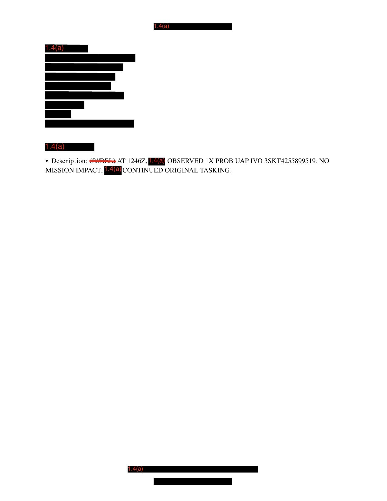

# #068 DOW-UAP-D6：7 頁中 6 頁全黑

D6 在已釋出的 D 系列裡屬於遮蔽光譜的極端端點。

7 頁 PDF，前 6 頁完全 1.4(a) 黑色遮蔽：整頁背景塗黑、左上角紅色 1.4(a) 標記、無任何可讀內容。

只有第 7 頁最下方留下一個 bullet：

> Description: (S//REL) AT 1246Z, [1.4a redacted] OBSERVED 1X PROB UAP IVO 3SKT4255899519. NO MISSION IMPACT, [1.4a redacted] CONTINUED ORIGINAL TASKING.

整份報告對外公開的內容只有這 22 個英文字。

## 從 22 字能讀出什麼

- 時間：1246Z（中午前後 UTC）
- 物體數：1 個 probable UAP
- 位置：MGRS 座標 3SKT4255899519
- 任務影響：無，繼續原訂任務
- 觀測者：被遮蔽（1.4a）
- 平台：被遮蔽（1.4a）
- 日期：報告分類「Arabian Gulf, 2020」，具體月日不明（war.gov 索引 N/A）

## 3SKT4255899519 的問題

MGRS（Military Grid Reference System）標準格式：
`<UTM 經度區><緯度帶><100km 方格 2 字母><易爾值 5 位><北行值 5 位>`

正確讀法應該類似 `38S KT 42558 99519`。

但報告原文寫的是「3SKT4255899519」，只有一個「3」。可能性：

1. 截斷錯誤：解密人員手抄時漏掉「8」，正確應是「38S KT 42558 99519」
2. 格式縮寫：直接連寫去空格，第一字母省略
3. 加密替換：某些參考點刻意改寫以避免精確定位

如果 38S KT 是正確讀法，對應位置在伊拉克、沙烏地阿拉伯、科威特三國交界附近，剛好對應「Arabian Gulf 2020」標題。

## 為什麼這麼遮

D 系列大多數報告會遮：

- 座標細節（lat/long）
- 機組身分
- 影片連結
- Bullseye 參考點

但 D6 連 mission narrative、weather、sensor type、aircraft type 都遮掉。在已釋出的 D 系列裡，遮蔽幅度比 D6 大的目前未見。

可能的解讀：

1. 觀測來自高度機密平台：例如 RC-135、U-2、RQ-170 等 SCI 級平台。即使釋出 UAP 觀測本身，平台身分與感測器 capability 都要保密。
2. 觀測涉及 ongoing operation：2020 年阿拉伯灣是 USCENTCOM 持續行動區（OIR、Operation Sentinel）。如果觀測過程牽涉到正在進行的情報任務，整份 narrative 都會被劃為 1.4(a)。
3. 第三國資料來源：觀測可能來自盟邦平台（如英國、法國），釋出前要走 FVEY / NATO 共享協議。

「NO MISSION IMPACT, CONTINUED ORIGINAL TASKING」這句反而提供最多資訊。觀測者有明確的原訂任務（不是 routine 巡邏），看到 UAP 後繼續執行，意味原訂任務優先級高於 UAP 跟蹤。

這支持第 2 種解讀：D6 觀測者正在執行情報任務，遭遇 UAP 是 collateral 觀測。

## D 系列遮蔽光譜

| 報告 | 遮蔽程度 | 可讀內容量 |
|---|---|---|
| D55 敘利亞 2016 | 低（地圖 + narrative 完整） | ~80% |
| D58 NA 2020 | 中（座標遮、narrative 完整） | ~60% |
| D57 亞丁灣 2020 | 中（座標部分遮） | ~70% |
| D56 北阿拉伯海 2020 | 中（座標遮、narrative 完整） | ~70% |
| D3 阿拉伯灣 2020 | 中（圖片有遮、narrative 完整） | ~65% |
| D6 阿拉伯灣 2020 | 極端（7 頁中 6 頁全黑）| ~5% |

D6 是這個光譜的極端端點。

## 為什麼這份還是釋出

如果整份都這麼敏感，為什麼還要列入 2026-05-08 的 AARO 釋出包？

可能性：

1. 法律強制：AARO 授權法規定所有 UAP 觀測記錄都要釋出，無論遮蔽程度。釋出 6 頁全黑也算「滿足釋出義務」。
2. 存在性確認：對 UAP 研究者來說，「這天這個座標附近確實有 UAP 觀測」就已經是新資訊。即使內容遮蔽，存在性本身是可確認的事實。
3. 未來解密路徑：25-year-rule 到期時整份內容可自動解密。先釋出框架，內容延後解密。

## 影像規格與來源

| 屬性 | 內容 |
|---|---|
| 格式 | PDF（7 頁，6 頁全黑） |
| 影像化解析度 | 150 DPI 轉 JPEG |
| 來源 | USCENTCOM |
| 原始機密等級 | (S//REL) - SECRET, RELEASABLE |
| 解密日期 | 未標示（AARO 釋出版） |
| AARO 釋出 | Approved for Release to AARO |
| 公開日 | 2026-05-08 |
| **事件時間** | **1246Z**（日期被遮，僅標 2020 年） |
| **事件地點** | **MGRS 3SKT4255899519**（推測 38S KT，伊拉克 / 沙烏地 / 科威特交界） |
| **目標數量** | **1 個 probable UAP** |
| **觀測平台** | **完全遮蔽** |
| **任務影響** | **無，繼續原訂任務** |
| 直接下載 | <https://www.war.gov/medialink/ufo/release_1/dow-uap-d6-mission-report-arabian-gulf-2020.pdf> |
| 官方 portal | [war.gov/UFO/#DOW-UAP-D6](https://www.war.gov/UFO/#DOW-UAP-D6,%20Mission%20Report,%20Arabian%20Gulf,%202020) |

## 相關案件

- [#067 D58 NA 2020-10](../142-dow_uap_d58_range_fouler_na_oct_2020/report.md)：另一份地點 NA 的高敏感報告，但內容遠比 D6 完整。
- [#066 D57 亞丁灣 2020-09](../141-dow_uap_d57_range_fouler_gulf_of_aden_sep_2020/report.md)：MQ-9 8 分鐘觀測。
- [#047 D3 阿拉伯灣 2020](../047-dow_uap_d3_mission_report_arabian_gulf_2020/report.md)：同地區、同年份，narrative 完整 D 系列代表案。
- [#054 D4 阿拉伯灣 2020](../054-dow_uap_d4_mission_report_arabian_gulf_2020/report.md)：D 系列阿拉伯灣家族另一份。
