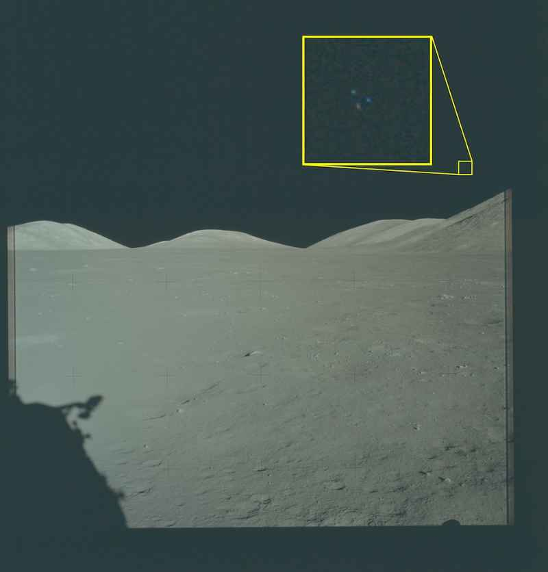

# NASA-UAP-VM6, Apollo 17, 1972

| 機關 | NASA（美國太空總署） |
| --- | --- |
| 類型 | IMG |
| 事件日期 | 1972 |
| 地點 | Moon（月球） |
| 任務 | Apollo 17 |
| 釋出日期 | 2026-05-08 |

> 由 Claude Opus 4.7 整理

## 摘要

Apollo 17 任務（1972 年 12 月）拍攝的照片，月球天空右下象限放大後可見 3 個點呈三角形排列。Department of War 已在 PURSUE 框架下立案調查，並調出原始底片重新分析。是 6 張 NASA UAP 中唯一被正式立案的一張。

## 內容

照片來自 1972 年 12 月的 Apollo 17 任務。畫面右下象限有 3 個「點」呈三角形排列，影像放大後清晰可見。NASA 在 blurb 中說明，這張照片過去曾被公開、也被熱心觀察者討論過，但對於這個異常物的性質一直沒有共識。

美國政府最新的初步分析給出一個關鍵結論：畫面上的這個特徵「有可能是場景中真實物體所造成」（possibly caused by real objects in the scene），而不是底片瑕疵。為了完成完整鑑識，DOW 已取得 Apollo 17 原始底片重新檢視，NASA 與 DOW 的完整分析報告會在完成後一併釋出。

VM6 因此跟其他 VM1 至 VM5 在分類上不同：那 5 張仍停留在「未識別現象，無進一步動作」，VM6 已升級為「立案中、原始底片已調出、結論待公開」。

> **小結**：影像在公開資料庫中可追溯，Apollo 17 為 NASA 公開歷史任務。可疑的是 3 點三角形成因仍未確定，可能是底片瑕疵、相機反射，也可能是政府初步分析所說的真實物體。可確認的是：DOW 已立案，原始底片已調出，後續鑑識報告會另行公開。

## 原始連結

- 主圖（高解析 JPG）：<https://www.war.gov/medialink/ufo/release_1/nasa-uap-vm6-apollo-17-1972.jpg>
- 縮圖（JPG）：<https://www.war.gov/medialink/ufo/release_1/thumbnail/nasa-uap-vm6-apollo-17-1972.jpg>
- 官方 portal：<https://www.war.gov/UFO/>
