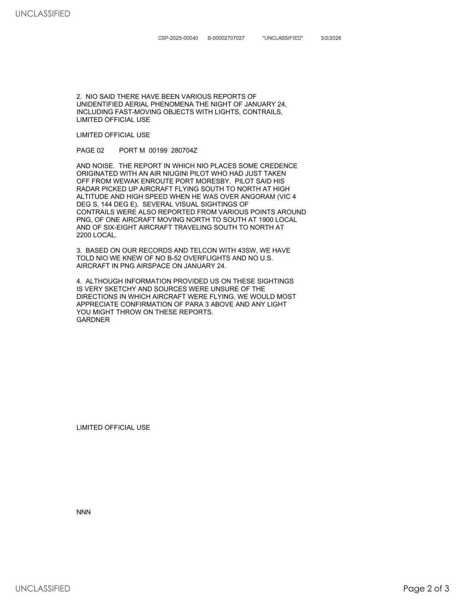

# #151 State Dept UAP Cable 1：Port Moresby → USCINCPAC 1985-01-28「PNG 1-24 高空高速飛行器入侵」

| 欄位 | 內容 |
|---|---|
| MRN | 85 PORT MORESBY 199 |
| 日期 | 1985-01-28 / 280000Z JAN 85 |
| From | AMEMBASSY PORT MORESBY（駐 Papua New Guinea 美使館，Gardner 代表）|
| 收件 | USCINCPAC HONOLULU（Action，含 J3 和 POLAD）|
| 抄送 | 43SW ANDERSEN AFB GU、SECSTATE WASHDC 1694、AMEMBASSY CANBERRA、AMEMBASSY JAKARTA |
| TAGS | MARR, PP |
| 主旨 | PAPUA NEW GUINEA INQUIRY RE OVERFLIGHTS |
| 機密層級 | LIMITED OFFICIAL USE ／ Released in Full（2026-02-25）|
| 公開日 | 2026-05-08 |

## 為什麼這份檔案重要

這是 War Department 釋出的 5 份 State Dept UAP Cable 中年代最早的一份，1985 年 PNG（Papua New Guinea，巴布亞紐幾內亞）一連串高空高速飛行物目擊事件後 4 天的美使館回報。電報主要對話者不是國務院本部，而是 USCINCPAC（太平洋總部，當時駐 Honolulu）+ 43SW（駐關島安德森空軍基地），意味本檔案是「軍方優先、外交次要」的查詢。

PNG 國家情報組織（NIO）主動找美使館，是因為當地 Wewak 居民被 1-24 晚的 overflight 嚇到，省長被迫召集公開會議，當時在選區度週末的總理出席。PNG 找美使館的潛台詞：「這是不是你們美國軍機？」美使館查 43SW（負責關島-PNG 區域 B-52 訓練飛行的單位）後回覆：「1-24 沒有 B-52，也沒有 US 飛機進入 PNG 空域。」並反過來向 USCINCPAC 確認且請求補充資訊。

這份電報的核心價值不在 UAP 描述本身（資訊極稀薄：「high-altitude, high-speed aircraft」+ 雷達資料 + 飛機尾跡），而在美使館「先排除自家軍機」流程的展示：當地民眾被嚇 → 省長公會 → 總理出席 → 情報機關接手 → 跟最近的盟邦使館對接。冷戰晚期 PNG 的航空主權問題，以及美方對「不是我們」的官方否認在 1985 年的 cable 形式。

## 1. 起因：Wewak 居民被嚇 + 省長召開公會

> 1. EMBASSY JANUARY 28 RECEIVED INFORMAL INQUIRY FROM PNG NATIONAL INTELLIGENCE ORGANIZATION (NIO) CONCERNING REPORTED SIGHTINGS OF HIGH-ALTITUDE, HIGH-SPEED AIRCRAFT OVER PNG DURING EVENING JANUARY 24. MATTER CAME TO NIO'S ATTENTION WHEN ITS OFFICER IN WEWAK REPORTED LOCAL RESIDENTS HAD BEEN FRIGHTENED BY OVERFLIGHTS, WHICH LED TO THE PROVINCIAL PREMIER'S CALLING OF A PUBLIC MEETING ON THE SUBJECT ATTENDED BY THE PRIME MINISTER WHO WAS WEEKENDING IN HIS ELECTORAL DISTRICT.

> 1. 美使館 1 月 28 日收到 PNG 國家情報組織（NIO）的非正式查詢，內容關於 1 月 24 日晚間 PNG 上空被通報的高空高速飛行器目擊。事件因 NIO 駐 Wewak 的官員回報當地居民因 overflight 而恐慌，導致省長就此主題召集公開會議，當時正在選區度週末的總理也出席會議。

Wewak 是 East Sepik 省的省會，位於 PNG 北岸，是 1-24 事件的主要目擊地之一。地理上 Wewak 距赤道約 3.5°S，距 Indonesia 西北外海約 350 公里，是當時 Indonesia-Australia 之間遠程飛行路徑的中段。

省長被迫召開公開會議 + 總理出席，意味事件影響的不只是少數目擊者，是整個省的政治事件。

## 2. 雷達與目視證據

> 2. NIO SAID THERE HAVE BEEN VARIOUS REPORTS OF UNIDENTIFIED AERIAL PHENOMENA THE NIGHT OF JANUARY 24, INCLUDING FAST-MOVING OBJECTS WITH LIGHTS, CONTRAILS, AND NOISE. THE REPORT IN WHICH NIO PLACES SOME CREDENCE ORIGINATED WITH AN AIR NIUGINI PILOT WHO HAD JUST TAKEN OFF FROM WEWAK ENROUTE PORT MORESBY. PILOT SAID HIS RADAR PICKED UP AIRCRAFT FLYING SOUTH TO NORTH AT HIGH ALTITUDE AND HIGH SPEED WHEN HE WAS OVER ANGORAM (VIC 4 DEG S, 144 DEG E). SEVERAL VISUAL SIGHTINGS OF CONTRAILS WERE ALSO REPORTED FROM VARIOUS POINTS AROUND PNG, OF ONE AIRCRAFT MOVING NORTH TO SOUTH AT 1900 LOCAL AND OF SIX-EIGHT AIRCRAFT TRAVELING SOUTH TO NORTH AT 2200 LOCAL.

> 2. NIO 表示 1 月 24 日晚間有各種不明航空現象通報，包括帶燈光的快速移動物體、尾跡、聲音。NIO 較為採信的一則報告來自一名 Air Niugini 飛行員，他剛從 Wewak 起飛前往 Port Moresby。飛行員表示，當他飛越 Angoram（約 4°S, 144°E）時，雷達偵測到南向北方高空高速飛行的航空器。PNG 各地的多個地點也通報目視看到尾跡：1900 當地時間一架北→南、2200 當地時間六到八架南→北。

關鍵事實：

- Air Niugini 飛行員雷達紀錄：南→北、高空、高速。Angoram 位於 4°S, 144°E（PNG 中北部）。
- 1900 local 北→南單架：1700 hours UTC = PNG 1900 local（UTC+10）。
- 2200 local 南→北 6-8 架：2000 hours UTC。六到八架編隊，方向與 Air Niugini 飛行員觀測一致。

「六到八架 South-to-North」的特徵符合冷戰時期 Indonesia → 蘇聯 / 越南方向長程戰略飛行的剖面，但同時也符合 USAF B-52 從 Diego Garcia → 關島的航線可能段（PNG 北方 Bismarck Sea 上空）。

## 3. 美方否認 + 反問

> 3. BASED ON OUR RECORDS AND TELCON WITH 43SW, WE HAVE TOLD NIO WE KNEW OF NO B-52 OVERFLIGHTS AND NO U.S. AIRCRAFT IN PNG AIRSPACE ON JANUARY 24.

> 3. 根據我們的紀錄以及與 43SW 的電話確認，我們已告知 NIO 我們不知道 1 月 24 日有任何 B-52 overflight，亦無美軍飛機進入 PNG 空域。

> 4. ALTHOUGH INFORMATION PROVIDED US ON THESE SIGHTINGS IS VERY SKETCHY AND SOURCES WERE UNSURE OF THE DIRECTIONS IN WHICH AIRCRAFT WERE FLYING, WE WOULD MOST APPRECIATE CONFIRMATION OF PARA 3 ABOVE AND ANY LIGHT YOU MIGHT THROW ON THESE REPORTS. GARDNER

> 4. 雖然提供給我們的目擊資訊非常粗略，來源也不確定飛行方向，我們仍懇切希望您能確認上述第 3 段，並就這些通報提供任何進一步說明。GARDNER

簽署者 Gardner 是當時美使館代表。「B-52 overflights」是核心關鍵詞，使館主動排除這個假設意味當時 PNG 上空最被懷疑的就是美軍 B-52 戰略轟炸機。43SW（駐關島安德森空軍基地的第 43 戰略翼）正是負責太平洋區域 B-52 戰略飛行的單位。

「ANY LIGHT YOU MIGHT THROW ON THESE REPORTS」是 cable 用語，意指「希望太平洋總部能補充」。美使館自己不知道答案，且不主動把案件當作真實 UAP 處理，而是先讓 USCINCPAC 確認軍機行蹤。

## 4. 觀察

(1) 「first denial, then ask」的 cable 流程：美使館 1985 年面對地主國 NIO 詢問「是不是美軍飛機」時的標準流程，先排除自家軍機（用 43SW 紀錄查），對外明確否認後再向太平洋司令部請求補充資訊。這份 cable 完整展示這個流程。

(2) 1985 年 PNG 上空的航空主權問題：PNG 1975 獨立，1985 仍在發展國家航空雷達系統初期。事件中民眾依賴 Air Niugini 機載雷達取得唯一可信數據，國家本身沒有大範圍空中監視能力。「6-8 架編隊」這種規模如果是真的，意味某主權國家把 PNG 領空當作免費通道。

(3) 「我們不知道」是電報的結論：第 4 段「information very sketchy」+「sources unsure of directions」+「請求 USCINCPAC 補充」，最終電報沒有給出結論，只記錄事件存在、美方排除自家、剩下由太平洋司令部接手。

(4) TAGS MARR + PP 而非 UAP：本電報 TAGS 為 MARR（Military Assistance Relations）+ PP（Peacekeeping）。1985 國務院 cable 系統沒有 UAP 標籤，只有最相關的軍事與和平相關標籤可選。但 War Department 2026-05-08 釋出包用「PNG overflight inquiry」這個檔案進入 UAP 釋出系列，意味 War Department 把「unidentified aerial phenomena」的歷史定義拓寬到包括「外交場域中提及的不明航空器」。

## 5. 跨檔案連結

- [#152 State Department UAP Cable 2, Kazakhstan 1994](../152-state_dept_uap_cable_2_kazakhstan_1994/report.md)：UAP Cable 系列的第二份。1994 Tajik Air B747 飛行員（含 3 名美籍駕駛）在 41,000 ft 41°N 45°E 哈薩克上空遭遇 UAP 的目擊細節，飛行員主張「extraterrestrial under intelligent control」。本檔案 1985 PNG 是「外交否認 + 雷達粗略」；#152 1994 哈薩克是「飛行員證詞 + 詳細目視」，兩種 cable 處理 UAP 的兩極。
- [#153 State Department UAP Cable 3, Tbilisi 2001](../153-state_dept_uap_cable_3_tbilisi_2001/report.md)：1985 PNG「真實高空 overflight 詢問」vs. 2001 Tbilisi「UFO 比喻當作外交否認術」，兩種 cable 內 UFO 一詞的截然用法。

## 6. 來源

- 原始檔案：[U.S. Department of War — State Department UAP Cable 1, Papua New Guinea, January 28, 1985](https://www.war.gov/UFO/#State%20Department%20UAP%20Cable%201,%20Papua%20New%20Guinea,%20January%2028,%201985)
- PDF 直接下載：`https://www.war.gov/medialink/ufo/release_1/dos-uap-d1-cable-1-papua-new-guinea-january-1985.pdf`
- 公開日：2026-05-08
- 3 頁，原 LIMITED OFFICIAL USE，Released in Full（2026-02-25 John Powers, Acting Director, US Department of State）
