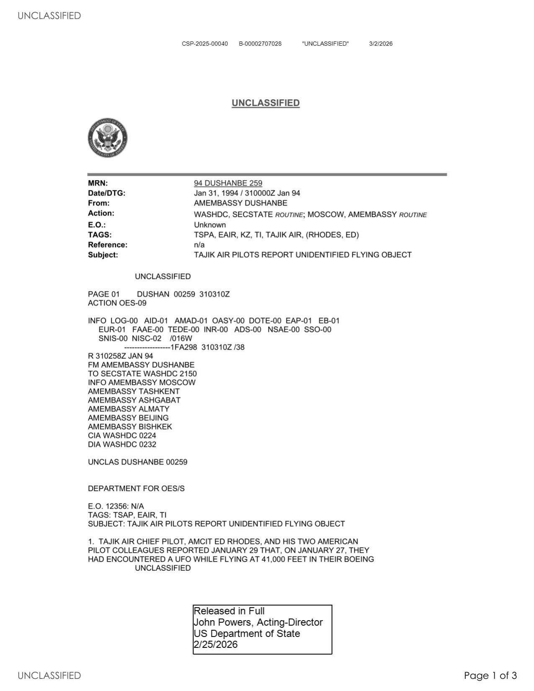
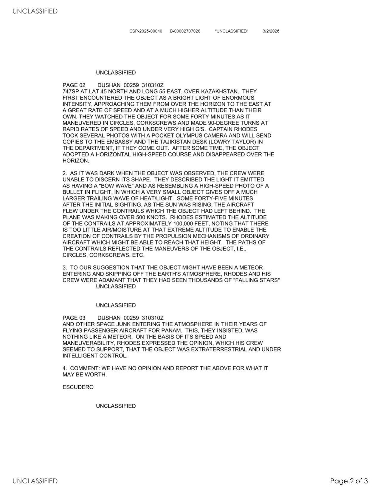

# #152 State Dept UAP Cable 2：Dushanbe → 華府 1994-01-31「Tajik Air B747 41,000 ft 哈薩克遭遇 UAP」

| 欄位 | 內容 |
|---|---|
| MRN | 94 DUSHANBE 259 |
| 日期 | 1994-01-31 / 310000Z JAN 94 |
| From | AMEMBASSY DUSHANBE（駐 Tajikistan 美使館，Escudero 簽署）|
| 收件 | SECSTATE WASHDC（Action OES-09，含 OES/S）|
| 抄送 | AMEMBASSY MOSCOW、TASHKENT、ASHGABAT、ALMATY、BEIJING、BISHKEK、CIA WASHDC 0224、DIA WASHDC 0232 |
| TAGS | TSPA, EAIR, KZ, TI, TAJIK AIR, (RHODES, ED) |
| 主旨 | TAJIK AIR PILOTS REPORT UNIDENTIFIED FLYING OBJECT |
| 機密層級 | UNCLASSIFIED ／ Released in Full（2026-02-25）|
| 公開日 | 2026-05-08 |

## 為什麼這份檔案重要

5 份國務院 UAP cable 中內容最具實質目擊密度的一份。1994-01-27 Tajik Air Chief Pilot Ed Rhodes（美國公民）與 2 名美籍同事在 Boeing 747SP 上、41,000 ft、北緯 45°、東經 75° 哈薩克上空目擊一個 UAP：物體從東方地平線高速接近、在他們前方更高空盤旋 40 分鐘做圓圈、開瓶器螺旋與 90 度高速急轉，伴有極高 G 力，最後沿水平高速軌跡消失在地平線。45 分鐘後日出，機組看到該物體留下的 contrail，估計高度約 100,000 ft（30,480 m），路徑反映其原本機動的圓圈與開瓶器形狀。

Captain Rhodes 用 pocket Olympus 相機拍下幾張高速照片，明確表示物體不像流星或太空垃圾，速度與機動性「seemed to support... extraterrestrial and under intelligent control」。美使館以 UNCLASSIFIED 級別發出，TAGS 包含 OES（Oceans, Environment, Science）作為 Action，CIA + DIA 抄送，顯示 1994 美國政府對「美籍商務飛行員在前蘇聯空域目擊 UAP」的標準處理流程。

電報的 COMMENT 段非常短：「WE HAVE NO OPINION AND REPORT THE ABOVE FOR WHAT IT MAY BE WORTH.」（我們沒有意見，僅就所聞如實上報，留待參酌。）展示 1994 國務院 cable 處理 UAP 的官方立場：不評論、不評估、純記錄。

## 1. 遭遇場景

> 1. TAJIK AIR CHIEF PILOT, AMCIT ED RHODES, AND HIS TWO AMERICAN PILOT COLLEAGUES REPORTED JANUARY 29 THAT, ON JANUARY 27, THEY HAD ENCOUNTERED A UFO WHILE FLYING AT 41,000 FEET IN THEIR BOEING 747SP AT LAT 45 NORTH AND LONG 75 EAST, OVER KAZAKHSTAN. THEY FIRST ENCOUNTERED THE OBJECT AS A BRIGHT LIGHT OF ENORMOUS INTENSITY, APPROACHING THEM FROM OVER THE HORIZON TO THE EAST AT A GREAT RATE OF SPEED AND AT A MUCH HIGHER ALTITUDE THAN THEIR OWN.

> 1. Tajik Air 首席飛行員、美國公民 Ed Rhodes 與兩名美籍飛行員同事於 1 月 29 日通報，他們在 1 月 27 日駕駛 Boeing 747SP 於北緯 45°、東經 75°（哈薩克上空）41,000 英尺處遭遇一個 UFO。他們起初看到的是一道從東方地平線過來的極強光，以非常快的速度接近、且高度遠高於他們自己。

座標 45°N 75°E 位於哈薩克中部，距 Baikonur Cosmodrome（位於 45.96°N 63.31°E）東方約 900 公里。1994-01 是蘇聯解體後第 3 年，Baikonur 仍在運作，但已由俄羅斯租借。

> THEY WATCHED THE OBJECT FOR SOME FORTY MINUTES AS IT MANEUVERED IN CIRCLES, CORKSCREWS AND MADE 90-DEGREE TURNS AT RAPID RATES OF SPEED AND UNDER VERY HIGH G'S. CAPTAIN RHODES TOOK SEVERAL PHOTOS WITH A POCKET OLYMPUS CAMERA AND WILL SEND COPIES TO THE EMBASSY AND THE TAJIKISTAN DESK (LOWRY TAYLOR) IN THE DEPARTMENT, IF THEY COME OUT. AFTER SOME TIME, THE OBJECT ADOPTED A HORIZONTAL HIGH-SPEED COURSE AND DISAPPEARED OVER THE HORIZON.

> 他們觀察該物體約 40 分鐘，期間它在天空中做圓圈、開瓶器螺旋、高速 90 度急轉動作，承受非常高的 G 力。Rhodes 機長用一台 pocket Olympus 相機拍了幾張照片，若沖洗成功將寄副本給美使館及國務院 Tajikistan 桌（Lowry Taylor）。一段時間後，該物體採取水平高速航線並消失於地平線。

「circles, corkscrews, 90-degree turns」與「very high G's」是飛行員語言的特殊組合：

- corkscrew（開瓶器螺旋）意味物體在三維空間中沿螺旋線運動。
- 90 度急轉在高速下對任何已知有人駕駛航空器是致命的（會超出人類耐受 G 限制）。
- 41,000 ft 之上的高度與此種機動性的組合，與 1990s 已知任何蘇聯戰機（MiG-29, Su-27, MiG-31）的性能都不符。

## 2. Bow Wave 與 Contrail

> 2. AS IT WAS DARK WHEN THE OBJECT WAS OBSERVED, THE CREW WERE UNABLE TO DISCERN ITS SHAPE. THEY DESCRIBED THE LIGHT IT EMITTED AS HAVING A "BOW WAVE" AND AS RESEMBLING A HIGH-SPEED PHOTO OF A BULLET IN FLIGHT, IN WHICH A VERY SMALL OBJECT GIVES OFF A MUCH LARGER TRAILING WAVE OF HEAT/LIGHT. SOME FORTY-FIVE MINUTES AFTER THE INITIAL SIGHTING, AS THE SUN WAS RISING, THE AIRCRAFT FLEW UNDER THE CONTRAILS WHICH THE OBJECT HAD LEFT BEHIND. THE PLANE WAS MAKING OVER 500 KNOTS. RHODES ESTIMATED THE ALTITUDE OF THE CONTRAILS AT APPROXIMATELY 100,000 FEET, NOTING THAT THERE IS TOO LITTLE AIR/MOISTURE AT THAT EXTREME ALTITUDE TO ENABLE THE CREATION OF CONTRAILS BY THE PROPULSION MECHANISMS OF ORDINARY AIRCRAFT WHICH MIGHT BE ABLE TO REACH THAT HEIGHT. THE PATHS OF THE CONTRAILS REFLECTED THE MANEUVERS OF THE OBJECT, I.E., CIRCLES, CORKSCREWS, ETC.

> 2. 因為觀測時是夜間，機組無法分辨物體的形狀。他們描述其發出的光呈現「bow wave」（弓形波）的形態，類似子彈飛行的高速攝影，一個極小的物體後面拖著遠大於本體的熱/光痕。初次目擊約 45 分鐘後，日出時，他們的飛機飛到物體留下的 contrail 之下。飛機當時速度逾 500 KTS。Rhodes 估計 contrail 高度約 100,000 英尺，並指出在那種極端高度大氣中的空氣與水分太少，普通飛行器的推進機構即使能到達該高度也無法產生 contrail。Contrail 的路徑映出物體的機動軌跡（圓圈、開瓶器等）。

「bow wave」是工程學術語，源自子彈飛行的衝擊波攝影。Rhodes 的比喻是工程性的，不是普通飛行員的形容。

「100,000 ft contrail」+「ordinary aircraft cannot create contrail at that altitude」是 Rhodes 的關鍵論點。100,000 ft（30.5 km）是 SR-71 巡航高度（85,000 ft）以上，達到 U-2 極限（70,000 ft）以上，超過 1994 已知所有量產噴射機。當高度的大氣密度約為海平面 1%，水蒸氣含量極低，理論上普通燃燒推進不會凝結成 contrail。但若推進機構釋出大量水蒸氣（例如氫氧火箭），則仍能成 contrail。Rhodes 的論點隱含「不是普通飛機」。

## 3. 流星假設的反駁

> 3. TO OUR SUGGESTION THAT THE OBJECT MIGHT HAVE BEEN A METEOR ENTERING AND SKIPPING OFF THE EARTH'S ATMOSPHERE, RHODES AND HIS CREW WERE ADAMANT THAT THEY HAD SEEN THOUSANDS OF "FALLING STARS" AND OTHER SPACE JUNK ENTERING THE ATMOSPHERE IN THEIR YEARS OF FLYING PASSENGER AIRCRAFT FOR PANAM. THIS, THEY INSISTED, WAS NOTHING LIKE A METEOR. ON THE BASIS OF ITS SPEED AND MANEUVERABILITY, RHODES EXPRESSED THE OPINION, WHICH HIS CREW SEEMED TO SUPPORT, THAT THE OBJECT WAS EXTRATERRESTRIAL AND UNDER INTELLIGENT CONTROL.

> 3. 對於我方提出「可能是流星進入並擦過地球大氣層」的假設，Rhodes 與機組堅持他們在 PanAm 多年的客機飛行經驗中已見過數千次流星與其他太空垃圾進入大氣層，他們強調這次絕不像流星。基於其速度與機動性，Rhodes 表達意見、機組似乎附議，認為該物體是地外的、處於智慧控制之下。

「PanAm」（Pan American World Airways）1991-12 破產，Rhodes 與兩名同事此時是前 PanAm 飛行員。「flown thousands of falling stars」是排除流星假設的關鍵專業背景。

## 4. 美使館 COMMENT：完全中立

> 4. COMMENT: WE HAVE NO OPINION AND REPORT THE ABOVE FOR WHAT IT MAY BE WORTH. ESCUDERO

> 4. 評論：我方無意見，僅將上述如實上報，留待參酌。ESCUDERO

簽署者 Escudero 是 1994 駐 Tajikistan 美使館代表（Stanley T. Escudero，1992-1995 任 chargé d'affaires）。「we have no opinion」是經典國務院 cable 用語，意指「我方僅扮演信使，不背書、不否定」。

## 5. 1994 美國 cable 系統內 UAP 的處理

電報 TAGS 包含 TSPA（Transportation/Aviation Space）、EAIR（Civil Aviation）、KZ（Kazakhstan）、TI（Tajikistan），收件抄送涵蓋區域使館（Moscow, Tashkent, Ashgabat, Almaty, Bishkek, Beijing）+ 情報機構（CIA, DIA）。

關鍵設計：

- Action 是 SECSTATE WASHDC OES-09（Oceans, Environment, Science Bureau）：1994 國務院把 UAP 與航空安全議題歸到 OES。
- TAGS 包含「(RHODES, ED)」：個人代碼，意味國務院 cable 系統有「個別公民跨案件追蹤」能力，Rhodes 此後若再出現於其他 cable，可以連結回來。
- CIA + DIA 抄送：1994 對「飛越前蘇聯空域的美籍商務飛行員 UAP 目擊」的標準收件單位，意味情報機構認為這類目擊是值得歸檔的數據。

## 6. 跨檔案連結

- [#151 State Department UAP Cable 1, Papua New Guinea 1985](../151-state_dept_uap_cable_1_papua_new_guinea_1985/report.md)：UAP Cable 系列的第一份。1985 PNG 是「外交否認 + 雷達粗略」，本檔案 1994 哈薩克是「飛行員目擊 + 工程細節」，兩種 cable 處理 UAP 的兩極。
- [#155 State Department UAP Cable 5, Mexico 2023](../155-state_dept_uap_cable_5_mexico_2023/report.md)：2023 墨西哥國會聽證 Ryan Graves（前美國海軍飛行員）+ Jaime Maussan（記者 + 偽造屍體）。本檔案 1994 Rhodes 是「前 PanAm 商務飛行員直接目擊」，與 Graves 的「前 F/A-18 海軍飛行員」傳統一脈相承。
- [#024 Russell 蘇聯目擊 1955](../024-341_110677_numerical_file_5-2500_azerbaijan/report.md)：1955 美國參議員 Russell 在蘇聯境內火車目擊 2 個飛碟垂直升空，外殼旋轉內部燈靜止。本檔案 1994 Rhodes 在哈薩克空域目擊高機動物體，是「美籍人員在前蘇聯空間目擊 UAP」cable 系列的 39 年延續。

## 7. 來源

- 原始檔案：[U.S. Department of War — State Department UAP Cable 2, Kazakhstan, January 31, 1994](https://www.war.gov/UFO/#State%20Department%20UAP%20Cable%202,%20Kazakhstan,%20January%2031,%201994)
- PDF 直接下載：`https://www.war.gov/medialink/ufo/release_1/dos-uap-d2-cable-2-kazakhstan-january-1994.pdf`
- 公開日：2026-05-08
- 3 頁，原 UNCLASSIFIED，Released in Full（2026-02-25 John Powers, Acting Director, US Department of State）
