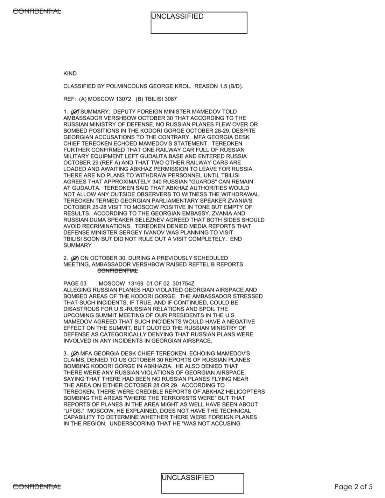
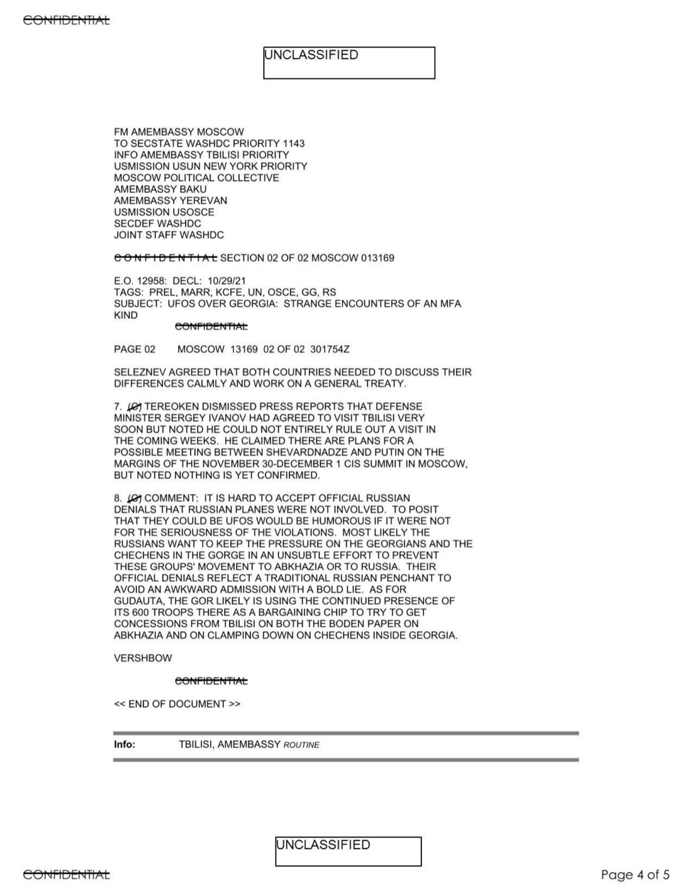

# #153 State Dept UAP Cable 3：莫斯科 → 華府 2001-10-30「UFOS OVER GEORGIA」（俄方否認話術）

| 欄位 | 內容 |
|---|---|
| MRN | 01 MOSCOW 13169 |
| 日期 | 2001-10-30 / 30000Z OCT 01 |
| From | AMEMBASSY MOSCOW（駐俄美使館，Ambassador Vershbow） |
| 收件 | SECSTATE WASHDC（國務院） |
| 抄送 | TBILISI, USUN New York, BAKU, YEREVAN, USOSCE, SECDEF, JOINT STAFF |
| TAGS | PREL, MARR, KCFE, UN, OSCE, GG, RS |
| 主旨 | UFOS OVER GEORGIA; STRANGE ENCOUNTERS OF AN MFA KIND |
| 機密層級 | CONFIDENTIAL ／ DECLASSIFIED (2026-02-25) |
| 公開日 | 2026-05-08 |

## 為什麼這份檔案重要，但不是因為 UFO

這份外交電報的標題是「UFOS OVER GEORGIA」，但**內容與 UFO 目擊事件無關**。它是 2001-10-29 期間 Russia-Georgia Kodori Gorge 危機的政治電報，俄羅斯外交部副部長 Tereoken 在被美國大使 Vershbow 質問「俄國戰機是否轟炸 Kodori Gorge」時，用「reports of planes in the area might as well have been about UFOs」當作鬼話搪塞，意思是「不是俄國飛機，可能是 UFO」。

美使館 POL Officer 用「STRANGE ENCOUNTERS OF AN MFA KIND」（外交部式的奇異遭遇）作為標題雙關，把這個電報歸入 PREL（政治關係）+ MARR（軍事關係）等正規 TAGS，UFO 不是它的真正主題。

但這份電報被收錄到 War Department 2026-05-08 UAP 釋出包，意味國務院/國防部在審視全部歷史 cable 時，**用「UFO」關鍵字檢索抓出來的東西包括「外交修辭中的 UFO 比喻」**，而不只是真實 UFO 目擊。這份電報的歷史價值在於展示「國務院 UAP 檔案分類」的不精確性，並間接揭示 2001 年 Russia-Georgia 危機背景。

## 1. 政治背景

2001-10-28/29 兩天，Georgia 政府指控俄羅斯戰機越境轟炸 Kodori Gorge（Abkhazia 邊境）。這是 Russia-Georgia 關係的長期衝突點，Abkhazia 是 Georgia 西北的分離主義地區，俄方支持 Abkhazia 獨立。Kodori Gorge 是 Georgian 政府仍能實質控制的 Abkhazia 邊境區。

美方背景：2001-09-11 兩週前，美國甘心境內遭恐怖攻擊；美俄關係正在「反恐合作」框架下重整。Vershbow 大使提醒 Mamedov 副部長：「俄機越境轟炸事件如屬實將是 US-Russian Relations 災難，且可能毀掉即將舉行的兩國總統高峰會。」

## 2. Tereoken 的「UFO」鬼話

> 3. (C) MFA GEORGIA DESK CHIEF TEREOKEN, ECHOING MAMEDOV'S CLAIMS, DENIED TO US OCTOBER 30 REPORTS OF RUSSIAN PLANES BOMBING KODORI GORGE IN ABKHAZIA. HE ALSO DENIED THAT THERE WERE ANY RUSSIAN VIOLATIONS OF GEORGIAN AIRSPACE, SAYING THAT THERE HAD BEEN NO RUSSIAN PLANES FLYING NEAR THE AREA ON EITHER OCTOBER 28 OR 29. ACCORDING TO TEREOKEN, THERE WERE CREDIBLE REPORTS OF ABKHAZ HELICOPTERS BOMBING THE AREAS "WHERE THE TERRORISTS WERE" BUT THAT REPORTS OF PLANES IN THE AREA MIGHT AS WELL HAVE BEEN ABOUT "UFOS." MOSCOW, HE EXPLAINED, DOES NOT HAVE THE TECHNICAL CAPABILITY TO DETERMINE WHETHER THERE WERE FOREIGN PLANES IN THE REGION. UNDERSCORING THAT HE "WAS NOT ACCUSING ANYONE," TEREOKEN ADDED THAT IT WAS POSSIBLE THAT "ANY SIDE" HAD SENT PLANES OVER KODORI.

> 3. (C) 俄羅斯外交部 Georgia 桌主任 Tereoken 呼應 Mamedov 的說法，1030 向美方否認俄機在 Abkhazia 的 Kodori Gorge 轟炸的相關報告。他並否認任何俄方違反 Georgia 領空，表示 10-28 或 10-29 都沒有俄機在該區域附近飛行。根據 Tereoken，有可信的報告指出 Abkhaz 直升機曾轟炸「恐怖分子在的區域」，但「該區域有飛機」的報告「也可能是關於 UFO 的」。Tereoken 解釋，莫斯科「沒有技術能力」判定該區域是否有外國飛機。強調他「並非指控任何人」，Tereoken 補充「任何一方」都有可能派飛機飛越 Kodori。

「reports of planes in the area might as well have been about UFOs」是俄方典型的「否認術」修辭：把對方的指控降級成「也可能是飛碟」這種荒謬假設，意指對方的指控本身就荒謬。

## 3. Vershbow 大使的 COMMENT

> 8. (C) COMMENT: IT IS HARD TO ACCEPT OFFICIAL RUSSIAN DENIALS THAT RUSSIAN PLANES WERE NOT INVOLVED. TO POSIT THAT THEY COULD BE UFOS WOULD BE HUMOROUS IF IT WERE NOT FOR THE SERIOUSNESS OF THE VIOLATIONS. MOST LIKELY THE RUSSIANS WANT TO KEEP THE PRESSURE ON THE GEORGIANS AND THE CHECHENS IN THE GORGE IN AN UNSUBTLE EFFORT TO PREVENT THESE GROUPS' MOVEMENT TO ABKHAZIA OR TO RUSSIA. THEIR OFFICIAL DENIALS REFLECT A TRADITIONAL RUSSIAN PENCHANT TO AVOID AN AWKWARD ADMISSION WITH A BOLD LIE.

> 8. (C) 評論：俄方對俄機未涉入此事的官方否認難以接受。把它們設想為 UFO 如果不是因為此違規行為的嚴重性，將會是滑稽的。俄方很可能希望對 Georgia 與 Gorge 內 Chechens 維持壓力，毫不掩飾地阻止這些群體進入 Abkhazia 或俄羅斯。他們的官方否認反映出俄羅斯傳統上以厚顏謊言迴避尷尬承認的傾向。

Vershbow 直接點破：俄方的「UFO」說法是 bold lie，而非真實 UFO 報告。

## 4. 觀察

**(1) UAP 檔案分類的鬆散性**：War Department 2026-05-08 釋出 161 份「UAP 檔案」中，有部分（如本檔案）實際上不是 UFO 目擊報告，而是政治外交電報中包含「UFO」一詞的記錄。當建立 UAP 檔案系統時，關鍵字搜索的精確度問題。

**(2) 俄方否認術的歷史定型**：Tereoken 把問題「降級成 UFO 假設」的修辭手法，在 2001 之後成為俄方對國際指控的常見回應方式。2014 Crimea 入侵期間「小綠人」（little green men）的否認、2018 Skripal 案的「否認 GRU 涉入」、2022 Bucha 大屠殺的否認，都採用類似的「對方指控荒謬」修辭結構。

**(3) 與真實 UAP 議題的對照**：本檔案展示**「UFO 修辭」與真實 UAP 議題的界線**。在 2001 國務院 cable 系統中，UFO 一詞仍主要用於修辭比喻（「不可能存在的事」），而非實質物理現象。2017 NYT 揭露 AATIP 後，State Dept 與 DoD 對 UAP 議題的處理方式才從「修辭性」轉向「實質性」。

## 5. 跨檔案連結

- **[#152 State Department UAP Cable 2, Kazakhstan, 1994-01-31](https://www.war.gov/UFO/#State%20Department%20UAP%20Cable%202,%20Kazakhstan,%20January%2031,%201994)**：UAP Cable 系列的第二份（本檔案是第三份），未在本批 URL 解析中找到。
- **[#154 State Department UAP Cable 4, Ashgabat 2004](../154-state_dept_uap_cable_4_ashgabat_2004/report.md)**：類似的「UFO 命名 + 非 UFO 內容」案例（Turkmenistan UFOlogists NGO）。
- **[#155 State Department UAP Cable 5, Mexico 2023](../155-state_dept_uap_cable_5_mexico_2023/report.md)**：實質性 UAP 內容（Jaime Maussan + Ryan Graves 在墨西哥國會證詞）。

## 6. 來源

- 原始檔案：[U.S. Department of War — State Department UAP Cable 3, Tbilisi, Georgia, October 30, 2001](https://www.war.gov/UFO/#State%20Department%20UAP%20Cable%203,%20Tbilisi,%20Georgia,%20October%2030,%202001)
- PDF 直接下載：`https://www.war.gov/medialink/ufo/release_1/059uap00011.pdf`
- 公開日：2026-05-08
- 5 頁，原 CONFIDENTIAL，DECLASSIFIED (2026-02-25 John Powers, Acting Director, US Department of State)
