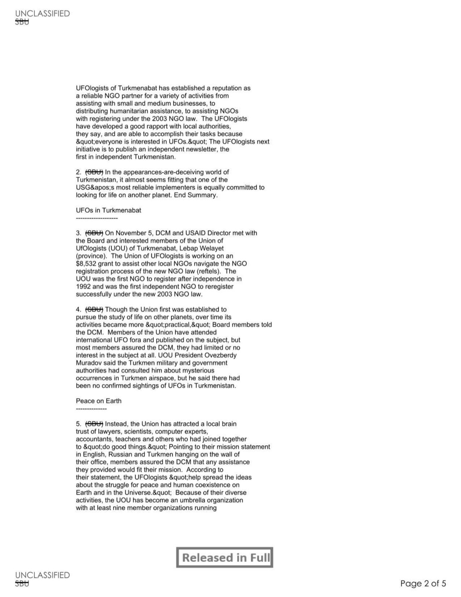
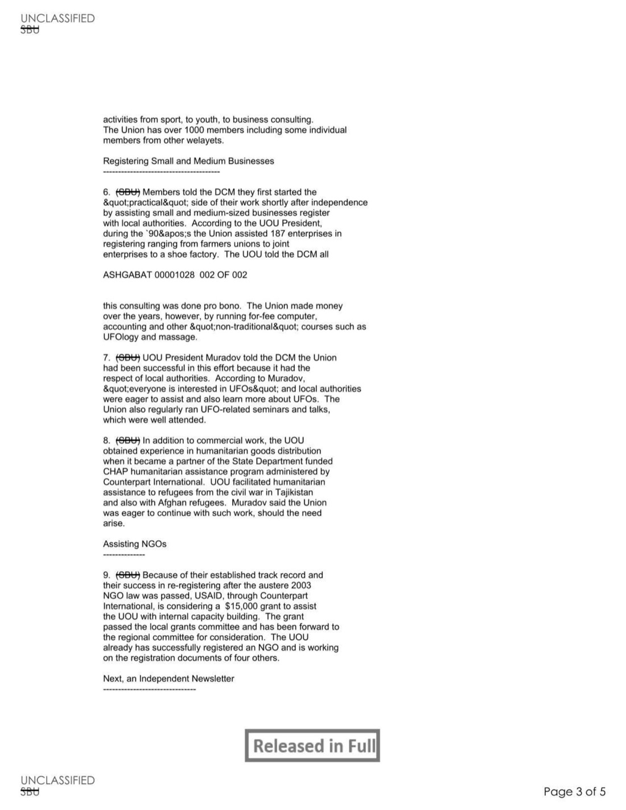
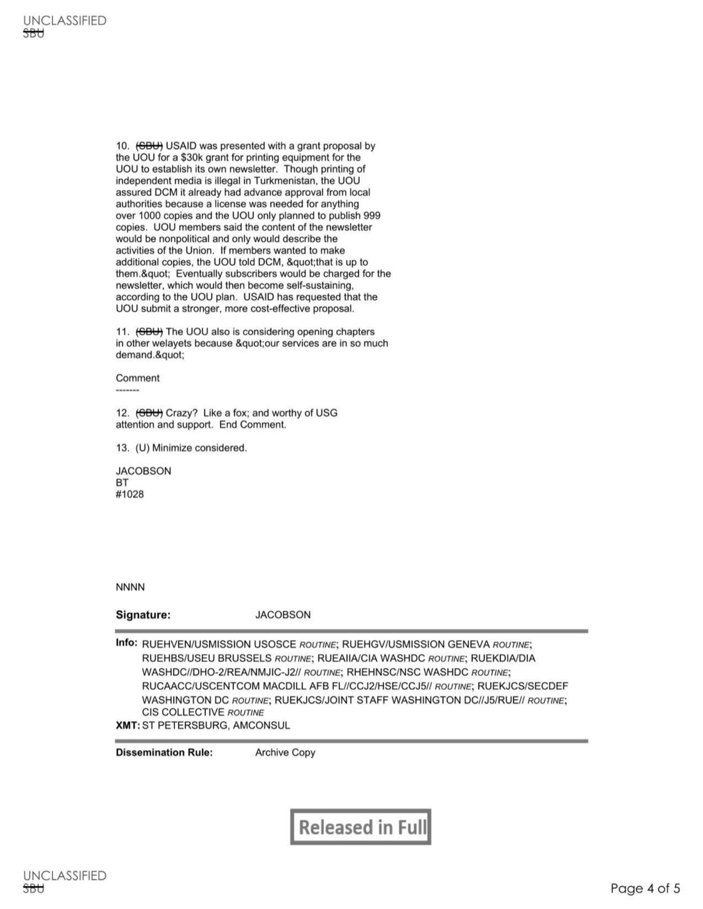

# #154 State Dept UAP Cable 4：Ashgabat → 華府 2004-11-12「Turkmenistan, Civil Society and UFOs」

| 欄位 | 內容 |
|---|---|
| MRN | 04 ASHGABAT 1028 |
| 日期 | 2004-11-12 / 120851Z NOV 04 |
| From | AMEMBASSY ASHGABAT（駐 Turkmenistan 美使館，Ambassador Jacobson） |
| 收件 | SECSTATE WASHDC |
| 抄送 | CIS COLLECTIVE, USMISSION USOSCE, USMISSION GENEVA, USEU BRUSSELS, CIA WASHDC, DIA WASHDC, NSC WASHDC, USCENTCOM, SECDEF, JOINT STAFF |
| TAGS | AORC, TSPA, PREL, PGOV, EAID, OSCI, TX |
| Captions | SENSITIVE |
| 主旨 | TURKMENISTAN, CIVIL SOCIETY AND UFOS |
| 機密層級 | SBU（Sensitive But Unclassified）／ DECLASSIFIED |
| 公開日 | 2026-05-08 |

## 為什麼這份檔案重要，但不是因為 UFO

本電報主題是 Turkmenistan 的 NGO「Turkmenabat UFOlogists 聯盟」（Union of UFOlogists, UOU），不是 UFO 目擊報告。UOU 1992 年（Turkmenistan 獨立後）成立，原意是「研究外星生命」，但實際營運轉型為**普通民間社會 NGO**：小型企業註冊輔導、人道援助分發、其他 NGO 註冊輔導、業餘電腦/會計/UFOlogy/按摩課程收費等。

UOU 是 Turkmenistan 1992 後**第一個註冊的 NGO**，並且是 2003 嚴苛 NGO 法後**第一個成功重新註冊的獨立 NGO**。美使館 USAID 透過 Counterpart International 給 UOU 一筆 $8,532 grant 協助其他 NGO 完成註冊；另在審議 $15,000 內部能力建設 grant；UOU 並向 USAID 申請 $30k 印刷設備 grant 以發行 Turkmenistan 第一份獨立通訊刊物（規避 NGO 法 1000 份限制，他們只印 999 份）。

電報內容含 UFO 元素的只有：「UOU President Ovezberdy Muradov 說 Turkmen 軍方和政府當局曾就 Turkmen 領空中的『神秘事件』向他諮詢，但他說 Turkmenistan 並無確認的 UFO 目擊。」

歷史意義：

1. **「UFO」命名的 NGO 在 Turkmenistan 獨裁政權下能存活**：「everyone is interested in UFOs」讓地方當局願意配合。這是 1990s Soviet 解體後新獨立國家 NGO 生態的有趣標本。
2. **美使館對 UOU 的真實態度**：「Crazy? Like a fox; and worthy of USG attention and support.」，使館將 UOU 視為「假 UFO 真 NGO」的有效合作對象。
3. **與真實 UAP 議題的距離**：雖然檔案標題含 UFO，但內容 95% 是 NGO 治理、Turkmenistan 政治、USAID 援助路徑分析。Muradov 對軍方諮詢的回應「沒有確認的 UFO 目擊」是唯一相關句。

## 1. UOU 的多重身分

> 4. (SBU) Though the Union first was established to pursue the study of life on other planets, over time its activities became more "practical," Board members told the DCM. Members of the Union have attended international UFO fora and published on the subject, but most members assured the DCM, they had limited or no interest in the subject at all. UOU President Ovezberdy Muradov said the Turkmen military and government authorities had consulted him about mysterious occurrences in Turkmen airspace, but he said there had been no confirmed sightings of UFOs in Turkmenistan.

> 4. (SBU) 雖然聯盟最初為研究其他行星生命而成立，理事會成員告訴 DCM，隨時間其活動變得更「實際」。聯盟成員曾出席國際 UFO 論壇並出版相關著作，但大多數成員向 DCM 確認，他們對該主題興趣有限或完全無興趣。UOU 主席 Ovezberdy Muradov 說 Turkmen 軍方與政府當局曾就 Turkmen 領空中的神秘事件諮詢過他，但他說 Turkmenistan 並無確認的 UFO 目擊。

> 5. (SBU) Instead, the Union has attracted a local brain trust of lawyers, scientists, computer experts, accountants, teachers and others who had joined together to "do good things." Pointing to their mission statement in English, Russian and Turkmen hanging on the wall of their office, members assured the DCM that any assistance they provided would fit their mission. According to their statement, the UFOlogists "help spread the ideas about the struggle for peace and human coexistence on Earth and in the Universe."

> 5. (SBU) 取而代之的是，聯盟吸引了當地的律師、科學家、電腦專家、會計師、教師等組成的智囊團，共同「做好事」。指著辦公室牆上以英文、俄文、土庫曼文書寫的使命宣言，成員們向 DCM 保證他們提供的任何協助都符合其使命。根據宣言，UFOlogists「協助傳播關於地球與宇宙中和平與人類共存的鬥爭理念」。

UOU 的使命宣言把「UFO 研究」與「地球和平 + 宇宙人類共存」糾結在一起，這是後蘇聯時期 NGO 為了取得地方當局信任而採用的混合敘事策略。

## 2. UOU 的實質工作

> 6. (SBU) Members told the DCM they first started the "practical" side of their work shortly after independence by assisting small and medium-sized businesses register with local authorities. According to the UOU President, during the '90s the Union assisted 187 enterprises in registering ranging from farmers unions to joint enterprises to a shoe factory. The UOU told the DCM all this consulting was done pro bono. The Union made money over the years, however, by running for-fee computer, accounting and other "non-traditional" courses such as UFOlogy and massage.

> 6. (SBU) 成員告訴 DCM 他們在獨立後不久就開始了工作的「實際」面，協助中小型企業向當地當局註冊。根據 UOU 主席，1990 年代聯盟協助了 187 家企業完成註冊，從農民聯盟到合資企業到一家鞋廠不等。UOU 告訴 DCM 所有這些諮詢都是 pro bono。然而聯盟多年來透過收費的電腦、會計與其他「非傳統」課程（如 UFOlogy 與按摩）賺錢。

「pro bono 商業諮詢 + 收費 UFOlogy 與按摩課」是極具創意的 NGO 永續模式。

UOU 還做：
- 人道援助分發（State Dept CHAP 計畫，難民來自 Tajikistan 內戰與 Afghanistan）
- 4 個其他 NGO 註冊輔導
- 計畫發行 Turkmenistan 第一份獨立通訊（規避法令上限）

## 3. 使館 COMMENT

> 12. (SBU) Comment: Crazy? Like a fox; and worthy of USG attention and support. End Comment.

> 12. (SBU) 評論：瘋了嗎？像狐狸一樣狡猾；值得美國政府關注與支持。完結。

美使館對 UOU 的評估極為正面：表面荒謬的「UFOlogists NGO」實際是 Turkmenistan 民間社會中最有效的獨立組織之一，使館建議美國政府繼續資助。

## 4. 觀察

**(1) UAP 檔案分類的問題**：本檔案標題「Turkmenistan, Civil Society and UFOs」中的 UFO 元素其實是組織名稱，非實質 UAP 內容。被收入 UAP 釋出包，是關鍵字檢索的副作用。

**(2) 後蘇聯 NGO 生態的「保護色」策略**：Turkmenistan 在 Niyazov 獨裁政權下，獨立 NGO 極難生存。UOU 用「UFO 研究」這種看似無害的命名做為「保護色」，實際做小企業註冊與 NGO 輔導等政治敏感工作。這是後蘇聯時期 NGO 治理史上的有趣標本。

**(3) Muradov 的「神秘事件」評語**：Turkmen 軍方曾向 UOU 主席諮詢「Turkmen 領空神秘事件」，雖然他說「無確認 UFO 目擊」。這暗示 Turkmen 軍方 1990s-2000s 期間確實處理過某些不明航空現象，並且因為 UOU 是當地唯一「自稱 UFO 專家」的組織所以被諮詢。這條線本身沒有展開，但意味 Central Asia 在這段時間有未解航空現象。

**(4) USAID 對「UFOlogists」的資助**：USAID 給 UOU 累計 $8,532 + 審議中 $15,000 + 申請中 $30k。這不是因為 UFO 研究，而是因為 UOU 在 NGO 輔導上的有效性。美使館對「資助名為 UFOlogists 的組織」的接受度，比較 [#017](../017-18_100754_general_1946-7_vol_2/report.md) 1947 USAF 對飛碟議題的處理態度，顯示出 50 年期間「UFO」一詞在美國政府內部含義的多元化。

## 5. 跨檔案連結

- **[#153 State Department UAP Cable 3, Tbilisi 2001](../153-state_dept_uap_cable_3_tbilisi_2001/report.md)**：類似的「UFO 標題 + 非 UFO 內容」模式（俄方否認話術）。本檔案 + #153 共同顯示 UAP 檔案分類的鬆散性。
- **[#155 State Department UAP Cable 5, Mexico 2023](../155-state_dept_uap_cable_5_mexico_2023/report.md)**：實質性 UAP 內容（墨西哥國會聽證）。
- **[#019 COMETA Report 1999 + Rosin → NASA](../019-255_413270_cometa_report_rosin/report.md)**：COMETA 報告與本檔案同樣是 1990s-2000s 國際 UAP 議題的相關文件，但 COMETA 是嚴肅的軍方退休將領研究，UOU 是「假 UFO 真 NGO」的政治掩護組織。

## 6. 來源

- 原始檔案：[U.S. Department of War — State Department UAP Cable 4, Ashgabat, Turkmenistan, November 5, 2004](https://www.war.gov/UFO/#State%20Department%20UAP%20Cable%204,%20Ashgabat,%20Turkmenistan,%20November%205,%202004)
- PDF 直接下載：`https://www.war.gov/medialink/ufo/release_1/059uap00012.pdf`
- 公開日：2026-05-08
- 5 頁，原 SBU（Sensitive But Unclassified），Released in Full（2026-02-25 John Powers, Acting Director, US Department of State）
- 注意：CSV 中標示「2004-11-05」，實際電報日期為 2004-11-12
