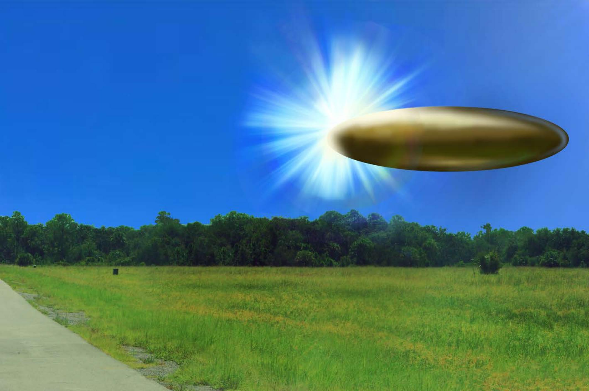

# #157 FBI 合成草圖：2023-09 美國西部目擊「銅金屬色橢球 + 極強光」

| 欄位 | 內容 |
|---|---|
| 文件類型 | FBI 實驗室合成草圖（依目擊者證詞繪製）|
| 事件時間 | 2023-09 |
| 地點 | Western United States（試驗場 / restricted air space）|
| 公開日 | 2024-04-30（檔名標示）|
| 釋出包 | War Department Release 1（2026-05-08）|

## 為什麼這份檔案重要

War Department 2026-05-08 釋出包中唯一一份視覺合成草圖。FBI 依目擊者證詞繪出 2023-09 美國西部試驗場 UAP 事件的視覺重建：背景為晴朗天空、樹線、草地、混凝土道路；前景中上方為**銅金屬色橢球體**，下方左側放射出強烈藍白色光芒。

這份單頁草圖是 War Department 2026-05-08 釋出包中與 #158-#160 三份 FBI 302 訪談記錄相對應的視覺證據。其中 #159（含目擊者描述「cigar shaped object」「metallic bronze in color」「length of two or three Blackhawk helicopters」「diamond white light pointing south east and looking at it (the light) was like looking into the sun」）的證詞與草圖呈現的視覺特徵直接對應。

## 1. 視覺要素拆解

依草圖可看出：

- **物體本體**：橢球形、上下扁、左右長，金屬光澤如氧化銅或鍍金，反射陽光。長徑：草圖比例約占畫面 35% 寬度。
- **強光位置**：物體下方左側，強烈藍白色，向四面放射出條狀光芒。光的位置與形狀描述為「diamond white light on the eastern end of the object」（鑽石白光位於物體東端）。
- **背景**：晴朗藍天、地平線樹林、草地、左下方混凝土道路（可能為 LiDAR 試驗用道路）。
- **比例尺**：依 USPER 證詞（cigar 長度為「two or three Blackhawks lined up nose to tail」），每架 Blackhawk（UH-60）約 19.8 公尺 → 物體長度約 40-60 公尺。AARO 後續對 Western US Event 的 Large Fiery Orb 量測為 12-18 公尺直徑（請見 #161），數量級不同，意味本草圖可能對應另一個型態（cigar）而非 fiery orb。

## 2. 與 FBI 302 訪談的對應

對照三份 9 月 2023 FBI 302 訪談（#158、#159、#160），最符合本草圖的證詞是：

**#159 訪談（in-person，contractor 在 LiDAR 試驗場目擊）**：

> The object was already there when they looked up. The light was an intense diamond white light with what appeared to be a ring around the light and was located on the eastern end of the object. The light was pointing south east and looking at it (the light) was like looking into the sun. The object was "metallic bronze in color" and was the length of two or three Blackhawk helicopters lined up nose to tail. The width of the object was approximately the width of one and a half Blackhawks but was hard to determine due the light on the object's eastern end which may have been obscuring part of the body.

> 物體在他們抬頭時已經在那裡。光是強烈的鑽石白光，似乎有一圈光環圍繞，位於物體的東端。光朝東南方指出，直視（該光）就像直視太陽。物體呈金屬銅色，長度為兩三架黑鷹直升機機鼻接尾排成一列。寬度約一架半黑鷹，但因光在物體東端使本體部分被遮蔽，寬度難以判定。

要素對照：

| 草圖要素 | #159 證詞 |
|---|---|
| 橢球形主體 | cigar shaped object（金屬銅色）|
| 強光位於物體一端 | diamond white light at eastern end |
| 強光像太陽 | looking at it was like looking into the sun |
| 長徑 vs. 短徑差 ~2x | 長度兩三架 Blackhawk、寬度一架半 |

## 3. FBI 實驗室合成草圖的歷史脈絡

FBI 實驗室合成草圖（composite sketch）通常用於刑事案件嫌犯重建。用於 UAP 事件的合成草圖是極少見的應用，意味 FBI 認為這份目擊在事件特徵的視覺重建上具有意義，類似刑事案件對嫌犯外貌的視覺重建。

對比歷史上其他 UAP 視覺重建：

- 1947 Kenneth Arnold 案：Arnold 自己畫的 9 個飛碟形狀草圖（boomerang + 圓盤混合），後續由媒體繪製成「飛碟」普及形象。
- 1948 Twining 信附圖（[#017](../017-18_100754_general_1946-7_vol_2/report.md)）：USAF 內部對「circular or elliptical, flat on bottom and domed on top」的描述語言，但無視覺草圖。
- 2004 USS Nimitz Tic Tac 事件：Cmdr. Fravor 描述後，後續媒體與 AARO 繪製出 Tic Tac 形狀草圖。
- 2023 西部事件：本檔案是 FBI 實驗室親自繪製，且作為證物正式釋出。

## 4. 觀察

(1) **FBI 實驗室介入**：合成草圖是 FBI 法證能力的應用。FBI 把 UAP 目擊視為與刑事證物同等嚴肅的視覺重建任務。

(2) **「銅金屬色」是核心特徵**：草圖的銅金屬色不是隨意選擇，是嚴格依目擊者「metallic bronze in color」證詞繪製。其他 War Department 2026 釋出包中描述為「銅金屬色」的目擊極少，這個顏色是 2023 西部事件的視覺 signature。

(3) **強光遮蔽本體部分**：草圖中強光遮住了物體左端的部分結構，與證詞「light may have been obscuring part of the body」一致。意味物體本身的形狀可能比草圖呈現的更複雜。

(4) **單一視角的限制**：合成草圖只代表觀測者其中一個視角下的視覺重建。同事件 #158 LiDAR 試驗（明亮光點 + 10-20 哩外）、#160（線狀金屬灰色 + 5,000 ft 上空 + 東西向）證詞描述出的物體型態與本草圖不同，意味事件可能涉及多個型態，或同一物體在不同距離與角度下呈現截然不同的視覺特徵。

## 5. 跨檔案連結

- [#159 FBI 302 訪談（雪茄銅金屬色）](../159-fbi_september_2023_serial_4/report.md)：本草圖的證詞基礎。「Cigar bronze + diamond white light + 2-3 Blackhawks long」。
- [#158 FBI 302 訪談（LiDAR 試驗場明亮光點）](../158-fbi_september_2023_serial_3/report.md)：同事件目擊者，但描述為「bright white light over horizon, stationary, 10 seconds」，差異甚大。
- [#160 FBI 302 訪談（線狀金屬灰色）](../160-fbi_september_2023_serial_5/report.md)：同事件目擊者，描述為「linear object, metallic/gray, smaller than 737」，與本草圖描述差別。
- [#156 USPER Statement](../156-usper_statement_uap_sighting/report.md)：2025 年同地區 USPER 直升機目擊「orange orbs flare up flare down」，與本草圖（2023）的時序順序與型態不同。
- [#161 Western US Event](../161-western_us_event/report.md)：4 種型態（Orbs Launching Orbs、Fiery Orb、Dark Kite、Transparent Kite）的官方 slide。本草圖未直接對應其中任一型態，可能描述的是第 5 種型態或 cigar / fiery orb 的另一視角。

## 6. 來源

- 原始檔案：[U.S. Department of War — FBI September 2023 Sighting - Composite Sketch](https://www.war.gov/UFO/#FBI%20September%202023%20Sighting%20-%20Composite%20Sketch)
- PDF 直接下載：`https://www.war.gov/medialink/ufo/release_1/2024-04-30-composite-sketch.pdf`
- 公開日：2026-05-08（War Department）／ 2024-04-30（FBI 實驗室草圖製作日）
- 1 頁，單張視覺重建圖
