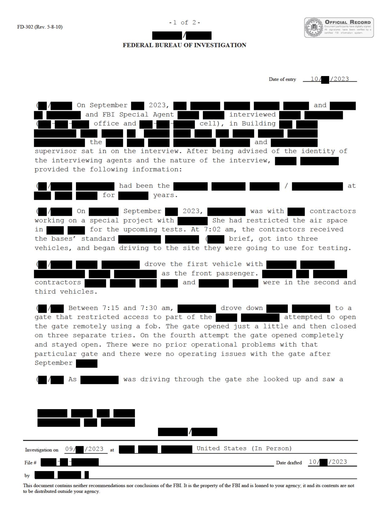
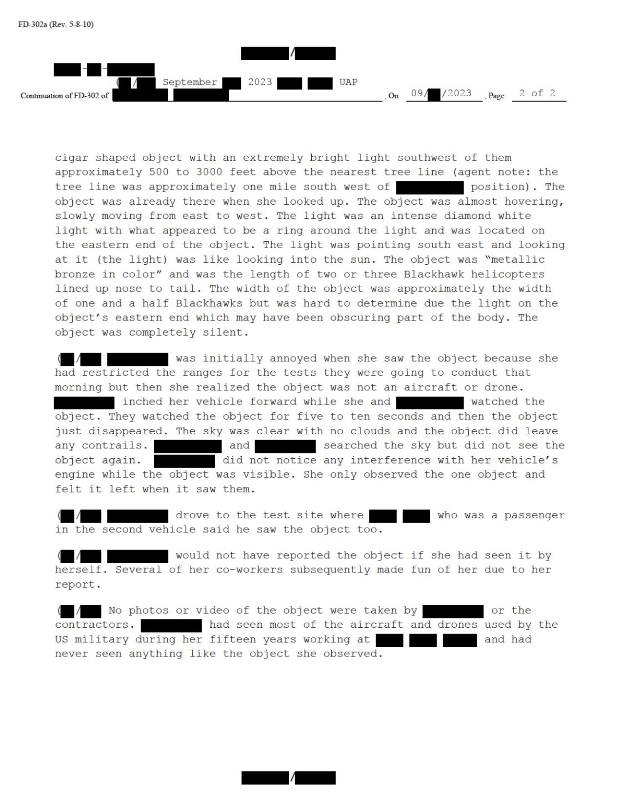

# #159 FBI 302 訪談（2023-09 雪茄銅金屬色）：限飛區內 2-3 架黑鷹長、強光遮蔽本體東端

| 欄位 | 內容 |
|---|---|
| 文件類型 | FBI FD-302 訪談紀錄（in-person 訪談）|
| 訪談日期 | 2023-10-？ |
| 訪談人 | FBI Special Agent + 同僚（supervisor 在場）|
| 受訪人 | 試驗場主管 / 區域負責人（女性，依「she」代名詞）|
| 事件日期 | 2023-09 某日 07:15-07:30 am |
| 公開日 | 2026-05-08 |

## 為什麼這份檔案重要

War Department 2026-05-08 釋出包中 9 月 2023 美國西部事件 FBI 302 訪談三件套中最具描述密度的一份。受訪者是試驗場區域主管（She had restricted the air space for the upcoming tests），現場親眼目擊「cigar shaped object」「metallic bronze in color」「length of two or three Blackhawks lined up nose to tail」「diamond white light on the eastern end」。

這份證詞是 #157 FBI 合成草圖的證詞基礎。詳細到：

- 物體：雪茄形、金屬銅色、長度兩三架黑鷹（39-60 m）、寬度 1.5 架黑鷹。
- 光：鑽石白光在物體東端，似有光環，朝東南方向射出，直視像太陽。
- 行為：幾乎懸停、緩慢由東向西移動、5-10 秒後消失。
- 場景：限飛區內、約 1 哩外樹線上方 500-3,000 ft。
- 觀測者反應：起初被惹惱（以為是違反限飛區的飛機/無人機），意識到不是後叫同事看；同事們開玩笑取笑她。

關鍵脈絡：

- **這場目擊發生在限飛區內 + 同事承包商的 LiDAR / drone test 早上 7 點現場**，是 #158、#160 兩名次要目擊者所在的同一事件。
- **訪談是 in-person + supervisor 在場**，意味事件嚴重性升級到 FBI 認為需要主管在場的層級。

## 1. 限飛區內：閘門問題 + 抬頭看見

> On September [REDACTED] 2023, [REDACTED] and [REDACTED] and FBI Special Agent [REDACTED] interviewed [REDACTED] (in [REDACTED] office and [REDACTED] cell), in Building [REDACTED] the [REDACTED] and [REDACTED] supervisor sat in on the interview. After being advised of the identity of the interviewing agents and the nature of the interview, [REDACTED] provided the following information:

> 2023 年 9 月 [REDACTED]，[REDACTED]、[REDACTED] 與 FBI Special Agent [REDACTED] 在 Building [REDACTED] 訪談 [REDACTED]（在 [REDACTED] 辦公室及 [REDACTED] cell），[REDACTED] 與 [REDACTED] 的 supervisor 旁聽。受訪者被告知探員身分與訪談性質後，提供以下資訊：

> [REDACTED] had been the [REDACTED] / [REDACTED] at [REDACTED] for [REDACTED] years.

> [REDACTED] 在 [REDACTED] 任 [REDACTED] / [REDACTED] 共 [REDACTED] 年。

> On September [REDACTED] 2023, [REDACTED] was with [REDACTED] contractors working on a special project with [REDACTED]. She had restricted the air space in [REDACTED] for the upcoming tests. At 7:02 am, the contractors received the bases' standard [REDACTED] brief, got into three vehicles, and began driving to the site they were going to use for testing.

> 2023 年 9 月 [REDACTED]，[REDACTED] 與 [REDACTED] 承包商正在執行一項特殊專案，與 [REDACTED] 合作。為即將進行的測試，她已對 [REDACTED] 的空域實施限飛。07:02 承包商接收基地標準 [REDACTED] 簡報，分乘三輛車開往測試地點。

> [REDACTED] drove the first vehicle with [REDACTED] [REDACTED] [REDACTED] [REDACTED] as the front passenger. [REDACTED] [REDACTED] contractors [REDACTED] and [REDACTED] were in the second and third vehicles.

> [REDACTED] 開第一輛車，[REDACTED][REDACTED][REDACTED][REDACTED] 坐前座乘客位。[REDACTED][REDACTED] 承包商 [REDACTED] 與 [REDACTED] 在第二、第三輛車。

> Between 7:15 and 7:30 am, [REDACTED] drove down [REDACTED] to a gate that restricted access to part of the [REDACTED] [REDACTED] attempted to open the gate remotely using a fob. The gate opened just a little and then closed on three separate tries. On the fourth attempt the gate opened completely and stayed open. There were no prior operational problems with that particular gate and there were no operating issues with the gate after September [REDACTED].

> 07:15-07:30 之間，[REDACTED] 開到一道閘門，該閘門限制進入 [REDACTED] 的部分區域。[REDACTED] 嘗試用 fob 遙控開門。閘門開一點點就關上，連續三次。第四次嘗試時閘門完全打開並保持開啟。該閘門之前無運作問題，9 月 [REDACTED] 之後也無問題。

關鍵脈絡：

- **「閘門開不了三次、第四次才開」**：閘門平時正常，但事件當天前三次失效。意味事件前後可能有電磁干擾或某種異常，但目擊者後續明確表示「未注意到車輛干擾」。
- 受訪者本人實施空域限飛，意味她對該區域上空允許的航空器有最高權限。她的「這不是一架飛機或無人機」的判斷帶有專業權威。

## 2. 雪茄銅金屬色 + 強光在東端

> As [REDACTED] was driving through the gate she looked up and saw a cigar shaped object with an extremely bright light southwest of them approximately 500 to 3000 feet above the nearest tree line (agent note: the tree line was approximately one mile south west of [REDACTED] position). The object was already there when she looked up. The light was an intense diamond white light with what appeared to be a ring around the light and was located on the eastern end of the object. The light was pointing south east and looking at it (the light) was like looking into the sun. The object was "metallic bronze in color" and was the length of two or three Blackhawk helicopters lined up nose to tail. The width of the object was approximately the width of one and a half Blackhawks but was hard to determine due the light on the object's eastern end which may have been obscuring part of the body. The object was completely silent.

> 當 [REDACTED] 開車穿過閘門時抬頭，看到他們西南方有一個雪茄形物體，伴有極強的光，距最近樹線上方約 500-3,000 英尺（探員註：樹線位於 [REDACTED] 位置西南方約 1 哩）。物體在她抬頭時已經在那裡。光是強烈的鑽石白光，似乎有光環圍繞，位於物體的東端。光朝東南方指出，直視（該光）就像直視太陽。物體呈「金屬銅色」，長度為兩到三架黑鷹直升機機鼻接尾排成一列。寬度約為一架半黑鷹寬，但因物體東端的光可能遮住本體部分，寬度難以判定。物體完全無聲。

> [REDACTED] was initially annoyed when she saw the object because she had restricted the ranges for the tests they were going to conduct that morning but then she realized the object was not an aircraft or drone. [REDACTED] inched her vehicle forward while she and [REDACTED] watched the object. They watched the object for five to ten seconds and then the object just disappeared. The sky was clear with no clouds and the object did leave any contrails. [REDACTED] and [REDACTED] searched the sky but did not see the object again. [REDACTED] did not notice any interference with her vehicle's engine while the object was visible. She only observed the one object and felt it left when it saw them.

> [REDACTED] 起初被物體惹惱，因為她已對當天上午要進行測試的區域實施限飛。但隨即她意識到該物體不是飛機或無人機。[REDACTED] 讓車輛緩慢前移，她與 [REDACTED] 持續觀察物體。他們觀察 5-10 秒後物體就消失了。天空晴朗無雲，物體未留下任何尾跡。[REDACTED] 與 [REDACTED] 搜尋天空但沒再看到物體。物體可見時 [REDACTED] 未注意到車輛引擎有任何干擾。她只觀察到一個物體，並覺得「它看到他們之後就離開了」。

> [REDACTED] drove to the test site where [REDACTED] who was a passenger in the second vehicle said he saw the object too.

> [REDACTED] drove to the test site where [REDACTED]（第二輛車的乘客）也說他看到了物體。

> [REDACTED] would not have reported the object if she had seen it by herself. Several of her co-workers subsequently made fun of her due to her report.

> [REDACTED] 若是一個人看到的，她不會通報該物體。她的幾位同事在事後因為她的通報而取笑她。

> No photos or video of the object were taken by [REDACTED] or the contractors. [REDACTED] had seen most of the aircraft and drones used by the US military during her fifteen years working at [REDACTED] [REDACTED] and had never seen anything like the object she observed.

> [REDACTED] 與承包商都沒有拍照或錄影。[REDACTED] 在 [REDACTED] 工作 15 年期間看過大部分美軍使用的飛機與無人機，從未見過像她當時看到的物體。

關鍵：

- 「**15 年工作經驗從未見過類似物體**」是受訪者的專業背景背書。她是該試驗場主管，對軍方所有量產 / 開發中飛行器有第一手熟悉。
- **「她看到他們之後就離開了」**是主觀感受。物體在 5-10 秒後消失（不是飛走，是「just disappeared」），暗示某種瞬間消失機制。
- **「若是一個人看到不會通報」**是因為害怕被取笑。即使有第二輛車的乘客證實，她仍被同事嘲笑。對 War Department 釋出包整體政治脈絡有意義：UAP 通報的社會成本仍然存在於 2023 年美軍試驗場文化中。

## 3. 觀察

(1) **試驗場主管的證詞權重**：受訪者實施空域限飛、15 年現場經驗、能判別美軍所有量產 / 試驗飛行器。這是 FBI 302 中可信度最高的 9 月 2023 西部事件證人。

(2) **5-10 秒目擊 + 消失**：物體靜止懸停 5-10 秒後「just disappeared」。對照 #158 LiDAR 試驗場目擊（「stationary 10 seconds, started moving to the right, disappeared」），時間維度相近但結束模式略異。

(3) **限飛區內出現 = 警報**：受訪者起初的反應是惱怒，因為這應該是已限飛區。「正規違規」假設轉為「非已知任何飛行器」的判斷只用了幾秒。

(4) **閘門 fob 三次失敗 + 第四次成功**：本份 302 中唯一可能與 UAP 物理特性相關的細節。EM 干擾假設未被受訪者本人提出，但時間吻合（7:15-7:30 開閘 + 7:30 左右抬頭看物體）。對比歷史上的 Levelland 1957（[#032 Krasuski 案](../032-65_hs1-101634279_100-de-26505_germany_1944/report.md)）的車輛電氣熄火 + UFO 目擊事件結構，本檔案是「電子設備異常 + 後續 UAP 目擊」的弱版本。

(5) **同事取笑**：UAP 通報社會成本在 2023 年的美軍試驗場仍然存在，這影響到 War Department 2026 釋出包之前的證詞收集量。

## 4. 跨檔案連結

- [#157 Composite Sketch](../157-fbi_september_2023_composite_sketch/report.md)：依本檔案證詞繪製的 FBI 實驗室合成草圖（銅金屬色橢球 + 強光）。
- [#158 FBI 302（LiDAR FaceTime 明亮光點）](../158-fbi_september_2023_serial_3/report.md)：同事件次要目擊者的遠端訪談。
- [#160 FBI 302（線狀金屬灰色 FaceTime）](../160-fbi_september_2023_serial_5/report.md)：同事件第三目擊者的遠端訪談。
- [#161 Western US Event](../161-western_us_event/report.md)：同事件官方 slide 摘要 + AARO 量測。
- [#156 USPER Statement](../156-usper_statement_uap_sighting/report.md)：2025 年同地區直升機 + FLIR + NVG 追蹤 orb 編隊。

## 5. 來源

- 原始檔案：War Department UAP Release 1（File at index #159 row in War Department portal）
- PDF 直接下載：`https://www.war.gov/medialink/ufo/release_1/serial-3_redacted.pdf`
- 公開日：2026-05-08
- 2 頁，FBI FD-302（Rev. 5-8-10）
- 訪談方式：In-person 訪談（受訪者辦公室，supervisor 在場）
