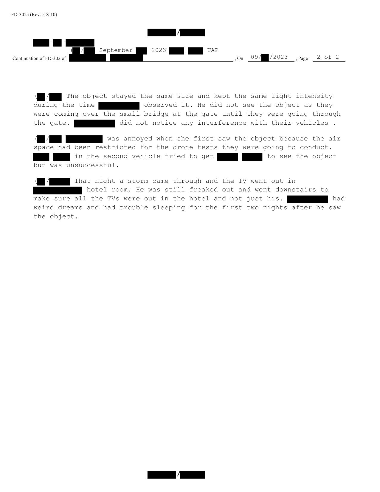

# #160 FBI 302 訪談（2023-09 線狀金屬灰色）：擋風玻璃看到、5,000 ft 上空、東西向、5-10 秒消失

| 欄位 | 內容 |
|---|---|
| 文件類型 | FBI FD-302 訪談紀錄（FaceTime video 訪談）|
| 訪談日期 | 2023-10-？ |
| 訪談人 | FBI Special Agent + 同僚 |
| 受訪人 | LiDAR 試驗場無人機操作員（有 10-15 小時無人機飛行經驗）|
| 事件日期 | 2023-09 某日 07:30 am 左右 |
| 公開日 | 2026-05-08 |

## 為什麼這份檔案重要

War Department 2026-05-08 釋出包中 9 月 2023 美國西部事件 FBI 302 訪談三件套之一。受訪者是 LiDAR 試驗場一名有 10-15 小時飛行時數的無人機操作員，駕駛車隊三車中的一輛。事件後夜間住宿酒店時遇到暴風雨、電視斷訊，受訪者因目擊事件「freaked out」、查看其他房客電視是否也斷訊。事件後兩晚做了奇怪的夢、睡不好。

證詞核心：

- 物體：**linear object（線狀）**、**metallic / gray**、無翼無排氣、比 737 小、長度 1-2 架黑鷹、明顯比無人機大。
- 光：物體東側極明亮白光，光內可見「bands of light」。
- 位置：地面上方約 5,000 ft，東西向平行於地面移動。
- 時間：可見 5-10 秒、光熄滅後物體消失、無法再找到。
- 觀察狀況：穿過小橋上的閘門時抬頭穿過擋風玻璃上端 3/4 處看到。

這份證詞描述的物體形態與 #159（雪茄銅金屬色，2-3 架黑鷹長）不同，與 #158（光點）也不同，但與 #157 草圖（橢球銅色）描述的物體截然不同。同事件三份證詞的不一致是本檔案組的核心研究問題。

## 1. 訪談脈絡與受訪者背景

> On September [REDACTED] 2023, [REDACTED] and [REDACTED] and FBI Special Agent [REDACTED] interviewed [REDACTED] via Facetime video. [REDACTED] a [REDACTED] with [REDACTED] sat in on the interview ([REDACTED] and [REDACTED] were in [REDACTED] at the time of the interview). After being advised of the identity of the interviewing agents and the nature of the interview, [REDACTED] provided the following information:

> 2023 年 9 月 [REDACTED]，[REDACTED]、[REDACTED] 與 FBI Special Agent [REDACTED] 通過 FaceTime 視訊訪談 [REDACTED]。[REDACTED] 來自 [REDACTED] 的 [REDACTED] 在場聆聽訪談（受訪者與另一人訪談時都在 [REDACTED]）。受訪者被告知探員身分與訪談性質後，提供以下資訊：

> [REDACTED] was a [REDACTED] of [REDACTED] in the [REDACTED] of [REDACTED]. He'd been an [REDACTED] since [REDACTED] and had ten to fifteen hours as a drone pilot.

> [REDACTED] 是 [REDACTED] 的 [REDACTED]，工作位置 [REDACTED]。他從 [REDACTED] 起就是 [REDACTED]，並有 10-15 小時的無人機飛行時數。

關鍵：受訪者具備無人機飛行經驗，能在後續描述中對「明顯比無人機大」做專業判斷。

## 2. 事件描述

> On September [REDACTED] 2023 [REDACTED] was at [REDACTED] with three other contractors and [REDACTED] for LiDAR tests with [REDACTED]. After receiving a [REDACTED] the five of them got into three vehicles with [REDACTED] driving the first vehicle and [REDACTED] as her passenger.

> 2023 年 9 月 [REDACTED]，[REDACTED] 在 [REDACTED] 與三名其他承包商、[REDACTED] 一起，與 [REDACTED] 進行 LiDAR 測試。在收到 [REDACTED] 後，五人分乘三輛車，[REDACTED] 開第一輛車，[REDACTED] 是她的乘客。

> The three vehicles began driving south around 7:30 am. The sun was in the east with good visibility.

> 三輛車在大約 07:30 開始向南行駛。太陽在東方，能見度良好。

> The three vehicles came to a gate that was giving [REDACTED] trouble. At about three quarters of the windshield up, [REDACTED] saw a linear object with a super bright light on the east side of the object. The light was bright white and bright enough to see bands within the light. The object was metallic / gray in color. It did not have any wings or exhaust. The object was smaller than a 737, one to two Blackhawk helicopters in length and was definitely bigger than a drone. The object was approximately 5000 feet above ground level, and moved east to west parallel to the ground. The object was visible for five to ten seconds and then the light went out and the object vanished. The sky was clear and [REDACTED] couldn't find the object again.

> 三輛車來到一道讓 [REDACTED] 開不順的閘門。在擋風玻璃上方約四分之三高度位置，[REDACTED] 看到一個線狀物體，其東側有極亮的光。光是亮白色，亮度足以看到光內的「條帶」。物體呈金屬/灰色。沒有翼、沒有排氣。物體比 737 小，長度為 1-2 架黑鷹直升機，明顯比無人機大。物體距地面約 5,000 英尺，由東向西平行於地面移動。物體可見 5-10 秒，然後光熄滅、物體消失。天空晴朗，[REDACTED] 無法再找到該物體。

關鍵要素：

- **「linear object + bands within the light」**：物體呈線狀（並非雪茄形或橢球形），光內可分辨「條帶」。「bands of light」是工程性描述，飛行員會用這個語言描述如 strobe 或 navigation light 的分段。但物體無翼無排氣，意味不是常規飛機。
- **5,000 ft + 東向西 + 平行地面**：高度與軌跡都明確。對比 #159（500-3,000 ft 樹線上方）與 #158（10-20 哩外地平線上方），三人位置觀察的高度差異大。
- **長度 1-2 架黑鷹（19-40 m）**：對比 #159（2-3 架黑鷹，39-60 m），同一物體在不同距離下視覺長度差異可能源自距離估計差別。
- **5-10 秒消失 + 光熄滅**：與 #159（5-10 秒「just disappeared」）類似，但 #160 補述「光先熄滅、然後物體消失」，意味物體本身不是只靠光辨識，光熄滅後仍短暫保留輪廓。

## 3. 後續心理影響 + 暴風雨夜

> The object stayed the same size and kept the same light intensity during the time [REDACTED] observed it. He did not see the object as they were coming over the small bridge at the gate until they were going through the gate. [REDACTED] did not notice any interference with their vehicles.

> [REDACTED] 觀察期間，物體大小與光強度都保持不變。他在開車過閘門前的小橋時還沒看到，直到他們穿過閘門時才看到。[REDACTED] 未注意到車輛有任何干擾。

> [REDACTED] was annoyed when she first saw the object because the air space had been restricted for the drone tests they were going to conduct. [REDACTED] [REDACTED] in the second vehicle tried to get [REDACTED] [REDACTED] to see the object but was unsuccessful.

> [REDACTED] 一開始看到物體很生氣，因為他們即將進行的無人機測試已對空域實施限飛。[REDACTED][REDACTED] 在第二輛車試圖讓 [REDACTED][REDACTED] 看到該物體，但未能成功。

> That night a storm came through and the TV went out in [REDACTED] hotel room. He was still freaked out and went downstairs to make sure all the TVs were out in the hotel and not just his. [REDACTED] had weird dreams and had trouble sleeping for the first two nights after he saw the object.

> 當晚有暴風雨來襲，[REDACTED] 酒店房間的電視斷訊。他當時仍被嚇到，下樓確認酒店所有電視都斷訊、不只是他房間的。[REDACTED] 在看到物體後的前兩晚做了奇怪的夢、睡不好。

關鍵：

- **物體大小 + 光強度不變**：意味不是接近 / 遠離過程（否則大小會變化）。
- **過橋前未看到、過閘門時看到**：意味物體在那個 5-10 秒前並不在那個位置（否則他在橋上就會看到），或物體在那個瞬間才出現於可見範圍。
- **暴風雨晚電視斷訊**：受訪者本能反應是查其他房客電視，意味他擔心這次斷訊與 UAP 有關。事後判斷是普通暴風雨。
- **連續兩晚奇怪的夢 + 睡不好**：UAP 目擊對民眾心理的後續影響，比較罕見在 FD-302 中被記錄。

## 4. 觀察

(1) **三份證詞的形狀不一致 = 觀察距離 / 角度差異**：

   | 證詞 | 距離 | 形狀 | 顏色 |
   |---|---|---|---|
   | #158（FaceTime） | 10-20 哩外、地平線上方 | 光點 | 亮白 |
   | #159（in-person）| 1 哩外、樹線上方 500-3,000 ft | 雪茄、寬度 1.5x | 金屬銅、強光在東端 |
   | #160（本檔案）| 約 1 哩外、5,000 ft 上空 | 線狀、無翼無排氣 | 金屬/灰、強光在東側 |

   三人位置都接近，但描述的物體形狀差別大。可能的解釋：
   - 同物體不同視角（從正下方 vs. 側下方）。
   - 同物體在不同時間（東西向移動意味從某些位置看是側面 = cigar，從某些位置看是頭尾 = linear）。
   - 三個不同物體。

(2) **「Bands within the light」是 #160 獨有觀察**：受訪者有無人機飛行經驗，對光的分段（如 strobe 條帶或 navigation light 模式）熟悉。但物體無翼無排氣意味不是常規飛機。

(3) **無排氣 + 無聲（#159）**：兩份證詞共同描述：無排氣（#160）、無聲（#159）。意味推進機構不是噴氣 / 螺旋槳。

(4) **三份證詞共同要素**：
   - 同事件、同上午、同 LiDAR 試驗場。
   - 5-10 秒可見 + 消失。
   - 光是核心識別特徵。
   - 無電氣干擾。

## 5. 跨檔案連結

- [#159 FBI 302（雪茄銅金屬色 in-person）](../159-fbi_september_2023_serial_4/report.md)：同事件主目擊者詳細證詞。
- [#158 FBI 302（LiDAR FaceTime 明亮光點）](../158-fbi_september_2023_serial_3/report.md)：同事件次要目擊者。
- [#157 Composite Sketch](../157-fbi_september_2023_composite_sketch/report.md)：依 #159 證詞繪製的 FBI 實驗室合成草圖。
- [#161 Western US Event](../161-western_us_event/report.md)：同事件官方 slide 摘要 + AARO 量測。
- [#156 USPER Statement](../156-usper_statement_uap_sighting/report.md)：2025 年同地區直升機 + FLIR + NVG 追蹤 orb 編隊。

## 6. 來源

- 原始檔案：War Department UAP Release 1（File at index #160 row in War Department portal）
- PDF 直接下載：`https://www.war.gov/medialink/ufo/release_1/serial-4-redacted_redacted.pdf`
- 公開日：2026-05-08
- 2 頁，FBI FD-302（Rev. 5-8-10）
- 訪談方式：FaceTime 視訊
