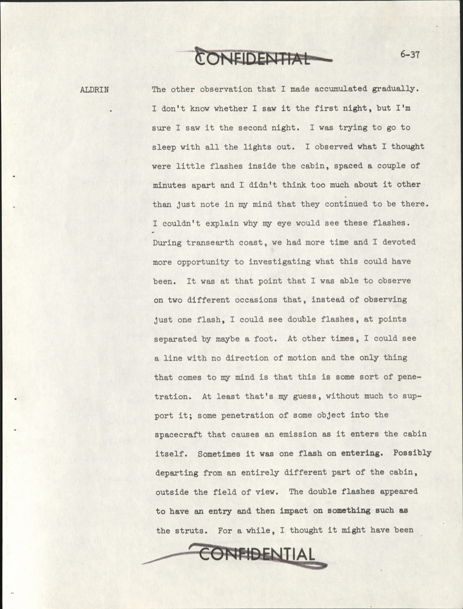
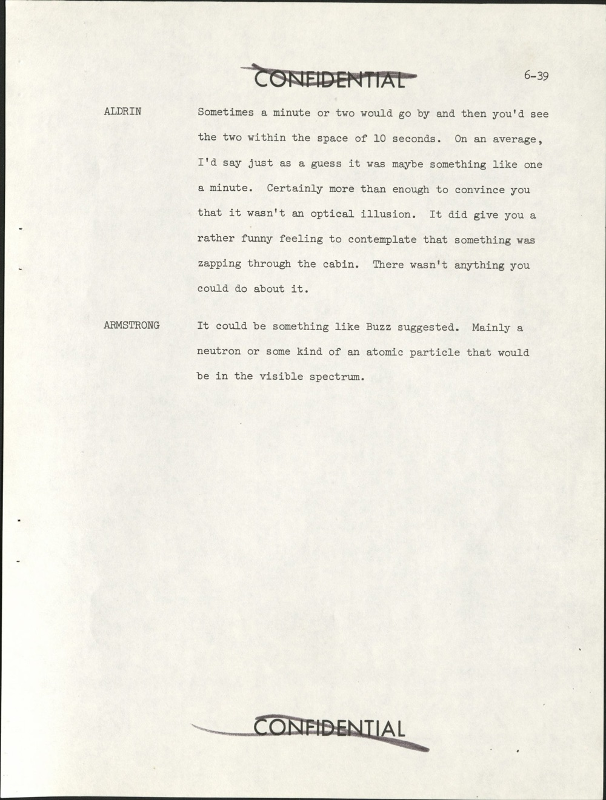
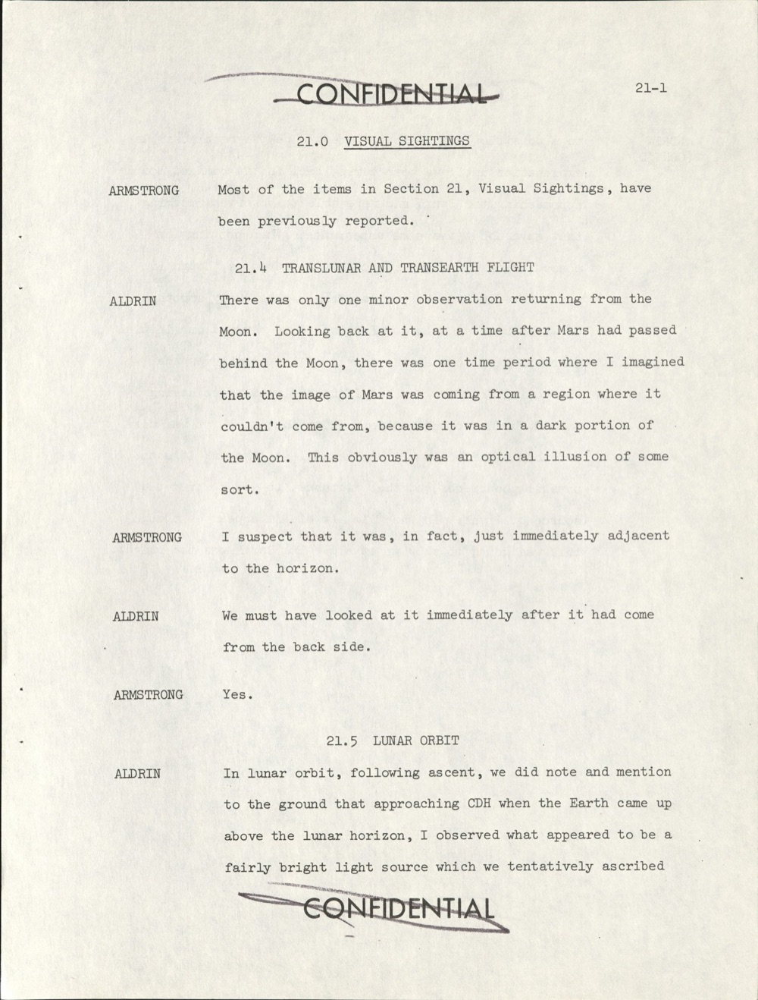
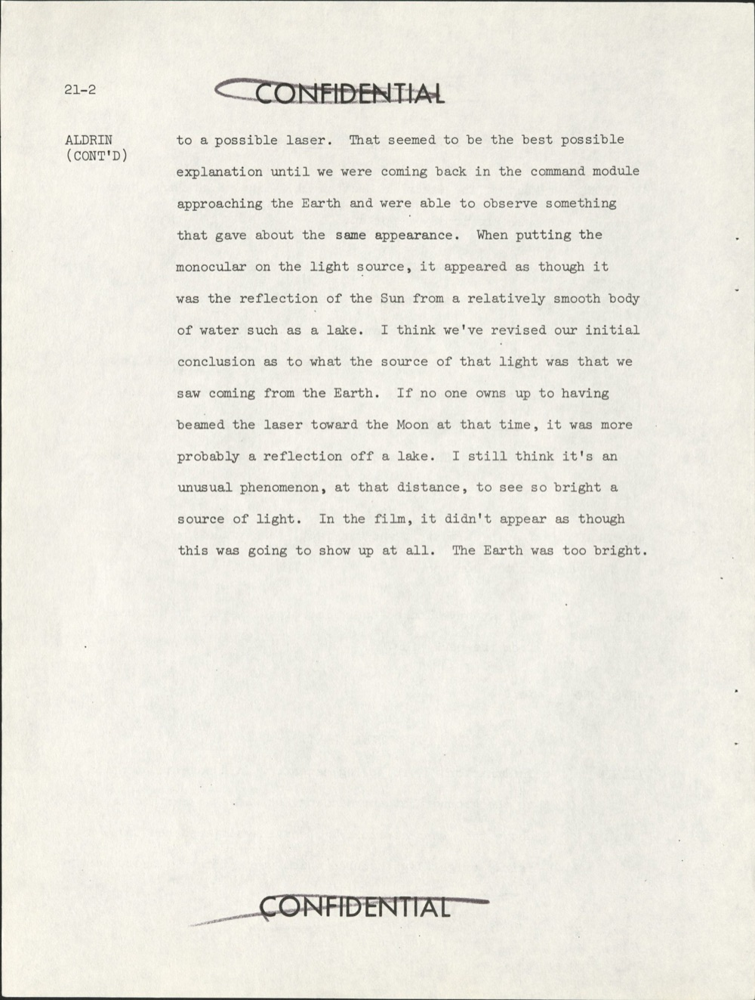

# Apollo 11：Aldrin 連續四晚記錄艙內閃光 + 月軌道看到「possible laser」

| 機關 | NASA |
| --- | --- |
| 類型 | PDF debriefing 節錄 |
| 任務日期 | 1969-07-16 至 1969-07-24 |
| 地點 | 月球軌道 + Mare Tranquillitatis + trans-lunar/trans-earth coast |
| 釋出日期 | 2026-05-08 |
| 卷宗 | [#141 NASA-UAP-D4 Apollo 11 Technical Crew Debriefing](https://www.war.gov/UFO/#nasa-uap-d4-apollo-11-technical-crew-debriefing-1969) |

## Overview

Apollo 11 是首次載人登月。機組 Armstrong（CDR）、Aldrin（LMP）、Collins（CMP）。1969-07-20 Armstrong + Aldrin 在 Mare Tranquillitatis 著陸，停留 21.5 小時。

本份 release 是 1969-07-31 整理的 Technical Crew Debriefing 節錄（來自原始 251 頁全文）。DOW 抽出第 6 章後段（cabin 內 flashes）+ 第 21 章（Visual Sightings）。

值得看：

- Aldrin 用 4 晚連續觀察記錄 light flashes，包括相距「a foot」的雙重 flash 跟 line 形軌跡
- 他主動提出「penetration」假說 — 高能粒子穿透艙壁產生光發射
- Armstrong 補充推測為 neutron 或 visible-spectrum 原子粒子
- Aldrin 自承做了系統性 1 小時觀察，「50 significant observations」
- 月軌道 CDH 階段 Aldrin 看到「possible laser」，trans-Earth 段才透過視差驗證它是湖面反射太陽光
- 這是 Apollo 計畫中第一次有太空人在 debrief 提出粒子穿透假說，三年後才被 Apollo 17 ALFMED 實驗驗證

## Apollo 11 Technical Crew Debriefing 封面

文件視覺特徵：

- 上方手寫「94」+「251 pgs」 — 後者是原文件總頁數，本 release 只抽出 UAP 相關章節
- 標題 (U) marker，1969 年寫成時整份文件分級為 CONFIDENTIAL
- 中間有一個褪色的紅藍方框 stamp 「CLASSIFICATION CHANGED TO U / BY AUTHORITY OF E.O. 11652 / DATE 6/4/72 / [簽名]」 — 1972 年依 Nixon E.O. 11652 改為非機密；又有一個 1977-04-11 的二次審視簽名
- GROUP 4 框：「Downgraded at 3-year intervals; declassified after 12 years」 — 1969 年原訂解密時程，理論上應該 1981 解密
- 左下圓形 indexing routing stamp（與 Apollo 17 同款）
- 下方 INDEXING DATA 手寫填入 DATE 07-31-69、OPR MSC、PGM A 11

兩個時間軸並列：1969 原定 12 年內解密 → 1972 已改為 unclassified → 但實際公開要等到 2026。中間 49 年沒有公開，是這份 release 在物質上最直接的「為什麼現在才看到」答案。

## Aldrin 第一晚發現艙內 flashes（頁 6-37）

頁碼 6-37。CONFIDENTIAL stamp 上下都被劃掉。

**Aldrin**：「另一個觀察是慢慢累積出來的。我不確定第一晚有沒有看到，但第二晚我確定看到了。我把所有燈關掉準備睡覺，看到艙內好像有小 flashes，每隔幾分鐘出現一次，當時沒太想，只是記在心裡說這現象一直在。我解釋不了為什麼眼睛會看到這些 flash。

trans-Earth coast 我們時間多了，我花更多時間研究這現象。在那段時間我兩次觀察到不只一個 flash，而是雙重 flash，兩點之間距離大概一英尺（約 30 公分）。其他時候我看到一條線，沒有運動方向，唯一想得到的解釋是某種 penetration。這只是我的猜測，沒有什麼根據；某種物體穿透太空船進入艙內，產生發光。有時候是一個 flash 在進入點。可能離開點是艙內視線外的另一個位置。雙重 flash 看起來像是一次進入然後撞到艙內結構（例如 struts）。我有一陣子以為那可能是 ——」

原文：

> ALDRIN: The other observation that I made accumulated gradually. I don't know whether I saw it the first night, but I'm sure I saw it the second night. I was trying to go to sleep with all the lights out. I observed what I thought were little flashes inside the cabin, spaced a couple of minutes apart and I didn't think too much about it other than just note in my mind that they continued to be there. I couldn't explain why my eye would see these flashes. During transearth coast, we had more time and I devoted more opportunity to investigating what this could have been. It was at that point that I was able to observe on two different occasions that, instead of observing just one flash, I could see double flashes, at points separated by maybe a foot. At other times, I could see a line with no direction of motion and the only thing that comes to my mind is that this is some sort of penetration. At least that's my guess, without much to support it; some penetration of some object into the spacecraft that causes an emission as it enters the cabin itself. Sometimes it was one flash on entering. Possibly departing from an entirely different part of the cabin, outside the field of view. The double flashes appeared to have an entry and then impact on something such as the struts. For a while, I thought it might have been

頁面在「For a while, I thought it might have been」斷句，續至 6-38。

## Aldrin 排除靜電 + 找太陽方向相關（頁 6-38）

頁碼 6-38。Aldrin 接續：

**Aldrin（續）**：「—— 某種靜電，因為我發現上下移動 sleep restraint 時可以產生很小的靜電火花。但我觀察越多次，發現這兩種現象有明顯差別。我試圖把它跟太陽方向關連起來。把窗戶遮光板拉上後，仍然有一點點漏光，大致可以判斷太陽方向 20 到 30 度範圍。flash 看起來確實從那個方向來；但我沒有足夠證據確認 flash 真的只在朝陽那一側看得到。少量證據支持這個關連。我問另外兩位有沒有看到，他們直到任務最後一天才看到。」

**Armstrong**：「Buzz，我之前有看到一些光點，但我都歸給陽光，因為窗戶蓋怎麼遮都會漏一點點光。我唯一一次認真觀察是任務最後一晚，我們真的去找它。我大概花了一小時仔細看艙內，那段時間我做了大概 50 次有意義的觀察。」

原文：

> ALDRIN (CONT'D): some static electricity because I was also able, in moving my hand up and down the sleep restraint, to generate very small sparks of static electricity. But there was a definite difference between the two as I observed it more and more. I tried to correlate this with the direction of the sun. When you put the window shades up there is still a small amount of leakage. You can generally tell within 20 or 30 degrees the direction of the sun. It seemed as though they were coming from that general direction; however, I really couldn't say if there was near enough evidence to support that these things were observable on the side of the spacecraft where the sun was. A little bit of evidence seemed to support this. I asked the others if they had seen any of these and, until about the last day, they hadn't.
>
> ARMSTRONG: Buzz, I'd seen some light, but I just always attributed this to sunlight, because the window covers leak a little bit of light no matter how tightly secured. The only time I observed it was the last night when we really looked for it. I spent probably an hour carefully watching the inside of the spacecraft and I probably made 50 significant observations in this period.

兩個方法論細節：

1. Aldrin 排除靜電（透過 sleep restraint 摩擦產生 spark 對照）
2. Armstrong 報告「真的去找」之後一小時內 50 次觀察 — 換算約 1.2 分鐘/次，跟下頁 Aldrin 給的「1/min」吻合

## Armstrong 提 neutron 假說（頁 6-39）

頁碼 6-39。

**Aldrin**：「有時候一兩分鐘都沒看到，然後 10 秒內看到兩個。平均下來大概每分鐘一次。絕對足夠讓你確定不是視覺幻覺。看著有東西在艙內 zapping 過去的感覺有點怪。你也沒辦法處理它。」

**Armstrong**：「可能是 Buzz 講的那種。主要是 neutron 或某種會在可見光範圍內的原子粒子。」

原文：

> ALDRIN: Sometimes a minute or two would go by and then you'd see the two within the space of 10 seconds. On an average, I'd say just as a guess it was maybe something like one a minute. Certainly more than enough to convince you that it wasn't an optical illusion. It did give you a rather funny feeling to contemplate that something was zapping through the cabin. There wasn't anything you could do about it.
>
> ARMSTRONG: It could be something like Buzz suggested. Mainly a neutron or some kind of an atomic particle that would be in the visible spectrum.

頁面後半空白。

Armstrong 補的 neutron 假說在物理上不正確 — neutron 沒有電荷不會直接產生可見光。後續 ALFMED 實驗證實主要是高能 proton 跟重離子（HZE）擊中視網膜或視覺皮層產生 phosphene。但 1969 年現場 Armstrong 已經抓到關鍵：是 atomic particle in visible spectrum（粒子直接被視覺察覺，不是透過設備）。

## 第 21 章 Visual Sightings 開頭：Mars 視差錯覺（頁 21-1）

頁碼 21-1。新章節「21.0 VISUAL SIGHTINGS」。

**Armstrong**：「第 21 章 Visual Sightings 大部分內容前面已經報告過。」

**21.4 TRANSLUNAR AND TRANSEARTH FLIGHT**

**Aldrin**：「返月段只有一次小觀察。回頭看那個時候，火星已經繞到月球後面，有一段時間我以為火星的影像出現在不該出現的地方，因為那是月球的暗面。顯然那是某種視覺錯覺。」

**Armstrong**：「我猜實際上那點光剛好就在地平線旁邊。」

**Aldrin**：「應該是火星剛從月背後面繞過來時我們看到的。」

**Armstrong**：「對。」

**21.5 LUNAR ORBIT**

**Aldrin**：「在月球軌道上 ascent 之後，我們在接近 CDH 時對地面提到，當地球從月面地平線升起，我看到一個相當亮的光點，當時我們暫時把它判定為 ——」

頁面在「we tentatively ascribed」斷句。

CDH = Constant Delta Height，月軌道交會 manoeuvre 點。Mars 視差事件（21.4）的講法很重要：機組看到火星在「不該出現的位置」，自己馬上歸為 optical illusion。這建立了標準：**機組的觀察報告會自我審視**。下一段（21.5）才是真正讓機組沒辦法歸為 illusion 的觀察。

## Aldrin：「possible laser」 → 改判為湖面反射（頁 21-2）

頁碼 21-2。Aldrin 接續：

**Aldrin（續）**：「—— 暫時把它判定為一個 possible laser。這在當時是最可能的解釋，直到回程 command module 接近地球時，我們又觀察到外觀類似的東西。我用單筒望遠鏡對焦，發現它看起來像太陽光從相對平靜的水面（例如湖泊）反射。我想我們已經修正了原本對那束光來源的結論。如果沒有人坦承當時對著月球發射 laser，那比較可能是湖面反射。我還是覺得這現象不尋常，那麼遠的距離還能看到那麼亮的光點。底片上根本看不到這個現象。地球太亮了。」

原文：

> ALDRIN (CONT'D): to a possible laser. That seemed to be the best possible explanation until we were coming back in the command module approaching the Earth and were able to observe something that gave about the same appearance. When putting the monocular on the light source, it appeared as though it was the reflection of the Sun from a relatively smooth body of water such as a lake. I think we've revised our initial conclusion as to what the source of that light was that we saw coming from the Earth. If no one owns up to having beamed the laser toward the Moon at that time, it was more probably a reflection off a lake. I still think it's an unusual phenomenon, at that distance, to see so bright a source of light. In the film, it didn't appear as though this was going to show up at all. The Earth was too bright.

完整的判斷流程：

1. 月軌道 CDH 階段，地球從地平線升起時看到一個亮點 → 直覺判 possible laser
2. trans-Earth 階段，距地球更近，看到類似亮點
3. 用單筒望遠鏡對焦，這次看清楚了 → 改判為湖面反射太陽光
4. 但 Aldrin 保留原假說的可能性：「if no one owns up to having beamed the laser」
5. 他補充這現象「unusual」，那麼遠還這麼亮
6. 底片完全沒記錄到，地球太亮把它蓋過去

## 分析

Aldrin penetration 假說在 1969 年是直覺判斷，1972 年 ALFMED 實驗驗證大致正確。

關鍵證據是「雙重 flash 相距一英尺」。Aldrin 觀察到：粒子在艙內留下兩個發光點，間距約 30 公分。三年後 Apollo 17 機組戴 ALFMED 眼罩，光線完全被擋住時 flashes 消失，拿掉眼罩又出現。這證實 flash 是視覺通道內部現象。

30 公分剛好是頭顱橫向尺度。粒子穿過眼睛 → 第一個 phosphene → 穿過頭部 → 在另一側 cortex 第二個 phosphene。Aldrin 看到的兩個 flash 是同一粒子在腦內兩段路徑的視覺輸出。

Armstrong 的 1 小時 50 次觀察數據（≈ 1.2 分鐘/次）是 Apollo 計畫第一個量化記錄。後續 Apollo 12-17 都用這個數量級當基線，Skylab 三批機組共 9 人也回報相當頻率（2-3/分鐘，因 Skylab 在 South Atlantic Anomaly 通量更高）。

「Possible laser」事件是 Aldrin 自己用視差驗證的範例。

1969 年正在運作的對月雷射觀測站只有少數幾個（McDonald Observatory + Crimean Astrophysical Observatory），都跟 Apollo LRRR retroreflector 後續實驗有關，但那是 1969-08 之後的事，比 Aldrin 觀察晚了一個月。

Aldrin 描述的特徵「fairly bright」+「approaching CDH 階段」+「Earth came up above the lunar horizon」 — 從這個幾何位置看出去的地球不規則反射光（specular flash）剛好是湖面對太陽的反射典型表現。

Aldrin 在 trans-Earth 段看到地球時用 monocular 確認了反射假說，這是 NASA 第一次在 debrief 中收一個「先報告 → 自己用後續觀察推翻 → 仍保留原假說可能性」的完整方法論。

NASA 1969 年沒把這些觀察列為 UAP 卷宗。它只是 Section 21 Visual Sightings 任務記錄。2026-05-08 DOW 把第 6 章後段（cabin flashes）+ 第 21 章（Visual Sightings）合併釋出為 NASA-UAP-D4，等於是事後追認：這幾段紀錄屬於 UAP file。

與本批 release 其他 NASA 卷宗的連結：

- Apollo 12 (#139) Bean 透過 AOT 看「particles escaping the Moon」是同一年（1969）的後續觀測
- Apollo 17 (#143) Cernan + Schmitt + Evans 戴 ALFMED 實驗驗證 Aldrin 1969 年提的 penetration 假說
- Skylab (#144) Kerwin + Conrad 在地球軌道重現相同 cabin flashes 現象，連 peripheral 視野偏置都吻合
- Gemini 7 (#020) Borman 1965 年「BOGEY」是更早的艙外不明物紀錄
