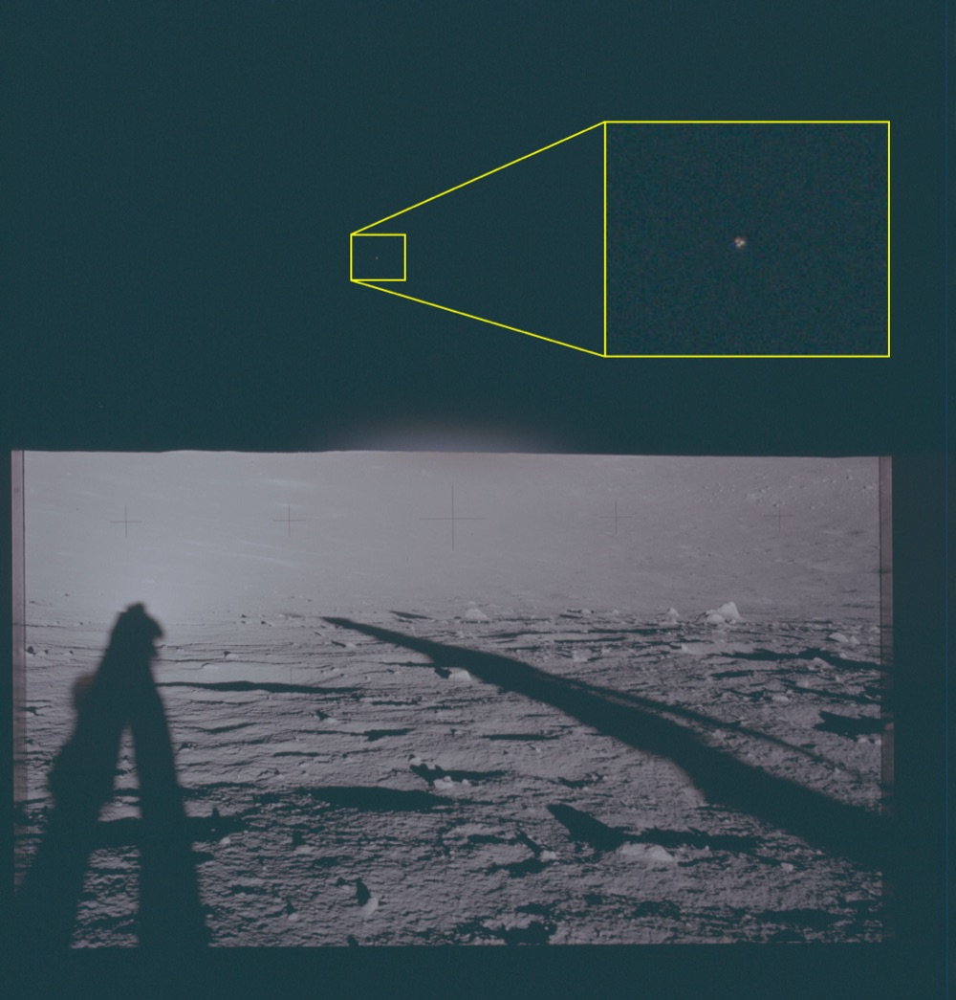

# Apollo 12：五張月面照框出 14 個藍色光點 + Bean 看到 particles 飛出月球

| 機關 | NASA |
| --- | --- |
| 類型 | 1 份 transcript + 5 張月面照 |
| 任務日期 | 1969-11-14 至 1969-11-24 |
| 地點 | 月球 Ocean of Storms（Surveyor 3 著陸點） |
| 釋出日期 | 2026-05-08 |
| 卷宗 | [#139 transcript](https://www.war.gov/UFO/#nasa-uap-d1-apollo-12-transcript-1969) ・ [#145-149 VM1-5 photos](https://www.war.gov/UFO/#nasa-uap-vm1-apollo-12-1969) |

## Overview

這是 Apollo 12 月面 panorama 系列。

機組 Charles Conrad（CDR）、Alan Bean（LMP）、Richard Gordon（CMP）。Conrad 跟 Bean 在月面 31.5 小時，Gordon 留在 Yankee Clipper 軌道。

DOW 從 Conrad/Bean 拍的月面 panorama 裡，挑出 5 張，黃框標出共 14 個觀測點，全是地平線上方深空裡的藍色光點。

值得看是因為：

- 這是 NASA UAP release 裡照片最多的一筆，DOW 一次標出 14 個觀測點
- 配對的 transcript 同步收 Bean 透過 AOT（光學瞄準鏡）親口報告：「particles of light... they're escaping the Moon. They really haul out of here and just press off at the stars」
- Conrad 後來補充月軌道夜面看到「little bits and pieces floating along with us」，原以為是追蹤燈反射，但燈關掉現象還在
- 同一任務同時有「飛行員肉眼觀測」 + 「事後底片發現」兩種 UAP 紀錄

## VM1：地平線上方一條藍色光柱

照片是月面 panorama，前景太空人剪影 + 月面足跡。

地平線上方深色天空中，DOW 標出黃框放大區。

放大後是一條垂直的藍色光柱，由多個亮點組成，像粒子串。

時序上對應 Bean 在月面活動期間。

## VM2：兩個觀測點 Area 1 + Area 2

同一張月面 panorama，DOW 在天空標出兩個區域。

Area 1（左）：深空中一個微小亮點。

Area 2（右）：另一個位置不同的亮點。

兩點不在同一直線，方向各異。

## VM3：一個藍紅雙色亮點

地平線上方靠右側，DOW 黃框放大。

放大後可見一個明顯亮點，藍色加紅色光暈。

雙色光譜在 1969 年的 Hasselblad 70mm 底片上是不尋常的特徵，通常單一星體只會呈單色。

## VM4：一個橘黃色點

Apollo 12 著陸點 Ocean of Storms 西緣的 panorama。

DOW 標出一個小區域，放大後是橘黃色亮點。

底片色調與 VM3 的藍紅光點明顯不同。

## VM5：一張照片標 5 個觀測點

VM5 是這套 5 張裡標記最密集的一張。

DOW 在天空標出 Area 1 至 Area 5。

Area 5（中間最大）放大後是一個垂直雙瓣亮點，藍 + 橘的雙色組合。

Area 1-4 各為單獨小亮點，分布範圍橫跨整個天空。

5 張照片合計 14 個觀測點，是 NASA 從未在 1970 年代正式公開的 Apollo 12 攝影遺留物。

## Apollo 12 Air-to-Ground Transcript 封面

NASA-S-69-23, Tape 90, Page 743。Apollo 12 任務地對空通訊原稿。

時間軸 GET（Ground Elapsed Time）格式：05 19 24 12 = 任務開始第 5 天 19 小時 24 分 12 秒。

通訊代號：CDR=Conrad、LMP=Bean、CMP=Gordon、CC=Capcom（Houston Capsule Communicator）。

## Bean 透過 AOT 看到 particles 從月球射向恆星

GET 05 19 27 25，Bean 在 LM Intrepid 內。

AOT（Alignment Optical Telescope）是月艙頂部光學瞄準鏡，用來校準慣性平台。

Bean 透過 AOT 第一象限（quadrant 1，左側）看出去：「You can see these lights - particles of light, flashes of light just seem to come from - in this case, I'm looking in quadrant 1 which is the left one.」

「It's coming from behind me, the left, and they're just sailing off in space.」

「I was thinking they're dropping from my water boiler, but it looks like some of those things are escaping the Moon.」

「They really haul out of here and just press off at the stars.」

Houston 沒給解釋，只回 Roger。

## Conrad 月軌道夜面看到 bits 與追蹤燈互動

GET 06 00 21 48，Apollo 12 月軌道交會階段，CSM Yankee Clipper 從 LM 後方接近。

Conrad 跟 Houston：「It looks like our tracking light's burned out. Dick hasn't been able to find us in this sextant.」

「On the first nightside pass we had little bits and pieces floating along with us and we could tell that the tracking light was flashing on them.」

「We still have, I've presumed to think, bits and pieces floating along and nothing's flashing on them, so I'm pretty sure it burned out.」

但隔幾秒 Houston 回：「Our electrical watchers say that the current indicates that your tracking light is on.」

Conrad 把燈關掉測：「Now we just turned it off. Now does the current show that?」 Houston：「It - It sure does, Pete.」

也就是說：bits and pieces 看不見不是因為燈壞了，而是同行的「碎片」自己消失了。

## 分析

5 張 panorama 標出的 14 個觀測點，公開資料沒有 NASA 的官方解釋。

可能的解釋包括底片瑕疵、cosmic ray 擊中底片、星體點陣、月面反射、或是真實未識別物。

Apollo 12 的 Hasselblad 70mm 在月面零大氣環境下，鏡頭對深空曝光容易顯出比地表更暗的恆星。

但 VM3 + VM5 Area 5 的雙色光譜（藍 + 紅）不是恆星典型特徵。Sirius、Canopus 在這條曝光時間內應該呈白色到藍白色，不會有同時藍紅雙瓣的結構。

Bean 的 AOT particles 觀測有兩種公認解釋。

第一種：水氣昇華。LM 水沸騰器（water boiler）排放在零真空中即時結冰，產生粒子雲。這是 Bean 自己提出的第一假設「dropping from my water boiler」。

第二種：月球塵埃揚塵。LM 著陸引擎熱氣使月塵帶電上升，懸浮在 LM 周圍。1972 年 Surveyor 7 LADEE 後續觀測也支持這個假設。

但 Bean 觀察到的特徵「they're escaping the Moon. They really haul out of here」是水氣與塵埃都解釋不了的：兩者初速都遠不及月球第二宇宙速度（2.4 km/s）。

Conrad 的 tracking-light bits 假設更難評。

CSM tracking light 是引導 LM 進行 rendezvous 的紅色信號燈，閃爍頻率 60 cycles/min。

他先觀察到「碎片與燈光同步閃爍」（同行軌道、有反射）。後來碎片看不見了，他歸因於燈壞了。但 Houston 確認電流正常 + 燈仍亮。

換句話說：碎片自己消失，不是因為失去照明。

這在月軌道夜面的真空環境很難解釋。最有可能：碎片是 LM 上脫落的隔熱層碎片，繞 LM 公轉一段時間後逐漸偏軌道散逸。

與本批 release 其他 NASA 卷宗的連結：

- Apollo 11 (#141) Aldrin 也談 cabin 內 flashes，但 Aldrin 是在艙內看，Bean 是在 AOT 透鏡看艙外
- Apollo 17 (#140 + #143 + #150) Schmitt 看到月面 flash + 三點三角，跟 Apollo 12 panorama 框出的 14 點同屬「不明發光體在月軌附近」類別
- Skylab (#144) Garriott 看到「rather large red star much brighter than Jupiter」，跟 VM3 的雙色光點是相近現象
- Gemini 7 (#020) Borman 1965 年「BOGEY」也是早期類似觀測，被歸為脫離的 booster + 冰晶
