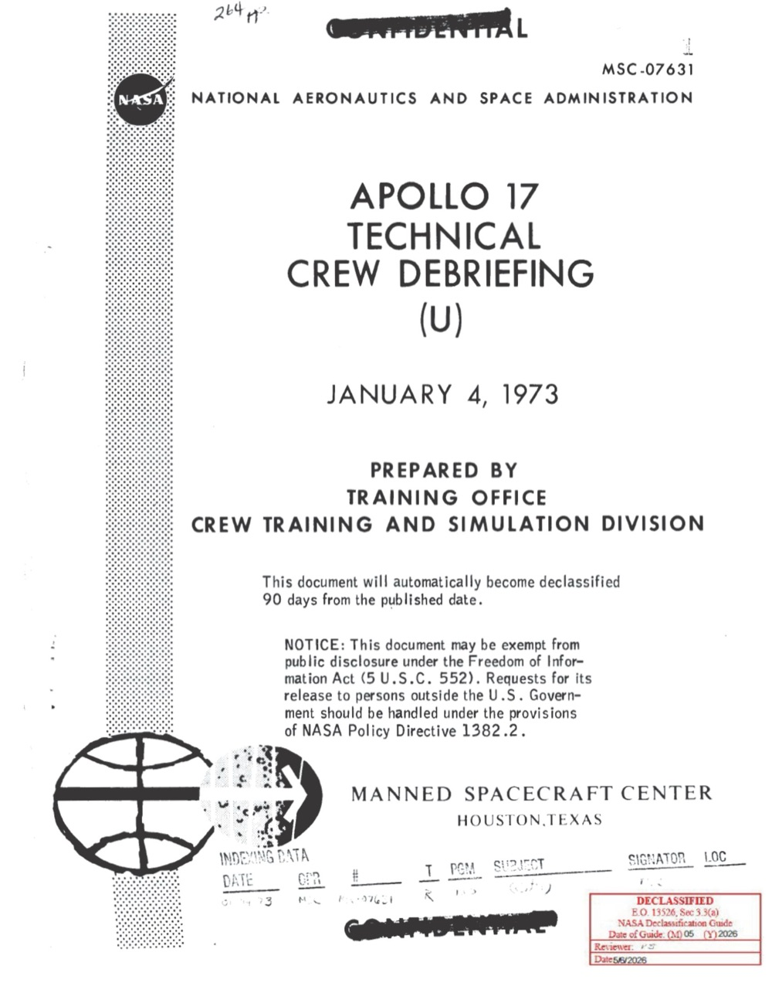
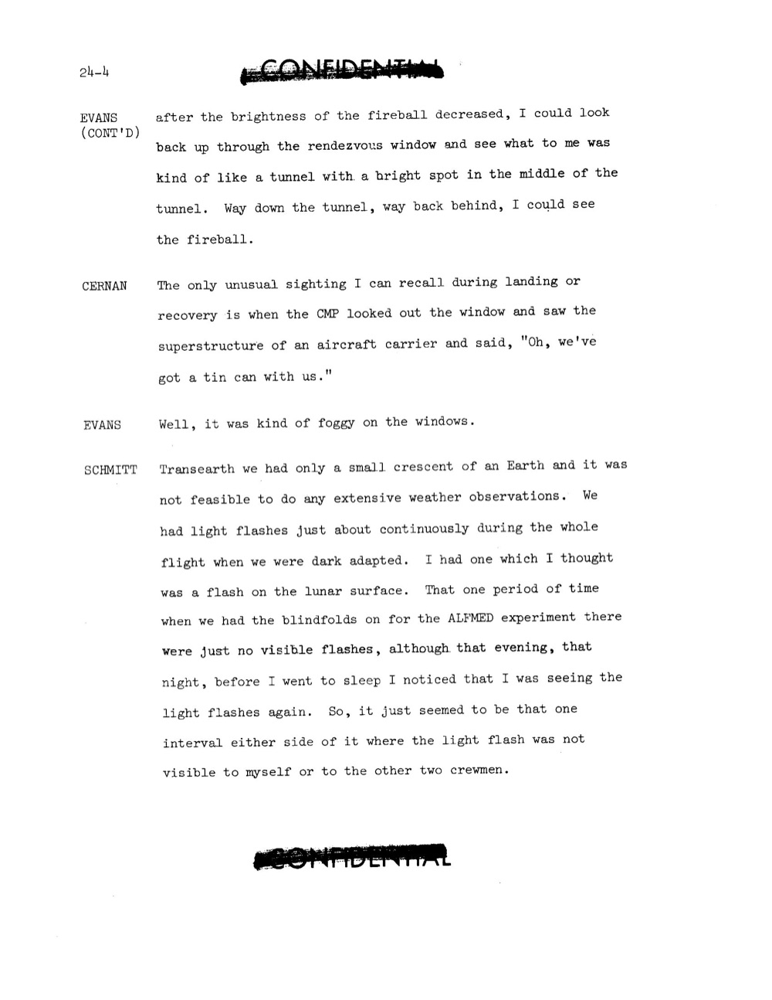
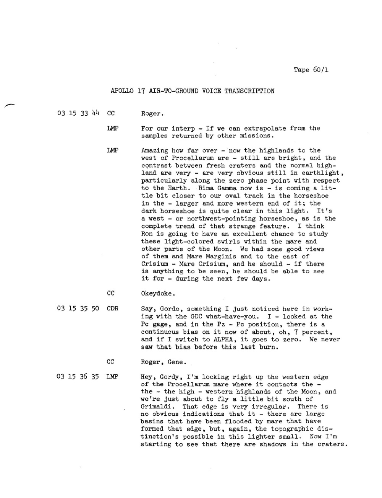
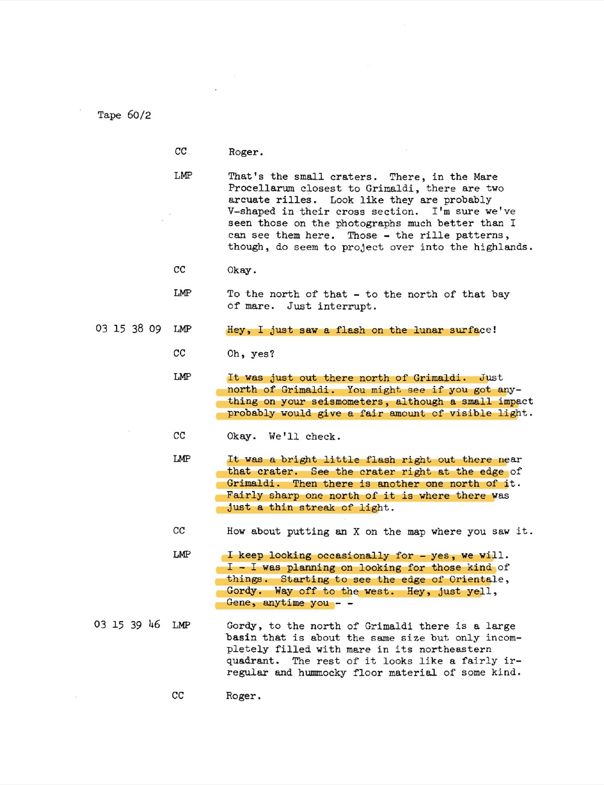

# Apollo 17：月面三點三角 + Schmitt 親眼看到月面閃光

| 機關 | NASA |
| --- | --- |
| 類型 | 3 份 PDF + 1 張月面照 |
| 任務日期 | 1972-12-07 至 1972-12-19 |
| 地點 | 月球軌道 + Taurus-Littrow valley |
| 釋出日期 | 2026-05-08 |
| 卷宗 | [#140 transcript](https://www.war.gov/UFO/#nasa-uap-d2-apollo-17-transcript-1972) ・ [#142 science debrief](https://www.war.gov/UFO/#nasa-uap-d5-apollo-17-crew-debriefing-for-science-1973) ・ [#143 technical debrief](https://www.war.gov/UFO/#nasa-uap-d6-apollo-17-technical-crew-debriefing-1973) ・ [#150 VM6 photo](https://www.war.gov/UFO/#nasa-uap-vm6-apollo-17-1972) |

## Overview

這是 Apollo 17 完整 UAP 包：一張 DOW 立案調查的月面三點三角照片，加三份事後 debrief 紀錄。

機組是 Eugene Cernan（CDR）、Ronald Evans（CMP）、Harrison Schmitt（LMP，地質學家）。他們是最後一批登月者，1972-12-11 在 Taurus-Littrow valley 著陸，停留 75 小時。

值得看是因為：

- 1972 年的 panorama 照片角落出現三個藍光呈三角排列，DOW 在 2026-05-08 把這張單獨開為 VM6 立案
- Schmitt 在月球軌道親眼看到月面閃光：「Hey, I just saw a flash on the lunar surface!」
- 三人在 trans-Earth coast 都看到「light flashes」，做了名為 ALFMED 的人體光學實驗驗證它是宇宙射線
- 一份月面任務剛好包含一次「飛行員看到不明物」 + 一次「飛行員實驗解釋了不明物」，兩件事在同一卷裡互文

## DOW 立案的三點三角形

VM6 是這份 release 裡 NASA 唯一被 DOW 個別立案的影像。

照片是 Taurus-Littrow valley 月面 panorama，地平線是 South Massif 山脊。

右上角黃框放大區是 DOW 標出來的觀測點：三個藍色亮點，在月面上空呈等邊三角形。

DOW 的卷宗描述寫 open investigation，沒給結論。

## Apollo 17 Technical Crew Debriefing 封面

MSC-07631，1973-01-04 由 Crew Training and Simulation Division 整理。

封面寫 "This document will automatically become declassified 90 days from the published date"。

實際在卷宗裡被留到 2026 才釋出。

NASA Declassification Guide review marker（黑色印章）顯示中間經過至少一次內部複審。

## Schmitt 在 ALFMED 實驗中描述 light flashes

Evans + Schmitt 在 trans-Earth 飛回地球的途中討論 light flashes。

Schmitt 親口紀錄：「We had light flashes just about continuously during the whole flight when we were dark adapted.」

「I had one which I thought was a flash on the lunar surface.」

ALFMED（Apollo Light Flash Moving Emulsion Detector）是專門設計的頭盔實驗。

戴上後遮眼罩 60 分鐘，記錄看到 flash 的時刻 + 方位 + 形狀。

ALFMED 期間 Schmitt 沒看到任何 flash，眼罩拿掉後又恢復看見。

這是 NASA 第一次用「人腦當偵測器」實驗證明 flashes 是宇宙射線打到視網膜，不是艙外閃光。

## ALFMED 實驗實況：CDR 拍 flash bugs 的相片

Tape 46/5，月球軌道對地實況通訊。

Cernan 跟 Houston 對話：「all you flash bugs down there - or flashbulbs I guess is the word - frame 50.」

「I just took four pictures to show - two on the side and two on the bottom - to show the position of the ALFMED」

ALFMED 同時被攝像紀錄，flash bug 是 Cernan 玩笑稱呼地面 flash 研究團隊。

這頁也包含 Schmitt 對 S-IVB 撞擊點的觀測，CDR 轉述「I bet you Ron could give a star sighting on it」。

## Schmitt 進入 Procellarum 西緣

Tape 60/1，03 15 33 - 36 GET。

Schmitt 開始細描月面：「the highlands to the west of Procellarum are - still are bright」「Rima Gamma now is - is coming a little bit closer to our oval track」。

地質學家視角：他逐一比對訓練時看過的 mare（海）和 highland（高地）。

最後一句鋪陳：「I'm looking right up the western edge of the Procellarum mare where it contacts the - the high - western highlands of the Moon, and we're just about to fly a little bit south of Grimaldi.」

Grimaldi 是月球西緣的暗色 crater。下一頁的事就在這裡發生。

## Schmitt 親眼看到月面閃光的瞬間

Tape 60/2，03 15 38 09 GET。

Schmitt 還在描述地形。

下一句突然：「Hey, I just saw a flash on the lunar surface!」（CC 紀錄成 LMP 發話）

中斷後立刻接回 Grimaldi 北邊的 basin 描述。Schmitt 沒停下來追問。

這是 NASA 任務通訊紀錄裡，首次有太空人在月球軌道親口報告月面 flash。

學界後來把它解釋為 transient lunar phenomenon (TLP) 或微隕石撞擊閃光，但 1972 年沒有同步觀測能驗證。

## 分析

VM6 這張三點三角，DOW 不給結論。

Apollo 17 任務中執行的 panorama 攝影主要是科學紀錄。三個藍點出現在地平線上方深空背景，可能是底片瑕疵、cosmic ray hit、星體點陣，或就是不明物。

這張屬於 NASA UAP 包裡唯一單獨被 DOW 拉出來的影像，意味 DOW 內部判斷這個現象「無現有解釋可套」。

Schmitt 的 Grimaldi flash 是 monitored phenomenon，不是 unidentified。

1971 年 Apollo 14 機組就回報過月面閃光，當時被視為偶發。Apollo 17 機組受訓時被特別告知記錄這類現象，所以 Schmitt 才會 calmly 報告完接著繼續地形描述。

ALFMED 實驗給了「機艙內 light flashes」官方解釋。

整個 1969-1972 年 Apollo 計畫，每位太空人都報告過睡覺時眼前有 flash。Apollo 17 Schmitt + Cernan + Evans 三人戴 ALFMED 60 分鐘後，發現眼罩遮蔽期間視野內沒有 flash，拿掉後又恢復。

這證實了 flash 是宇宙射線粒子直接擊中視網膜或視覺皮層，不是艙外光源。

但這個解釋不能套到月面 flash 上。地表的 Schmitt 不可能用同樣方式看到視網膜內的閃光，因為那是月面外部現象。

Apollo 17 這份包同時收兩種「未解光點」。

一種（cabin flashes）被 NASA 自己用 ALFMED 實驗解掉。

一種（VM6 三點三角 + Schmitt Grimaldi flash）2026 年 DOW 重啟調查。

兩件事在同一卷宗共存，是這份卷的特徵：NASA 不是「只報告」也不是「只解釋」，而是兩面並存。

與本批 release 其他 NASA 卷宗的連結：

- Apollo 11 (#141) Aldrin 也報告 cabin flashes，但時序更早（1969），他自己提出「neutron 穿艙」假設
- Apollo 12 (#139) Bean 看到 AOT 視野內 particles「逃離月球射向恆星」，被歸為水汽噴射推力
- Skylab (#144) Gibson + Carr + Pogue 在地球軌道也看見 flashes，疑與 South Atlantic anomaly 相關
- Gemini 7 (#020) 1965 年 Borman 喊「BOGEY at ten o'clock high」是 NASA 通訊紀錄首次出現 bogey
