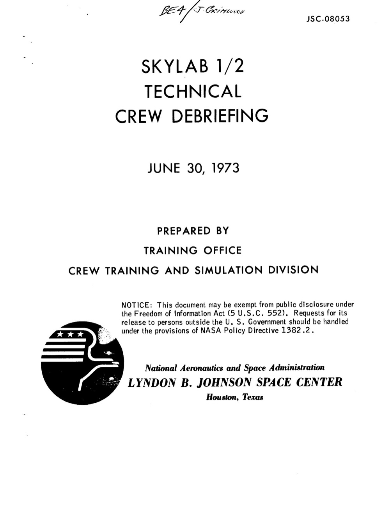
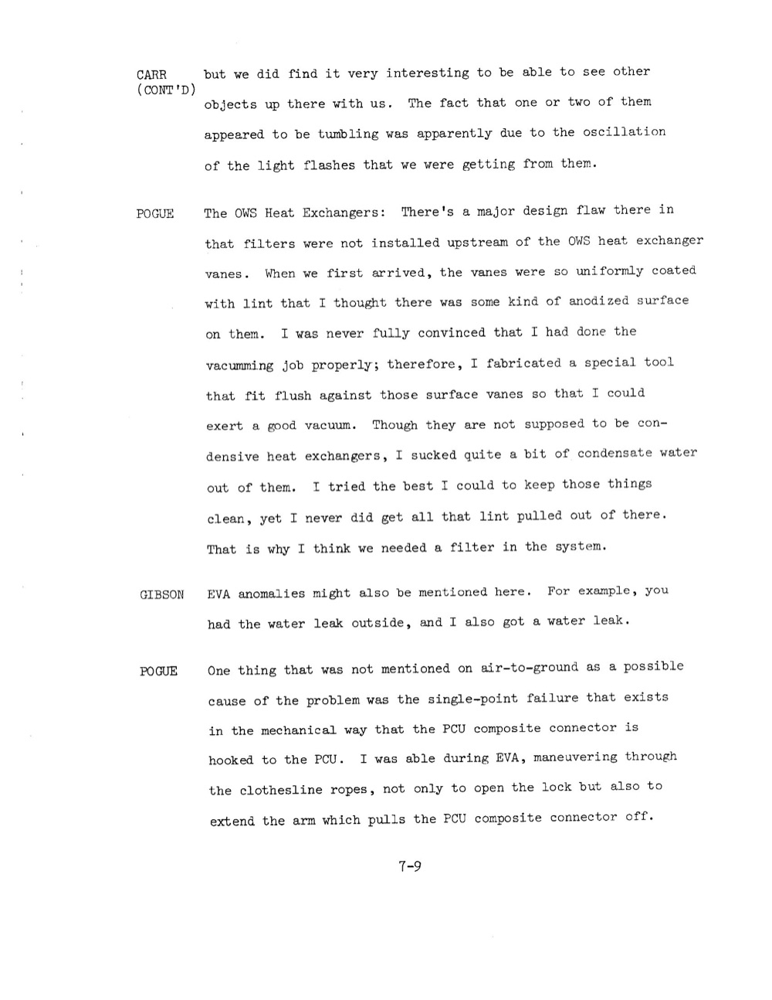

# Skylab：地球軌道一年三批機組都看到 light flashes + Garriott 紅色亮星

| 機關 | NASA |
| --- | --- |
| 類型 | PDF debriefing（11 頁，跨三批機組） |
| 任務日期 | 1973-05-25 至 1974-02-08 |
| 地點 | 地球軌道 Skylab 太空站 |
| 釋出日期 | 2026-05-08 |
| 卷宗 | [#144 NASA-UAP-D7 Skylab Technical Crew Debriefing](https://www.war.gov/UFO/#nasa-uap-d7-skylab-technical-crew-debriefing-1973) |

## Overview

這是 Skylab 三批機組合併的技術 debrief，Visual Sightings 章節集中收三組各自的不明物觀測。

三批機組分別：

- SL-2（1973-05-25 to 06-22）Conrad、Kerwin、Weitz
- SL-3（1973-07-28 to 09-25）Bean、Lousma、Garriott
- SL-4（1973-11-16 to 1974-02-08）Carr、Gibson、Pogue

Skylab 是地球軌道太空站，不是月球任務。但 Visual Sightings 紀錄量龐大，三批共 9 位太空人都報告類似現象。

值得看是因為：

- Kerwin（SL-2）報告 light flashes：眼睛閉著還能看，2-3 次/分鐘，集中在週邊視野
- Garriott（SL-3）描述「一顆比木星還亮的紅色星」，10 天前出現，整個機組聯合觀察
- SL-4 機組看到「正在 tumble 的物體」，觀察到 light flashes 同步閃爍，間接判斷是物體自轉
- 三批機組各自獨立觀察、彼此沒有先入為主，但描述的現象高度一致

## Skylab Technical Crew Debriefing 封面

NASA Lyndon B. Johnson Space Center, Houston。1974-04-25 整理。

封面 CONFIDENTIAL 分級 + automatic declassification 90 days 條款。

debrief 結構：以章節編號 20.0 收錄 Visual Sightings，跨三批機組，每批機組各自答問。

## Kerwin：light flashes 在閉眼時最頻繁

第 23.20 章 "Unusual or Unexpected Visual Phenomenon"。Kerwin（SL-2 醫官）：

「Unusual or Unexpected Visual Phenomenon. We saw light flashes. I think all of us saw them. I saw them most often when I was in the sack at night with my eyes closed but awake naturally.」

頻率：「numerous at times - two or three per minute」。

特徵：「Some of them to me were a spot or sunbursts. Some were streaks. The streaks, in my case, were less frequent than the bursts.」

「Most of them were in my peripheral visual field. Very few in the central visual field.」

Conrad 補充：「I would say mine were primarily in the left eye for some reason.」

Weitz 補充：「You have to concentrate but you can determine they are in one eye.」

對話中還提到「South Atlantic Anomaly」假設，但 Kerwin 自己沒帶 PAD（觀察記錄板），無法直接驗證時間吻合。

South Atlantic Anomaly 是地球磁場最弱的區域，太空船經過時會接收到較強的高能粒子。

這跟 Apollo 11 Aldrin 提的 penetration 假說 + Apollo 17 ALFMED 實驗驗證的「宇宙射線打視網膜」屬於同一現象，但 Skylab 是地球軌道，受 Van Allen belt 內側保護，本來宇宙射線通量比月球任務低 10 倍以上。

## Garriott：紅色亮星比木星還亮

第 20.0 章 Visual Sightings。SL-3 機組對話。

Lousma：「Do you want to talk about that satellite?」

Garriott：「I saw a couple of satellites that appeared like a satellite would on the Earth. I saw one that was not like one you would see on Earth, so why don't you mention it.」

「Okay, about a week or 10 days before recovery and we were still waiting for information to be supplied to us about the identification.」

「Jack first noticed this rather large red star out the wardroom window. Upon close examination, it was much brighter than Jupiter or any of the other planets.」

事件時序：

- 距任務結束 7-10 天觀察到
- 從 wardroom 窗口看出去
- 第一個發現的是 Jack Lousma
- 整個機組聯合觀察
- 任務結束時 Houston 還沒給識別答案

紅色 + 比木星亮（apparent magnitude < -2.5）+ 持續存在多日，屬於 satellite 範疇但 Garriott 自評「not like one you would see on Earth」。

## SL-4 機組：tumbling object 的 light flashes

第 20.0 章後段，SL-4 Carr + Gibson + Pogue 對話。

Carr：「we did find it very interesting to be able to see other objects up there with us. The fact that one or two of them appeared to be tumbling was apparently due to the oscillation of the light flashes that we were getting from them.」

也就是：

- 有「其他物體」與 Skylab 共軌
- 一部分物體看起來在自轉（tumbling）
- 自轉判斷依據：光點亮度週期性 oscillation（脈動）

物體自轉時不同面反射太陽光的角度不同，產生亮度脈動。這個推理是太空人觀星的標準技巧。

但「other objects up there with us」沒有經過地面確認 ID，這份 debrief 也沒附後續比對結果。

## 分析

Skylab 三批機組看到的 cabin flashes 是 Apollo 太空人觀測的延續。

時間軸：

- 1969 Apollo 11 Aldrin 提 penetration 假說
- 1969 Apollo 12 Bean 透過 AOT 看 particles
- 1972 Apollo 17 ALFMED 實驗驗證
- 1973-1974 Skylab 三批機組共 9 人重複觀察

Skylab 樣本特殊在三方面：

第一，地球軌道不是 deep space，本來宇宙射線通量低。但 Kerwin 描述頻率「2-3 per minute」與 Apollo 機組相當。原因：Skylab 軌道 50° 傾角，每軌會穿越 South Atlantic Anomaly，當地高能粒子局部高出全球平均 10-100 倍。

第二，9 個獨立樣本確認「peripheral 視野為主」「閉眼可見」「single 比 double 多」三個特徵，給 1972 年 ALFMED 實驗結論加碼確認。

第三，三批機組都是先看到再被問，不是被先告知後去找。代表這個現象是現場感官觀察可重現的。

Garriott 的紅色亮星是另一類問題。

1973 年低軌道太空中可看到的人造物體大致：其他 satellite、太空垃圾、散落的隔熱層、未燒盡的火箭級。但「比木星亮」的物體在當時的 catalog 裡沒有自然候選。

可能性：

- 報廢的 Saturn V 第三級或 LM ascent stage 殘骸
- 蘇聯軍事 satellite
- 未知物體

debrief 寫成的時候 NASA 還在等 Houston 的 identification，但 50 年後的這份 release 仍沒有附追認結果。換句話說：1973 年觀察到的這個紅色亮星，到 2026 年仍未公開識別。

SL-4 的 tumbling objects 比較像近距離追蹤到的軌道殘骸。

但「light flashes 同步 oscillation」的描述特殊。一般軌道殘骸自轉週期通常數秒到數分鐘，肉眼判斷需要持續觀察 10 秒以上才能確認週期性。Carr 在 debrief 中沒給具體頻率，但「one or two of them」表示同時可見多個自轉物體 + 同時被 SL-4 機組三人共同確認。

與本批 release 其他 NASA 卷宗的連結：

- Apollo 11 (#141) Aldrin penetration 假說，Skylab Kerwin 在地球軌道重現相同現象
- Apollo 17 (#143) ALFMED 實驗結論被 Skylab 9 人觀察確認
- Apollo 12 (#139) Bean 透過 AOT 看「particles escaping the Moon」，Skylab Carr 看「objects up there with us」是同一類「軌道近場不明物」紀錄
- Gemini 7 (#020) Borman BOGEY 是這個系列最早期紀錄，1965 年地球軌道
